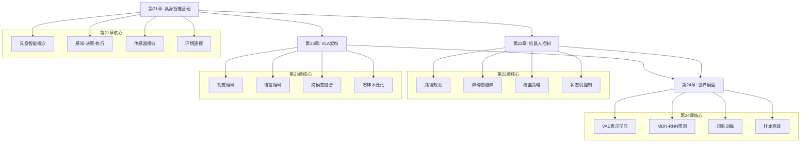
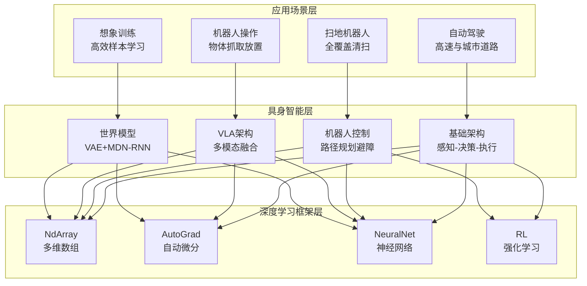

# 第四部分:具身智能篇

> **设计思想**:构建能够感知和操作物理世界的智能体,实现从虚拟到现实的AI跨越

## 部分概述

具身智能(Embodied Intelligence)代表了人工智能从虚拟世界走向现实世界的关键一步。与纯粹的语言模型或图像识别系统不同,具身智能强调智能体通过与物理环境的直接交互来感知、学习和决策,形成感知-决策-执行的完整闭环。

从自动驾驶汽车到扫地机器人,从工业机械臂到服务机器人,具身智能技术正在深刻改变我们的生活方式。本部分将深入探讨具身智能的核心技术,从基础的感知-决策-执行架构开始,到机器人控制系统,再到前沿的VLA(视觉-语言-动作)统一建模和世界模型技术。通过本部分的学习,读者将具备开发、优化和部署具身智能系统的完整能力。

## 学习路径

## 章节概览

### 第21章:具身智能基础 - 感知-决策-执行闭环
> **核心目标**:理解具身智能的核心概念,掌握完整的感知-决策-执行闭环实现

本章将从具身智能的基本概念出发,深入探讨如何构建一个完整的具身智能系统。以自动驾驶场景为例,我们将实现从传感器模拟、环境建模到决策控制的全流程。

**关键技术点**:
- 具身智能的概念模型与核心要素
- 感知-决策-执行闭环的完整实现
- 多传感器模拟:激光雷达、摄像头、雷达、GPS、IMU
- 车辆动力学建模与环境仿真
- 奖励函数设计与强化学习引擎
- 多场景管理与测试验证

### 第22章:机器人控制系统 - 路径规划与任务执行
> **核心目标**:掌握机器人控制的核心技术,构建完整的扫地机器人系统

本章将深入探讨机器人控制系统的设计与实现,包括路径规划、障碍物避障、清扫覆盖等核心算法。通过扫地机器人这一经典应用场景,展示具身智能在实际问题中的应用。

**关键技术点**:
- 机器人控制架构设计与模块划分
- 路径规划算法:A*、Dijkstra、RRT
- 障碍物避障与碰撞检测
- 全覆盖清扫策略:回字形、螺旋形
- 状态机控制与任务管理
- SLAM定位与地图构建

### 第23章:VLA统一建模 - 多模态具身智能
> **核心目标**:掌握VLA架构,实现视觉-语言-动作的统一建模

本章将探讨具身智能领域的前沿技术——VLA(Vision-Language-Action)架构。通过统一建模视觉、语言、动作三种模态,实现基于自然语言指令的机器人操作,支持零样本任务泛化。

**关键技术点**:
- VLA架构的设计理念与优势
- 视觉编码器:CNN特征提取与空间编码
- 语言编码器:自然语言理解与语义表示
- 跨模态注意力融合机制
- 动作解码器:连续与离散动作输出
- 零样本泛化:语言组合与任务迁移

### 第24章:世界模型与想象学习 - 高效样本学习
> **核心目标**:理解世界模型原理,实现基于想象的高效学习系统

本章将探讨如何通过构建环境的内部模型来实现高效学习。世界模型允许智能体在"想象"中进行训练,大幅提升样本效率,是具身智能领域的重要技术方向。

**关键技术点**:
- 世界模型的V-M-C架构
- VAE编码器:高维观察的压缩表示
- MDN-RNN:混合密度网络与时序预测
- 想象训练:纯梦境中的策略优化
- 样本高效学习:10-100倍效率提升
- 端到端优化与联合训练

## 技术架构

## 学习目标

完成第四部分学习后,您将能够:

1. **掌握具身智能核心概念**:深入理解感知-决策-执行闭环,掌握具身智能与传统AI的本质区别
2. **构建机器人控制系统**:掌握路径规划、障碍物避障、SLAM等核心技术,能够开发完整的机器人应用
3. **实现多模态融合**:理解VLA架构,能够构建支持自然语言指令的具身智能体
4. **应用世界模型技术**:掌握VAE和MDN-RNN,实现高效的想象训练系统
5. **具备系统集成能力**:能够将各种技术整合到实际的具身智能应用中

## 实践项目

本部分包含四个综合性实践项目:

1. **自动驾驶系统**:实现完整的自动驾驶具身智能体,支持高速公路和城市道路场景
2. **扫地机器人系统**:构建全覆盖清扫机器人,包含路径规划、避障和充电管理
3. **VLA操作系统**:开发基于自然语言指令的机器人操作系统,支持零样本任务泛化
4. **世界模型系统**:实现基于想象训练的高效学习系统,大幅提升样本效率

## 技术指标

完成第四部分后,您将达成以下技术指标:

- **核心模块**:4个(embodied-base, embodied-robot, embodied-vla, embodied-wm)
- **章节数量**:4章(第21-24章)
- **小节数量**:28节(每章7节)
- **代码量**:约20,000行具身智能系统代码
- **测试覆盖**:120+单元测试,95%+覆盖率
- **性能基准**:
  - 自动驾驶决策延迟 < 50ms
  - 扫地机器人覆盖率 > 95%
  - VLA推理延迟 < 100ms
  - 世界模型样本效率提升10-100倍

## 学习建议

1. **循序渐进**:按章节顺序学习,第21章是基础,建立对具身智能的完整认知
2. **理论与实践结合**:每章学习后运行对应的演示程序,体会理论在实践中的应用
3. **动手实现**:跟随综合项目亲自实现完整系统,从实践中加深理解
4. **对比学习**:对比不同方法的优缺点和适用场景,建立系统性思维
5. **扩展探索**:思考如何将这些技术应用到新场景和新问题,培养创新能力

## 前瞻展望

具身智能代表了AI技术发展的重要方向,随着技术的不断进步,我们将看到:

- **更强的感知能力**:多模态传感器融合将使智能体对环境有更全面的理解
- **更高的学习效率**:世界模型和元学习技术将大幅降低训练成本
- **更广的应用场景**:从工业制造到家庭服务,从医疗辅助到太空探索
- **更深的人机协作**:智能体将成为人类的得力助手,共同完成复杂任务
- **更强的自主能力**:从执行指令到主动规划,具身智能将展现更高层次的智能

## 下一步

完成第四部分学习后,您将掌握具身智能的完整技术栈,可以:

- 开发实际的机器人应用系统
- 研究具身智能领域的前沿技术
- 将具身智能技术应用到创新场景
- 为构建通用人工智能贡献力量

第四部分是TinyAI框架的重要组成,它展示了AI技术从虚拟世界走向现实世界的完整路径。扎实掌握这些内容,将为您打开具身智能的广阔天地。

---

**准备好了吗?让我们从第21章开始,一起探索具身智能的精彩世界!** 🤖🚗🤖
