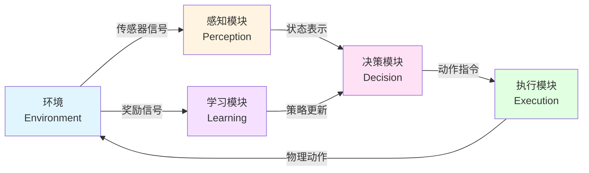
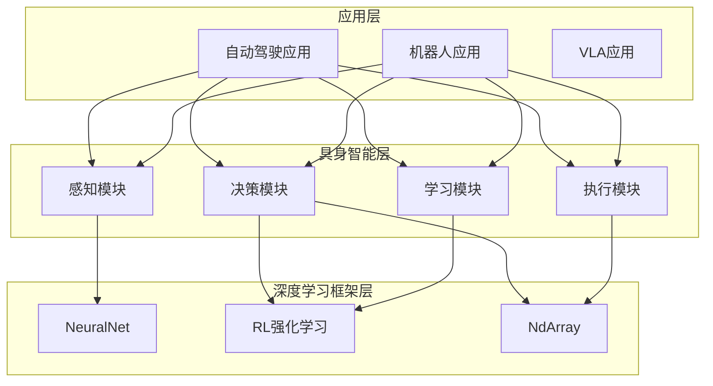

# 21.1 具身智能概念模型

## 引言

想象一下,一辆自动驾驶汽车行驶在繁忙的城市道路上:它的摄像头捕捉路况,雷达感知周围车辆,GPS定位当前位置,然后根据这些信息做出决策——是加速、减速还是转向?最后将决策转化为实际的控制指令,操控方向盘、油门和刹车。这个过程看似简单,却包含了**具身智能**(Embodied Intelligence)的全部精髓。

与传统AI系统不同,具身智能强调**智能体与物理世界的直接交互**。它不仅要"思考",更要"行动";不仅要处理数据,更要感知和改变真实环境。从自动驾驶到扫地机器人,从工业机械臂到无人机,具身智能正在让AI从虚拟世界走向现实世界,开启人工智能的新篇章。

## 核心概念

### 概念1:具身智能的定义

**定义**:具身智能是指能够通过传感器感知物理环境、通过决策系统规划行动、通过执行器与环境交互,并在此过程中不断学习和进化的智能系统。

**直觉理解**:
就像人类通过眼睛看、耳朵听、手脚行动来与世界互动一样,具身智能体也需要"身体"(传感器+执行器)来与环境建立连接。一个纯粹的AlphaGo虽然很聪明,但它没有"身体",无法直接操作围棋子,需要人类代为执行。而具身智能体则拥有完整的感知-决策-执行能力,能够独立完成物理任务。

**核心特征**:
- **环境交互性**:持续与物理世界交互,形成闭环反馈
- **实时性要求**:必须在有限时间内做出决策和响应
- **多模态感知**:同时处理视觉、听觉、触觉等多种感知信号
- **物理约束**:受到能量、速度、惯性等物理规律限制
- **安全关键性**:错误决策可能导致物理损害

### 概念2:与传统AI的本质区别

**数据处理 vs 物理交互**

| 维度 | 传统AI | 具身智能 |
|------|--------|---------|
| **任务目标** | 处理数据,产生输出 | 完成物理任务,改变环境状态 |
| **输入形式** | 结构化数据(表格、文本、图像) | 传感器原始信号(点云、IMU、GPS) |
| **输出形式** | 分类标签、生成文本、预测值 | 物理动作(转向角、速度、关节角度) |
| **反馈机制** | 训练数据的标签 | 环境的物理反馈(位置变化、碰撞) |
| **时间特性** | 可离线处理,无严格时间限制 | 必须实时决策,延迟影响性能 |
| **安全性** | 错误影响有限(如推荐不准) | 错误可能造成物理损害(如碰撞) |
| **学习方式** | 监督学习、无监督学习 | 强化学习、模仿学习、自主探索 |

**示例对比**:
- **传统AI**:图像分类系统识别照片中的物体类别
- **具身智能**:机器人看到桌上的杯子,走过去将其拿起并放到指定位置

### 概念3:感知-决策-执行-学习闭环

**定义**:具身智能的核心架构,由四个相互连接的模块组成完整的行为循环。

**架构解析**:



**各模块职责**:

1. **感知模块(Perception)**
   - 功能:从传感器获取原始数据并提取有用特征
   - 输入:摄像头图像、雷达点云、GPS坐标、IMU数据
   - 输出:环境状态表示(如车道线位置、障碍物距离)
   - 挑战:多源数据融合、噪声处理、实时性

2. **决策模块(Decision)**
   - 功能:基于当前状态和任务目标,选择最优动作
   - 输入:感知模块输出的状态表示
   - 输出:动作指令(如转向角+5°、加速度0.2m/s²)
   - 挑战:多目标平衡、长期规划、不确定性处理

3. **执行模块(Execution)**
   - 功能:将抽象动作转化为具体控制指令,驱动物理系统
   - 输入:决策模块输出的动作指令
   - 输出:电机控制信号、舵机角度、油门刹车命令
   - 挑战:动作平滑、物理约束、安全保护

4. **学习模块(Learning)**
   - 功能:从交互经验中学习,优化决策策略
   - 输入:状态-动作-奖励-下一状态的序列数据
   - 输出:更新后的策略网络参数
   - 挑战:样本效率、稳定性、泛化能力

**闭环的重要性**:
- **持续进化**:通过与环境交互不断改进策略
- **适应性**:能够应对环境变化和新场景
- **鲁棒性**:通过反馈机制及时纠正错误
- **自主性**:无需人工标注,通过自主探索学习

### 概念4:应用场景分类

具身智能的应用场景可以按照环境复杂度和任务类型分类:

**按环境分类**:

| 环境类型 | 特点 | 典型应用 | 技术难度 |
|---------|------|---------|---------|
| **结构化环境** | 环境固定,规则明确 | 工业机器人、仓储AGV | ⭐⭐ |
| **半结构化环境** | 环境可预测,存在变化 | 扫地机器人、农业机器人 | ⭐⭐⭐ |
| **非结构化环境** | 环境复杂,高度动态 | 自动驾驶、野外探索 | ⭐⭐⭐⭐⭐ |

**按任务分类**:

1. **导航类任务**
   - 目标:从起点到达终点
   - 示例:自动驾驶、无人机配送、移动机器人
   - 核心技术:路径规划、SLAM、避障

2. **操作类任务**
   - 目标:操纵物体完成特定动作
   - 示例:机械臂抓取、手术机器人、装配机器人
   - 核心技术:视觉伺服、力控制、轨迹规划

3. **服务类任务**
   - 目标:为人类提供服务
   - 示例:送餐机器人、清扫机器人、陪伴机器人
   - 核心技术:人机交互、任务规划、多模态理解

4. **探索类任务**
   - 目标:探索未知环境,收集信息
   - 示例:星球探测、灾害救援、海洋探测
   - 核心技术:主动感知、地图构建、风险评估

### 概念5:技术挑战

**挑战1:实时性(Real-time Constraint)**
- **问题**:从感知到执行的全流程必须在极短时间内完成
- **要求**:自动驾驶通常要求<50ms的决策延迟
- **难点**:神经网络推理、传感器数据处理都需要时间优化

**挑战2:鲁棒性(Robustness)**
- **问题**:面对传感器噪声、环境变化、异常情况仍能稳定工作
- **场景**:雨雪天气下的摄像头模糊、GPS信号丢失
- **解决**:多传感器融合、异常检测、降级策略

**挑战3:安全性(Safety)**
- **问题**:错误决策可能造成人身伤害或财产损失
- **要求**:形式化验证、安全约束、紧急制动
- **难点**:如何在保证安全的同时不过于保守

**挑战4:样本效率(Sample Efficiency)**
- **问题**:真实环境中试错成本高昂,难以大量采样
- **对比**:AlphaGo可以自我对弈百万局,但真实机器人无法碰撞百万次
- **解决**:仿真训练、迁移学习、少样本学习

**挑战5:泛化能力(Generalization)**
- **问题**:训练环境与实际部署环境存在差异
- **现象**:仿真中表现完美,真实环境中失效(Sim-to-Real Gap)
- **解决**:领域随机化、域适应、现实增强训练

## 技术演进历程

具身智能的发展经历了几个重要阶段:

### 阶段1:传统控制时代(1950s-1980s)
- **代表**:工业机器人、数控机床
- **特点**:基于精确建模和PID控制
- **局限**:只能应对结构化环境,缺乏适应性

### 阶段2:反应式行为时代(1980s-2000s)
- **代表**:Subsumption架构(Brooks)、行为基机器人
- **特点**:无需内部模型,直接感知-动作映射
- **突破**:能应对动态环境,反应迅速
- **局限**:难以完成复杂任务,缺乏规划能力

### 阶段3:学习驱动时代(2000s-2015s)
- **代表**:强化学习机器人、自动驾驶早期系统
- **特点**:通过学习获得策略,无需手工设计规则
- **突破**:适应性强,能处理复杂情况
- **局限**:样本效率低,训练时间长

### 阶段4:深度学习时代(2015s-至今)
- **代表**:端到端自动驾驶(NVIDIA)、OpenAI机械臂
- **特点**:深度神经网络直接处理原始感知数据
- **突破**:可以学习复杂的感知-动作映射
- **前沿**:大模型+具身智能(VLA架构)、世界模型

## TinyAI中的具身智能设计

在TinyAI框架中,具身智能遵循以下设计原则:

### 设计原则1:模块化架构


### 设计原则2:教育友好
- **渐进式复杂度**:从简单场景到复杂场景
- **可视化支持**:提供轨迹绘制、状态监控
- **完整注释**:每个关键决策都有详细说明
- **最佳实践**:展示工业界常用的技术方案

### 设计原则3:可扩展性
- **传感器可插拔**:轻松添加新的传感器类型
- **场景可配置**:通过配置文件定义新场景
- **学习算法可替换**:支持DQN、PPO、端到端学习等多种算法
- **环境可定制**:从自动驾驶扩展到机器人、无人机等

### 设计原则4:生产就绪
- **性能优化**:满足实时性要求(<50ms决策延迟)
- **异常处理**:完善的错误检测和恢复机制
- **测试覆盖**:单元测试、集成测试、场景测试
- **文档完备**:架构设计、API文档、使用示例

## 实际应用示例

### 示例1:自动驾驶感知-决策-执行流程

让我们通过一个具体例子理解具身智能的工作流程:

**场景**:车辆行驶在高速公路上,前方出现慢速车辆

**步骤1:感知**
- 摄像头:检测到前方车辆及车道线
- 激光雷达:测量前车距离40米,相对速度-10m/s
- GPS:当前位置(经度116.4,纬度39.9)
- IMU:当前速度25m/s,加速度0

**步骤2:状态提取**
```
状态向量 = [
    ego_speed: 25.0,           // 自车速度
    front_vehicle_distance: 40.0,  // 前车距离
    relative_speed: -10.0,     // 相对速度
    lane_deviation: 0.1,       // 车道偏离
    left_lane_clear: true,     // 左侧车道是否畅通
    steering_angle: 0.0        // 当前转向角
]
```

**步骤3:决策**
- 目标:保持安全距离,维持目标速度
- 策略网络输出:
  - 转向角:-2°(微调保持车道)
  - 油门:0.3(轻踩)
  - 刹车:0.0(不踩)
- 决策:减速至20m/s,保持车道

**步骤4:执行**
- 将转向角-2°转换为方向盘转角
- 将油门0.3转换为节气门开度
- 通过CAN总线发送控制指令

**步骤5:反馈与学习**
- 环境更新:车辆减速,距离增加到45米
- 奖励计算:
  - 速度控制:0.8(接近目标速度)
  - 安全距离:0.9(距离合理)
  - 车道保持:0.95(偏离很小)
  - 综合奖励:0.88
- 学习:将(状态,动作,奖励,新状态)存入经验池

### 示例2:机器人抓取任务

**任务**:机器人看到桌上的杯子,将其拿起并放到指定位置

**感知**:
- 深度相机:获取3D点云,识别杯子位置(x:0.3, y:0.2, z:0.8)
- 力传感器:当前末端执行器无接触

**决策**:
- 规划抓取轨迹:从当前位置移动到杯子上方→下降→闭合夹爪→提升
- 计算逆运动学:目标位置→各关节角度

**执行**:
- 控制6个关节电机按照轨迹运动
- 监控力传感器,检测是否成功抓取

**学习**:
- 如果抓取成功:正奖励+1
- 如果杯子掉落:负奖励-1
- 更新策略,提高成功率

## 关键性能指标

具身智能系统的性能可以从多个维度评估:

| 指标类型 | 具体指标 | 目标值(自动驾驶示例) | 说明 |
|---------|---------|---------------------|------|
| **实时性** | 决策延迟 | <50ms | 从感知到动作输出的时间 |
| **实时性** | 控制频率 | ≥20Hz | 每秒执行决策的次数 |
| **安全性** | 碰撞率 | <0.1% | 测试中发生碰撞的比例 |
| **安全性** | 紧急制动距离 | <5m@50km/h | 检测到危险后的停车距离 |
| **准确性** | 车道偏离 | <0.2m | 与车道中心的平均偏离 |
| **准确性** | 速度误差 | <5% | 实际速度与目标速度的偏差 |
| **舒适性** | 加速度变化率 | <2m/s³ | 避免急加速急刹车 |
| **舒适性** | 转向平滑度 | <10°/s | 转向角变化速率 |
| **学习效率** | 收敛速度 | <1000 episodes | 达到90%成功率所需训练轮数 |
| **泛化能力** | 跨场景性能 | >80% | 新场景中保持的性能比例 |

## 常见误区

### 误区1:"仿真训练可以完全替代真实测试"
**错误观点**:在仿真环境中训练好的模型可以直接部署到真实系统

**真相**:存在Sim-to-Real Gap
- 仿真无法完美复现真实物理特性
- 传感器噪声特性差异
- 环境复杂度差异

**正确做法**:
- 在仿真中预训练,真实环境中微调
- 使用域随机化技术提高鲁棒性
- 进行充分的真实环境测试

### 误区2:"端到端学习可以解决所有问题"
**错误观点**:只要数据足够,端到端学习可以自动学会所有技能

**真相**:端到端学习有局限
- 需要大量数据,样本效率低
- 缺乏可解释性,难以调试
- 难以保证安全性

**正确做法**:
- 结合模块化设计和端到端学习
- 在关键模块使用可解释的方法
- 添加安全约束和规则

### 误区3:"更复杂的模型一定更好"
**错误观点**:使用最先进、最复杂的模型可以获得最好性能

**真相**:需要权衡复杂度和性能
- 复杂模型推理慢,难以满足实时性
- 过度拟合,泛化能力差
- 调试困难,维护成本高

**正确做法**:
- 根据任务需求选择合适复杂度的模型
- 优先保证实时性和鲁棒性
- 在满足性能的前提下选择简单模型

## 小节总结

### 核心要点

1. **具身智能的本质**:强调智能体与物理环境的直接交互,形成感知-决策-执行-学习的完整闭环

2. **与传统AI的区别**:不仅处理数据,更要控制物理系统;不仅追求准确性,更要满足实时性和安全性

3. **四大核心模块**:感知模块(提取环境信息)、决策模块(规划动作)、执行模块(控制物理系统)、学习模块(优化策略)

4. **五大技术挑战**:实时性、鲁棒性、安全性、样本效率、泛化能力

5. **应用场景广泛**:从自动驾驶到机器人控制,从工业制造到服务场景

### 学习价值

- **理论基础**:建立了对具身智能的系统性认知
- **架构思维**:理解了闭环系统的设计思想
- **实践指导**:了解了真实系统开发的关键考虑因素
- **前瞻视野**:认识到具身智能在AI发展中的重要地位

### 与后续内容的联系

本小节建立的概念框架将贯穿整个第21章:
- **21.2节**将深入感知-决策-执行闭环的技术细节
- **21.3节**将详解多种传感器的模拟方法
- **21.4节**将讲解环境建模和车辆动力学
- **21.5节**将介绍如何设计奖励函数驱动学习
- **21.6节**将展示场景管理和测试方法
- **21.7节**将整合所有知识完成自动驾驶系统

## 思考题

1. **概念理解**:请用自己的话解释"具身智能"与"传统AI"的核心区别,并举一个生活中的例子。

2. **系统设计**:假设你要设计一个送餐机器人,它的感知-决策-执行-学习闭环应该包含哪些具体内容?

3. **技术权衡**:在自动驾驶系统中,如果决策延迟从50ms降低到100ms,可能会产生什么影响?如何权衡模型复杂度和实时性?

4. **安全性思考**:为什么具身智能系统的安全性比传统AI系统更加关键?请列举至少3个具体风险。

5. **未来展望**:你认为具身智能技术在未来5-10年会如何发展?哪些应用场景可能率先突破?

## 拓展阅读

### 推荐论文
- **"Embodied Intelligence"** (Brooks, 1991) - 具身智能的开创性论文
- **"End to End Learning for Self-Driving Cars"** (NVIDIA, 2016) - 端到端自动驾驶的里程碑
- **"Learning Dexterous In-Hand Manipulation"** (OpenAI, 2019) - 机械手灵巧操作

### 推荐书籍
- **《智能机器人系统》** - 系统介绍机器人学基础
- **《强化学习导论》**(Sutton & Barto) - RL理论基础
- **《概率机器人》**(Thrun) - 移动机器人技术

### 开源项目
- **CARLA** - 开源自动驾驶仿真平台
- **OpenAI Gym** - 强化学习环境标准接口
- **ROS** (Robot Operating System) - 机器人开发框架

### 在线资源
- Udacity自动驾驶工程师纳米学位
- MIT 6.834J 认知机器人学
- Stanford CS237B 机器人原理

---

**下一节预告**:下一节我们将深入探讨感知-决策-执行闭环的技术实现细节,包括数据流设计、状态空间表示、动作空间设计等核心内容。这将为后续的传感器模拟和环境建模打下坚实基础。
