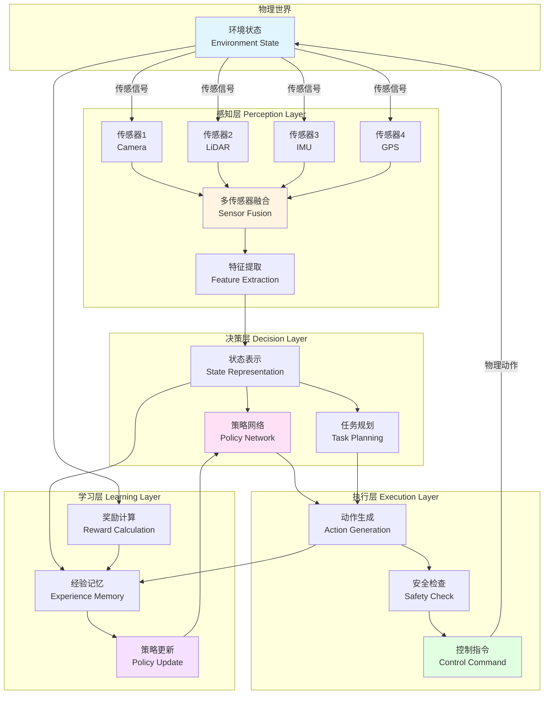
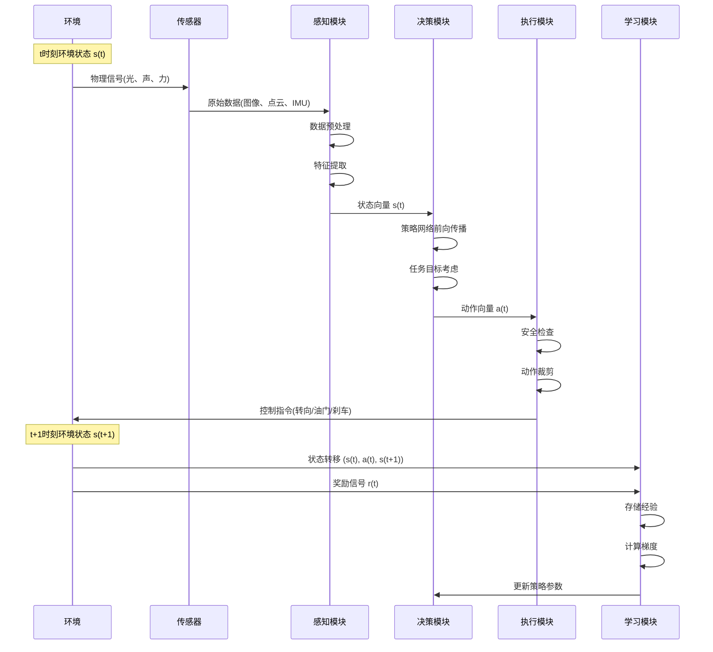
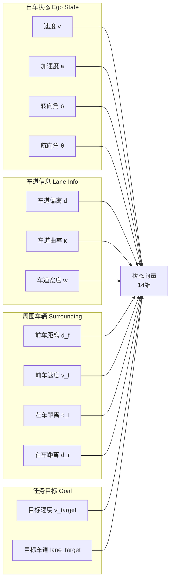

# 21.2 感知-决策-执行闭环

## 引言

在上一节中,我们了解了具身智能的核心概念。现在,让我们深入这个概念的心脏——**感知-决策-执行闭环**。

想象你正在骑自行车:眼睛看到前方路况(感知),大脑判断应该左转还是右转(决策),手脚控制车把和踏板(执行),然后你感受到车身的变化(反馈),继续调整...这个过程每秒钟重复数十次,形成一个流畅的闭环。具身智能系统的工作原理与此相同。

本节将详细解析这个闭环的架构设计、数据流动、状态空间设计和动作空间设计,为后续章节的技术实现打下坚实基础。

## 核心概念

### 概念1:闭环架构的必要性

**开环 vs 闭环对比**

| 特性 | 开环系统 | 闭环系统 |
|------|---------|---------|
| **反馈** | 无反馈,执行完就结束 | 持续获取反馈,动态调整 |
| **鲁棒性** | 对干扰敏感,无法纠错 | 能够应对干扰和不确定性 |
| **适应性** | 环境变化时失效 | 能够适应环境变化 |
| **示例** | 定时器控制的洗衣机 | 温控系统、自动驾驶 |

**为什么具身智能必须是闭环?**

1. **环境不确定性**:物理世界充满不可预测的因素(如突然出现的行人)
2. **模型误差**:无论多精确的模型都无法完美预测真实系统
3. **执行偏差**:指令执行可能存在误差(如轮胎打滑)
4. **动态目标**:任务目标可能随时间变化

### 概念2:完整闭环架构

**系统架构图**



**架构层次解析**

1. **感知层**:从物理世界获取信息
   - 原始数据采集(传感器)
   - 多源数据融合
   - 特征提取与表示

2. **决策层**:基于感知做出决策
   - 状态空间构建
   - 策略网络推理
   - 任务规划与优化

3. **执行层**:将决策转化为动作
   - 动作空间映射
   - 安全约束检查
   - 物理控制执行

4. **学习层**:从经验中学习
   - 经验数据存储
   - 奖励信号计算
   - 策略参数更新

### 概念3:数据流分析

**完整数据流图**



**数据类型与维度**

| 数据流 | 数据类型 | 典型维度 | 更新频率 |
|-------|---------|---------|---------|
| 传感器原始数据 | float[] | 摄像头:224×224×3<br/>雷达:360×3 | 10-30Hz |
| 特征向量 | float[] | 64-512维 | 10-20Hz |
| 状态向量 | float[] | 6-20维 | 20Hz |
| 动作向量 | float[] | 2-10维 | 20Hz |
| 奖励信号 | float | 标量 | 20Hz |
| 梯度数据 | float[] | 与网络参数同维 | 1-10Hz |

### 概念4:状态空间设计

**状态表示的原则**

1. **完备性**:包含所有决策相关信息
2. **紧凑性**:去除冗余,降低维度
3. **可观测性**:能够从传感器数据可靠提取
4. **马尔可夫性**:当前状态包含足够的历史信息

**自动驾驶状态空间示例**



**状态向量构成**

```
state = [
    ego_velocity,          // 自车速度 [0, 40] m/s
    ego_acceleration,      // 自车加速度 [-5, 5] m/s²
    steering_angle,        // 转向角 [-30, 30] degree
    heading_angle,         // 航向角 [-180, 180] degree
    lane_deviation,        // 车道偏离 [-2, 2] m
    lane_curvature,        // 车道曲率 [-0.1, 0.1] 1/m
    lane_width,            // 车道宽度 [3, 4] m
    front_distance,        // 前车距离 [0, 100] m
    front_velocity,        // 前车速度 [0, 40] m/s
    left_distance,         // 左车距离 [0, 50] m
    right_distance,        // 右车距离 [0, 50] m
    target_velocity,       // 目标速度 [0, 40] m/s
    target_lane,           // 目标车道 [0, 3]
    time_to_collision      // 碰撞时间 [0, 10] s
]
```

**状态归一化**

为了提高神经网络训练效率,需要对状态进行归一化:

```
normalized_state[i] = (state[i] - min[i]) / (max[i] - min[i])
```

归一化后所有状态分量都在[0, 1]范围内。

### 概念5:动作空间设计

**连续动作 vs 离散动作**

| 特性 | 连续动作 | 离散动作 |
|------|---------|---------|
| **定义** | 动作值在连续区间 | 动作从有限集合选择 |
| **示例** | 转向角[-30°, 30°] | {左转, 直行, 右转} |
| **优点** | 精确控制,平滑过渡 | 易于学习,样本效率高 |
| **缺点** | 探索困难,收敛慢 | 控制粗糙,动作抖动 |
| **算法** | DDPG, TD3, SAC | DQN, PPO(离散版) |
| **应用** | 自动驾驶、机械臂 | 游戏AI、简单机器人 |

**自动驾驶动作空间设计**

**方案1:连续动作空间**
```
action = [
    steering,    // 转向角增量 [-1, 1] → [-5°, 5°]
    throttle,    // 油门 [0, 1] → [0%, 100%]
    brake        // 刹车 [0, 1] → [0%, 100%]
]
```

**方案2:离散动作空间**
```
actions = {
    0: {steering: -5°, throttle: 0.5, brake: 0},    // 左转加速
    1: {steering: 0°, throttle: 0.5, brake: 0},     // 直行加速
    2: {steering: 5°, throttle: 0.5, brake: 0},     // 右转加速
    3: {steering: 0°, throttle: 0, brake: 0},       // 保持
    4: {steering: 0°, throttle: 0, brake: 0.5},     // 刹车
    5: {steering: -5°, throttle: 0, brake: 0},      // 左转
    6: {steering: 5°, throttle: 0, brake: 0}        // 右转
}
```

**TinyAI采用方案:混合动作空间**
- 转向:连续值,精确控制方向
- 油门/刹车:离散化为5个档位,简化学习

## 技术实现

### 实现思路

闭环系统的实现遵循以下步骤:

1. **初始化阶段**
   - 创建环境实例
   - 加载策略网络
   - 重置所有传感器
   - 设置初始状态

2. **单步循环**
   - 采集传感器数据
   - 提取状态特征
   - 策略网络推理
   - 执行动作控制
   - 环境状态更新
   - 计算奖励信号
   - 存储经验数据

3. **学习阶段**
   - 从经验池采样批次
   - 计算TD误差/策略梯度
   - 反向传播更新参数
   - 更新目标网络(如DQN)

### 完整闭环伪代码

```java
/**
 * 具身智能体的完整闭环执行
 */
public class EmbodiedAgentLoop {
    
    private DrivingEnvironment env;
    private PerceptionModule perception;
    private DecisionModule decision;
    private ExecutionModule execution;
    private LearningEngine learning;
    
    /**
     * 执行一个完整的episode
     */
    public Episode runEpisode(int maxSteps) {
        // 1. 重置环境到初始状态
        NdArray state = env.reset();
        Episode episode = new Episode();
        
        for (int step = 0; step < maxSteps; step++) {
            // 2. 感知:从环境获取传感器数据
            SensorData sensorData = perception.processSensors(env);
            
            // 3. 特征提取:转换为状态表示
            NdArray stateVector = perception.extractFeatures(sensorData);
            
            // 4. 决策:策略网络推理
            NdArray action = decision.selectAction(stateVector);
            
            // 5. 安全检查:确保动作在安全范围内
            NdArray safeAction = execution.applySafetyConstraints(action);
            
            // 6. 执行:应用动作到环境
            StepResult result = env.step(safeAction);
            NdArray nextState = result.getState();
            float reward = result.getReward();
            boolean done = result.isDone();
            
            // 7. 存储经验:(s, a, r, s', done)
            Transition transition = new Transition(
                stateVector, safeAction, reward, nextState, done
            );
            episode.addTransition(transition);
            learning.storeExperience(transition);
            
            // 8. 学习:定期更新策略
            if (step % learningFrequency == 0) {
                learning.update();
            }
            
            // 9. 更新状态
            state = nextState;
            
            // 10. 终止条件检查
            if (done) {
                break;
            }
        }
        
        return episode;
    }
    
    /**
     * 感知模块:处理传感器数据
     */
    class PerceptionModule {
        public SensorData processSensors(DrivingEnvironment env) {
            SensorData data = new SensorData();
            
            // 获取各传感器数据
            data.camera = env.getSensorData(SensorType.CAMERA);
            data.lidar = env.getSensorData(SensorType.LIDAR);
            data.imu = env.getSensorData(SensorType.IMU);
            data.gps = env.getSensorData(SensorType.GPS);
            
            // 时间戳同步
            data.timestamp = System.currentTimeMillis();
            
            return data;
        }
        
        public NdArray extractFeatures(SensorData data) {
            // 多传感器融合
            NdArray egoState = extractEgoState(data.imu, data.gps);
            NdArray laneInfo = extractLaneInfo(data.camera);
            NdArray obstacles = extractObstacles(data.lidar);
            
            // 拼接为统一状态向量
            return NdArray.concatenate(egoState, laneInfo, obstacles);
        }
    }
    
    /**
     * 决策模块:基于状态选择动作
     */
    class DecisionModule {
        private PolicyNetwork policy;
        private double epsilon = 0.1;  // 探索率
        
        public NdArray selectAction(NdArray state) {
            // ε-greedy探索策略
            if (Math.random() < epsilon) {
                // 探索:随机动作
                return generateRandomAction();
            } else {
                // 利用:策略网络推理
                return policy.forward(state);
            }
        }
        
        private NdArray generateRandomAction() {
            // 生成随机但合理的动作
            float steering = (float)(Math.random() * 2 - 1);  // [-1, 1]
            float throttle = (float)Math.random();             // [0, 1]
            float brake = 0.0f;
            
            return NdArray.of(steering, throttle, brake);
        }
    }
    
    /**
     * 执行模块:应用安全约束
     */
    class ExecutionModule {
        public NdArray applySafetyConstraints(NdArray action) {
            NdArray safeAction = action.copy();
            
            // 1. 动作范围裁剪
            float steering = clip(action.get(0), -1.0f, 1.0f);
            float throttle = clip(action.get(1), 0.0f, 1.0f);
            float brake = clip(action.get(2), 0.0f, 1.0f);
            
            // 2. 互斥约束:油门和刹车不能同时
            if (throttle > 0.1f && brake > 0.1f) {
                brake = 0.0f;  // 优先油门
            }
            
            // 3. 速度约束:超速时强制刹车
            if (env.getEgoVehicle().getSpeed() > speedLimit) {
                throttle = 0.0f;
                brake = 0.5f;
            }
            
            safeAction.set(0, steering);
            safeAction.set(1, throttle);
            safeAction.set(2, brake);
            
            return safeAction;
        }
        
        private float clip(float value, float min, float max) {
            return Math.max(min, Math.min(max, value));
        }
    }
}
```

### 时序同步机制

**问题**:不同传感器的采样频率不同,如何保证数据同步?

**解决方案:时间戳对齐**

```java
class SensorSynchronizer {
    private Map<SensorType, Queue<SensorReading>> buffers;
    private long syncWindow = 50;  // 50ms同步窗口
    
    /**
     * 获取时间对齐的传感器数据
     */
    public SensorData getSynchronizedData(long targetTime) {
        SensorData data = new SensorData();
        
        // 为每个传感器找到最接近目标时间的数据
        for (SensorType type : SensorType.values()) {
            SensorReading reading = findClosestReading(type, targetTime);
            
            if (reading != null && 
                Math.abs(reading.timestamp - targetTime) < syncWindow) {
                data.put(type, reading.data);
            } else {
                // 数据缺失,使用上一帧或插值
                data.put(type, interpolate(type, targetTime));
            }
        }
        
        return data;
    }
}
```

## 性能优化

### 优化1:状态空间降维

**问题**:高维状态空间导致学习困难

**方法**:主成分分析(PCA)降维

```java
// 原始状态:64维传感器特征
NdArray rawState = extractRawFeatures(sensorData);

// PCA降维到16维
NdArray compressedState = pcaTransform(rawState, targetDim=16);

// 保留90%以上方差的同时大幅降低维度
```

### 优化2:动作平滑

**问题**:神经网络输出抖动,导致执行不稳定

**方法**:指数移动平均(EMA)

```java
class ActionSmoother {
    private NdArray lastAction;
    private float alpha = 0.7f;  // 平滑系数
    
    public NdArray smooth(NdArray newAction) {
        if (lastAction == null) {
            lastAction = newAction;
            return newAction;
        }
        
        // 平滑后动作 = α * 新动作 + (1-α) * 旧动作
        NdArray smoothed = newAction.multiply(alpha)
                                    .add(lastAction.multiply(1 - alpha));
        
        lastAction = smoothed;
        return smoothed;
    }
}
```

### 优化3:批处理推理

**问题**:逐个样本推理效率低

**方法**:批量处理

```java
// 低效:逐个处理
for (Agent agent : agents) {
    NdArray action = policy.forward(agent.getState());
    agent.setAction(action);
}

// 高效:批处理
NdArray stateBatch = stackStates(agents);  // [N, state_dim]
NdArray actionBatch = policy.forward(stateBatch);  // [N, action_dim]
distributeActions(agents, actionBatch);
```

## 常见问题

### 问题1:动作抖动,车辆左右摆动

**现象**:车辆行驶不稳定,频繁左右调整

**原因**:
- 策略网络输出不稳定
- 学习率过大导致参数震荡
- 缺少动作平滑机制

**解决方案**:
```java
// 1. 降低学习率
optimizer.setLearningRate(0.0001);

// 2. 添加动作平滑
action = actionSmoother.smooth(rawAction);

// 3. 在奖励函数中惩罚动作变化
float smoothnessReward = -Math.abs(action - lastAction);
```

### 问题2:决策延迟过高

**现象**:从感知到执行延迟超过100ms,响应不及时

**原因**:
- 神经网络过于复杂
- 传感器数据处理耗时
- 无效的计算开销

**解决方案**:
```java
// 1. 模型轻量化:减少层数和参数
PolicyNetwork policy = new PolicyNetwork(
    inputDim: 14,
    hiddenDims: [32, 32],  // 而非[256, 256]
    outputDim: 3
);

// 2. 异步处理:感知和决策并行
CompletableFuture<SensorData> perceptionTask = 
    CompletableFuture.supplyAsync(() -> perception.process(env));
    
NdArray action = decision.selectAction(lastState);

// 3. 定时器控制:严格20Hz执行
ScheduledExecutorService executor = 
    Executors.newScheduledThreadPool(1);
executor.scheduleAtFixedRate(
    () -> executeOneStep(), 
    0, 50, TimeUnit.MILLISECONDS
);
```

### 问题3:状态表示不完整

**现象**:智能体表现不稳定,相同场景不同反应

**原因**:
- 状态缺少关键信息(如历史速度)
- 违反马尔可夫性

**解决方案**:
```java
// 方法1:添加历史状态
NdArray state = NdArray.concatenate(
    currentState,       // 当前状态
    history.get(-1),    // 上一时刻状态
    history.get(-2)     // 上两时刻状态
);

// 方法2:使用LSTM记忆历史
class PolicyNetworkLSTM extends Block {
    private LSTM lstm;
    private Linear linear;
    
    public NdArray forward(NdArray state) {
        NdArray hidden = lstm.forward(state);  // 自动记忆历史
        return linear.forward(hidden);
    }
}
```

## 最佳实践

### 实践1:模块化设计

**原则**:感知、决策、执行、学习模块独立,通过清晰接口交互

**好处**:
- 易于测试和调试
- 可以独立优化各模块
- 便于团队协作

```java
// 清晰的接口定义
interface PerceptionModule {
    NdArray extractState(DrivingEnvironment env);
}

interface DecisionModule {
    NdArray selectAction(NdArray state);
}

interface ExecutionModule {
    StepResult execute(NdArray action, DrivingEnvironment env);
}
```

### 实践2:增量式开发

**流程**:
1. 先用简单策略验证闭环(如随机策略)
2. 再加入简单学习算法(如Q-Learning)
3. 最后使用复杂算法(如DQN、PPO)

**验证**:每一步都确保系统稳定运行

### 实践3:全面监控

**监控指标**:
- 决策延迟:每步执行时间
- 动作分布:检测是否出现某个动作占主导
- 状态统计:检测异常值
- 奖励曲线:监控学习进度

```java
class PerformanceMonitor {
    public void logStep(StepMetrics metrics) {
        logger.info("Step {}: latency={}ms, reward={}, action={}", 
                   metrics.step, 
                   metrics.latency, 
                   metrics.reward,
                   metrics.action);
        
        // 检测异常
        if (metrics.latency > 100) {
            logger.warn("High latency detected!");
        }
    }
}
```

## 小节总结

### 核心要点

1. **闭环的必要性**:具身智能必须是闭环系统,才能应对环境不确定性和模型误差

2. **四层架构**:感知层(数据采集)、决策层(策略推理)、执行层(动作控制)、学习层(策略优化)

3. **数据流**:环境→传感器→感知→决策→执行→环境,形成完整循环

4. **状态空间**:需要满足完备性、紧凑性、可观测性、马尔可夫性四个原则

5. **动作空间**:连续动作精确但难学,离散动作简单但粗糙,可采用混合方案

### 实现要领

- **时序同步**:确保多传感器数据时间对齐
- **动作平滑**:避免抖动,提高控制稳定性
- **性能优化**:降维、批处理、模型轻量化
- **安全第一**:执行前必须进行安全检查

### 应用价值

本节建立的闭环架构是所有具身智能系统的基础,无论是自动驾驶、机器人还是无人机,都遵循相同的设计模式。掌握这个架构,就掌握了具身智能的核心。

## 思考题

1. **架构理解**:为什么需要将感知、决策、执行分为独立模块?如果合并会有什么问题?

2. **状态设计**:假设设计一个室内送餐机器人,它的状态空间应该包含哪些信息?

3. **动作选择**:对于机械臂抓取任务,应该选择连续动作还是离散动作?为什么?

4. **性能权衡**:如何在决策精度和实时性之间取得平衡?

5. **故障处理**:如果某个传感器突然失效,闭环系统应该如何应对?

## 拓展阅读

- **控制理论**:《现代控制工程》(Ogata) - PID控制、状态空间方法
- **强化学习**:《Reinforcement Learning: An Introduction》 - MDP、策略优化
- **机器人学**:《Probabilistic Robotics》 - 状态估计、传感器融合

---

**下一节预告**:下一节我们将深入探讨传感器模拟与多模态感知,学习如何实现摄像头、激光雷达、IMU、GPS等多种传感器的仿真,以及如何进行多传感器融合。
