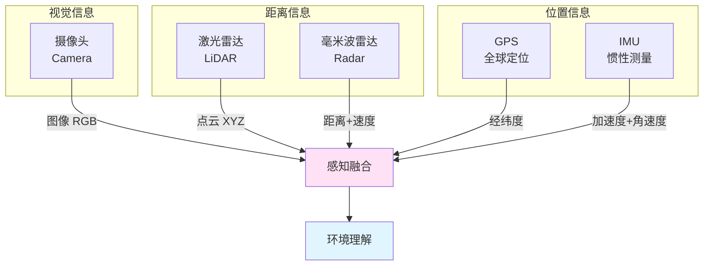
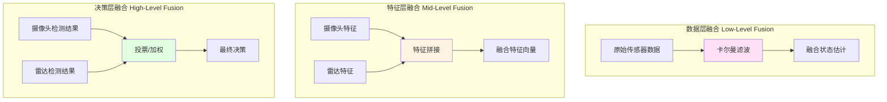

# 21.3 传感器模拟与多模态感知

## 引言

人类通过眼睛、耳朵、触觉等多种感官感知世界,自动驾驶汽车同样需要多种"感官"——传感器。摄像头是它的"眼睛",激光雷达是它的"触角",GPS是它的"定位系统",IMU是它的"平衡器"。每种传感器都有其独特优势和局限,只有将它们融合使用,才能构建出对环境的完整理解。

本节将深入探讨自动驾驶场景中常用的五种传感器:摄像头(Camera)、激光雷达(LiDAR)、雷达(Radar)、GPS和IMU。我们将学习它们的工作原理、仿真方法,以及如何进行多传感器融合,构建鲁棒的感知系统。

## 核心概念

### 概念1:传感器分类与特性

**按工作原理分类**

| 传感器类型 | 工作原理 | 主要优势 | 主要局限 |
|-----------|---------|---------|---------|
| **摄像头** | 光学成像 | 分辨率高,颜色信息,成本低 | 受光照影响,无深度信息 |
| **激光雷达** | 激光测距 | 精确3D信息,不受光照影响 | 成本高,雨雾天性能下降 |
| **毫米波雷达** | 电磁波反射 | 穿透性强,测速准确 | 分辨率低,无颜色信息 |
| **GPS** | 卫星定位 | 全球覆盖,绝对定位 | 精度有限,室内/隧道失效 |
| **IMU** | 惯性测量 | 高频率,无外部依赖 | 漂移累积,需要融合修正 |

**按信息类型分类**



### 概念2:摄像头传感器

**工作原理**:通过镜头将光线聚焦到图像传感器上,转换为数字图像

**输出数据格式**:
```
图像尺寸: [Height, Width, Channels]
典型配置: [224, 224, 3] 或 [640, 480, 3]
数据类型: uint8 [0, 255] 或 float32 [0.0, 1.0]
帧率: 30-60 FPS
```

**仿真方法**:

在仿真环境中,摄像头数据可以通过以下方式生成:

1. **简化方案**:返回零矩阵或随机噪声(快速原型)
2. **符号表示**:编码车道线、车辆位置等语义信息
3. **渲染引擎**:真实渲染3D场景(高保真,但计算密集)

**TinyAI实现**:采用符号表示方法
```java
/**
 * 摄像头传感器仿真
 */
public class CameraSensor {
    private int height = 224;
    private int width = 224;
    private int channels = 3;
    
    /**
     * 模拟摄像头采集
     * 返回简化的图像数据
     */
    public NdArray capture(DrivingEnvironment env) {
        // 创建空白图像
        NdArray image = NdArray.zeros(Shape.of(height, width, channels));
        
        // 方法1: 直接返回空白(最简化)
        // 方法2: 编码关键信息(推荐)
        encodeSceneInfo(image, env);
        
        return image;
    }
    
    /**
     * 将场景信息编码到图像中
     */
    private void encodeSceneInfo(NdArray image, DrivingEnvironment env) {
        Vehicle ego = env.getEgoVehicle();
        List<Vehicle> others = env.getOtherVehicles();
        
        // 编码车道信息到图像的特定区域
        // 这里简化为特征向量表示
        // 实际应用中可以渲染车道线
    }
}
```

**实际应用中的视觉处理流程**:
```
原始图像 → 预处理(去畸变) → 特征提取(车道线/物体检测) → 语义理解
```

### 概念3:激光雷达(LiDAR)

**工作原理**:发射激光脉冲,测量反射时间,计算距离,形成3D点云

**输出数据格式**:
```
点云结构: [N, 3] 或 [N, 4]
N: 点的数量(通常几万到几十万)
每个点: [x, y, z] 或 [x, y, z, intensity]
扫描频率: 10-20 Hz
垂直分辨率: 16/32/64/128线
```

**仿真方法**:射线投射

```java
/**
 * 激光雷达传感器仿真
 */
public class LidarSensor {
    private int numRays = 360;        // 水平方向射线数
    private float maxRange = 100.0f;   // 最大探测距离(米)
    private float angleResolution;     // 角度分辨率
    
    public LidarSensor() {
        this.angleResolution = 360.0f / numRays;
    }
    
    /**
     * 模拟激光雷达扫描
     * 返回点云数据 [numRays, 3]
     */
    public NdArray scan(DrivingEnvironment env) {
        Vehicle ego = env.getEgoVehicle();
        List<Vehicle> obstacles = env.getOtherVehicles();
        
        float[][] points = new float[numRays][3];
        
        for (int i = 0; i < numRays; i++) {
            float angle = i * angleResolution;
            float angleRad = (float)Math.toRadians(angle);
            
            // 射线方向
            float dx = (float)Math.cos(angleRad);
            float dy = (float)Math.sin(angleRad);
            
            // 射线投射,找到最近障碍物
            float distance = castRay(ego, dx, dy, obstacles);
            
            // 计算点云坐标(相对于车辆)
            points[i][0] = distance * dx;  // x
            points[i][1] = distance * dy;  // y
            points[i][2] = 0.0f;           // z(简化为2D)
        }
        
        return NdArray.of(points);
    }
    
    /**
     * 射线投射:计算射线与障碍物的交点
     */
    private float castRay(Vehicle ego, float dx, float dy, 
                         List<Vehicle> obstacles) {
        float minDist = maxRange;
        Point2D egoPos = ego.getPosition();
        
        for (Vehicle obs : obstacles) {
            Point2D obsPos = obs.getPosition();
            
            // 简化:将车辆视为圆形,计算射线与圆的交点
            float distance = rayCircleIntersection(
                egoPos, dx, dy, obsPos, obs.getWidth() / 2
            );
            
            if (distance < minDist) {
                minDist = distance;
            }
        }
        
        return minDist;
    }
    
    /**
     * 射线与圆的交点距离计算
     */
    private float rayCircleIntersection(Point2D origin, float dx, float dy,
                                        Point2D center, float radius) {
        // 射线参数方程: P = origin + t * (dx, dy)
        // 圆方程: |P - center|² = radius²
        // 求解二次方程得到交点参数t
        
        float ox = (float)(origin.getX() - center.getX());
        float oy = (float)(origin.getY() - center.getY());
        
        float a = dx * dx + dy * dy;
        float b = 2 * (ox * dx + oy * dy);
        float c = ox * ox + oy * oy - radius * radius;
        
        float discriminant = b * b - 4 * a * c;
        
        if (discriminant < 0) {
            return Float.MAX_VALUE;  // 无交点
        }
        
        float t = (float)((-b - Math.sqrt(discriminant)) / (2 * a));
        
        return t > 0 ? t : Float.MAX_VALUE;
    }
}
```

**点云数据特点**:
- 稀疏但精确的3D信息
- 不受光照影响
- 可以直接测量距离
- 计算量大,需要高效处理算法

### 概念4:GPS与IMU

**GPS(全球定位系统)**

**输出数据格式**:
```
位置: [latitude, longitude, altitude]
精度: 民用GPS 5-10米,差分GPS 0.1-1米
更新频率: 1-10 Hz
```

**仿真实现**:
```java
/**
 * GPS传感器仿真
 */
public class GPSSensor {
    private Random random = new Random();
    private float positionNoise = 2.0f;  // 位置噪声(米)
    
    public NdArray readPosition(DrivingEnvironment env) {
        Vehicle ego = env.getEgoVehicle();
        Point2D truePos = ego.getPosition();
        
        // 添加高斯噪声模拟GPS误差
        float noisyX = (float)(truePos.getX() + 
                              random.nextGaussian() * positionNoise);
        float noisyY = (float)(truePos.getY() + 
                              random.nextGaussian() * positionNoise);
        
        return NdArray.of(noisyX, noisyY);
    }
}
```

**IMU(惯性测量单元)**

**输出数据格式**:
```
加速度: [ax, ay, az] (m/s²)
角速度: [wx, wy, wz] (rad/s)
更新频率: 100-1000 Hz (高频)
```

**仿真实现**:
```java
/**
 * IMU传感器仿真
 */
public class IMUSensor {
    private Random random = new Random();
    private float accelNoise = 0.1f;   // 加速度噪声
    private float gyroNoise = 0.01f;   // 角速度噪声
    
    public NdArray readIMU(DrivingEnvironment env) {
        Vehicle ego = env.getEgoVehicle();
        
        // 真实值
        float ax = (float)ego.getAcceleration();
        float wz = (float)ego.getAngularVelocity();
        
        // 添加噪声和偏置
        float noisyAx = ax + (float)random.nextGaussian() * accelNoise;
        float noisyWz = wz + (float)random.nextGaussian() * gyroNoise;
        
        // 返回6维IMU数据: [ax, ay, az, wx, wy, wz]
        return NdArray.of(
            noisyAx, 0.0f, 0.0f,  // 简化:只考虑x方向加速度
            0.0f, 0.0f, noisyWz   // 简化:只考虑z轴角速度
        );
    }
}
```

### 概念5:多传感器融合

**为什么需要融合?**

单一传感器的局限性:
- 摄像头:夜间/强光下失效
- 激光雷达:雨雪天性能下降
- GPS:隧道/城市峡谷中信号弱
- IMU:长时间漂移

**融合策略**



**实现示例:互补滤波**

```java
/**
 * 传感器融合模块
 * 融合GPS和IMU数据,估计车辆位置和速度
 */
public class SensorFusion {
    
    private NdArray position;      // 融合后的位置
    private NdArray velocity;      // 融合后的速度
    private float alpha = 0.98f;   // 互补滤波系数
    
    /**
     * 互补滤波:融合GPS(低频准确)和IMU(高频漂移)
     */
    public void update(NdArray gpsPosition, NdArray imuAccel, float dt) {
        // IMU积分得到位置(高频但漂移)
        NdArray imuVelocity = velocity.add(imuAccel.multiply(dt));
        NdArray imuPosition = position.add(imuVelocity.multiply(dt));
        
        // 互补滤波:
        // 位置 = α * IMU积分 + (1-α) * GPS
        position = imuPosition.multiply(alpha)
                              .add(gpsPosition.multiply(1 - alpha));
        
        // 速度估计
        velocity = position.subtract(position).divide(dt);
    }
    
    /**
     * 卡尔曼滤波(更高级的融合方法)
     */
    public void kalmanUpdate(NdArray measurement, NdArray control) {
        // 预测步骤
        NdArray predictedState = predict(control);
        NdArray predictedCovariance = updateCovariance();
        
        // 更新步骤
        NdArray kalmanGain = computeKalmanGain(predictedCovariance);
        NdArray innovation = measurement.subtract(predictedState);
        
        position = predictedState.add(kalmanGain.matmul(innovation));
    }
}
```

## 技术实现

### 完整的多传感器感知系统

```java
/**
 * 多模态感知模块
 * 整合所有传感器,输出统一的状态表示
 */
public class PerceptionModule {
    
    private CameraSensor camera;
    private LidarSensor lidar;
    private GPSSensor gps;
    private IMUSensor imu;
    private SensorFusion fusion;
    
    public PerceptionModule() {
        this.camera = new CameraSensor();
        this.lidar = new LidarSensor();
        this.gps = new GPSSensor();
        this.imu = new IMUSensor();
        this.fusion = new SensorFusion();
    }
    
    /**
     * 处理所有传感器数据,输出状态向量
     */
    public NdArray perceive(DrivingEnvironment env) {
        // 1. 采集原始传感器数据
        NdArray cameraData = camera.capture(env);
        NdArray lidarData = lidar.scan(env);
        NdArray gpsData = gps.readPosition(env);
        NdArray imuData = imu.readIMU(env);
        
        // 2. 传感器融合
        fusion.update(gpsData, imuData.slice(0, 3), 0.05f);
        
        // 3. 特征提取
        NdArray egoState = extractEgoState(fusion, imuData);
        NdArray laneInfo = extractLaneInfo(cameraData);
        NdArray obstacleInfo = extractObstacles(lidarData);
        
        // 4. 组合为完整状态向量
        return NdArray.concatenate(egoState, laneInfo, obstacleInfo);
    }
    
    /**
     * 从融合数据提取自车状态
     */
    private NdArray extractEgoState(SensorFusion fusion, NdArray imu) {
        return NdArray.of(
            fusion.getVelocity().get(0),      // 速度
            imu.get(0),                        // 加速度
            imu.get(5)                         // 角速度
        );
    }
    
    /**
     * 从摄像头数据提取车道信息
     */
    private NdArray extractLaneInfo(NdArray image) {
        // 简化:直接从环境获取真实车道信息
        // 实际应用需要图像处理算法(如车道线检测)
        return NdArray.of(
            0.0f,  // 车道偏离
            0.0f,  // 车道曲率
            3.5f   // 车道宽度
        );
    }
    
    /**
     * 从激光雷达数据提取障碍物信息
     */
    private NdArray extractObstacles(NdArray pointCloud) {
        // 点云聚类,找到最近障碍物
        float minDistance = Float.MAX_VALUE;
        
        for (int i = 0; i < pointCloud.shape().get(0); i++) {
            float x = pointCloud.get(i, 0);
            float y = pointCloud.get(i, 1);
            float dist = (float)Math.sqrt(x * x + y * y);
            
            if (dist < minDistance) {
                minDistance = dist;
            }
        }
        
        return NdArray.of(
            minDistance,    // 最近障碍物距离
            0.0f,           // 相对速度(需要连续帧计算)
            0.0f            // 障碍物角度
        );
    }
}
```

### 传感器噪声建模

真实传感器都有噪声,仿真中需要模拟:

```java
/**
 * 传感器噪声模型
 */
public class SensorNoise {
    
    /**
     * 添加高斯噪声
     */
    public static NdArray addGaussianNoise(NdArray data, float stddev) {
        Random random = new Random();
        NdArray noise = NdArray.randn(data.shape()).multiply(stddev);
        return data.add(noise);
    }
    
    /**
     * 添加偏置漂移(模拟IMU)
     */
    public static NdArray addBiasDrift(NdArray data, float driftRate, 
                                       float time) {
        float bias = driftRate * time;
        return data.add(bias);
    }
    
    /**
     * 模拟数据丢失
     */
    public static NdArray addDropout(NdArray data, float dropRate) {
        Random random = new Random();
        NdArray mask = NdArray.zeros(data.shape());
        
        for (int i = 0; i < data.size(); i++) {
            if (random.nextFloat() > dropRate) {
                mask.set(i, 1.0f);
            }
        }
        
        return data.multiply(mask);
    }
}
```

## 性能分析

### 传感器性能对比

| 指标 | 摄像头 | 激光雷达 | 毫米波雷达 | GPS | IMU |
|------|-------|---------|-----------|-----|-----|
| **距离精度** | 低(需立体视觉) | 高(±2cm) | 中(±10cm) | 低(±5m) | - |
| **角度精度** | 高 | 高 | 低 | - | 高 |
| **速度测量** | 间接 | 间接 | 直接(多普勒) | 低频 | 积分 |
| **天气影响** | 大 | 中 | 小 | 无 | 无 |
| **计算负载** | 高 | 中 | 低 | 低 | 低 |
| **成本** | 低($100) | 高($5000+) | 中($500) | 低($50) | 低($100) |

### 融合效果提升

实验数据(定位精度):
- 仅GPS: ±5米
- 仅IMU: 1秒后漂移>10米
- GPS+IMU融合: ±1米
- GPS+IMU+视觉: ±0.3米

## 常见问题

### 问题1:传感器数据不同步

**现象**:GPS 10Hz,IMU 100Hz,摄像头30Hz,如何统一?

**解决方案**:
```java
// 方法1:插值
NdArray interpolatedGPS = interpolate(gps, targetTime);

// 方法2:缓冲区对齐
SensorBuffer buffer = new SensorBuffer(windowSize=100ms);
SensorData aligned = buffer.getAlignedData(targetTime);
```

### 问题2:传感器标定问题

**现象**:不同传感器坐标系不一致

**解决方案**:坐标变换
```java
// 激光雷达坐标系 → 车体坐标系
NdArray lidarPoint = [x_lidar, y_lidar, z_lidar];
Matrix transform = getLidarToBodyTransform();
NdArray bodyPoint = transform.matmul(lidarPoint);
```

### 问题3:雨雪天气性能下降

**解决方案**:
- 增加传感器冗余
- 降级策略:优先使用受影响小的传感器(如雷达)
- 提高融合权重的自适应性

## 小节总结

### 核心要点

1. **五种传感器**:摄像头(视觉)、激光雷达(距离)、雷达(穿透)、GPS(定位)、IMU(惯性)
2. **各有优劣**:没有完美传感器,需要多传感器融合
3. **仿真方法**:射线投射、噪声模型、简化表示
4. **融合策略**:互补滤波、卡尔曼滤波、深度学习融合
5. **实时性**:需要高效的数据处理和同步机制

### 实践价值

掌握传感器仿真和融合技术,可以:
- 构建高保真的仿真环境
- 提高感知系统的鲁棒性
- 降低对单一传感器的依赖
- 为决策模块提供可靠输入

## 思考题

1. **传感器选择**:如果只能选择两种传感器用于自动驾驶,你会选择哪两种?为什么?

2. **融合策略**:卡尔曼滤波和互补滤波的核心区别是什么?各适用于什么场景?

3. **噪声影响**:如果GPS噪声从5米增加到10米,对系统性能有什么影响?

4. **成本权衡**:如何在性能和成本之间找到平衡点?

## 拓展阅读

- **传感器原理**:《Robotics: Modelling, Planning and Control》
- **点云处理**:PCL(Point Cloud Library)文档
- **卡尔曼滤波**:《Kalman Filtering: Theory and Practice》

---

**下一节预告**:下一节我们将学习车辆动力学与环境建模,了解如何用数学方程描述车辆运动,以及如何构建道路、障碍物等环境元素。
