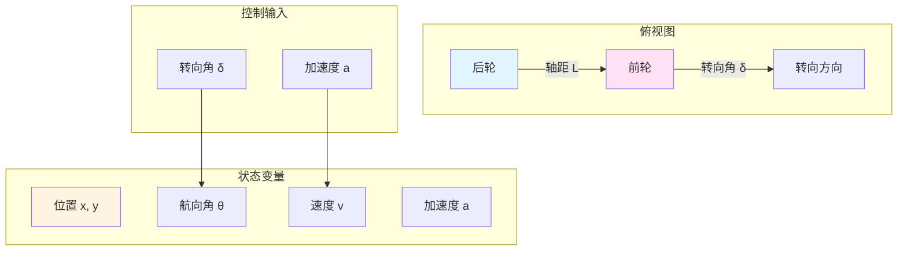
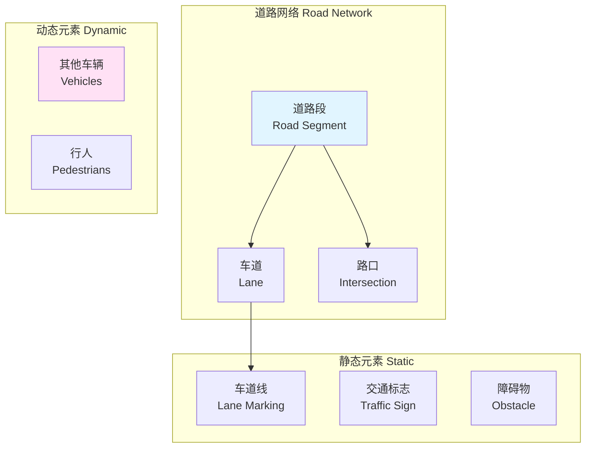

# 21.4 车辆动力学与环境建模

## 引言

在上一节中,我们学习了如何通过传感器感知环境。但仅有感知还不够,具身智能体还需要理解自己的"身体"——车辆如何运动,以及它所处的"世界"——环境如何构成。这就是动力学建模和环境建模的任务。

当你转动方向盘,车辆为什么会转弯?踩下油门,速度如何变化?这背后都有精确的物理规律。本节将介绍自行车模型(Bicycle Model)这一经典的车辆动力学简化模型,以及如何构建包含道路、车道、障碍物的仿真环境。

## 核心概念

### 概念1:车辆动力学建模层次

车辆动力学建模有多个层次,复杂度和精度各不相同:

| 模型层次 | 复杂度 | 精度 | 计算成本 | 适用场景 |
|---------|-------|------|---------|---------|
| **运动学模型** | 低 | 低 | 很低 | 低速场景,路径规划 |
| **自行车模型** | 中 | 中 | 低 | 中高速场景,策略学习 |
| **二自由度模型** | 中高 | 中高 | 中 | 极限工况,稳定性分析 |
| **多体动力学** | 很高 | 很高 | 很高 | 精确仿真,悬架设计 |

**TinyAI采用:自行车模型** - 在精度和效率间取得良好平衡

### 概念2:自行车模型(Bicycle Model)

**基本思想**:将四轮车辆简化为两轮,前轮控制方向,后轮提供驱动

**模型示意图**:



**状态方程**:

车辆状态由6个变量描述:
```
状态向量 s = [x, y, θ, v, δ, a]

其中:
- (x, y): 车辆位置 (米)
- θ: 航向角 (弧度)
- v: 速度 (米/秒)
- δ: 转向角 (弧度)
- a: 加速度 (米/秒²)
```

**动力学方程**:

```
连续时间形式:
ẋ = v · cos(θ)
ẏ = v · sin(θ)
θ̇ = (v / L) · tan(δ)
v̇ = a

离散时间形式(时间步长Δt):
x(t+1) = x(t) + v(t) · cos(θ(t)) · Δt
y(t+1) = y(t) + v(t) · sin(θ(t)) · Δt
θ(t+1) = θ(t) + (v(t) / L) · tan(δ(t)) · Δt
v(t+1) = v(t) + a(t) · Δt
```

**关键参数**:
- L = 2.7米 (车辆轴距,典型轿车)
- δ_max = ±30° (最大转向角)
- v_max = 40 m/s = 144 km/h (最大速度)
- a_max = ±5 m/s² (最大加速度)

### 概念3:车辆动力学实现

```java
/**
 * 车辆动力学模型
 * 基于自行车模型的简化实现
 */
public class VehicleDynamics {
    
    // 车辆参数
    private double wheelbase = 2.7;        // 轴距(米)
    private double width = 1.8;            // 车宽(米)
    private double length = 4.5;           // 车长(米)
    
    // 物理限制
    private double maxSpeed = 40.0;        // 最大速度(m/s)
    private double maxSteering = Math.toRadians(30);  // 最大转向角(弧度)
    private double maxAccel = 5.0;         // 最大加速度(m/s²)
    
    // 当前状态
    private Point2D position;              // 位置(x, y)
    private double heading;                // 航向角(弧度)
    private double velocity;               // 速度(m/s)
    private double steeringAngle;          // 转向角(弧度)
    private double acceleration;           // 加速度(m/s²)
    
    /**
     * 状态更新:根据控制输入更新车辆状态
     * @param steering 转向角增量 [-1, 1]
     * @param throttle 油门 [0, 1]
     * @param brake 刹车 [0, 1]
     * @param dt 时间步长(秒)
     */
    public void update(double steering, double throttle, 
                      double brake, double dt) {
        // 1. 更新转向角
        double steeringDelta = steering * maxSteering * 0.1;  // 每步最多转5°
        steeringAngle = clip(steeringAngle + steeringDelta, 
                            -maxSteering, maxSteering);
        
        // 2. 更新加速度
        if (brake > 0.01) {
            // 刹车:负加速度
            acceleration = -brake * maxAccel;
        } else {
            // 油门:正加速度
            acceleration = throttle * maxAccel;
        }
        
        // 3. 考虑空气阻力和摩擦力
        double dragForce = 0.01 * velocity * velocity;  // 简化的阻力模型
        acceleration -= dragForce;
        
        // 4. 更新速度
        velocity = clip(velocity + acceleration * dt, 0, maxSpeed);
        
        // 5. 计算角速度(基于自行车模型)
        double angularVelocity = (velocity / wheelbase) * 
                                 Math.tan(steeringAngle);
        
        // 6. 更新航向角
        heading += angularVelocity * dt;
        heading = normalizeAngle(heading);  // 归一化到[-π, π]
        
        // 7. 更新位置
        double dx = velocity * Math.cos(heading) * dt;
        double dy = velocity * Math.sin(heading) * dt;
        position = new Point2D.Double(
            position.getX() + dx,
            position.getY() + dy
        );
    }
    
    /**
     * 获取车辆四个角的坐标(用于碰撞检测)
     */
    public List<Point2D> getCorners() {
        List<Point2D> corners = new ArrayList<>();
        
        double halfLength = length / 2;
        double halfWidth = width / 2;
        
        // 车辆坐标系下的四个角
        double[][] localCorners = {
            {halfLength, halfWidth},    // 右前
            {halfLength, -halfWidth},   // 左前
            {-halfLength, -halfWidth},  // 左后
            {-halfLength, halfWidth}    // 右后
        };
        
        // 转换到世界坐标系
        for (double[] local : localCorners) {
            double x = position.getX() + 
                      local[0] * Math.cos(heading) - 
                      local[1] * Math.sin(heading);
            double y = position.getY() + 
                      local[0] * Math.sin(heading) + 
                      local[1] * Math.cos(heading);
            corners.add(new Point2D.Double(x, y));
        }
        
        return corners;
    }
    
    /**
     * 辅助方法:数值裁剪
     */
    private double clip(double value, double min, double max) {
        return Math.max(min, Math.min(max, value));
    }
    
    /**
     * 辅助方法:角度归一化到[-π, π]
     */
    private double normalizeAngle(double angle) {
        while (angle > Math.PI) angle -= 2 * Math.PI;
        while (angle < -Math.PI) angle += 2 * Math.PI;
        return angle;
    }
}
```

### 概念4:环境建模

环境包含多个要素:道路、车道、障碍物、其他车辆

**环境组成**:



**道路模型实现**:

```java
/**
 * 道路模型
 */
public class Road {
    private int numLanes;              // 车道数量
    private double laneWidth;          // 车道宽度(米)
    private double length;             // 道路长度(米)
    private RoadType type;             // 道路类型
    
    /**
     * 计算车道中心线位置
     */
    public double getLaneCenterY(int laneIndex) {
        // 假设最右侧车道索引为0
        return (laneIndex + 0.5) * laneWidth;
    }
    
    /**
     * 计算车道边界
     */
    public double[] getLaneBoundaries(int laneIndex) {
        return new double[] {
            laneIndex * laneWidth,        // 右边界
            (laneIndex + 1) * laneWidth   // 左边界
        };
    }
    
    /**
     * 检查车辆是否在车道内
     */
    public boolean isInLane(Vehicle vehicle, int laneIndex) {
        double y = vehicle.getPosition().getY();
        double[] bounds = getLaneBoundaries(laneIndex);
        return y >= bounds[0] && y <= bounds[1];
    }
    
    /**
     * 计算车道偏离距离
     */
    public double getLaneDeviation(Vehicle vehicle, int targetLane) {
        double y = vehicle.getPosition().getY();
        double centerY = getLaneCenterY(targetLane);
        return y - centerY;
    }
}

/**
 * 道路类型枚举
 */
enum RoadType {
    HIGHWAY,      // 高速公路:多车道,限速高
    URBAN,        // 城市道路:中等车道,限速中
    RURAL,        // 乡村道路:窄车道,限速低
    PARKING_LOT   // 停车场:复杂布局
}
```

**其他车辆建模**:

```java
/**
 * 其他车辆(交通流)
 */
public class TrafficVehicle {
    private VehicleDynamics dynamics;
    private int currentLane;
    private TrafficBehavior behavior;
    
    /**
     * 简单的跟驰模型(IDM - Intelligent Driver Model)
     */
    public double calculateAcceleration(Vehicle frontVehicle) {
        double v = dynamics.getVelocity();
        double vDesired = 25.0;  // 期望速度(m/s)
        double T = 1.5;          // 期望时间间隔(秒)
        double a = 2.0;          // 最大加速度(m/s²)
        double b = 3.0;          // 舒适减速度(m/s²)
        double s0 = 2.0;         // 最小间距(米)
        
        // 自由流加速度
        double freeAccel = a * (1 - Math.pow(v / vDesired, 4));
        
        if (frontVehicle == null) {
            return freeAccel;  // 无前车,自由加速
        }
        
        // 有前车:计算期望间距
        double s = getDistance(frontVehicle);
        double dv = v - frontVehicle.getVelocity();
        double sStar = s0 + v * T + (v * dv) / (2 * Math.sqrt(a * b));
        
        // IDM加速度
        return freeAccel - a * Math.pow(sStar / s, 2);
    }
}
```

### 概念5:碰撞检测

**方法1:简化圆形检测**

```java
/**
 * 简化碰撞检测:将车辆视为圆形
 */
public boolean checkCollisionSimple(Vehicle v1, Vehicle v2) {
    double dist = v1.getPosition().distance(v2.getPosition());
    double minDist = (v1.getLength() + v2.getLength()) / 4;  // 近似半径
    return dist < minDist;
}
```

**方法2:矩形碰撞检测(更精确)**

```java
/**
 * 分离轴定理(SAT)碰撞检测
 */
public boolean checkCollisionAccurate(Vehicle v1, Vehicle v2) {
    List<Point2D> corners1 = v1.getCorners();
    List<Point2D> corners2 = v2.getCorners();
    
    // 检查两个矩形的所有分离轴
    List<Vector2D> axes = new ArrayList<>();
    axes.addAll(getAxes(corners1));
    axes.addAll(getAxes(corners2));
    
    for (Vector2D axis : axes) {
        Projection proj1 = project(corners1, axis);
        Projection proj2 = project(corners2, axis);
        
        if (!proj1.overlaps(proj2)) {
            return false;  // 找到分离轴,无碰撞
        }
    }
    
    return true;  // 所有轴都重叠,发生碰撞
}
```

## 技术实现

### 完整的驾驶环境

```java
/**
 * 驾驶环境:整合车辆动力学和环境元素
 */
public class DrivingEnvironment {
    
    private Road road;
    private Vehicle egoVehicle;           // 自车
    private List<Vehicle> trafficVehicles; // 其他车辆
    private double timeStep = 0.05;       // 时间步长:50ms
    private int stepCount = 0;
    
    /**
     * 重置环境到初始状态
     */
    public NdArray reset() {
        // 1. 重置道路
        road = new Road(numLanes=3, laneWidth=3.5, length=1000);
        
        // 2. 重置自车:在中间车道起始位置
        egoVehicle = new Vehicle();
        egoVehicle.setPosition(new Point2D.Double(0, road.getLaneCenterY(1)));
        egoVehicle.setVelocity(20.0);  // 初始速度20m/s
        
        // 3. 生成交通车辆
        trafficVehicles = generateTraffic(density=0.1);
        
        // 4. 重置步数
        stepCount = 0;
        
        return getState();
    }
    
    /**
     * 执行一步仿真
     */
    public StepResult step(NdArray action) {
        // 1. 解析动作
        double steering = action.get(0);   // [-1, 1]
        double throttle = action.get(1);   // [0, 1]
        double brake = action.get(2);      // [0, 1]
        
        // 2. 更新自车状态
        egoVehicle.update(steering, throttle, brake, timeStep);
        
        // 3. 更新交通车辆
        for (Vehicle traffic : trafficVehicles) {
            traffic.updateTraffic(timeStep);
        }
        
        // 4. 碰撞检测
        boolean collision = checkCollisions();
        
        // 5. 边界检测
        boolean outOfRoad = checkOutOfRoad();
        
        // 6. 计算奖励
        float reward = calculateReward(collision, outOfRoad);
        
        // 7. 终止条件
        boolean done = collision || outOfRoad || 
                      stepCount > 2000 ||
                      egoVehicle.getPosition().getX() > road.getLength();
        
        stepCount++;
        
        return new StepResult(getState(), reward, done);
    }
    
    /**
     * 获取当前状态向量
     */
    private NdArray getState() {
        // 自车状态
        double egoSpeed = egoVehicle.getVelocity();
        double egoAccel = egoVehicle.getAcceleration();
        double steering = egoVehicle.getSteeringAngle();
        
        // 车道信息
        double laneDeviation = road.getLaneDeviation(egoVehicle, 1);
        
        // 前车距离和速度
        Vehicle frontVehicle = findFrontVehicle();
        double frontDist = frontVehicle != null ? 
                          getDistance(egoVehicle, frontVehicle) : 100.0;
        double frontSpeed = frontVehicle != null ? 
                           frontVehicle.getVelocity() : egoSpeed;
        
        return NdArray.of(
            (float)egoSpeed,
            (float)egoAccel,
            (float)steering,
            (float)laneDeviation,
            (float)frontDist,
            (float)frontSpeed
        );
    }
    
    /**
     * 奖励函数
     */
    private float calculateReward(boolean collision, boolean outOfRoad) {
        if (collision) return -100.0f;     // 碰撞:严重惩罚
        if (outOfRoad) return -50.0f;      // 偏离道路:中等惩罚
        
        // 多目标奖励
        float speedReward = calculateSpeedReward();
        float laneReward = calculateLaneKeepingReward();
        float safetyReward = calculateSafetyReward();
        float comfortReward = calculateComfortReward();
        
        return 0.3f * speedReward + 
               0.4f * laneReward + 
               0.2f * safetyReward + 
               0.1f * comfortReward;
    }
}
```

### 数值稳定性

**问题**:时间步长过大会导致数值不稳定

**解决方案**:

```java
// 方法1:减小时间步长
double dt = 0.01;  // 从0.1减到0.01

// 方法2:使用更高阶的积分方法(RK4)
public void updateRK4(double steering, double throttle, 
                     double brake, double dt) {
    // 4阶龙格-库塔方法
    State k1 = computeDerivative(currentState);
    State k2 = computeDerivative(currentState.add(k1.multiply(dt/2)));
    State k3 = computeDerivative(currentState.add(k2.multiply(dt/2)));
    State k4 = computeDerivative(currentState.add(k3.multiply(dt)));
    
    State newState = currentState.add(
        k1.add(k2.multiply(2)).add(k3.multiply(2)).add(k4).multiply(dt/6)
    );
}
```

## 性能分析

### 计算复杂度

| 操作 | 复杂度 | 耗时(参考) |
|------|-------|-----------|
| 车辆状态更新 | O(1) | <0.1ms |
| 交通车辆更新(N辆) | O(N) | ~0.5ms (N=10) |
| 碰撞检测(简化) | O(N) | ~0.2ms (N=10) |
| 碰撞检测(精确) | O(N) | ~1ms (N=10) |
| 总计(每步) | O(N) | ~2ms |

**优化建议**:
- 使用空间分区减少碰撞检测次数
- 远处车辆使用简化模型
- 并行更新交通车辆

## 常见问题

### 问题1:车辆运动不真实

**现象**:车辆可以原地旋转,速度瞬间变化

**解决**:
```java
// 添加物理约束
if (velocity < 0.1) {
    // 低速时限制转向
    steeringAngle *= velocity / 0.1;
}

// 限制加速度变化率
double maxJerk = 2.0;  // 最大加加速度(m/s³)
double accelChange = clip(newAccel - oldAccel, 
                         -maxJerk * dt, maxJerk * dt);
```

### 问题2:碰撞检测不准确

**解决**:
- 使用更精确的形状(矩形而非圆形)
- 增加安全边距
- 使用连续碰撞检测(CCD)防止穿透

## 小节总结

### 核心要点

1. **自行车模型**:用6个状态变量和简单方程描述车辆运动
2. **环境建模**:包含道路、车道、其他车辆等元素
3. **碰撞检测**:从简单到精确的多种方法
4. **数值稳定性**:选择合适的时间步长和积分方法
5. **性能优化**:空间分区、模型简化、并行计算

## 思考题

1. **模型选择**:什么场景下自行车模型不够用,需要更复杂的模型?
2. **参数调整**:如何确定车辆的轴距、最大转向角等参数?
3. **真实性**:如何让仿真更接近真实车辆的行为?

## 拓展阅读

- **车辆动力学**:《Vehicle Dynamics and Control》
- **游戏物理**:《Game Physics Engine Development》

---

**下一节预告**:下一节我们将学习奖励函数设计和学习引擎,这是驱动智能体不断进化的核心。
