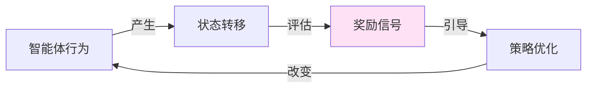
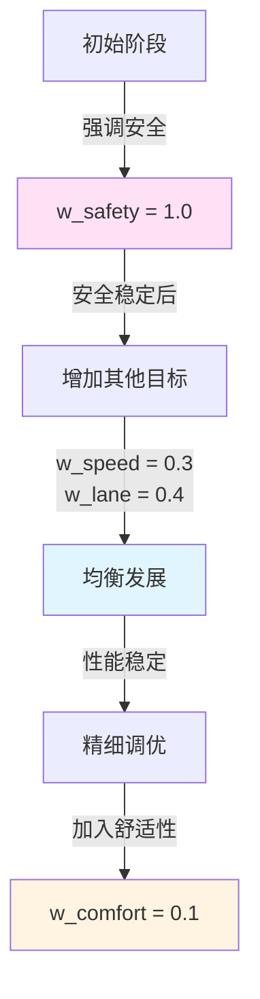
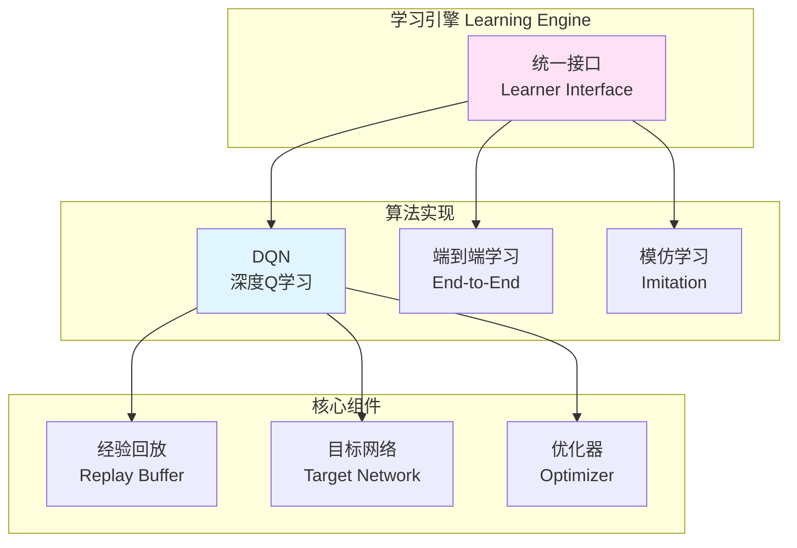

# 21.5 奖励函数与学习引擎

## 引言

如果说传感器是智能体的"眼睛",动力学模型是它的"身体",那么奖励函数就是它的"价值观"——什么是好的,什么是坏的。奖励函数决定了智能体的学习方向,是强化学习中最关键也最具挑战性的部分。

设计一个好的奖励函数就像培养一个孩子:你希望他安全(避免碰撞)、高效(保持速度)、守规矩(遵守交通规则)、还要舒适(平稳驾驶)。如何在这些目标间找到平衡?本节将深入探讨奖励函数的设计原则和学习引擎的实现。

## 核心概念

### 概念1:奖励函数的作用

**定义**:奖励函数r(s, a)将状态-动作对映射到标量值,指导智能体学习最优策略

**核心作用**:


**设计原则**:

| 原则 | 说明 | 示例 |
|------|------|------|
| **明确目标** | 奖励应清晰反映任务目标 | 到达终点:+100,碰撞:-100 |
| **即时反馈** | 每步给予奖励,不只在终局 | 保持车道:每步+0.5 |
| **多目标平衡** | 使用加权组合平衡冲突目标 | 速度30%+安全40%+舒适10% |
| **数值范围** | 控制在合理范围,避免梯度爆炸 | 归一化到[-1, 1]或[0, 1] |
| **可塑性** | 避免奖励陷阱,防止策略退化 | 惩罚过度保守的行为 |

### 概念2:多目标奖励函数设计

自动驾驶需要平衡多个目标,我们采用加权组合:

**总体公式**:
```
R_total = w1·R_speed + w2·R_lane + w3·R_safety + w4·R_comfort

权重归一化: Σw_i = 1
```

**各分项详解**:

#### 1. 速度控制奖励 R_speed

**目标**:鼓励保持目标速度

**公式**:
```
R_speed = 1 - |v_current - v_target| / v_max

其中:
- v_current: 当前速度
- v_target: 目标速度(如25 m/s)
- v_max: 最大速度(如40 m/s)
```

**特点**:
- 速度越接近目标,奖励越高
- 范围:[0, 1],归一化后易于学习
- 对速度偏差线性惩罚

**代码实现**:
```java
private float calculateSpeedReward() {
    double currentSpeed = egoVehicle.getVelocity();
    double targetSpeed = config.getTargetSpeed();
    double maxSpeed = config.getMaxSpeed();
    
    float reward = (float)(1.0 - 
        Math.abs(currentSpeed - targetSpeed) / maxSpeed);
    
    return Math.max(0, reward);  // 确保非负
}
```

#### 2. 车道保持奖励 R_lane

**目标**:鼓励保持在车道中心

**公式**:
```
R_lane = exp(-k · deviation²)

其中:
- deviation: 与车道中心的偏离距离(米)
- k: 惩罚系数(如k=2),控制衰减速度
```

**特点**:
- 使用高斯函数,偏离越大惩罚越重
- 在中心附近较平缓,远离中心迅速衰减
- 范围:(0, 1]

**代码实现**:
```java
private float calculateLaneKeepingReward() {
    double deviation = road.getLaneDeviation(egoVehicle, targetLane);
    double k = 2.0;
    
    return (float)Math.exp(-k * deviation * deviation);
}
```

**效果对比**:
```
偏离0.0m → reward = 1.00
偏离0.5m → reward = 0.61
偏离1.0m → reward = 0.14
偏离1.5m → reward = 0.02
```

#### 3. 安全奖励 R_safety

**目标**:避免碰撞,保持安全距离

**公式**:
```
R_safety = {
    -100,           如果发生碰撞
    -10/d,          如果距离d < d_safe
    0,              否则
}

其中:
- d: 与最近障碍物的距离
- d_safe: 安全距离阈值(如10米)
```

**特点**:
- 碰撞严厉惩罚,确保安全第一
- 距离越近惩罚越大(反比关系)
- 安全距离外无惩罚

**代码实现**:
```java
private float calculateSafetyReward() {
    // 检查碰撞
    if (checkCollisions()) {
        return -100.0f;
    }
    
    // 计算最近障碍物距离
    double minDistance = findMinimumDistance();
    double safeDistance = 10.0;
    
    if (minDistance < safeDistance) {
        return (float)(-10.0 / minDistance);
    }
    
    return 0.0f;
}
```

#### 4. 舒适性奖励 R_comfort

**目标**:鼓励平滑驾驶,避免急加速/急转向

**公式**:
```
R_comfort = -α·|acceleration| - β·|steering_rate|

其中:
- α, β: 权重系数
- steering_rate: 转向角变化率
```

**特点**:
- 惩罚大的加速度和转向变化
- 鼓励平稳的控制输出
- 提升乘坐体验

**代码实现**:
```java
private float calculateComfortReward() {
    double accel = egoVehicle.getAcceleration();
    double steeringRate = (currentSteering - lastSteering) / dt;
    
    float accelPenalty = (float)(0.1 * Math.abs(accel));
    float steeringPenalty = (float)(0.2 * Math.abs(steeringRate));
    
    return -(accelPenalty + steeringPenalty);
}
```

### 概念3:奖励函数调优

**权重调整策略**:



**调优步骤**:

1. **阶段1:安全为主**(训练0-200轮)
   ```java
   config.setSpeedRewardWeight(0.0);
   config.setLaneKeepingWeight(0.0);
   config.setCollisionPenaltyWeight(1.0);
   config.setComfortWeight(0.0);
   ```

2. **阶段2:加入车道保持**(200-500轮)
   ```java
   config.setSpeedRewardWeight(0.2);
   config.setLaneKeepingWeight(0.5);
   config.setCollisionPenaltyWeight(1.0);  // 保持不变
   config.setComfortWeight(0.0);
   ```

3. **阶段3:全面优化**(500+轮)
   ```java
   config.setSpeedRewardWeight(0.3);
   config.setLaneKeepingWeight(0.4);
   config.setCollisionPenaltyWeight(1.0);
   config.setComfortWeight(0.1);
   ```

### 概念4:学习引擎架构

**TinyAI学习引擎支持多种算法**:



### 概念5:DQN学习算法

**DQN(Deep Q-Network)核心思想**:
- 用神经网络近似Q函数:Q(s, a)
- 通过经验回放打破数据相关性
- 使用目标网络稳定训练

**算法流程**:

```java
/**
 * DQN学习器实现
 */
public class DQNLearner implements Learner {
    
    private NeuralNetwork qNetwork;        // Q网络
    private NeuralNetwork targetNetwork;   // 目标网络
    private ReplayBuffer replayBuffer;     // 经验回放池
    private Optimizer optimizer;           // 优化器
    
    // 超参数
    private float gamma = 0.99f;           // 折扣因子
    private float epsilon = 0.1f;          // 探索率
    private int batchSize = 32;            // 批大小
    private int targetUpdateFreq = 100;    // 目标网络更新频率
    
    /**
     * 选择动作:ε-greedy策略
     */
    @Override
    public NdArray selectAction(NdArray state) {
        if (Math.random() < epsilon) {
            // 探索:随机动作
            return generateRandomAction();
        } else {
            // 利用:选择Q值最大的动作
            NdArray qValues = qNetwork.forward(state);
            int bestAction = argmax(qValues);
            return actionIndexToVector(bestAction);
        }
    }
    
    /**
     * 存储经验
     */
    @Override
    public void storeExperience(Transition transition) {
        replayBuffer.add(transition);
    }
    
    /**
     * 学习更新
     */
    @Override
    public void update() {
        if (replayBuffer.size() < batchSize) {
            return;  // 数据不足,跳过
        }
        
        // 1. 从经验池采样批次
        List<Transition> batch = replayBuffer.sample(batchSize);
        
        // 2. 构建训练数据
        NdArray states = stackStates(batch);
        NdArray actions = stackActions(batch);
        NdArray rewards = stackRewards(batch);
        NdArray nextStates = stackNextStates(batch);
        NdArray dones = stackDones(batch);
        
        // 3. 计算目标Q值
        NdArray nextQValues = targetNetwork.forward(nextStates);
        NdArray maxNextQ = nextQValues.max(axis=1);
        
        NdArray targetQ = rewards.add(
            gamma.multiply(maxNextQ).multiply(dones.not())
        );
        
        // 4. 计算当前Q值
        NdArray currentQValues = qNetwork.forward(states);
        NdArray selectedQ = currentQValues.gather(actions);
        
        // 5. 计算TD误差损失
        NdArray tdError = targetQ.subtract(selectedQ);
        NdArray loss = tdError.square().mean();
        
        // 6. 反向传播更新
        loss.backward();
        optimizer.step();
        optimizer.zeroGrad();
        
        // 7. 定期更新目标网络
        if (updateCount % targetUpdateFreq == 0) {
            updateTargetNetwork();
        }
        
        updateCount++;
    }
    
    /**
     * 更新目标网络
     */
    private void updateTargetNetwork() {
        // 硬更新:直接复制参数
        targetNetwork.loadParameters(qNetwork.getParameters());
        
        // 或软更新:指数移动平均
        // targetParams = τ·qParams + (1-τ)·targetParams
    }
}
```

## 技术实现

### 完整的学习流程

```java
/**
 * 训练流程:集成奖励函数和学习引擎
 */
public class TrainingPipeline {
    
    private DrivingEnvironment env;
    private DQNLearner learner;
    private List<Float> rewardHistory;
    
    /**
     * 训练指定轮数
     */
    public void train(int numEpisodes) {
        for (int episode = 0; episode < numEpisodes; episode++) {
            float episodeReward = runEpisode();
            rewardHistory.add(episodeReward);
            
            // 每10轮输出进度
            if (episode % 10 == 0) {
                float avgReward = getAverageReward(10);
                System.out.printf("Episode %d: Avg Reward = %.2f\n", 
                                 episode, avgReward);
            }
            
            // 每100轮保存模型
            if (episode % 100 == 0) {
                saveModel("checkpoint_" + episode + ".model");
            }
        }
    }
    
    /**
     * 运行一个episode
     */
    private float runEpisode() {
        NdArray state = env.reset();
        float totalReward = 0;
        boolean done = false;
        int step = 0;
        
        while (!done && step < 2000) {
            // 1. 选择动作
            NdArray action = learner.selectAction(state);
            
            // 2. 执行动作
            StepResult result = env.step(action);
            NdArray nextState = result.getState();
            float reward = result.getReward();
            done = result.isDone();
            
            // 3. 存储经验
            Transition transition = new Transition(
                state, action, reward, nextState, done
            );
            learner.storeExperience(transition);
            
            // 4. 学习更新
            learner.update();
            
            // 5. 累计奖励
            totalReward += reward;
            
            // 6. 状态转移
            state = nextState;
            step++;
        }
        
        return totalReward;
    }
}
```

### 奖励塑形(Reward Shaping)

有时原始奖励信号稀疏,可以通过奖励塑形增加中间反馈:

```java
/**
 * 奖励塑形:添加势函数引导学习
 */
public class RewardShaper {
    
    /**
     * 基于势函数的奖励塑形
     * shaped_reward = original_reward + γ·Φ(s') - Φ(s)
     */
    public float shapeReward(NdArray state, NdArray nextState, 
                            float originalReward) {
        float potential = computePotential(state);
        float nextPotential = computePotential(nextState);
        
        float shapedReward = originalReward + 
                            gamma * nextPotential - potential;
        
        return shapedReward;
    }
    
    /**
     * 势函数:距离目标的负距离
     */
    private float computePotential(NdArray state) {
        double x = egoVehicle.getPosition().getX();
        double goalX = road.getLength();
        
        return -(float)(goalX - x) / 100.0f;  // 归一化
    }
}
```

## 性能分析

### 学习曲线分析

典型的DQN学习曲线:

```
Episode  |  Avg Reward  |  Success Rate  |  说明
---------|--------------|----------------|------------------
0-100    |   -50 ~ -20  |      10%       | 探索阶段,大量碰撞
100-300  |   -20 ~ 0    |      40%       | 学会避免碰撞
300-600  |    0 ~ 20    |      70%       | 学会车道保持
600-1000 |   20 ~ 35    |      90%       | 性能稳定,接近最优
1000+    |   35 ~ 40    |      95%       | 收敛,微调阶段
```

### 超参数影响

| 参数 | 过小 | 合适 | 过大 |
|------|------|------|------|
| **学习率** | 收敛慢 | 0.001 | 不稳定 |
| **折扣因子γ** | 短视 | 0.99 | 不收敛 |
| **批大小** | 噪声大 | 32-64 | 内存占用高 |
| **缓冲区大小** | 相关性强 | 10000 | 浪费内存 |

## 常见问题

### 问题1:奖励难以提升

**现象**:训练1000轮仍无明显进步

**可能原因**:
1. 奖励函数设计不合理(过于稀疏或冲突)
2. 探索不足(epsilon过小)
3. 学习率不当
4. 网络容量不足

**解决方案**:
```java
// 1. 简化奖励函数
reward = safetyReward;  // 先只关注安全

// 2. 增加探索
epsilon = 0.3;  // 从0.1提高到0.3

// 3. 调整学习率
optimizer.setLearningRate(0.01);  // 尝试更大学习率

// 4. 增加网络容量
qNetwork = new Network(stateSize, [128, 128], actionSize);
```

### 问题2:性能不稳定,时好时坏

**解决**:
- 使用目标网络(已实现)
- 降低学习率
- 增大批大小减少方差
- 使用Double DQN防止过估计

## 小节总结

### 核心要点

1. **奖励函数是学习的灵魂**:设计好坏直接决定学习效果
2. **多目标加权组合**:速度、安全、车道、舒适四个维度
3. **渐进式调整**:从单一目标(安全)到多目标平衡
4. **DQN算法**:经验回放+目标网络,稳定高效
5. **超参数调优**:学习率、折扣因子、探索率需要仔细调整

## 思考题

1. **奖励设计**:如果要让车辆学会"超车",应该如何修改奖励函数?
2. **算法选择**:什么场景下PPO比DQN更合适?
3. **样本效率**:如何在更少的训练轮数内达到相同性能?

## 拓展阅读

- **强化学习**:《Reinforcement Learning: An Introduction》
- **DQN论文**:Playing Atari with Deep Reinforcement Learning
- **奖励塑形**:Policy Invariance Under Reward Transformations

---

**下一节预告**:下一节我们将学习场景管理与测试,了解如何设计多样化的测试场景,全面评估智能体性能。
