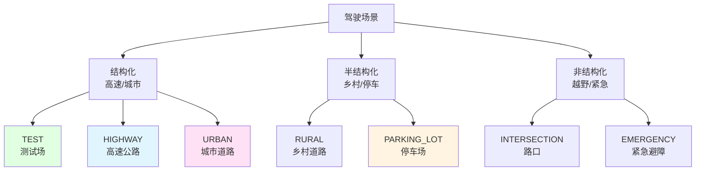
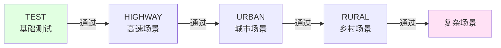

# 21.6 场景管理与测试

## 引言

一个优秀的自动驾驶系统不仅要在理想条件下工作,更要能应对各种复杂场景:高速公路的高速行驶、城市道路的频繁变道、停车场的低速机动、路口的复杂交互...每种场景都有其独特的挑战。

就像驾校训练要涵盖各种路况一样,智能体的训练和测试也需要多样化的场景。本节将介绍如何设计、管理和测试多种驾驶场景,构建完整的评估体系。

## 核心概念

### 概念1:场景分类体系

**按道路类型分类**:

| 场景类型 | 特点 | 车道数 | 限速 | 交通密度 | 难度 |
|---------|------|-------|------|---------|------|
| **高速公路** | 直线为主,高速 | 3-4 | 100-120km/h | 中 | ⭐⭐ |
| **城市道路** | 频繁变道,路口 | 2-3 | 40-60km/h | 高 | ⭐⭐⭐⭐ |
| **乡村道路** | 弯道多,窄路 | 1-2 | 60-80km/h | 低 | ⭐⭐⭐ |
| **停车场** | 低速,复杂机动 | 多车位 | <20km/h | 很高 | ⭐⭐⭐⭐⭐ |
| **路口** | 交叉,信号灯 | 2+2 | 30-50km/h | 高 | ⭐⭐⭐⭐⭐ |
| **测试场** | 简单,用于调试 | 1 | 无限制 | 无 | ⭐ |

**场景分类图**:



### 概念2:场景参数化

每个场景由一组参数定义:

```java
/**
 * 场景配置类
 */
public class ScenarioConfig {
    // 道路参数
    private int laneCount;          // 车道数量
    private double laneWidth;       // 车道宽度(米)
    private double roadLength;      // 道路长度(米)
    private double curvature;       // 道路曲率
    
    // 交通参数
    private int vehicleDensity;     // 车辆密度(辆/公里)
    private double speedLimit;      // 限速(m/s)
    private double targetSpeed;     // 目标速度(m/s)
    
    // 环境参数
    private WeatherCondition weather;  // 天气状况
    private double visibility;      // 能见度[0, 1]
    private TimeOfDay timeOfDay;    // 时段(白天/夜晚)
    
    // 任务参数
    private Point2D startPosition;  // 起始位置
    private Point2D goalPosition;   // 目标位置
    private int maxSteps;           // 最大步数
}
```

### 概念3:内置场景详解

#### 场景1: TEST (测试场)

**用途**:开发调试,快速验证

**配置**:
```java
public static ScenarioConfig createTestConfig() {
    ScenarioConfig config = new ScenarioConfig();
    config.setLaneCount(1);
    config.setLaneWidth(3.5);
    config.setRoadLength(200.0);
    config.setSpeedLimit(30.0);
    config.setVehicleDensity(0);     // 无其他车辆
    config.setTargetSpeed(20.0);
    return config;
}
```

**特点**:
- 单车道,无障碍
- 用于测试基本功能(如车道保持)
- 训练初期使用

#### 场景2: HIGHWAY (高速公路)

**用途**:高速行驶,车道保持,跟车

**配置**:
```java
public static ScenarioConfig createHighwayConfig() {
    ScenarioConfig config = new ScenarioConfig();
    config.setLaneCount(3);
    config.setLaneWidth(3.75);       // 高速车道更宽
    config.setRoadLength(2000.0);    // 2公里
    config.setSpeedLimit(33.3);      // 120 km/h
    config.setVehicleDensity(15);    // 15辆/公里
    config.setTargetSpeed(27.8);     // 100 km/h
    return config;
}
```

**挑战**:
- 高速下的稳定控制
- 安全车距保持
- 变道决策

**评估指标**:
```
- 平均速度 > 90 km/h
- 车道偏离 < 0.2m
- 碰撞率 < 1%
```

#### 场景3: URBAN (城市道路)

**用途**:复杂交通,频繁变道

**配置**:
```java
public static ScenarioConfig createUrbanConfig() {
    ScenarioConfig config = new ScenarioConfig();
    config.setLaneCount(2);
    config.setLaneWidth(3.5);
    config.setRoadLength(1000.0);
    config.setSpeedLimit(16.7);      // 60 km/h
    config.setVehicleDensity(30);    // 高密度交通
    config.setTargetSpeed(13.9);     // 50 km/h
    return config;
}
```

**挑战**:
- 高密度交通导航
- 动态避障
- 交通规则遵守

#### 场景4: PARKING_LOT (停车场)

**用途**:低速精确控制,泊车

**配置**:
```java
public static ScenarioConfig createParkingConfig() {
    ScenarioConfig config = new ScenarioConfig();
    config.setRoadLength(100.0);
    config.setSpeedLimit(2.8);       // 10 km/h
    config.setTargetSpeed(1.4);      // 5 km/h
    config.setParkingSpots(generateParkingSpots());
    return config;
}
```

**挑战**:
- 低速精确控制
- 狭小空间机动
- 泊车入位

### 概念4:场景加载器

```java
/**
 * 场景加载器:根据类型创建场景配置
 */
public class ScenarioLoader {
    
    /**
     * 加载预定义场景
     */
    public ScenarioConfig load(ScenarioType type) {
        switch (type) {
            case TEST:
                return createTestConfig();
            case HIGHWAY:
                return createHighwayConfig();
            case URBAN:
                return createUrbanConfig();
            case RURAL:
                return createRuralConfig();
            case PARKING_LOT:
                return createParkingConfig();
            case INTERSECTION:
                return createIntersectionConfig();
            default:
                throw new IllegalArgumentException("Unknown scenario: " + type);
        }
    }
    
    /**
     * 创建自定义场景
     */
    public ScenarioConfig createCustomScenario(
            ScenarioType baseType,
            Map<String, Object> customParams) {
        
        // 1. 加载基础配置
        ScenarioConfig config = load(baseType);
        
        // 2. 应用自定义参数
        if (customParams.containsKey("laneCount")) {
            config.setLaneCount((Integer)customParams.get("laneCount"));
        }
        if (customParams.containsKey("speedLimit")) {
            config.setSpeedLimit((Double)customParams.get("speedLimit"));
        }
        if (customParams.containsKey("vehicleDensity")) {
            config.setVehicleDensity((Integer)customParams.get("vehicleDensity"));
        }
        
        return config;
    }
    
    /**
     * 随机场景生成(用于泛化测试)
     */
    public ScenarioConfig generateRandomScenario() {
        Random random = new Random();
        ScenarioConfig config = new ScenarioConfig();
        
        config.setLaneCount(random.nextInt(3) + 1);         // 1-3车道
        config.setSpeedLimit(10 + random.nextDouble() * 30); // 10-40 m/s
        config.setVehicleDensity(random.nextInt(40));       // 0-40辆/公里
        
        return config;
    }
}
```

## 技术实现

### 测试框架

```java
/**
 * 场景测试框架
 */
public class ScenarioTester {
    
    private DrivingEnvironment env;
    private EmbodiedAgent agent;
    private TestMetrics metrics;
    
    /**
     * 在单个场景中测试
     */
    public TestResult testScenario(ScenarioConfig config, 
                                   int numEpisodes) {
        TestResult result = new TestResult(config.getType());
        
        for (int i = 0; i < numEpisodes; i++) {
            // 应用场景配置
            env.configure(config);
            
            // 运行episode
            EpisodeResult episode = agent.runEpisode(env);
            
            // 记录指标
            result.addEpisode(episode);
        }
        
        // 计算统计量
        result.computeStatistics();
        
        return result;
    }
    
    /**
     * 在所有场景中测试
     */
    public Map<ScenarioType, TestResult> testAllScenarios() {
        Map<ScenarioType, TestResult> results = new HashMap<>();
        
        for (ScenarioType type : ScenarioType.values()) {
            ScenarioConfig config = new ScenarioLoader().load(type);
            TestResult result = testScenario(config, 100);
            results.put(type, result);
        }
        
        return results;
    }
}

/**
 * 测试结果
 */
public class TestResult {
    private ScenarioType scenario;
    private List<EpisodeResult> episodes;
    
    // 统计指标
    private double avgReward;
    private double successRate;
    private double avgSpeed;
    private double avgLaneDeviation;
    private int collisionCount;
    
    public void computeStatistics() {
        int successCount = 0;
        double totalReward = 0;
        double totalSpeed = 0;
        double totalDeviation = 0;
        collisionCount = 0;
        
        for (EpisodeResult episode : episodes) {
            totalReward += episode.getTotalReward();
            totalSpeed += episode.getAverageSpeed();
            totalDeviation += episode.getAverageLaneDeviation();
            
            if (episode.isSuccess()) {
                successCount++;
            }
            if (episode.hasCollision()) {
                collisionCount++;
            }
        }
        
        int n = episodes.size();
        avgReward = totalReward / n;
        successRate = (double)successCount / n;
        avgSpeed = totalSpeed / n;
        avgLaneDeviation = totalDeviation / n;
    }
    
    public void printReport() {
        System.out.println("========== " + scenario + " ==========");
        System.out.printf("Success Rate: %.1f%%\n", successRate * 100);
        System.out.printf("Avg Reward: %.2f\n", avgReward);
        System.out.printf("Avg Speed: %.1f m/s\n", avgSpeed);
        System.out.printf("Avg Lane Deviation: %.2f m\n", avgLaneDeviation);
        System.out.printf("Collision Count: %d/%d\n", 
                         collisionCount, episodes.size());
        System.out.println("===============================\n");
    }
}
```

### 性能基准

建立各场景的性能基准:

| 场景 | 成功率目标 | 平均速度目标 | 车道偏离目标 | 碰撞率目标 |
|------|----------|------------|------------|-----------|
| TEST | >95% | >18 m/s | <0.1m | <1% |
| HIGHWAY | >90% | >25 m/s | <0.2m | <2% |
| URBAN | >85% | >12 m/s | <0.3m | <3% |
| RURAL | >80% | >15 m/s | <0.4m | <5% |
| PARKING_LOT | >70% | >1 m/s | <0.1m | <10% |
| INTERSECTION | >75% | >10 m/s | <0.3m | <5% |

```java
/**
 * 性能基准检查
 */
public class BenchmarkChecker {
    
    private Map<ScenarioType, Benchmark> benchmarks;
    
    public BenchmarkChecker() {
        benchmarks = new HashMap<>();
        benchmarks.put(ScenarioType.TEST, 
            new Benchmark(0.95, 18.0, 0.1, 0.01));
        benchmarks.put(ScenarioType.HIGHWAY, 
            new Benchmark(0.90, 25.0, 0.2, 0.02));
        // ... 其他场景
    }
    
    /**
     * 检查是否达到基准
     */
    public boolean checkBenchmark(ScenarioType type, TestResult result) {
        Benchmark benchmark = benchmarks.get(type);
        
        return result.getSuccessRate() >= benchmark.successRate &&
               result.getAvgSpeed() >= benchmark.avgSpeed &&
               result.getAvgLaneDeviation() <= benchmark.maxDeviation &&
               result.getCollisionRate() <= benchmark.maxCollisionRate;
    }
}
```

## 测试策略

### 策略1:渐进式测试



### 策略2:压力测试

```java
/**
 * 压力测试:极端条件下的性能
 */
public class StressTest {
    
    /**
     * 高密度交通
     */
    public void testHighDensityTraffic() {
        ScenarioConfig config = ScenarioLoader.load(URBAN);
        config.setVehicleDensity(50);  // 50辆/公里(极高)
        
        TestResult result = tester.testScenario(config, 100);
        // 预期性能下降,但不应完全失效
    }
    
    /**
     * 恶劣天气
     */
    public void testAdverseWeather() {
        ScenarioConfig config = ScenarioLoader.load(HIGHWAY);
        config.setWeather(WeatherCondition.HEAVY_RAIN);
        config.setVisibility(0.3);  // 能见度30%
        
        TestResult result = tester.testScenario(config, 100);
    }
    
    /**
     * 传感器故障
     */
    public void testSensorFailure() {
        // 模拟GPS失效
        env.disableSensor(SensorType.GPS);
        
        TestResult result = tester.testScenario(config, 100);
        // 检查是否能通过其他传感器继续工作
    }
}
```

### 策略3:边界情况测试

```java
/**
 * 边界情况测试
 */
public void testEdgeCases() {
    // 情况1:突然切入
    testSuddenCutIn();
    
    // 情况2:紧急刹车
    testEmergencyBraking();
    
    // 情况3:道路边界
    testRoadBoundary();
    
    // 情况4:极限转向
    testExtremeSteering();
}
```

## 可视化工具

```java
/**
 * 轨迹可视化
 */
public class TrajectoryVisualizer {
    
    /**
     * 绘制轨迹图
     */
    public void plotTrajectory(EpisodeResult episode) {
        List<Point2D> positions = episode.getPositions();
        
        // 使用简单的ASCII艺术或导出数据供外部工具绘制
        for (int i = 0; i < positions.size(); i += 10) {
            Point2D pos = positions.get(i);
            System.out.printf("Step %d: (%.1f, %.1f)\n", 
                             i, pos.getX(), pos.getY());
        }
    }
    
    /**
     * 生成状态时间序列
     */
    public void plotStateTimeSeries(EpisodeResult episode) {
        List<NdArray> states = episode.getStates();
        
        // 绘制速度曲线
        System.out.println("Speed over time:");
        for (int i = 0; i < states.size(); i++) {
            float speed = states.get(i).get(0);
            int barLength = (int)(speed * 2);
            System.out.printf("t=%d: %s %.1f m/s\n", 
                             i, "#".repeat(barLength), speed);
        }
    }
}
```

## 常见问题

### 问题1:某个场景性能特别差

**解决**:
- 增加该场景的训练样本比例
- 调整奖励函数权重适应该场景
- 使用课程学习,逐步增加难度

### 问题2:泛化能力不足

**现象**:训练场景表现好,新场景表现差

**解决**:
```java
// 训练时场景随机化
for (int episode = 0; episode < numEpisodes; episode++) {
    ScenarioConfig config = loader.generateRandomScenario();
    runEpisode(config);
}
```

## 小节总结

### 核心要点

1. **场景分类**:6种预定义场景覆盖不同驾驶条件
2. **参数化配置**:灵活调整场景参数
3. **测试框架**:系统化评估性能
4. **性能基准**:明确的目标指标
5. **渐进式测试**:从简单到复杂

## 思考题

1. **场景设计**:如果要测试"雨天夜间高速",应该如何配置场景?
2. **评估指标**:除了文中提到的,还有哪些有价值的评估指标?
3. **边界情况**:列举5个自动驾驶中的危险边界情况

## 拓展阅读

- **测试标准**:ISO 26262汽车功能安全标准
- **场景库**:CommonRoad场景数据库
- **仿真平台**:CARLA, SUMO

---

**下一节预告**:最后一节我们将整合所有知识,完成一个完整的自动驾驶系统综合项目!
