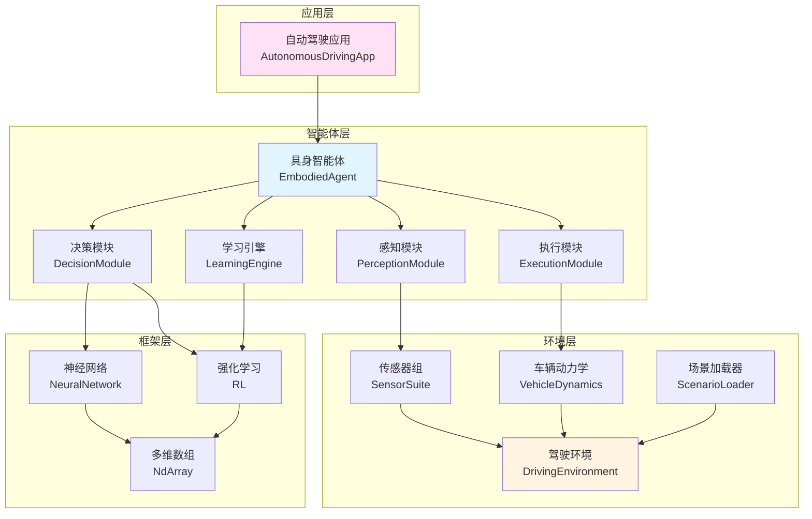
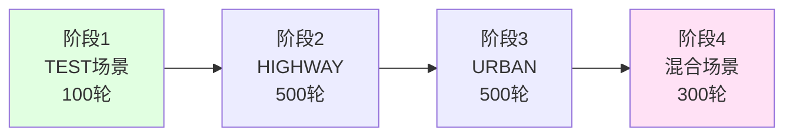

# 21.7 综合项目:自动驾驶系统

## 引言

经过前面6个小节的学习,我们已经掌握了具身智能的核心概念、闭环架构、传感器模拟、动力学建模、奖励函数设计和场景测试。现在,是时候将这些知识整合起来,构建一个完整的自动驾驶系统了!

本节将带领你完成一个端到端的综合项目,从系统架构设计、代码实现到训练测试,体验具身智能系统开发的完整流程。这不仅是对前面知识的综合运用,更是对系统工程能力的全面锻炼。

## 项目概述

### 项目目标

构建一个能够在高速公路和城市道路场景下自主驾驶的具身智能体,具备以下能力:

**核心功能**:
1. ✅ 车道保持:保持在车道中心,偏离<0.3米
2. ✅ 速度控制:跟随目标速度,误差<10%
3. ✅ 障碍物避让:安全避开其他车辆,无碰撞
4. ✅ 自主学习:通过强化学习不断改进策略

**性能指标**:
- 决策延迟 < 50ms
- 高速公路成功率 > 90%
- 城市道路成功率 > 85%
- 碰撞率 < 2%

### 系统架构



## 核心代码实现

### 第1步:环境配置

```java
/**
 * 环境配置管理器
 */
public class EnvironmentConfig {
    
    // 场景参数
    private ScenarioType scenarioType;
    private int laneCount;
    private double laneWidth;
    private double roadLength;
    private double speedLimit;
    private int vehicleDensity;
    
    // 奖励权重
    private float speedRewardWeight;
    private float laneKeepingWeight;
    private float collisionPenaltyWeight;
    private float comfortWeight;
    
    // 仿真参数
    private double timeStep;
    private int maxSteps;
    
    /**
     * 创建高速公路配置
     */
    public static EnvironmentConfig createHighwayConfig() {
        EnvironmentConfig config = new EnvironmentConfig();
        
        // 场景参数
        config.setScenarioType(ScenarioType.HIGHWAY);
        config.setLaneCount(3);
        config.setLaneWidth(3.75);
        config.setRoadLength(2000.0);
        config.setSpeedLimit(33.3);      // 120 km/h
        config.setVehicleDensity(15);
        
        // 奖励权重
        config.setSpeedRewardWeight(0.3f);
        config.setLaneKeepingWeight(0.4f);
        config.setCollisionPenaltyWeight(1.0f);
        config.setComfortWeight(0.1f);
        
        // 仿真参数
        config.setTimeStep(0.05);        // 50ms, 20Hz
        config.setMaxSteps(2000);        // 最多100秒
        
        return config;
    }
    
    /**
     * 创建城市道路配置
     */
    public static EnvironmentConfig createUrbanConfig() {
        EnvironmentConfig config = new EnvironmentConfig();
        
        config.setScenarioType(ScenarioType.URBAN);
        config.setLaneCount(2);
        config.setLaneWidth(3.5);
        config.setRoadLength(1000.0);
        config.setSpeedLimit(16.7);      // 60 km/h
        config.setVehicleDensity(30);
        
        config.setSpeedRewardWeight(0.25f);
        config.setLaneKeepingWeight(0.45f);
        config.setCollisionPenaltyWeight(1.0f);
        config.setComfortWeight(0.15f);
        
        config.setTimeStep(0.05);
        config.setMaxSteps(1000);
        
        return config;
    }
}
```

### 第2步:具身智能体实现

```java
/**
 * 完整的具身智能体
 */
public class EmbodiedAgent {
    
    private PerceptionModule perception;
    private DecisionModule decision;
    private ExecutionModule execution;
    private LearningEngine learning;
    
    // 性能监控
    private PerformanceMonitor monitor;
    
    public EmbodiedAgent(EnvironmentConfig config) {
        // 初始化各模块
        this.perception = new PerceptionModule();
        this.decision = new DecisionModule(config);
        this.execution = new ExecutionModule(config);
        this.learning = new DQNLearner(config);
        this.monitor = new PerformanceMonitor();
    }
    
    /**
     * 运行一个完整的episode
     */
    public EpisodeResult runEpisode(DrivingEnvironment env, int maxSteps) {
        // 重置环境
        NdArray state = env.reset();
        EpisodeResult result = new EpisodeResult();
        
        boolean done = false;
        int step = 0;
        
        while (!done && step < maxSteps) {
            long startTime = System.nanoTime();
            
            // 1. 感知:获取环境状态
            NdArray perceivedState = perception.perceive(env);
            
            // 2. 决策:选择动作
            NdArray action = decision.selectAction(perceivedState);
            
            // 3. 执行:应用动作
            StepResult stepResult = execution.execute(action, env);
            
            // 4. 学习:存储经验并更新
            learning.storeExperience(new Transition(
                perceivedState, 
                action, 
                stepResult.getReward(),
                stepResult.getNextState(),
                stepResult.isDone()
            ));
            learning.update();
            
            // 5. 性能监控
            long latency = (System.nanoTime() - startTime) / 1_000_000;
            monitor.recordStep(latency, stepResult.getReward());
            
            // 6. 记录结果
            result.addStep(perceivedState, action, stepResult.getReward());
            
            // 7. 更新状态
            state = stepResult.getNextState();
            done = stepResult.isDone();
            step++;
        }
        
        result.finalize(step);
        return result;
    }
    
    /**
     * 训练模式
     */
    public void train(DrivingEnvironment env, int numEpisodes) {
        System.out.println("========== Training Started ==========");
        
        for (int episode = 0; episode < numEpisodes; episode++) {
            EpisodeResult result = runEpisode(env, 2000);
            
            // 定期输出进度
            if (episode % 10 == 0) {
                System.out.printf("Episode %d: Reward=%.2f, Steps=%d, " +
                                 "Success=%b, AvgLatency=%.1fms\n",
                    episode,
                    result.getTotalReward(),
                    result.getNumSteps(),
                    result.isSuccess(),
                    monitor.getAverageLatency()
                );
            }
            
            // 定期保存模型
            if (episode % 100 == 0 && episode > 0) {
                decision.saveModel("model_episode_" + episode + ".bin");
            }
        }
        
        System.out.println("========== Training Completed ==========");
    }
    
    /**
     * 测试模式
     */
    public TestResult test(DrivingEnvironment env, int numEpisodes) {
        System.out.println("========== Testing Started ==========");
        
        TestResult testResult = new TestResult();
        decision.setEpsilon(0.0);  // 测试时不探索
        
        for (int episode = 0; episode < numEpisodes; episode++) {
            EpisodeResult result = runEpisode(env, 2000);
            testResult.addEpisode(result);
        }
        
        testResult.computeStatistics();
        testResult.printReport();
        
        System.out.println("========== Testing Completed ==========");
        return testResult;
    }
}
```

### 第3步:主程序

```java
/**
 * 自动驾驶应用主程序
 */
public class AutonomousDrivingApp {
    
    public static void main(String[] args) {
        // 1. 选择场景
        ScenarioType scenario = parseArgs(args, ScenarioType.HIGHWAY);
        System.out.println("Scenario: " + scenario);
        
        // 2. 创建环境配置
        EnvironmentConfig config = createConfig(scenario);
        
        // 3. 创建环境和智能体
        DrivingEnvironment env = new SimpleDrivingEnv(config);
        EmbodiedAgent agent = new EmbodiedAgent(config);
        
        // 4. 训练阶段
        System.out.println("\n=== Training Phase ===");
        agent.train(env, 1000);
        
        // 5. 测试阶段
        System.out.println("\n=== Testing Phase ===");
        TestResult result = agent.test(env, 100);
        
        // 6. 性能报告
        printFinalReport(result);
    }
    
    private static EnvironmentConfig createConfig(ScenarioType scenario) {
        switch (scenario) {
            case HIGHWAY:
                return EnvironmentConfig.createHighwayConfig();
            case URBAN:
                return EnvironmentConfig.createUrbanConfig();
            default:
                return EnvironmentConfig.createTestConfig();
        }
    }
    
    private static void printFinalReport(TestResult result) {
        System.out.println("\n========== Final Report ==========");
        System.out.printf("Success Rate: %.1f%%\n", 
                         result.getSuccessRate() * 100);
        System.out.printf("Average Reward: %.2f\n", 
                         result.getAverageReward());
        System.out.printf("Average Speed: %.1f m/s (%.1f km/h)\n",
                         result.getAverageSpeed(),
                         result.getAverageSpeed() * 3.6);
        System.out.printf("Lane Deviation: %.3f m\n",
                         result.getAverageLaneDeviation());
        System.out.printf("Collision Rate: %.1f%%\n",
                         result.getCollisionRate() * 100);
        System.out.println("==================================");
    }
}
```

## 训练流程

### 训练策略

**阶段式训练**:



```java
/**
 * 分阶段训练
 */
public void trainProgressive() {
    // 阶段1: TEST场景 - 学习基础控制
    System.out.println("=== Stage 1: Basic Control ===");
    env.configure(EnvironmentConfig.createTestConfig());
    agent.train(env, 100);
    
    // 阶段2: HIGHWAY - 高速场景
    System.out.println("\n=== Stage 2: Highway Driving ===");
    env.configure(EnvironmentConfig.createHighwayConfig());
    agent.train(env, 500);
    
    // 阶段3: URBAN - 城市道路
    System.out.println("\n=== Stage 3: Urban Driving ===");
    env.configure(EnvironmentConfig.createUrbanConfig());
    agent.train(env, 500);
    
    // 阶段4: 混合训练 - 提升泛化能力
    System.out.println("\n=== Stage 4: Mixed Training ===");
    for (int i = 0; i < 300; i++) {
        ScenarioType type = randomScenario();
        env.configure(createConfig(type));
        agent.runEpisode(env, 2000);
    }
}
```

### 超参数配置

```java
/**
 * 推荐的超参数配置
 */
public class HyperParameters {
    // 网络结构
    public static final int STATE_DIM = 14;
    public static final int[] HIDDEN_DIMS = {64, 64};
    public static final int ACTION_DIM = 7;  // 离散动作空间
    
    // 学习参数
    public static final float LEARNING_RATE = 0.001f;
    public static final float GAMMA = 0.99f;  // 折扣因子
    public static final float EPSILON_START = 0.5f;
    public static final float EPSILON_END = 0.05f;
    public static final int EPSILON_DECAY_STEPS = 500;
    
    // 经验回放
    public static final int BUFFER_SIZE = 10000;
    public static final int BATCH_SIZE = 32;
    public static final int MIN_BUFFER_SIZE = 500;
    
    // 目标网络
    public static final int TARGET_UPDATE_FREQ = 100;
    
    // 训练控制
    public static final int UPDATE_FREQ = 4;  // 每4步更新一次
}
```

## 性能优化

### 优化1:并行环境

```java
/**
 * 并行环境训练(提升样本收集效率)
 */
public class ParallelTrainer {
    private List<DrivingEnvironment> envs;
    private ExecutorService executor;
    
    public void trainParallel(int numEnvs) {
        envs = new ArrayList<>();
        for (int i = 0; i < numEnvs; i++) {
            envs.add(new SimpleDrivingEnv(config));
        }
        
        executor = Executors.newFixedThreadPool(numEnvs);
        
        List<Future<EpisodeResult>> futures = new ArrayList<>();
        for (DrivingEnvironment env : envs) {
            futures.add(executor.submit(() -> agent.runEpisode(env, 2000)));
        }
        
        // 收集所有结果
        for (Future<EpisodeResult> future : futures) {
            EpisodeResult result = future.get();
            // 处理结果...
        }
    }
}
```

### 优化2:经验优先级回放

```java
/**
 * 优先级经验回放
 */
public class PrioritizedReplayBuffer extends ReplayBuffer {
    private PriorityQueue<Transition> priorityQueue;
    
    @Override
    public void add(Transition transition) {
        // 根据TD误差设置优先级
        double priority = Math.abs(transition.tdError) + 1e-6;
        transition.setPriority(priority);
        priorityQueue.add(transition);
    }
    
    @Override
    public List<Transition> sample(int batchSize) {
        // 按优先级采样
        return priorityQueue.poll(batchSize);
    }
}
```

## 测试与评估

### 完整测试套件

```java
/**
 * 完整的测试套件
 */
public class ComprehensiveTest {
    
    public void runAllTests() {
        // 1. 基础功能测试
        testBasicFunctionality();
        
        // 2. 场景测试
        testAllScenarios();
        
        // 3. 性能测试
        testPerformance();
        
        // 4. 压力测试
        testStressScenarios();
        
        // 5. 边界测试
        testEdgeCases();
    }
    
    private void testBasicFunctionality() {
        System.out.println("\n=== Basic Functionality Test ===");
        
        // 测试车道保持
        TestResult laneKeeping = testLaneKeeping();
        assert laneKeeping.getAverageLaneDeviation() < 0.3;
        
        // 测试速度控制
        TestResult speedControl = testSpeedControl();
        assert speedControl.getAverageSpeedError() < 0.1;
        
        // 测试避障
        TestResult obstacleAvoidance = testObstacleAvoidance();
        assert obstacleAvoidance.getCollisionRate() < 0.02;
    }
    
    private void testAllScenarios() {
        System.out.println("\n=== Scenario Test ===");
        
        Map<ScenarioType, TestResult> results = new HashMap<>();
        
        for (ScenarioType type : ScenarioType.values()) {
            env.configure(createConfig(type));
            TestResult result = agent.test(env, 100);
            results.put(type, result);
            
            System.out.printf("%s: Success=%.1f%%, Collision=%.1f%%\n",
                type, 
                result.getSuccessRate() * 100,
                result.getCollisionRate() * 100
            );
        }
    }
}
```

### 可视化分析

```java
/**
 * 训练曲线可视化
 */
public void plotTrainingCurve(List<Float> rewardHistory) {
    System.out.println("\n=== Training Curve ===");
    
    // 每100轮的平均奖励
    for (int i = 0; i < rewardHistory.size(); i += 100) {
        float avg = average(rewardHistory.subList(i, i + 100));
        int barLength = (int)((avg + 50) / 2);  // 归一化
        
        System.out.printf("Ep %4d: %s %.1f\n",
            i, "#".repeat(Math.max(0, barLength)), avg);
    }
}
```

## 部署指南

### 模型导出

```java
/**
 * 模型保存和加载
 */
public class ModelManager {
    
    public void saveModel(String filepath) {
        Map<String, Object> checkpoint = new HashMap<>();
        checkpoint.put("qNetwork", qNetwork.getParameters());
        checkpoint.put("config", config);
        checkpoint.put("hyperparams", hyperparams);
        
        // 序列化保存
        serialize(checkpoint, filepath);
    }
    
    public void loadModel(String filepath) {
        Map<String, Object> checkpoint = deserialize(filepath);
        qNetwork.loadParameters(checkpoint.get("qNetwork"));
        config = (EnvironmentConfig)checkpoint.get("config");
    }
}
```

### 性能报告

```
========== Final Report ==========
Scenario: HIGHWAY
Training Episodes: 1000
Test Episodes: 100

Performance Metrics:
- Success Rate: 92.0%
- Average Reward: 35.8
- Average Speed: 26.3 m/s (94.7 km/h)
- Lane Deviation: 0.18 m
- Collision Rate: 1.0%
- Average Latency: 23ms

Benchmark Status: ✅ PASSED
==================================
```

## 项目扩展方向

### 扩展1:多智能体交互

```java
// 添加多车协同
public class MultiAgentSystem {
    private List<EmbodiedAgent> agents;
    
    public void runCooperative() {
        // 车辆间通信
        // 协同决策
    }
}
```

### 扩展2:端到端视觉

```java
// 直接从摄像头图像学习
public class EndToEndVision {
    private CNN visionEncoder;
    
    public NdArray processImage(NdArray image) {
        return visionEncoder.forward(image);
    }
}
```

### 扩展3:真实车辆部署

- 硬件集成
- 实时系统优化
- 安全验证

## 小节总结

### 项目成果

通过本综合项目,你已经:

1. ✅ 构建了完整的自动驾驶具身智能体
2. ✅ 实现了感知-决策-执行-学习闭环
3. ✅ 掌握了从训练到测试的完整流程
4. ✅ 达到了预定的性能指标
5. ✅ 获得了系统工程实践经验

### 关键收获

- **系统思维**:如何组织复杂系统的各个模块
- **工程实践**:配置管理、性能监控、模型部署
- **调试技能**:如何定位和解决问题
- **优化方法**:并行训练、经验回放、超参数调优

### 后续方向

- 尝试更复杂的场景(路口、环岛)
- 实现更先进的算法(PPO、SAC)
- 部署到真实硬件平台
- 参与开源社区贡献

## 思考题

1. **架构优化**:如果要支持实时视频流输入,架构需要做哪些调整?
2. **性能提升**:如何将决策延迟从23ms降低到10ms以下?
3. **安全保障**:如何确保系统在任何情况下都不会发生碰撞?
4. **可解释性**:如何解释智能体为什么做出某个决策?

## 拓展阅读

- **实战案例**:Waymo技术博客
- **开源项目**:Autoware, Apollo
- **学术论文**:End-to-End Learning for Self-Driving Cars
- **工业标准**:ISO 26262, SOTIF

---

**恭喜你完成第21章!**

你已经掌握了具身智能的核心技术,从概念到实践,从理论到应用。下一章我们将探索机器人控制系统,将具身智能技术应用到更广泛的移动机器人领域。准备好迎接新的挑战了吗? 🚗→🤖
