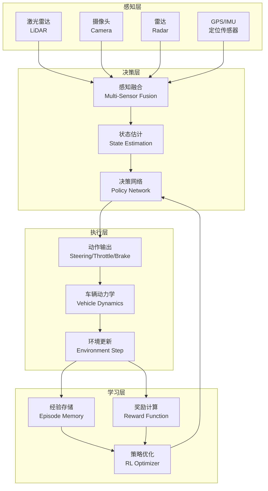

# 第21章:具身智能基础

## 章节概述

> **设计思想**:理解具身智能的核心理念,构建完整的感知-决策-执行闭环

本章将从具身智能的基本概念出发,以自动驾驶场景为例,系统性地介绍如何构建一个完整的具身智能系统。我们将深入探讨感知模块如何获取环境信息、决策模块如何基于感知做出行动选择、执行模块如何控制物理系统,以及学习引擎如何从交互中不断改进策略。

具身智能不同于传统AI的关键在于:它强调智能体与物理环境的直接交互,形成"感知→理解→决策→执行→反馈→学习"的完整闭环。这种闭环使得智能体能够在真实环境中不断进化,适应各种复杂场景。

## 学习目标

完成本章学习后,你将:

- ✅ **掌握核心概念**:理解具身智能的定义、特点及与传统AI的本质区别
- ✅ **具备架构能力**:能够设计完整的感知-决策-执行闭环系统
- ✅ **掌握传感器模拟**:了解多种传感器的原理和模拟方法
- ✅ **理解环境建模**:掌握车辆动力学模型和环境仿真技术
- ✅ **设计奖励函数**:能够为强化学习任务设计合理的奖励函数
- ✅ **获得实战经验**:通过自动驾驶项目掌握具身智能系统开发

## 技术架构图



## 章节大纲

### 21.1 具身智能概念模型
**学习重点**:理解具身智能的核心思想和设计原则

- 具身智能的定义:与物理世界直接交互的智能系统
- 与传统AI的区别:从数据处理到物理交互的范式转变
- 核心要素:感知(Perception)、决策(Decision)、执行(Execution)、学习(Learning)
- 应用场景:自动驾驶、机器人控制、无人机导航等
- 技术挑战:实时性、鲁棒性、安全性、样本效率

### 21.2 感知-决策-执行闭环  
**学习重点**:掌握具身智能系统的核心架构

- 闭环架构设计:信息流和控制流的完整路径
- 数据流分析:从传感器原始数据到控制指令的转换
- 状态表示:如何设计有效的状态空间
- 动作空间设计:连续动作vs离散动作的权衡
- 时序同步:传感器采样、决策计算、动作执行的时间协调

### 21.3 传感器模拟与多模态感知
**学习重点**:了解各类传感器的工作原理和模拟方法

- 激光雷达(LiDAR):3D点云数据获取与处理
- 摄像头(Camera):图像采集与视觉特征提取
- 雷达(Radar):障碍物距离和速度测量
- GPS/IMU:位置和姿态传感
- 传感器融合:多源数据的协同与互补
- 噪声模拟:真实传感器的不确定性建模

### 21.4 车辆动力学与环境建模
**学习重点**:掌握物理系统建模的基本方法

- 自行车模型:简化的车辆动力学表示
- 动力学方程:位置、速度、加速度、转向的数学关系
- 环境仿真:道路、障碍物、其他车辆的建模
- 物理约束:速度限制、转向角限制、加速度限制
- 碰撞检测:安全性验证的基础
- 场景设计:高速公路、城市道路、停车场等不同场景

### 21.5 奖励函数与学习引擎
**学习重点**:设计有效的学习信号,驱动智能体进化

- 奖励函数设计:多目标加权组合
  - 速度控制奖励:鼓励保持目标速度
  - 车道保持奖励:惩罚偏离车道中心
  - 碰撞惩罚:确保安全性
  - 舒适性奖励:平滑的加速和转向
- 强化学习集成:与TinyAI RL模块的对接
- 策略优化:从随机策略到最优策略的学习过程
- 经验回放:提升样本利用效率
- 探索与利用:平衡尝试新策略和利用已知最优策略

### 21.6 场景管理与测试
**学习重点**:构建完整的测试和评估体系

- 6种内置场景:
  - TEST:简单测试环境
  - HIGHWAY:高速公路场景
  - URBAN:城市道路场景
  - RURAL:乡村道路场景
  - PARKING_LOT:停车场场景
  - INTERSECTION:路口场景
- 场景配置:车道数、车辆密度、速度限制等参数
- 测试方法:单元测试、集成测试、压力测试
- 性能评估:成功率、平均速度、碰撞次数、舒适度
- 可视化工具:轨迹绘制、状态监控

### 21.7 综合项目:自动驾驶系统
**学习重点**:整合所有技术,实现完整的自动驾驶具身智能体

- 项目目标:在高速公路和城市道路场景下实现自动驾驶
- 系统架构:感知-决策-执行-学习四大模块的集成
- 核心功能:
  - 车道保持
  - 速度控制
  - 障碍物避让
  - 自主学习改进
- 性能要求:
  - 决策延迟 < 50ms
  - 碰撞率 < 1%
  - 车道偏离 < 0.3m
- 扩展方向:加入更多传感器、复杂场景、多车协同

## 核心技术点

### 技术点1:自行车模型动力学

自行车模型是车辆动力学的简化表示,核心思想是将四轮车辆简化为两轮:

**状态更新方程**:
```
x(t+Δt) = x(t) + v·cos(θ)·Δt
y(t+Δt) = y(t) + v·sin(θ)·Δt  
θ(t+Δt) = θ(t) + ω·Δt
v(t+Δt) = v(t) + a·Δt

其中角速度: ω = v·tan(δ) / L
```

**关键参数**:
- L: 车辆轴距(wheelbase)
- δ: 转向角(steering angle)
- v: 速度(velocity)
- θ: 航向角(heading angle)
- a: 加速度(acceleration)

**应用**:这个模型虽然简化,但对于路径规划和控制已经足够准确,是自动驾驶仿真的常用模型。

### 技术点2:多目标奖励函数设计

设计奖励函数需要平衡多个目标:

**组合奖励公式**:
```
R_total = w1·R_speed + w2·R_lane + w3·R_collision + w4·R_comfort
```

**各项奖励**:
- R_speed = 1 - |v - v_target| / v_max (速度奖励)
- R_lane = exp(-lateral_deviation²) (车道保持奖励)
- R_collision = -100 (碰撞) / -10·min_distance (接近障碍物)
- R_comfort = -|a| - 2|δ| (舒适性奖励)

**权重选择**:
- w1 = 0.3 (速度控制)
- w2 = 0.4 (车道保持)
- w3 = 1.0 (安全性最高优先级)
- w4 = 0.1 (舒适性次要)

**调优建议**:初期可以强调安全性(高w3),训练稳定后逐步提升其他目标权重。

## 性能基准

| 指标 | 目标值 | 说明 |
|------|--------|------|
| 决策延迟 | < 50ms | 单次感知-决策-执行循环时间 |
| 成功率 | > 90% | 在测试场景中无碰撞完成任务的比例 |
| 车道偏离 | < 0.3m | 与车道中心的平均偏离距离 |
| 平均速度 | > 80% v_target | 实际速度与目标速度的比例 |
| 内存占用 | < 512MB | 运行时峰值内存使用 |

## 常见问题与解决方案

### 问题1:车辆抖动,轨迹不平滑

**症状**:车辆在行驶过程中频繁左右摆动,转向角变化剧烈

**原因**:
- 决策网络输出不稳定
- 奖励函数没有惩罚剧烈动作变化
- 传感器噪声导致感知波动

**解决方案**:
- 在奖励函数中加入动作变化惩罚:R_smooth = -|δ(t) - δ(t-1)|
- 对传感器数据进行低通滤波
- 使用动作平滑技术:输出动作 = 0.7·新动作 + 0.3·上一动作

### 问题2:学习不收敛,性能无法提升

**症状**:训练多个回合后,智能体性能没有明显改善,奖励值波动大

**原因**:
- 探索不足,陷入局部最优
- 学习率设置不当
- 奖励函数设计有问题,存在多个局部最优

**解决方案**:
- 增加探索:使用ε-greedy策略,初期ε=0.5,逐渐衰减到0.1
- 调整学习率:建议从0.001开始,观察损失曲线调整
- 简化奖励函数:初期只关注主要目标(如避免碰撞),逐步加入次要目标
- 使用课程学习:从简单场景(TEST)开始,逐步过渡到复杂场景(URBAN)

### 问题3:仿真环境不稳定,出现NaN或Inf

**症状**:运行过程中出现数值异常,车辆位置或速度变成无穷大

**原因**:
- 动作输出超出合理范围
- 数值计算精度问题(除零、开方负数等)
- 时间步长过大导致数值不稳定

**解决方案**:
- 对所有动作进行裁剪:steering ∈ [-1, 1], throttle ∈ [0, 1]
- 添加数值检查:定期检查关键变量是否为有效值
- 减小时间步长:从dt=0.1降到dt=0.05或更小
- 使用更稳定的数值积分方法(如RK4替代欧拉法)

## 本章小结

### 核心收获

- **概念理解**:掌握了具身智能的核心理念——通过与物理环境直接交互来学习和决策
- **架构能力**:具备了设计感知-决策-执行-学习完整闭环的能力
- **技术积累**:学习了传感器模拟、车辆动力学、奖励函数设计等关键技术
- **实践经验**:通过自动驾驶项目获得了具身智能系统开发的完整经验

### 知识点回顾

1. **感知-决策-执行闭环**:这是具身智能的核心架构,贯穿所有具身智能应用
2. **多传感器融合**:不同传感器提供互补信息,融合后更鲁棒
3. **车辆动力学模型**:物理系统的数学表示,是仿真的基础
4. **奖励函数设计**:驱动学习的关键,需要精心设计权衡多个目标
5. **场景化测试**:不同场景验证系统的泛化能力

### 与后续章节的联系

本章学习的内容将在后续章节中应用于:

- **第22章**:路径规划和障碍物避障会用到本章的感知和环境建模技术
- **第23章**:VLA架构会扩展本章的单模态感知到多模态融合
- **第24章**:世界模型会利用本章的环境仿真思想,构建智能体的内部模型

## 延伸阅读

### 推荐资源

1. **论文**:
   - "End to End Learning for Self-Driving Cars" (NVIDIA, 2016)
   - "Learning to Drive in a Day" (Wayve, 2018)

2. **开源项目**:
   - CARLA Simulator: 开源自动驾驶仿真平台
   - OpenAI Gym: 强化学习环境标准接口

3. **在线资源**:
   - Udacity自动驾驶课程
   - Coursera机器人学专项课程

### 深入研究方向

- **高保真仿真**:从简化模型到物理引擎(如MuJoCo, PyBullet)
- **Sim-to-Real**:如何将仿真中学到的策略迁移到真实系统
- **多智能体协同**:多车协同驾驶和车路协同
- **安全性验证**:形式化验证方法确保自动驾驶安全

## 思考题

1. **基础理解**:为什么说具身智能需要"闭环"?如果没有反馈会怎样?
2. **技术应用**:如何将本章的技术应用到无人机导航场景?需要做哪些调整?
3. **系统设计**:如果要设计一个室内送餐机器人,感知-决策-执行闭环应该如何设计?
4. **性能优化**:如何在保证安全的前提下,让自动驾驶更"激进"一些?

## 实践练习

### 练习1:调整奖励函数
**目标**:理解奖励函数对学习效果的影响

**要求**:
- 修改奖励函数权重,观察训练效果变化
- 尝试只用单一目标(如速度或车道保持),分析优缺点
- 设计一个奖励函数让车辆"超车"行为更积极

**提示**:记录不同配置下的性能指标,绘制对比图表

### 练习2:增加新传感器
**目标**:理解传感器融合的价值

**要求**:
- 在现有基础上添加一个新的传感器类型
- 实现传感器数据融合逻辑
- 对比单传感器和多传感器的性能差异

**提示**:可以尝试添加后视传感器,支持变道决策

### 练习3:设计新场景
**目标**:巩固场景建模能力

**要求**:
- 设计一个新的驾驶场景(如环岛、匝道、隧道等)
- 配置场景参数(道路宽度、曲率、障碍物等)
- 测试智能体在新场景下的表现

**提示**:从简单场景开始,逐步增加复杂度

---

**下一章预告**:下一章我们将学习机器人控制系统,从自动驾驶扩展到更广泛的移动机器人应用,重点掌握路径规划、SLAM等核心算法。准备好迎接新的挑战了吗? 🤖
