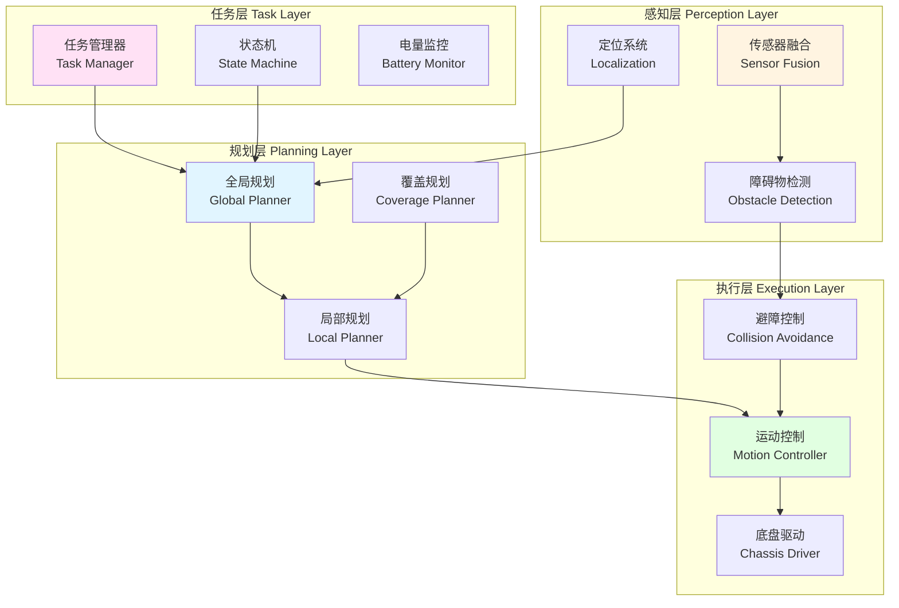
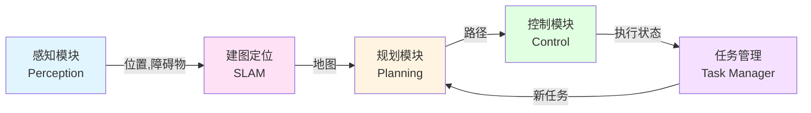
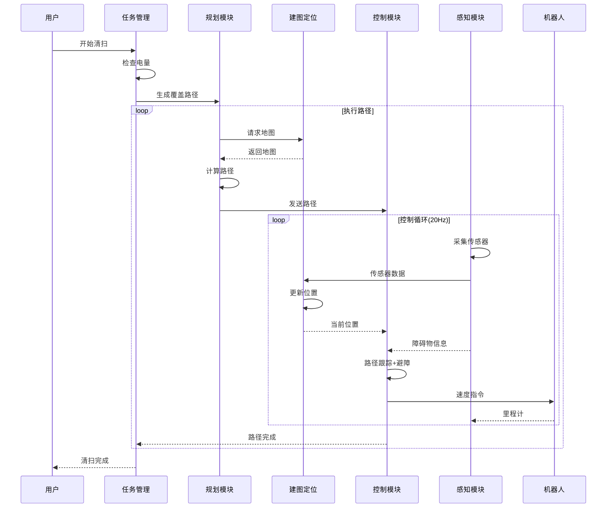

# 22.1 机器人控制架构设计

## 引言

想象一下,一台扫地机器人在你的家里工作:它需要知道自己在哪里(定位)、周围有什么障碍物(感知)、该往哪走(规划)、如何执行(控制)、什么时候该充电(任务管理)...这些功能如何有机地组织在一起?这就是控制架构设计要解决的问题。

一个好的架构就像一座建筑的框架,它决定了系统的可扩展性、可维护性和性能上限。本节将介绍移动机器人控制系统的经典分层架构,以及各模块的职责和接口设计。

## 核心概念

### 概念1:分层控制架构

移动机器人控制系统通常采用**三层架构**:任务层、规划层、执行层



**各层职责**:

| 层次 | 时间尺度 | 主要功能 | 输入 | 输出 |
|------|---------|---------|------|------|
| **任务层** | 秒级-分钟级 | 任务分解、调度、监控 | 用户指令、系统状态 | 目标点、清扫区域 |
| **规划层** | 100ms-1s | 路径规划、轨迹生成 | 目标点、地图、位置 | 路径点、速度命令 |
| **执行层** | 10-50ms | 运动控制、避障 | 速度命令、传感器 | 电机指令 |
| **感知层** | 10-100ms | 数据采集、处理、融合 | 传感器原始数据 | 位置、障碍物 |

**层次间通信**:
- 上层向下层发送**目标**和**指令**
- 下层向上层反馈**状态**和**结果**
- 同层模块通过**共享数据**协作

### 概念2:模块化设计

**核心模块划分**:



#### 模块1:感知模块(Perception Module)

**职责**:
- 采集传感器数据
- 数据预处理和滤波
- 障碍物检测
- 环境特征提取

**接口**:
```java
/**
 * 感知模块接口
 */
public interface PerceptionModule {
    /**
     * 获取障碍物列表
     */
    List<Obstacle> getObstacles();
    
    /**
     * 获取距离传感器数据
     */
    float[] getDistanceReadings();
    
    /**
     * 检查指定方向是否有障碍物
     */
    boolean isObstacleInDirection(double angle, double maxDistance);
}
```

#### 模块2:建图定位模块(SLAM Module)

**职责**:
- 构建环境地图
- 实时定位
- 地图更新
- 回环检测

**接口**:
```java
/**
 * SLAM模块接口
 */
public interface SLAMModule {
    /**
     * 获取当前位置
     */
    Pose2D getCurrentPose();
    
    /**
     * 获取栅格地图
     */
    OccupancyGrid getMap();
    
    /**
     * 更新位置和地图
     */
    void update(float[] sensorData, Odometry odom);
}
```

#### 模块3:规划模块(Planning Module)

**职责**:
- 全局路径规划
- 局部路径规划
- 覆盖路径规划
- 动态重规划

**接口**:
```java
/**
 * 规划模块接口
 */
public interface PlanningModule {
    /**
     * 计算从当前位置到目标的路径
     */
    Path planPath(Pose2D start, Pose2D goal, OccupancyGrid map);
    
    /**
     * 生成覆盖路径
     */
    Path planCoveragePath(Room room);
    
    /**
     * 检查路径是否仍然有效
     */
    boolean isPathValid(Path path, OccupancyGrid map);
}
```

#### 模块4:控制模块(Control Module)

**职责**:
- 路径跟踪
- 速度控制
- 避障控制
- 底盘驱动

**接口**:
```java
/**
 * 控制模块接口
 */
public interface ControlModule {
    /**
     * 跟踪路径,返回速度指令
     */
    VelocityCommand followPath(Path path, Pose2D currentPose);
    
    /**
     * 执行紧急停止
     */
    void emergencyStop();
    
    /**
     * 设置目标速度
     */
    void setTargetVelocity(double linear, double angular);
}
```

#### 模块5:任务管理模块(Task Manager)

**职责**:
- 任务分解和调度
- 状态机管理
- 电量监控
- 异常处理

**接口**:
```java
/**
 * 任务管理模块接口
 */
public interface TaskManager {
    /**
     * 执行清扫任务
     */
    void executeCleaningTask(Room room);
    
    /**
     * 返回充电桩
     */
    void returnToChargingStation();
    
    /**
     * 获取当前状态
     */
    RobotState getCurrentState();
    
    /**
     * 处理异常
     */
    void handleException(Exception exception);
}
```

### 概念3:数据流设计

**完整数据流图**:



**数据类型定义**:

```java
/**
 * 位姿(位置+姿态)
 */
public class Pose2D {
    private double x;        // x坐标(米)
    private double y;        // y坐标(米)
    private double theta;    // 航向角(弧度)
}

/**
 * 路径
 */
public class Path {
    private List<Pose2D> waypoints;  // 路径点列表
    private double totalLength;       // 总长度
    
    public Pose2D getNextWaypoint(Pose2D current);
    public boolean isCompleted(Pose2D current);
}

/**
 * 速度指令
 */
public class VelocityCommand {
    private double linearVelocity;   // 线速度(m/s)
    private double angularVelocity;  // 角速度(rad/s)
}

/**
 * 障碍物
 */
public class Obstacle {
    private Point2D position;  // 位置
    private double radius;     // 半径(简化为圆形)
    private boolean isDynamic; // 是否动态
}

/**
 * 栅格地图
 */
public class OccupancyGrid {
    private int width;         // 宽度(栅格数)
    private int height;        // 高度(栅格数)
    private float resolution;  // 分辨率(米/栅格)
    private byte[][] data;     // 占用数据:0=空闲,100=占用,-1=未知
    
    public boolean isOccupied(int x, int y);
    public boolean isFree(int x, int y);
}
```

## 技术实现

### 完整的机器人控制器

```java
/**
 * 机器人控制器主类
 * 整合所有模块,实现完整控制流程
 */
public class RobotController {
    
    // 核心模块
    private PerceptionModule perception;
    private SLAMModule slam;
    private PlanningModule planner;
    private ControlModule controller;
    private TaskManager taskManager;
    
    // 配置参数
    private RobotConfig config;
    
    // 状态变量
    private RobotState currentState;
    private Path currentPath;
    
    public RobotController(RobotConfig config) {
        this.config = config;
        
        // 初始化各模块
        this.perception = new PerceptionModuleImpl(config);
        this.slam = new SLAMModuleImpl(config);
        this.planner = new PlanningModuleImpl(config);
        this.controller = new ControlModuleImpl(config);
        this.taskManager = new TaskManagerImpl(config);
        
        this.currentState = RobotState.IDLE;
    }
    
    /**
     * 主控制循环(20Hz)
     */
    public void controlLoop() {
        // 1. 感知:采集传感器数据
        float[] sensorData = perception.getDistanceReadings();
        List<Obstacle> obstacles = perception.getObstacles();
        
        // 2. 定位:更新位置和地图
        Odometry odom = getRobotOdometry();
        slam.update(sensorData, odom);
        Pose2D currentPose = slam.getCurrentPose();
        OccupancyGrid map = slam.getMap();
        
        // 3. 规划:根据任务状态决定行为
        switch (currentState) {
            case CLEANING:
                executeCleaningBehavior(currentPose, map, obstacles);
                break;
                
            case RETURNING_TO_CHARGE:
                executeReturnBehavior(currentPose, map, obstacles);
                break;
                
            case IDLE:
            case CHARGING:
                controller.setTargetVelocity(0, 0);
                break;
                
            case ERROR:
                handleErrorState();
                break;
        }
        
        // 4. 任务管理:检查状态转换
        taskManager.updateState();
    }
    
    /**
     * 执行清扫行为
     */
    private void executeCleaningBehavior(Pose2D pose, 
                                        OccupancyGrid map, 
                                        List<Obstacle> obstacles) {
        // 检查是否有当前路径
        if (currentPath == null || !planner.isPathValid(currentPath, map)) {
            // 重新规划
            currentPath = planner.planCoveragePath(map.getUncleanedArea());
        }
        
        // 跟踪路径
        VelocityCommand cmd = controller.followPath(currentPath, pose);
        
        // 避障调整
        if (hasImmediateObstacle(obstacles)) {
            cmd = controller.avoidObstacles(obstacles, cmd);
        }
        
        // 发送速度指令
        sendVelocityCommand(cmd);
        
        // 检查路径是否完成
        if (currentPath.isCompleted(pose)) {
            currentPath = null;  // 清除路径,下次循环重新规划
        }
    }
    
    /**
     * 执行返回充电行为
     */
    private void executeReturnBehavior(Pose2D pose, 
                                      OccupancyGrid map, 
                                      List<Obstacle> obstacles) {
        Pose2D chargingStation = config.getChargingStationPose();
        
        // 规划返回路径
        if (currentPath == null) {
            currentPath = planner.planPath(pose, chargingStation, map);
        }
        
        // 跟踪路径
        VelocityCommand cmd = controller.followPath(currentPath, pose);
        sendVelocityCommand(cmd);
        
        // 检查是否到达
        if (pose.distance(chargingStation) < 0.1) {
            currentState = RobotState.CHARGING;
            controller.setTargetVelocity(0, 0);
        }
    }
    
    /**
     * 检查是否有近距离障碍物
     */
    private boolean hasImmediateObstacle(List<Obstacle> obstacles) {
        for (Obstacle obs : obstacles) {
            if (obs.distance(slam.getCurrentPose()) < 0.3) {
                return true;
            }
        }
        return false;
    }
}
```

### 模块间通信机制

**方法1:直接调用**
```java
// 简单直接,适合单线程
Pose2D pose = slam.getCurrentPose();
Path path = planner.planPath(pose, goal, map);
```

**方法2:消息队列**
```java
/**
 * 异步通信,适合多线程
 */
public class MessageBus {
    private Map<String, Queue<Message>> queues;
    
    public void publish(String topic, Message msg) {
        queues.get(topic).offer(msg);
    }
    
    public Message subscribe(String topic) {
        return queues.get(topic).poll();
    }
}

// 使用示例
messageBus.publish("pose_update", new PoseMessage(currentPose));
PoseMessage msg = messageBus.subscribe("pose_update");
```

**方法3:共享内存**
```java
/**
 * 高性能,适合高频数据
 */
public class SharedData {
    private volatile Pose2D currentPose;
    private volatile OccupancyGrid map;
    
    public synchronized void updatePose(Pose2D pose) {
        this.currentPose = pose;
    }
    
    public synchronized Pose2D getPose() {
        return currentPose;
    }
}
```

## 架构优化

### 优化1:模块解耦

**问题**:模块间耦合度高,难以单独测试和替换

**解决**:依赖注入和接口抽象
```java
public class RobotController {
    // 依赖接口而非具体实现
    private IPlanningModule planner;
    
    // 通过构造函数注入
    public RobotController(IPlanningModule planner) {
        this.planner = planner;
    }
    
    // 方便替换不同实现
    // planner可以是AStarPlanner, RRTPlanner等
}
```

### 优化2:异步处理

**问题**:某些模块计算耗时,阻塞控制循环

**解决**:异步任务执行
```java
public class AsyncPlanningModule implements IPlanningModule {
    private ExecutorService executor;
    private Future<Path> planningTask;
    
    @Override
    public Path planPath(Pose2D start, Pose2D goal, OccupancyGrid map) {
        // 提交异步任务
        planningTask = executor.submit(() -> {
            return computePath(start, goal, map);
        });
        
        // 立即返回,不阻塞
        return null;
    }
    
    public Path getPathIfReady() {
        if (planningTask != null && planningTask.isDone()) {
            return planningTask.get();
        }
        return null;
    }
}
```

### 优化3:优先级调度

**问题**:避障等紧急任务被延迟

**解决**:优先级队列
```java
public class PriorityTaskScheduler {
    private PriorityQueue<Task> taskQueue;
    
    public void schedule(Task task, int priority) {
        task.setPriority(priority);
        taskQueue.offer(task);
    }
    
    public void executeTasks() {
        while (!taskQueue.isEmpty()) {
            Task task = taskQueue.poll();
            task.execute();
        }
    }
}

// 使用
scheduler.schedule(avoidanceTask, Priority.HIGH);      // 优先级高
scheduler.schedule(cleaningTask, Priority.MEDIUM);     // 优先级中
scheduler.schedule(mappingTask, Priority.LOW);         // 优先级低
```

## 性能分析

### 计算负载分配

| 模块 | CPU占用 | 更新频率 | 主要耗时操作 |
|------|--------|---------|-------------|
| 感知 | 10% | 20Hz | 数据滤波、特征提取 |
| SLAM | 20% | 10Hz | 粒子滤波、地图更新 |
| 规划 | 30% | 1Hz | A*搜索、路径优化 |
| 控制 | 5% | 20Hz | PID计算、速度指令 |
| 任务管理 | 5% | 1Hz | 状态检查、决策 |
| 其他 | 30% | - | 系统开销、通信 |

### 实时性保证

```java
/**
 * 周期性任务执行器
 */
public class PeriodicExecutor {
    private ScheduledExecutorService scheduler;
    
    public void startControlLoop(int frequency) {
        long period = 1000 / frequency;  // 毫秒
        
        scheduler.scheduleAtFixedRate(
            () -> controlLoop(),
            0,
            period,
            TimeUnit.MILLISECONDS
        );
    }
    
    private void controlLoop() {
        long startTime = System.currentTimeMillis();
        
        // 执行控制逻辑
        executeControl();
        
        long elapsed = System.currentTimeMillis() - startTime;
        if (elapsed > 50) {  // 超过50ms警告
            logger.warn("Control loop took {}ms", elapsed);
        }
    }
}
```

## 常见问题

### 问题1:模块初始化顺序错误

**现象**:SLAM模块未初始化就被规划模块调用

**解决**:明确初始化顺序
```java
public void initialize() {
    // 按依赖顺序初始化
    perception.initialize();   // 1. 感知优先
    slam.initialize();         // 2. 定位依赖感知
    planner.initialize();      // 3. 规划依赖定位
    controller.initialize();   // 4. 控制依赖规划
    taskManager.initialize();  // 5. 任务管理最后
}
```

### 问题2:数据不一致

**现象**:规划使用的地图和控制使用的地图不同步

**解决**:数据版本控制
```java
public class VersionedData<T> {
    private T data;
    private long version;
    
    public synchronized void update(T newData) {
        this.data = newData;
        this.version++;
    }
    
    public synchronized DataSnapshot<T> getSnapshot() {
        return new DataSnapshot<>(data, version);
    }
}
```

## 小节总结

### 核心要点

1. **分层架构**:任务层、规划层、执行层、感知层,各司其职
2. **模块化设计**:感知、建图、规划、控制、任务管理五大模块
3. **接口抽象**:模块间通过清晰接口交互,降低耦合
4. **数据流**:从传感器到执行器的完整数据流设计
5. **实时性**:通过周期调度和优先级保证控制响应

### 设计原则

- **单一职责**:每个模块只负责一项功能
- **开闭原则**:对扩展开放,对修改封闭
- **依赖倒置**:依赖接口而非具体实现
- **高内聚低耦合**:模块内部紧密,模块间松散

### 应用价值

良好的架构设计是系统成功的基础:
- 提高代码可维护性
- 便于团队协作开发
- 支持功能逐步扩展
- 降低调试难度

## 思考题

1. **架构对比**:三层架构和反应式架构(如Subsumption)有什么区别?各适用什么场景?

2. **模块划分**:如果要添加语音交互功能,应该放在哪个模块?还是新建模块?

3. **通信方式**:什么情况下使用消息队列比直接调用更好?

4. **容错设计**:如果SLAM模块崩溃,如何保证机器人仍能安全运行?

## 拓展阅读

- **机器人学**:《Introduction to Autonomous Mobile Robots》
- **软件架构**:《软件架构设计:程序员向架构师转型必备》
- **ROS**:Robot Operating System架构设计

---

**下一节预告**:下一节我们将深入学习路径规划算法,掌握A*、Dijkstra、RRT等经典算法的原理和实现。
