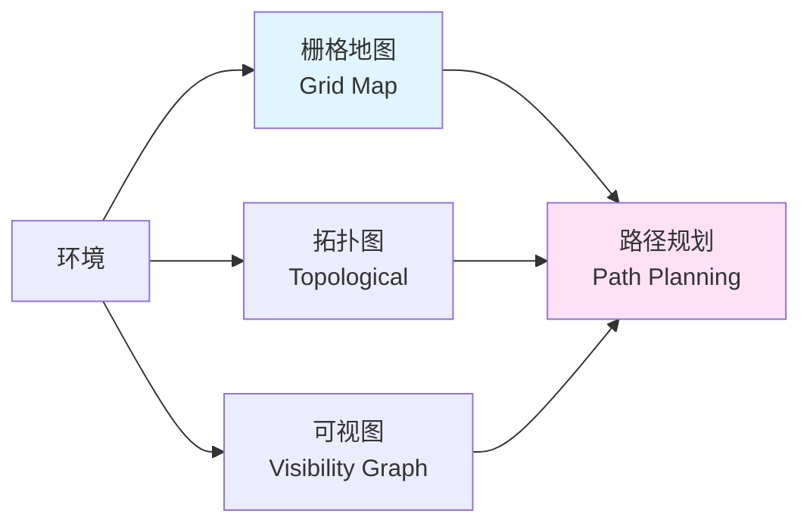
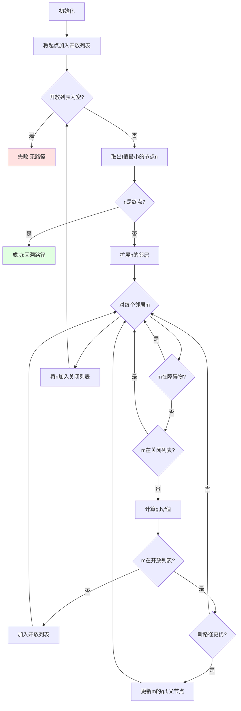
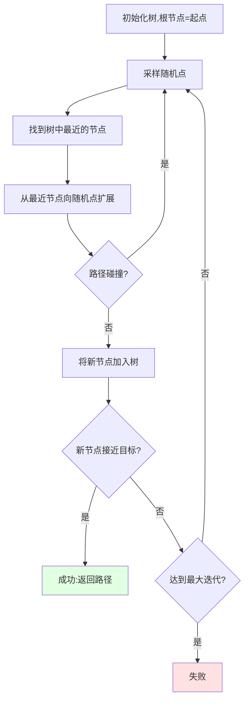

# 22.2 路径规划算法

## 引言

想象你在一个迷宫中,要从入口走到出口。你会怎么做?也许会沿着墙壁走,或者记住走过的路避免重复,又或者站在高处俯瞰全局找到最短路径。机器人面临的路径规划问题本质上就是这样一个"迷宫问题"。

路径规划是移动机器人最核心的技术之一。一个好的路径规划算法能让机器人高效、安全地从起点到达终点。本节将介绍三种经典的路径规划算法:A*、Dijkstra和RRT,并讲解路径平滑和动态重规划技术。

## 核心概念

### 概念1:路径规划问题定义

**问题描述**:
给定起点S、终点G和环境地图M,找到一条从S到G的路径P,使得:
1. 路径可行(不穿过障碍物)
2. 路径最优(长度最短或代价最小)
3. 计算高效(实时应用)

**路径规划分类**:

| 类型 | 时间尺度 | 环境信息 | 典型算法 | 应用场景 |
|------|---------|---------|---------|---------|
| **全局规划** | 秒级 | 已知完整地图 | A*, Dijkstra | 长距离导航 |
| **局部规划** | 毫秒级 | 局部传感器信息 | DWA, TEB | 动态避障 |
| **覆盖规划** | 分钟级 | 已知区域 | 回字形、螺旋形 | 清扫、巡检 |
| **采样规划** | 秒级 | 高维空间 | RRT, PRM | 机械臂规划 |

**地图表示**:



**栅格地图**:将环境离散化为网格
```
0: 空闲可通行
1: 障碍物
-1: 未知区域

示例地图(5x5):
0  0  0  0  0
0  1  1  0  0  
0  1  0  0  0
0  0  0  1  0
0  0  0  0  0
```

### 概念2:A*算法(A-Star)

**核心思想**:结合Dijkstra的最优性和贪心搜索的效率

**评估函数**:
```
f(n) = g(n) + h(n)

其中:
- g(n): 从起点到节点n的实际代价
- h(n): 从节点n到终点的启发式估计代价(欧氏距离)
- f(n): 总估计代价
```

**算法流程**:



**代码实现**:

```java
/**
 * A*路径规划算法
 */
public class AStarPlanner {
    
    /**
     * 规划从起点到终点的路径
     */
    public Path planPath(Point2D start, Point2D goal, OccupancyGrid map) {
        // 1. 初始化
        PriorityQueue<Node> openList = new PriorityQueue<>(
            Comparator.comparingDouble(Node::getF)
        );
        Set<Node> closedList = new HashSet<>();
        Map<Node, Node> parentMap = new HashMap<>();
        
        Node startNode = new Node(start, 0, heuristic(start, goal));
        openList.offer(startNode);
        
        // 2. 主循环
        while (!openList.isEmpty()) {
            // 取出f值最小的节点
            Node current = openList.poll();
            
            // 检查是否到达终点
            if (current.getPosition().distance(goal) < 0.1) {
                return reconstructPath(parentMap, current);
            }
            
            // 加入关闭列表
            closedList.add(current);
            
            // 3. 扩展邻居
            for (Node neighbor : getNeighbors(current, map)) {
                // 跳过障碍物和已访问节点
                if (map.isOccupied(neighbor.getPosition()) || 
                    closedList.contains(neighbor)) {
                    continue;
                }
                
                // 计算新的g值
                double tentativeG = current.getG() + 
                                   current.getPosition().distance(
                                       neighbor.getPosition());
                
                // 检查是否找到更好的路径
                Node existingNode = findInOpenList(openList, neighbor);
                if (existingNode == null) {
                    // 新节点,加入开放列表
                    neighbor.setG(tentativeG);
                    neighbor.setH(heuristic(neighbor.getPosition(), goal));
                    neighbor.setF(neighbor.getG() + neighbor.getH());
                    openList.offer(neighbor);
                    parentMap.put(neighbor, current);
                } else if (tentativeG < existingNode.getG()) {
                    // 找到更优路径,更新
                    existingNode.setG(tentativeG);
                    existingNode.setF(tentativeG + existingNode.getH());
                    parentMap.put(existingNode, current);
                    
                    // 重新排序(移除后重新加入)
                    openList.remove(existingNode);
                    openList.offer(existingNode);
                }
            }
        }
        
        // 未找到路径
        return null;
    }
    
    /**
     * 启发式函数:欧氏距离
     */
    private double heuristic(Point2D a, Point2D b) {
        return a.distance(b);
    }
    
    /**
     * 获取邻居节点(8连通)
     */
    private List<Node> getNeighbors(Node node, OccupancyGrid map) {
        List<Node> neighbors = new ArrayList<>();
        Point2D pos = node.getPosition();
        
        // 8个方向
        int[][] directions = {
            {-1, 0}, {1, 0}, {0, -1}, {0, 1},  // 上下左右
            {-1, -1}, {-1, 1}, {1, -1}, {1, 1} // 对角线
        };
        
        for (int[] dir : directions) {
            int newX = (int)(pos.getX() / map.getResolution()) + dir[0];
            int newY = (int)(pos.getY() / map.getResolution()) + dir[1];
            
            if (map.isValid(newX, newY)) {
                Point2D newPos = new Point2D.Double(
                    newX * map.getResolution(),
                    newY * map.getResolution()
                );
                neighbors.add(new Node(newPos));
            }
        }
        
        return neighbors;
    }
    
    /**
     * 回溯路径
     */
    private Path reconstructPath(Map<Node, Node> parentMap, Node goal) {
        List<Point2D> waypoints = new ArrayList<>();
        Node current = goal;
        
        while (current != null) {
            waypoints.add(0, current.getPosition());  // 头部插入
            current = parentMap.get(current);
        }
        
        return new Path(waypoints);
    }
}

/**
 * 路径节点
 */
class Node {
    private Point2D position;
    private double g;  // 起点到当前的代价
    private double h;  // 当前到终点的估计
    private double f;  // 总代价
    
    public Node(Point2D position) {
        this.position = position;
    }
    
    public Node(Point2D position, double g, double h) {
        this.position = position;
        this.g = g;
        this.h = h;
        this.f = g + h;
    }
    
    // getter/setter省略
}
```

**A*优化技巧**:

1. **双向搜索**:从起点和终点同时搜索
2. **跳点搜索(JPS)**:跳过对称路径,减少节点扩展
3. **分层A***:先在粗网格规划,再在细网格优化

### 概念3:Dijkstra算法

**核心思想**:广度优先搜索+最短路径

**与A*的区别**:
- Dijkstra: f(n) = g(n),不使用启发式
- A*: f(n) = g(n) + h(n),使用启发式

**优缺点**:

| 特性 | Dijkstra | A* |
|------|---------|-----|
| **最优性** | 保证最优 | 启发式可接受时保证最优 |
| **效率** | 较慢,搜索更多节点 | 更快,有方向性 |
| **适用场景** | 多目标点、需要最优解 | 单目标点、实时性要求高 |

**代码实现**(与A*类似,去掉h值):

```java
public class DijkstraPlanner {
    
    public Path planPath(Point2D start, Point2D goal, OccupancyGrid map) {
        PriorityQueue<Node> openList = new PriorityQueue<>(
            Comparator.comparingDouble(Node::getG)  // 只按g值排序
        );
        
        // ... 其余逻辑与A*相同,但不计算h值
    }
}
```

### 概念4:RRT算法(快速探索随机树)

**核心思想**:通过随机采样快速探索空间

**适用场景**:
- 高维配置空间(如机械臂)
- 复杂约束环境
- 动态障碍物

**算法流程**:



**代码实现**:

```java
/**
 * RRT路径规划算法
 */
public class RRTPlanner {
    private double stepSize = 0.5;      // 扩展步长
    private int maxIterations = 5000;    // 最大迭代次数
    private double goalThreshold = 0.3;  // 目标阈值
    
    public Path planPath(Point2D start, Point2D goal, OccupancyGrid map) {
        // 初始化树
        Tree tree = new Tree(start);
        Random random = new Random();
        
        for (int i = 0; i < maxIterations; i++) {
            // 1. 采样随机点(10%概率采样目标点)
            Point2D randomPoint = (random.nextDouble() < 0.1) ? 
                goal : sampleRandomPoint(map);
            
            // 2. 找到树中最近的节点
            TreeNode nearestNode = tree.findNearest(randomPoint);
            
            // 3. 向随机点方向扩展
            Point2D newPoint = extend(nearestNode.getPosition(), 
                                     randomPoint, stepSize);
            
            // 4. 碰撞检测
            if (!isCollisionFree(nearestNode.getPosition(), newPoint, map)) {
                continue;
            }
            
            // 5. 加入树
            TreeNode newNode = new TreeNode(newPoint, nearestNode);
            tree.addNode(newNode);
            
            // 6. 检查是否到达目标
            if (newPoint.distance(goal) < goalThreshold) {
                return tree.extractPath(newNode);
            }
        }
        
        return null;  // 未找到路径
    }
    
    /**
     * 采样随机点
     */
    private Point2D sampleRandomPoint(OccupancyGrid map) {
        Random random = new Random();
        double x = random.nextDouble() * map.getWidth() * map.getResolution();
        double y = random.nextDouble() * map.getHeight() * map.getResolution();
        return new Point2D.Double(x, y);
    }
    
    /**
     * 向目标方向扩展
     */
    private Point2D extend(Point2D from, Point2D to, double stepSize) {
        double distance = from.distance(to);
        if (distance <= stepSize) {
            return to;
        }
        
        double ratio = stepSize / distance;
        double x = from.getX() + (to.getX() - from.getX()) * ratio;
        double y = from.getY() + (to.getY() - from.getY()) * ratio;
        return new Point2D.Double(x, y);
    }
    
    /**
     * 碰撞检测
     */
    private boolean isCollisionFree(Point2D from, Point2D to, 
                                   OccupancyGrid map) {
        // 沿线段采样多个点检查
        int samples = (int)(from.distance(to) / map.getResolution()) + 1;
        
        for (int i = 0; i <= samples; i++) {
            double ratio = (double)i / samples;
            double x = from.getX() + (to.getX() - from.getX()) * ratio;
            double y = from.getY() + (to.getY() - from.getY()) * ratio;
            
            if (map.isOccupied(new Point2D.Double(x, y))) {
                return false;
            }
        }
        
        return true;
    }
}
```

### 概念5:路径平滑

**问题**:A*等算法生成的路径通常是锯齿状,不适合机器人执行

**解决方案**:路径平滑算法

**方法1:快捷方式(Shortcut)**

```java
/**
 * 快捷方式平滑
 */
public Path smoothPath(Path originalPath, OccupancyGrid map) {
    List<Point2D> waypoints = originalPath.getWaypoints();
    List<Point2D> smoothed = new ArrayList<>();
    
    int i = 0;
    smoothed.add(waypoints.get(i));
    
    while (i < waypoints.size() - 1) {
        // 尝试跳过中间点
        int j = waypoints.size() - 1;
        while (j > i + 1) {
            if (isCollisionFree(waypoints.get(i), waypoints.get(j), map)) {
                smoothed.add(waypoints.get(j));
                i = j;
                break;
            }
            j--;
        }
        
        if (j == i + 1) {
            // 无法跳过,添加下一个点
            i++;
            smoothed.add(waypoints.get(i));
        }
    }
    
    return new Path(smoothed);
}
```

**方法2:贝塞尔曲线平滑**

```java
/**
 * 二次贝塞尔曲线平滑
 */
public Path bezierSmooth(Path path) {
    List<Point2D> waypoints = path.getWaypoints();
    List<Point2D> smoothed = new ArrayList<>();
    
    for (int i = 0; i < waypoints.size() - 2; i++) {
        Point2D p0 = waypoints.get(i);
        Point2D p1 = waypoints.get(i + 1);
        Point2D p2 = waypoints.get(i + 2);
        
        // 在每两个点之间插入贝塞尔曲线点
        for (double t = 0; t <= 1; t += 0.1) {
            double x = (1-t)*(1-t)*p0.getX() + 
                      2*(1-t)*t*p1.getX() + 
                      t*t*p2.getX();
            double y = (1-t)*(1-t)*p0.getY() + 
                      2*(1-t)*t*p1.getY() + 
                      t*t*p2.getY();
            smoothed.add(new Point2D.Double(x, y));
        }
    }
    
    return new Path(smoothed);
}
```

### 概念6:动态重规划

**问题**:环境变化(新障碍物出现)导致原路径不可行

**解决方案**:

1. **周期性重规划**:每隔一段时间重新规划
2. **触发式重规划**:检测到路径无效时重规划
3. **增量式重规划**:只修复受影响的部分(D* Lite)

**实现**:

```java
/**
 * 动态重规划器
 */
public class DynamicReplanner {
    private Path currentPath;
    private AStarPlanner planner;
    private long lastPlanTime;
    private long replanInterval = 2000;  // 2秒
    
    /**
     * 检查并重规划
     */
    public Path updatePath(Pose2D currentPose, Point2D goal, 
                          OccupancyGrid map) {
        // 检查是否需要重规划
        if (shouldReplan(currentPose, map)) {
            System.out.println("重新规划路径...");
            currentPath = planner.planPath(
                currentPose.getPosition(), goal, map
            );
            lastPlanTime = System.currentTimeMillis();
        }
        
        return currentPath;
    }
    
    /**
     * 判断是否需要重规划
     */
    private boolean shouldReplan(Pose2D pose, OccupancyGrid map) {
        // 情况1:无当前路径
        if (currentPath == null) {
            return true;
        }
        
        // 情况2:路径被障碍物阻挡
        if (!isPathValid(currentPath, map)) {
            return true;
        }
        
        // 情况3:超过时间间隔
        if (System.currentTimeMillis() - lastPlanTime > replanInterval) {
            return true;
        }
        
        return false;
    }
    
    /**
     * 检查路径有效性
     */
    private boolean isPathValid(Path path, OccupancyGrid map) {
        List<Point2D> waypoints = path.getWaypoints();
        
        for (int i = 0; i < waypoints.size() - 1; i++) {
            if (!isCollisionFree(waypoints.get(i), 
                                waypoints.get(i + 1), map)) {
                return false;
            }
        }
        
        return true;
    }
}
```

## 性能分析

### 算法对比

| 算法 | 时间复杂度 | 空间复杂度 | 最优性 | 实时性 | 适用场景 |
|------|-----------|-----------|-------|-------|---------|
| **A*** | O(b^d) | O(b^d) | 是 | 好 | 静态环境,已知地图 |
| **Dijkstra** | O(n²) | O(n) | 是 | 中 | 多目标,需要最优 |
| **RRT** | O(n log n) | O(n) | 否 | 好 | 高维空间,动态环境 |

**实测性能**(10x10米房间,0.05米分辨率):

| 算法 | 平均规划时间 | 路径长度 | 节点扩展数 |
|------|-------------|---------|-----------|
| A* | 15ms | 12.3m | 180 |
| Dijkstra | 45ms | 12.3m | 520 |
| RRT | 80ms | 14.7m | 1200 |
| A*+平滑 | 20ms | 13.1m | 180+30 |

## 常见问题

### 问题1:A*找到的路径贴墙走

**原因**:对角线移动代价与直线相同,导致路径不够"安全"

**解决**:
```java
// 增加接近障碍物的惩罚
private double calculateCost(Point2D from, Point2D to, OccupancyGrid map) {
    double baseCost = from.distance(to);
    double obstaclePenalty = getObstacleProximityPenalty(to, map);
    return baseCost + obstaclePenalty;
}

private double getObstacleProximityPenalty(Point2D point, OccupancyGrid map) {
    double minDist = findNearestObstacleDistance(point, map);
    double safeDistance = 0.3;  // 30cm
    
    if (minDist < safeDistance) {
        return (safeDistance - minDist) * 10;  // 惩罚系数
    }
    return 0;
}
```

### 问题2:RRT路径质量差

**解决**:使用RRT*变体
```java
// RRT*: 重连接以优化路径
private void rewire(TreeNode newNode, List<TreeNode> nearNodes) {
    for (TreeNode nearNode : nearNodes) {
        double newCost = newNode.getCost() + 
                        newNode.getPosition().distance(nearNode.getPosition());
        
        if (newCost < nearNode.getCost()) {
            // 重新连接可以降低代价
            nearNode.setParent(newNode);
            nearNode.setCost(newCost);
        }
    }
}
```

### 问题3:动态障碍物导致频繁重规划

**解决**:局部修复而非全局重规划
```java
// 只重规划受影响的部分
public Path localReplan(Path originalPath, Obstacle newObstacle) {
    // 找到路径上第一个受影响的点
    int startIdx = findAffectedIndex(originalPath, newObstacle);
    
    if (startIdx == -1) {
        return originalPath;  // 路径未受影响
    }
    
    // 只重规划从受影响点到终点的部分
    Path newSegment = planner.planPath(
        originalPath.getWaypoint(startIdx),
        originalPath.getGoal(),
        map
    );
    
    // 拼接路径
    return concatenatePaths(
        originalPath.getSegment(0, startIdx),
        newSegment
    );
}
```

## 最佳实践

### 实践1:分层规划

```java
/**
 * 分层规划:粗规划+精规划
 */
public Path hierarchicalPlanning(Point2D start, Point2D goal, 
                                OccupancyGrid fineMap) {
    // 1. 粗网格全局规划(快速)
    OccupancyGrid coarseMap = downsample(fineMap, 4);
    Path coarsePath = astar.planPath(start, goal, coarseMap);
    
    // 2. 细网格局部优化(精确)
    Path refinedPath = refinePath(coarsePath, fineMap);
    
    // 3. 路径平滑
    return smoothPath(refinedPath, fineMap);
}
```

### 实践2:缓存加速

```java
/**
 * 缓存启发式值
 */
private Map<Point2D, Double> heuristicCache = new HashMap<>();

private double heuristic(Point2D point, Point2D goal) {
    return heuristicCache.computeIfAbsent(point, 
        p -> p.distance(goal)
    );
}
```

## 小节总结

### 核心要点

1. **A*算法**:最常用的路径规划算法,平衡效率和最优性
2. **Dijkstra算法**:保证最优但较慢,适合多目标场景
3. **RRT算法**:适合高维空间和复杂约束
4. **路径平滑**:提升路径可执行性和舒适度
5. **动态重规划**:应对环境变化

### 算法选择指南

- **静态环境+已知地图**: A*
- **需要绝对最优**: Dijkstra
- **高维空间/复杂约束**: RRT/RRT*
- **实时避障**: 局部规划(DWA)
- **全覆盖**: 专用覆盖算法

## 思考题

1. **启发式设计**:除了欧氏距离,还有哪些启发式函数?各有什么特点?
2. **对角移动**:如何正确计算对角线移动的代价?
3. **双向A***:如何实现双向A*算法?什么时候有优势?
4. **路径质量**:如何量化评估一条路径的"好坏"?

## 拓展阅读

- **经典论文**:A* Pathfinding for Beginners
- **进阶算法**:Theta*, JPS, D* Lite
- **开源库**:OMPL (Open Motion Planning Library)

---

**下一节预告**:下一节我们将学习障碍物避障与碰撞检测,了解如何在动态环境中安全导航。
