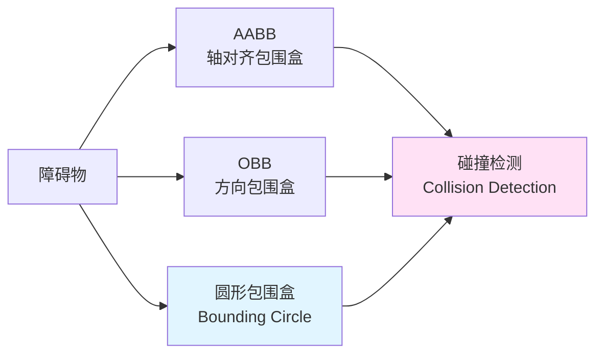
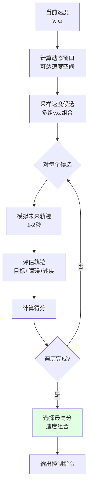

# 22.3 障碍物避障与碰撞检测

## 引言

路径规划解决了"往哪走"的问题,但真实世界中,机器人还会遇到各种动态障碍物:突然出现的宠物、移动的人、其他机器人...这些都需要实时避障能力。就像开车时,即使你知道目的地怎么走,也需要随时注意突然窜出的行人和车辆。

避障是机器人安全运行的基础。一个好的避障系统不仅要能躲开障碍物,还要保持运动的流畅性,避免急停急转。本节将介绍障碍物检测、动态避障算法和碰撞预警机制。

## 核心概念

### 概念1:障碍物表示方法

**表示方式对比**:

| 表示方法 | 优点 | 缺点 | 适用场景 |
|---------|------|------|---------|
| **点云** | 精确,保留细节 | 数据量大,处理慢 | 3D感知,精确建模 |
| **栅格地图** | 计算简单,内存规整 | 分辨率受限 | 2D导航,路径规划 |
| **边界框** | 计算极快 | 过于简化 | 实时避障,碰撞检测 |
| **多边形** | 精度可调 | 计算复杂度中等 | 形状拟合,区域表示 |

**边界框表示**:



**代码实现**:

```java
/**
 * 障碍物抽象类
 */
public abstract class Obstacle {
    protected Point2D position;
    protected boolean isDynamic;
    
    /**
     * 检查与点的碰撞
     */
    public abstract boolean intersects(Point2D point);
    
    /**
     * 检查与线段的碰撞
     */
    public abstract boolean intersects(Point2D start, Point2D end);
    
    /**
     * 获取最近点的距离
     */
    public abstract double distance(Point2D point);
}

/**
 * 圆形障碍物(最简单)
 */
public class CircularObstacle extends Obstacle {
    private double radius;
    
    @Override
    public boolean intersects(Point2D point) {
        return position.distance(point) <= radius;
    }
    
    @Override
    public boolean intersects(Point2D start, Point2D end) {
        // 点到线段的距离
        double dist = distancePointToSegment(position, start, end);
        return dist <= radius;
    }
    
    @Override
    public double distance(Point2D point) {
        return Math.max(0, position.distance(point) - radius);
    }
    
    /**
     * 点到线段的距离
     */
    private double distancePointToSegment(Point2D p, 
                                         Point2D a, Point2D b) {
        double vx = b.getX() - a.getX();
        double vy = b.getY() - a.getY();
        double wx = p.getX() - a.getX();
        double wy = p.getY() - a.getY();
        
        double c1 = wx * vx + wy * vy;
        if (c1 <= 0) {
            return p.distance(a);
        }
        
        double c2 = vx * vx + vy * vy;
        if (c1 >= c2) {
            return p.distance(b);
        }
        
        double b_proj = c1 / c2;
        Point2D projection = new Point2D.Double(
            a.getX() + b_proj * vx,
            a.getY() + b_proj * vy
        );
        
        return p.distance(projection);
    }
}

/**
 * 矩形障碍物
 */
public class RectangularObstacle extends Obstacle {
    private double width;
    private double height;
    private double orientation;  // 朝向角
    
    @Override
    public boolean intersects(Point2D point) {
        // 将点转换到障碍物局部坐标系
        Point2D local = worldToLocal(point);
        return Math.abs(local.getX()) <= width / 2 && 
               Math.abs(local.getY()) <= height / 2;
    }
    
    private Point2D worldToLocal(Point2D world) {
        double dx = world.getX() - position.getX();
        double dy = world.getY() - position.getY();
        
        double cos = Math.cos(-orientation);
        double sin = Math.sin(-orientation);
        
        return new Point2D.Double(
            dx * cos - dy * sin,
            dx * sin + dy * cos
        );
    }
}
```

### 概念2:动态窗口法(Dynamic Window Approach)

**核心思想**:在机器人动力学约束下,搜索最优的速度组合

**算法流程**:



**动态窗口计算**:

```
动力学约束:
V_d = {(v, ω) | v_min ≤ v ≤ v_max, ω_min ≤ ω ≤ ω_max}

加速度约束:
V_a = {(v, ω) | v-a·Δt ≤ v ≤ v+a·Δt, ω-α·Δt ≤ ω ≤ ω+α·Δt}

安全约束(避免碰撞):
V_s = {(v, ω) | dist(v,ω) > stop_distance(v)}

动态窗口 = V_d ∩ V_a ∩ V_s
```

**评估函数**:

```
G(v, ω) = σ·heading(v,ω) + β·dist(v,ω) + γ·velocity(v,ω)

其中:
- heading: 朝向目标的程度
- dist: 与最近障碍物的距离
- velocity: 速度大小
- σ, β, γ: 权重系数
```

**代码实现**:

```java
/**
 * 动态窗口避障算法
 */
public class DynamicWindowApproach {
    
    // 参数配置
    private double maxLinearVel = 0.5;    // 最大线速度 m/s
    private double maxAngularVel = 1.0;   // 最大角速度 rad/s
    private double maxLinearAccel = 0.5;  // 最大线加速度
    private double maxAngularAccel = 1.0; // 最大角加速度
    private double predictTime = 2.0;     // 预测时间
    private double timeStep = 0.1;        // 模拟时间步
    
    // 评估权重
    private double headingWeight = 1.0;
    private double distanceWeight = 0.5;
    private double velocityWeight = 0.2;
    
    /**
     * 计算最优速度指令
     */
    public VelocityCommand computeVelocity(
            Pose2D currentPose,
            VelocityCommand currentVel,
            Point2D goal,
            List<Obstacle> obstacles) {
        
        // 1. 计算动态窗口
        VelocityWindow window = calculateDynamicWindow(currentVel);
        
        // 2. 采样速度候选
        List<VelocityCommand> candidates = sampleVelocities(window);
        
        // 3. 评估每个候选
        VelocityCommand bestCmd = null;
        double bestScore = Double.NEGATIVE_INFINITY;
        
        for (VelocityCommand cmd : candidates) {
            // 模拟轨迹
            Trajectory trajectory = simulateTrajectory(
                currentPose, cmd, predictTime
            );
            
            // 检查碰撞
            if (isCollision(trajectory, obstacles)) {
                continue;  // 跳过会碰撞的候选
            }
            
            // 评估得分
            double score = evaluateTrajectory(
                trajectory, goal, obstacles
            );
            
            if (score > bestScore) {
                bestScore = score;
                bestCmd = cmd;
            }
        }
        
        // 4. 返回最优指令(如无安全指令则紧急停止)
        return bestCmd != null ? bestCmd : 
               new VelocityCommand(0, 0);
    }
    
    /**
     * 计算动态窗口
     */
    private VelocityWindow calculateDynamicWindow(VelocityCommand current) {
        // 动力学约束
        double vMin = 0;
        double vMax = maxLinearVel;
        double wMin = -maxAngularVel;
        double wMax = maxAngularVel;
        
        // 加速度约束
        double dt = 0.1;  // 时间步
        vMin = Math.max(vMin, current.getLinear() - maxLinearAccel * dt);
        vMax = Math.min(vMax, current.getLinear() + maxLinearAccel * dt);
        wMin = Math.max(wMin, current.getAngular() - maxAngularAccel * dt);
        wMax = Math.min(wMax, current.getAngular() + maxAngularAccel * dt);
        
        return new VelocityWindow(vMin, vMax, wMin, wMax);
    }
    
    /**
     * 采样速度
     */
    private List<VelocityCommand> sampleVelocities(VelocityWindow window) {
        List<VelocityCommand> samples = new ArrayList<>();
        
        int vSamples = 10;
        int wSamples = 20;
        
        for (int i = 0; i < vSamples; i++) {
            double v = window.vMin + 
                      (window.vMax - window.vMin) * i / (vSamples - 1);
            
            for (int j = 0; j < wSamples; j++) {
                double w = window.wMin + 
                          (window.wMax - window.wMin) * j / (wSamples - 1);
                
                samples.add(new VelocityCommand(v, w));
            }
        }
        
        return samples;
    }
    
    /**
     * 模拟轨迹
     */
    private Trajectory simulateTrajectory(Pose2D start, 
                                         VelocityCommand cmd, 
                                         double duration) {
        List<Pose2D> poses = new ArrayList<>();
        Pose2D current = start;
        
        for (double t = 0; t < duration; t += timeStep) {
            // 简化运动学模型
            double x = current.getX() + 
                      cmd.getLinear() * Math.cos(current.getTheta()) * timeStep;
            double y = current.getY() + 
                      cmd.getLinear() * Math.sin(current.getTheta()) * timeStep;
            double theta = current.getTheta() + 
                          cmd.getAngular() * timeStep;
            
            current = new Pose2D(x, y, theta);
            poses.add(current);
        }
        
        return new Trajectory(poses);
    }
    
    /**
     * 碰撞检测
     */
    private boolean isCollision(Trajectory trajectory, 
                               List<Obstacle> obstacles) {
        for (Pose2D pose : trajectory.getPoses()) {
            for (Obstacle obs : obstacles) {
                if (obs.intersects(pose.getPosition())) {
                    return true;
                }
            }
        }
        return false;
    }
    
    /**
     * 评估轨迹
     */
    private double evaluateTrajectory(Trajectory trajectory, 
                                     Point2D goal, 
                                     List<Obstacle> obstacles) {
        Pose2D endPose = trajectory.getEndPose();
        
        // 1. 朝向得分:朝向目标的程度
        double heading = calculateHeadingScore(endPose, goal);
        
        // 2. 距离得分:与障碍物的最小距离
        double distance = calculateDistanceScore(trajectory, obstacles);
        
        // 3. 速度得分:鼓励较高速度
        double velocity = trajectory.getAverageVelocity() / maxLinearVel;
        
        return headingWeight * heading + 
               distanceWeight * distance + 
               velocityWeight * velocity;
    }
    
    /**
     * 计算朝向得分
     */
    private double calculateHeadingScore(Pose2D pose, Point2D goal) {
        double dx = goal.getX() - pose.getX();
        double dy = goal.getY() - pose.getY();
        double goalAngle = Math.atan2(dy, dx);
        
        double angleDiff = Math.abs(normalizeAngle(
            goalAngle - pose.getTheta()
        ));
        
        return 1.0 - angleDiff / Math.PI;  // [0, 1]
    }
    
    /**
     * 计算距离得分
     */
    private double calculateDistanceScore(Trajectory trajectory, 
                                         List<Obstacle> obstacles) {
        double minDistance = Double.MAX_VALUE;
        
        for (Pose2D pose : trajectory.getPoses()) {
            for (Obstacle obs : obstacles) {
                double dist = obs.distance(pose.getPosition());
                minDistance = Math.min(minDistance, dist);
            }
        }
        
        // 距离越大得分越高,但有上限
        return Math.min(1.0, minDistance / 2.0);
    }
}
```

### 概念3:碰撞预警系统

**分级预警**:

| 级别 | 距离范围 | 动作 | 颜色标识 |
|------|---------|------|---------|
| **安全** | > 1.0m | 正常行驶 | 🟢 绿色 |
| **警告** | 0.5-1.0m | 减速 | 🟡 黄色 |
| **危险** | 0.2-0.5m | 急减速 | 🟠 橙色 |
| **紧急** | < 0.2m | 紧急停止 | 🔴 红色 |

**实现**:

```java
/**
 * 碰撞预警系统
 */
public class CollisionWarningSystem {
    
    private static final double SAFE_DISTANCE = 1.0;
    private static final double WARNING_DISTANCE = 0.5;
    private static final double DANGER_DISTANCE = 0.2;
    
    /**
     * 评估碰撞风险
     */
    public CollisionRisk assessRisk(Pose2D robotPose, 
                                   VelocityCommand robotVel,
                                   List<Obstacle> obstacles) {
        double minDistance = Double.MAX_VALUE;
        Obstacle nearestObstacle = null;
        
        // 找到最近的障碍物
        for (Obstacle obs : obstacles) {
            double dist = obs.distance(robotPose.getPosition());
            if (dist < minDistance) {
                minDistance = dist;
                nearestObstacle = obs;
            }
        }
        
        // 计算碰撞时间(TTC - Time To Collision)
        double ttc = calculateTTC(
            robotPose, robotVel, nearestObstacle
        );
        
        // 确定风险级别
        CollisionLevel level;
        if (minDistance >= SAFE_DISTANCE) {
            level = CollisionLevel.SAFE;
        } else if (minDistance >= WARNING_DISTANCE) {
            level = CollisionLevel.WARNING;
        } else if (minDistance >= DANGER_DISTANCE) {
            level = CollisionLevel.DANGER;
        } else {
            level = CollisionLevel.EMERGENCY;
        }
        
        return new CollisionRisk(level, minDistance, ttc, nearestObstacle);
    }
    
    /**
     * 计算碰撞时间
     */
    private double calculateTTC(Pose2D pose, 
                               VelocityCommand vel, 
                               Obstacle obstacle) {
        if (obstacle == null) {
            return Double.MAX_VALUE;
        }
        
        // 简化:假设直线运动
        Point2D robotPos = pose.getPosition();
        Point2D obsPos = obstacle.getPosition();
        
        double dx = obsPos.getX() - robotPos.getX();
        double dy = obsPos.getY() - robotPos.getY();
        
        double vx = vel.getLinear() * Math.cos(pose.getTheta());
        double vy = vel.getLinear() * Math.sin(pose.getTheta());
        
        double relativeVel = (dx * vx + dy * vy) / 
                            Math.sqrt(dx * dx + dy * dy);
        
        if (relativeVel <= 0) {
            return Double.MAX_VALUE;  // 远离障碍物
        }
        
        double distance = obstacle.distance(robotPos);
        return distance / relativeVel;
    }
    
    /**
     * 根据风险调整速度
     */
    public VelocityCommand adjustVelocity(VelocityCommand original, 
                                         CollisionRisk risk) {
        switch (risk.getLevel()) {
            case SAFE:
                return original;
                
            case WARNING:
                // 减速到70%
                return new VelocityCommand(
                    original.getLinear() * 0.7,
                    original.getAngular() * 0.7
                );
                
            case DANGER:
                // 减速到30%
                return new VelocityCommand(
                    original.getLinear() * 0.3,
                    original.getAngular() * 0.5
                );
                
            case EMERGENCY:
                // 紧急停止
                return new VelocityCommand(0, 0);
                
            default:
                return original;
        }
    }
}
```

### 概念4:人工势场法

**核心思想**:目标产生引力,障碍物产生斥力

**势场函数**:

```
吸引势场(目标):
U_att(q) = 1/2 · k_att · distance²(q, goal)

排斥势场(障碍物):
U_rep(q) = {
    1/2 · k_rep · (1/d - 1/d₀)²,  如果 d < d₀
    0,                            如果 d ≥ d₀
}

总势场:
U(q) = U_att(q) + Σ U_rep_i(q)

合力:
F(q) = -∇U(q)
```

**代码实现**:

```java
/**
 * 人工势场法
 */
public class ArtificialPotentialField {
    private double k_att = 1.0;   // 吸引力系数
    private double k_rep = 100.0; // 排斥力系数
    private double d0 = 1.0;      // 障碍物影响范围
    
    /**
     * 计算合力
     */
    public Vector2D calculateForce(Point2D position, 
                                   Point2D goal, 
                                   List<Obstacle> obstacles) {
        // 吸引力
        Vector2D attractiveForce = calculateAttractiveForce(position, goal);
        
        // 排斥力
        Vector2D repulsiveForce = new Vector2D(0, 0);
        for (Obstacle obs : obstacles) {
            repulsiveForce = repulsiveForce.add(
                calculateRepulsiveForce(position, obs)
            );
        }
        
        return attractiveForce.add(repulsiveForce);
    }
    
    /**
     * 吸引力
     */
    private Vector2D calculateAttractiveForce(Point2D position, 
                                             Point2D goal) {
        double dx = goal.getX() - position.getX();
        double dy = goal.getY() - position.getY();
        double distance = Math.sqrt(dx * dx + dy * dy);
        
        if (distance < 0.01) {
            return new Vector2D(0, 0);
        }
        
        // F_att = k_att * (goal - position)
        return new Vector2D(
            k_att * dx / distance,
            k_att * dy / distance
        );
    }
    
    /**
     * 排斥力
     */
    private Vector2D calculateRepulsiveForce(Point2D position, 
                                            Obstacle obstacle) {
        double distance = obstacle.distance(position);
        
        if (distance >= d0) {
            return new Vector2D(0, 0);
        }
        
        Point2D obsPos = obstacle.getPosition();
        double dx = position.getX() - obsPos.getX();
        double dy = position.getY() - obsPos.getY();
        
        // F_rep = k_rep * (1/d - 1/d0) * (1/d²) * direction
        double magnitude = k_rep * (1.0/distance - 1.0/d0) / 
                          (distance * distance);
        
        return new Vector2D(
            magnitude * dx / distance,
            magnitude * dy / distance
        );
    }
}
```

**局限性**:
- 容易陷入局部最优(如U形障碍物)
- 目标附近振荡
- 窄通道难以通过

**改进方法**:
- 结合随机扰动跳出局部最优
- 使用改进的势场函数
- 与全局规划结合

## 性能优化

### 优化1:分层检测

```java
/**
 * 分层障碍物检测
 */
public class HierarchicalObstacleDetection {
    
    /**
     * 粗检测:快速排除远距离障碍物
     */
    public List<Obstacle> coarseDetection(Point2D position, 
                                         List<Obstacle> allObstacles) {
        List<Obstacle> nearby = new ArrayList<>();
        double threshold = 3.0;  // 3米
        
        for (Obstacle obs : allObstacles) {
            if (obs.distance(position) < threshold) {
                nearby.add(obs);
            }
        }
        
        return nearby;
    }
    
    /**
     * 精检测:详细碰撞检测
     */
    public List<Obstacle> fineDetection(Trajectory trajectory, 
                                       List<Obstacle> candidates) {
        List<Obstacle> colliding = new ArrayList<>();
        
        for (Obstacle obs : candidates) {
            for (Pose2D pose : trajectory.getPoses()) {
                if (obs.intersects(pose.getPosition())) {
                    colliding.add(obs);
                    break;
                }
            }
        }
        
        return colliding;
    }
}
```

### 优化2:空间索引

```java
/**
 * 使用网格加速障碍物查询
 */
public class SpatialGrid {
    private Map<GridCell, List<Obstacle>> grid;
    private double cellSize;
    
    /**
     * 快速查询附近障碍物
     */
    public List<Obstacle> queryNearby(Point2D position, double radius) {
        Set<Obstacle> result = new HashSet<>();
        
        int minX = (int)((position.getX() - radius) / cellSize);
        int maxX = (int)((position.getX() + radius) / cellSize);
        int minY = (int)((position.getY() - radius) / cellSize);
        int maxY = (int)((position.getY() + radius) / cellSize);
        
        for (int x = minX; x <= maxX; x++) {
            for (int y = minY; y <= maxY; y++) {
                GridCell cell = new GridCell(x, y);
                List<Obstacle> obstacles = grid.get(cell);
                if (obstacles != null) {
                    result.addAll(obstacles);
                }
            }
        }
        
        return new ArrayList<>(result);
    }
}
```

## 常见问题

### 问题1:DWA在窄通道中卡住

**解决**:临时降低安全距离
```java
if (isNarrowPassage()) {
    distanceWeight = 0.2;  // 降低距离权重
} else {
    distanceWeight = 0.5;  // 正常权重
}
```

### 问题2:高速下来不及避障

**解决**:速度自适应
```java
double safeSpeed = Math.sqrt(2 * maxAccel * minObstacleDistance);
targetSpeed = Math.min(targetSpeed, safeSpeed);
```

## 小节总结

### 核心要点

1. **障碍物表示**:圆形、矩形、多边形,权衡精度和效率
2. **DWA算法**:在动力学约束下搜索最优速度
3. **碰撞预警**:分级预警,提前响应
4. **势场法**:简单直观,但有局部最优问题
5. **性能优化**:分层检测、空间索引

## 思考题

1. **算法对比**:DWA和势场法各适用什么场景?
2. **动态障碍物**:如何预测行人的运动轨迹?
3. **多机器人**:多个机器人如何协同避障?

## 拓展阅读

- **DWA论文**:The Dynamic Window Approach to Collision Avoidance
- **TEB算法**:Timed Elastic Band局部规划
- **MPC方法**:模型预测控制用于避障

---

**下一节预告**:下一节我们将学习覆盖规划与清扫策略,了解如何高效地清扫整个区域。
