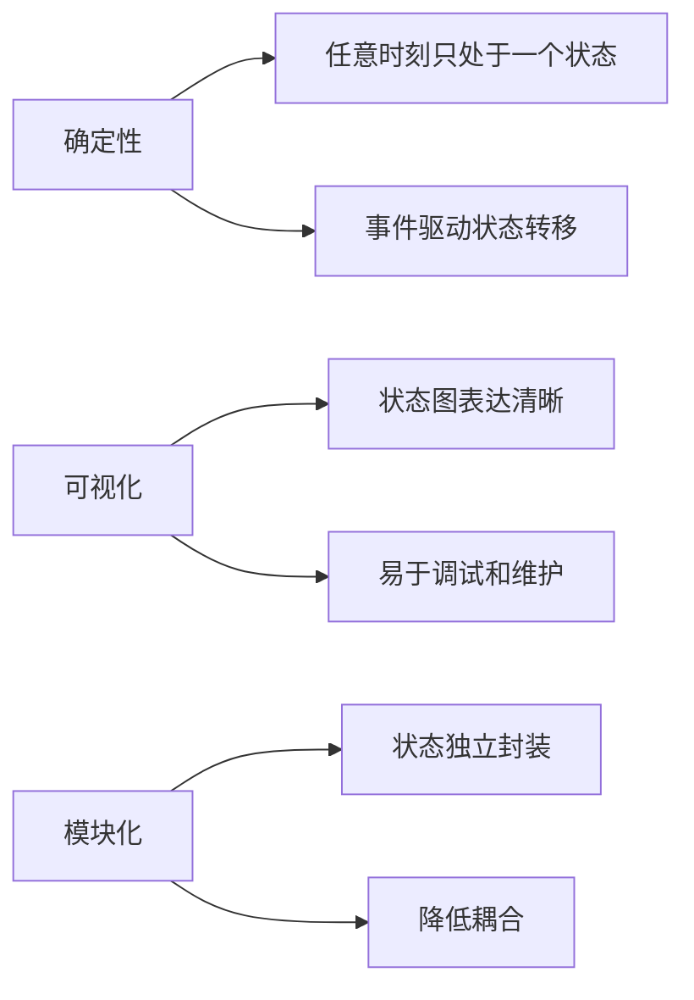
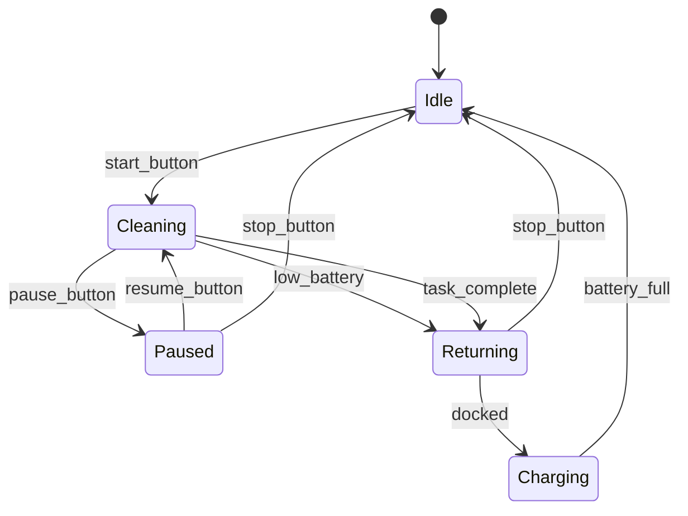
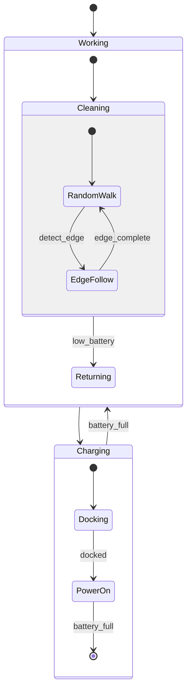
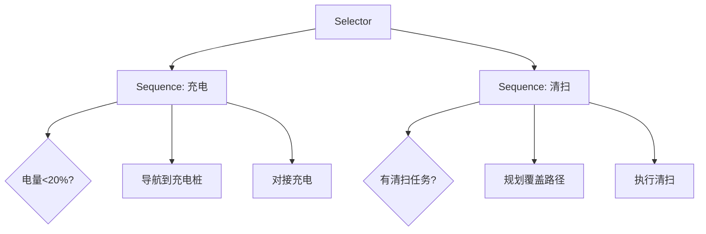

# 22.5 状态机与任务管理

## 引言

移动机器人的行为往往具有高度的结构化特征,在不同工作阶段需要切换不同的控制模式。例如,扫地机器人可能处于待机、清扫、返回充电、充电等多种状态;无人配送车可能处于等待订单、导航中、装货、卸货等状态。状态机(State Machine)提供了一种清晰、可维护的方式来建模这些复杂行为。

本节将深入探讨有限状态机(FSM)、层次状态机(HSM)、行为树(Behavior Tree)等任务管理技术,并介绍如何设计鲁棒的任务调度系统。

### 本节目标
- 理解状态机在机器人控制中的作用
- 掌握FSM和HSM的设计与实现
- 学习行为树的构建方法
- 实现多任务优先级调度系统

## 核心概念

### 1. 有限状态机(FSM)

**定义**: 有限状态机是一个五元组 $M = (S, \Sigma, \delta, s_0, F)$,其中:
- $S$: 有限状态集合
- $\Sigma$: 输入事件集合
- $\delta: S \times \Sigma \rightarrow S$: 状态转移函数
- $s_0 \in S$: 初始状态
- $F \subseteq S$: 终止状态集合

**状态机特性**:


**扫地机器人状态机示例**:



### 2. 层次状态机(HSM)

复杂系统的状态数量会呈指数增长,层次状态机通过嵌套结构解决状态爆炸问题。

**层次结构**:


### 3. 行为树(Behavior Tree)

行为树是游戏AI和机器人领域广泛使用的任务管理框架,比状态机更灵活。

**基本节点类型**:
- **复合节点** (Composite):
  - Sequence: 顺序执行子节点,全部成功则成功
  - Selector: 选择执行子节点,有一个成功则成功
  - Parallel: 并行执行多个子节点
- **装饰节点** (Decorator): 修饰单个子节点的行为(重复、反转、条件等)
- **叶节点** (Leaf): 
  - Action: 执行具体动作
  - Condition: 检查条件

**行为树示例**:



## 技术实现

### 1. 有限状态机实现

**状态接口与基类**:

```java
/**
 * 状态接口
 */
public interface State {
    /**
     * 进入状态时调用
     */
    void onEnter();
    
    /**
     * 状态更新(每个控制周期调用)
     */
    void onUpdate(double deltaTime);
    
    /**
     * 离开状态时调用
     */
    void onExit();
    
    /**
     * 处理事件
     * @return 目标状态(null表示不转移)
     */
    State handleEvent(Event event);
    
    /**
     * 获取状态名称
     */
    String getName();
}

/**
 * 事件基类
 */
public abstract class Event {
    private String type;
    private long timestamp;
    private Map<String, Object> data;
    
    public Event(String type) {
        this.type = type;
        this.timestamp = System.currentTimeMillis();
        this.data = new HashMap<>();
    }
    
    public String getType() { return type; }
    public Map<String, Object> getData() { return data; }
}

/**
 * 状态机引擎
 */
public class StateMachine {
    private State currentState;
    private State previousState;
    private Map<String, State> stateMap;
    private Queue<Event> eventQueue;
    private boolean isRunning;
    
    public StateMachine() {
        this.stateMap = new HashMap<>();
        this.eventQueue = new LinkedList<>();
        this.isRunning = false;
    }
    
    /**
     * 注册状态
     */
    public void registerState(State state) {
        stateMap.put(state.getName(), state);
    }
    
    /**
     * 设置初始状态
     */
    public void setInitialState(String stateName) {
        currentState = stateMap.get(stateName);
        if (currentState != null) {
            currentState.onEnter();
        }
    }
    
    /**
     * 发送事件
     */
    public void sendEvent(Event event) {
        eventQueue.offer(event);
    }
    
    /**
     * 状态机更新循环
     */
    public void update(double deltaTime) {
        if (!isRunning || currentState == null) {
            return;
        }
        
        // 1. 处理事件队列
        while (!eventQueue.isEmpty()) {
            Event event = eventQueue.poll();
            State nextState = currentState.handleEvent(event);
            
            if (nextState != null && nextState != currentState) {
                transitionTo(nextState);
            }
        }
        
        // 2. 更新当前状态
        currentState.onUpdate(deltaTime);
    }
    
    /**
     * 状态转移
     */
    private void transitionTo(State nextState) {
        System.out.println("状态转移: " + currentState.getName() + 
                          " -> " + nextState.getName());
        
        previousState = currentState;
        currentState.onExit();
        
        currentState = nextState;
        currentState.onEnter();
    }
    
    public void start() { isRunning = true; }
    public void stop() { isRunning = false; }
    public State getCurrentState() { return currentState; }
}
```

**扫地机器人状态实现**:

```java
/**
 * 清扫状态
 */
public class CleaningState implements State {
    private RobotController robot;
    private CoveragePlanner planner;
    private CoveragePath currentPath;
    private int waypointIndex;
    
    public CleaningState(RobotController robot) {
        this.robot = robot;
        this.planner = new BoustrophedonPlanner(
            robot.getMap(), robot.getRadius(), 0.3);
    }
    
    @Override
    public void onEnter() {
        System.out.println("开始清扫任务");
        
        // 规划覆盖路径
        currentPath = planner.planBoustrophedon(
            robot.getCurrentPose().getPosition(),
            ScanDirection.HORIZONTAL);
        
        waypointIndex = 0;
        robot.enableVacuum(true);  // 打开吸尘器
    }
    
    @Override
    public void onUpdate(double deltaTime) {
        // 检查是否到达当前航点
        Point2D currentPos = robot.getCurrentPose().getPosition();
        Point2D targetWaypoint = currentPath.waypoints.get(waypointIndex);
        
        if (currentPos.distance(targetWaypoint) < 0.1) {
            waypointIndex++;
            
            if (waypointIndex >= currentPath.waypoints.size()) {
                // 清扫完成
                robot.sendEvent(new Event("task_complete"));
                return;
            }
        }
        
        // 导航到下一个航点
        robot.navigateTo(targetWaypoint);
        
        // 检查电量
        if (robot.getBatteryLevel() < 20.0) {
            robot.sendEvent(new Event("low_battery"));
        }
    }
    
    @Override
    public void onExit() {
        System.out.println("结束清扫任务");
        robot.enableVacuum(false);
        robot.stopMotion();
    }
    
    @Override
    public State handleEvent(Event event) {
        switch (event.getType()) {
            case "pause_button":
                return new PausedState(robot);
            case "low_battery":
                return new ReturningState(robot);
            case "task_complete":
                return new ReturningState(robot);
            case "stop_button":
                return new IdleState(robot);
            default:
                return null;  // 不转移
        }
    }
    
    @Override
    public String getName() {
        return "Cleaning";
    }
}

/**
 * 返回充电桩状态
 */
public class ReturningState implements State {
    private RobotController robot;
    private AStarPlanner pathPlanner;
    private Path pathToDock;
    
    public ReturningState(RobotController robot) {
        this.robot = robot;
        this.pathPlanner = new AStarPlanner();
    }
    
    @Override
    public void onEnter() {
        System.out.println("返回充电桩");
        
        // 规划到充电桩的路径
        Point2D dockPosition = robot.getDockPosition();
        pathToDock = pathPlanner.planPath(
            robot.getCurrentPose().getPosition(),
            dockPosition,
            robot.getMap());
    }
    
    @Override
    public void onUpdate(double deltaTime) {
        // 沿路径导航
        if (pathToDock != null && !pathToDock.isEmpty()) {
            Point2D nextPoint = pathToDock.getWaypoints().get(0);
            robot.navigateTo(nextPoint);
            
            // 检查是否到达充电桩
            if (robot.isDockedToCharger()) {
                robot.sendEvent(new Event("docked"));
            }
        }
    }
    
    @Override
    public void onExit() {
        robot.stopMotion();
    }
    
    @Override
    public State handleEvent(Event event) {
        if ("docked".equals(event.getType())) {
            return new ChargingState(robot);
        } else if ("stop_button".equals(event.getType())) {
            return new IdleState(robot);
        }
        return null;
    }
    
    @Override
    public String getName() {
        return "Returning";
    }
}

/**
 * 充电状态
 */
public class ChargingState implements State {
    private RobotController robot;
    
    public ChargingState(RobotController robot) {
        this.robot = robot;
    }
    
    @Override
    public void onEnter() {
        System.out.println("开始充电");
        robot.enableCharging(true);
    }
    
    @Override
    public void onUpdate(double deltaTime) {
        double batteryLevel = robot.getBatteryLevel();
        
        if (batteryLevel >= 95.0) {
            robot.sendEvent(new Event("battery_full"));
        }
        
        // 显示充电进度
        System.out.printf("充电中: %.1f%%\r", batteryLevel);
    }
    
    @Override
    public void onExit() {
        System.out.println("\n充电完成");
        robot.enableCharging(false);
    }
    
    @Override
    public State handleEvent(Event event) {
        if ("battery_full".equals(event.getType())) {
            return new IdleState(robot);
        }
        return null;
    }
    
    @Override
    public String getName() {
        return "Charging";
    }
}
```

### 2. 层次状态机实现

```java
/**
 * 复合状态(包含子状态)
 */
public class CompositeState implements State {
    private String name;
    private StateMachine subStateMachine;
    private State parentExitState;  // 父级转移目标
    
    public CompositeState(String name) {
        this.name = name;
        this.subStateMachine = new StateMachine();
    }
    
    /**
     * 添加子状态
     */
    public void addSubState(State subState) {
        subStateMachine.registerState(subState);
    }
    
    /**
     * 设置子状态机的初始状态
     */
    public void setInitialSubState(String stateName) {
        subStateMachine.setInitialState(stateName);
    }
    
    @Override
    public void onEnter() {
        System.out.println("进入复合状态: " + name);
        subStateMachine.start();
    }
    
    @Override
    public void onUpdate(double deltaTime) {
        // 更新子状态机
        subStateMachine.update(deltaTime);
    }
    
    @Override
    public void onExit() {
        System.out.println("退出复合状态: " + name);
        subStateMachine.stop();
    }
    
    @Override
    public State handleEvent(Event event) {
        // 先让子状态机处理事件
        subStateMachine.sendEvent(event);
        
        // 检查是否有父级转移
        if (shouldExitToParent(event)) {
            return parentExitState;
        }
        
        return null;
    }
    
    /**
     * 判断是否应退出到父级状态
     */
    private boolean shouldExitToParent(Event event) {
        // 例如:低电量事件导致整个工作状态退出
        return "low_battery".equals(event.getType());
    }
    
    @Override
    public String getName() {
        return name;
    }
}
```

### 3. 行为树实现

**行为树节点基类**:

```java
/**
 * 行为树节点状态
 */
public enum NodeStatus {
    SUCCESS,   // 成功
    FAILURE,   // 失败
    RUNNING    // 运行中
}

/**
 * 行为树节点接口
 */
public interface BehaviorNode {
    /**
     * 执行节点
     */
    NodeStatus tick(double deltaTime);
    
    /**
     * 重置节点
     */
    void reset();
}

/**
 * 复合节点:Sequence(顺序执行)
 */
public class SequenceNode implements BehaviorNode {
    private List<BehaviorNode> children;
    private int currentChildIndex;
    
    public SequenceNode() {
        this.children = new ArrayList<>();
        this.currentChildIndex = 0;
    }
    
    public void addChild(BehaviorNode child) {
        children.add(child);
    }
    
    @Override
    public NodeStatus tick(double deltaTime) {
        while (currentChildIndex < children.size()) {
            BehaviorNode currentChild = children.get(currentChildIndex);
            NodeStatus status = currentChild.tick(deltaTime);
            
            switch (status) {
                case SUCCESS:
                    // 当前子节点成功,继续下一个
                    currentChildIndex++;
                    break;
                    
                case FAILURE:
                    // 任一子节点失败,整个序列失败
                    reset();
                    return NodeStatus.FAILURE;
                    
                case RUNNING:
                    // 子节点仍在运行
                    return NodeStatus.RUNNING;
            }
        }
        
        // 所有子节点成功
        reset();
        return NodeStatus.SUCCESS;
    }
    
    @Override
    public void reset() {
        currentChildIndex = 0;
        for (BehaviorNode child : children) {
            child.reset();
        }
    }
}

/**
 * 复合节点:Selector(选择执行)
 */
public class SelectorNode implements BehaviorNode {
    private List<BehaviorNode> children;
    private int currentChildIndex;
    
    public SelectorNode() {
        this.children = new ArrayList<>();
        this.currentChildIndex = 0;
    }
    
    public void addChild(BehaviorNode child) {
        children.add(child);
    }
    
    @Override
    public NodeStatus tick(double deltaTime) {
        while (currentChildIndex < children.size()) {
            BehaviorNode currentChild = children.get(currentChildIndex);
            NodeStatus status = currentChild.tick(deltaTime);
            
            switch (status) {
                case SUCCESS:
                    // 任一子节点成功,选择器成功
                    reset();
                    return NodeStatus.SUCCESS;
                    
                case FAILURE:
                    // 当前子节点失败,尝试下一个
                    currentChildIndex++;
                    break;
                    
                case RUNNING:
                    return NodeStatus.RUNNING;
            }
        }
        
        // 所有子节点都失败
        reset();
        return NodeStatus.FAILURE;
    }
    
    @Override
    public void reset() {
        currentChildIndex = 0;
        for (BehaviorNode child : children) {
            child.reset();
        }
    }
}

/**
 * 装饰节点:Repeat(重复执行)
 */
public class RepeatNode implements BehaviorNode {
    private BehaviorNode child;
    private int maxRepeats;
    private int currentRepeat;
    
    public RepeatNode(BehaviorNode child, int maxRepeats) {
        this.child = child;
        this.maxRepeats = maxRepeats;  // -1表示无限重复
        this.currentRepeat = 0;
    }
    
    @Override
    public NodeStatus tick(double deltaTime) {
        NodeStatus status = child.tick(deltaTime);
        
        if (status != NodeStatus.RUNNING) {
            currentRepeat++;
            child.reset();
            
            if (maxRepeats > 0 && currentRepeat >= maxRepeats) {
                reset();
                return NodeStatus.SUCCESS;
            }
        }
        
        return NodeStatus.RUNNING;
    }
    
    @Override
    public void reset() {
        currentRepeat = 0;
        child.reset();
    }
}

/**
 * 叶节点:条件检查
 */
public class ConditionNode implements BehaviorNode {
    private Supplier<Boolean> condition;
    
    public ConditionNode(Supplier<Boolean> condition) {
        this.condition = condition;
    }
    
    @Override
    public NodeStatus tick(double deltaTime) {
        return condition.get() ? NodeStatus.SUCCESS : NodeStatus.FAILURE;
    }
    
    @Override
    public void reset() {
        // 条件节点无需重置
    }
}

/**
 * 叶节点:动作执行
 */
public abstract class ActionNode implements BehaviorNode {
    protected boolean isRunning;
    
    public ActionNode() {
        this.isRunning = false;
    }
    
    @Override
    public NodeStatus tick(double deltaTime) {
        if (!isRunning) {
            onStart();
            isRunning = true;
        }
        
        NodeStatus status = onUpdate(deltaTime);
        
        if (status != NodeStatus.RUNNING) {
            onEnd();
            isRunning = false;
        }
        
        return status;
    }
    
    @Override
    public void reset() {
        if (isRunning) {
            onEnd();
            isRunning = false;
        }
    }
    
    protected abstract void onStart();
    protected abstract NodeStatus onUpdate(double deltaTime);
    protected abstract void onEnd();
}
```

**扫地机器人行为树示例**:

```java
/**
 * 扫地机器人行为树
 */
public class CleaningRobotBehaviorTree {
    private BehaviorNode root;
    private RobotController robot;
    
    public CleaningRobotBehaviorTree(RobotController robot) {
        this.robot = robot;
        buildTree();
    }
    
    private void buildTree() {
        // 根节点:Selector
        SelectorNode root = new SelectorNode();
        
        // 分支1:充电序列
        SequenceNode chargingSequence = new SequenceNode();
        chargingSequence.addChild(new ConditionNode(
            () -> robot.getBatteryLevel() < 20.0));
        chargingSequence.addChild(new NavigateToDockAction(robot));
        chargingSequence.addChild(new DockAction(robot));
        chargingSequence.addChild(new ChargeAction(robot));
        
        // 分支2:清扫序列
        SequenceNode cleaningSequence = new SequenceNode();
        cleaningSequence.addChild(new ConditionNode(
            () -> robot.hasCleaningTask()));
        cleaningSequence.addChild(new PlanCoveragePathAction(robot));
        cleaningSequence.addChild(new ExecuteCleaningAction(robot));
        
        // 分支3:待机
        ActionNode idleAction = new IdleAction(robot);
        
        root.addChild(chargingSequence);
        root.addChild(cleaningSequence);
        root.addChild(idleAction);
        
        this.root = root;
    }
    
    /**
     * 更新行为树
     */
    public void update(double deltaTime) {
        root.tick(deltaTime);
    }
}

/**
 * 导航到充电桩动作
 */
class NavigateToDockAction extends ActionNode {
    private RobotController robot;
    private Path pathToDock;
    
    public NavigateToDockAction(RobotController robot) {
        this.robot = robot;
    }
    
    @Override
    protected void onStart() {
        System.out.println("开始导航到充电桩");
        AStarPlanner planner = new AStarPlanner();
        pathToDock = planner.planPath(
            robot.getCurrentPose().getPosition(),
            robot.getDockPosition(),
            robot.getMap());
    }
    
    @Override
    protected NodeStatus onUpdate(double deltaTime) {
        if (pathToDock == null || pathToDock.isEmpty()) {
            return NodeStatus.FAILURE;
        }
        
        // 检查是否到达
        Point2D currentPos = robot.getCurrentPose().getPosition();
        if (currentPos.distance(robot.getDockPosition()) < 0.3) {
            return NodeStatus.SUCCESS;
        }
        
        // 继续导航
        robot.followPath(pathToDock);
        return NodeStatus.RUNNING;
    }
    
    @Override
    protected void onEnd() {
        robot.stopMotion();
    }
}

/**
 * 执行清扫动作
 */
class ExecuteCleaningAction extends ActionNode {
    private RobotController robot;
    private CoveragePath coveragePath;
    private int waypointIndex;
    
    public ExecuteCleaningAction(RobotController robot) {
        this.robot = robot;
    }
    
    @Override
    protected void onStart() {
        System.out.println("开始清扫");
        robot.enableVacuum(true);
        waypointIndex = 0;
    }
    
    @Override
    protected NodeStatus onUpdate(double deltaTime) {
        // 获取当前覆盖路径(由PlanCoveragePathAction设置)
        coveragePath = robot.getCurrentCoveragePath();
        
        if (coveragePath == null || waypointIndex >= coveragePath.waypoints.size()) {
            return NodeStatus.SUCCESS;  // 清扫完成
        }
        
        // 导航到下一个航点
        Point2D target = coveragePath.waypoints.get(waypointIndex);
        Point2D current = robot.getCurrentPose().getPosition();
        
        if (current.distance(target) < 0.1) {
            waypointIndex++;
        } else {
            robot.navigateTo(target);
        }
        
        return NodeStatus.RUNNING;
    }
    
    @Override
    protected void onEnd() {
        robot.enableVacuum(false);
        robot.stopMotion();
    }
}
```

### 4. 任务优先级调度

```java
/**
 * 任务定义
 */
public class Task implements Comparable<Task> {
    private String id;
    private String name;
    private int priority;  // 优先级(数值越大越优先)
    private TaskStatus status;
    private Runnable action;
    private long createTime;
    private long deadline;  // 截止时间(毫秒时间戳)
    
    public enum TaskStatus {
        PENDING,
        RUNNING,
        COMPLETED,
        FAILED,
        CANCELLED
    }
    
    @Override
    public int compareTo(Task other) {
        // 优先级高的排前面
        if (this.priority != other.priority) {
            return other.priority - this.priority;
        }
        // 优先级相同,截止时间早的排前面
        return Long.compare(this.deadline, other.deadline);
    }
}

/**
 * 任务调度器
 */
public class TaskScheduler {
    private PriorityQueue<Task> taskQueue;
    private Task currentTask;
    private ExecutorService executor;
    private Map<String, Task> taskMap;
    
    public TaskScheduler() {
        this.taskQueue = new PriorityQueue<>();
        this.taskMap = new HashMap<>();
        this.executor = Executors.newSingleThreadExecutor();
    }
    
    /**
     * 提交任务
     */
    public void submitTask(Task task) {
        taskQueue.offer(task);
        taskMap.put(task.getId(), task);
        task.setStatus(TaskStatus.PENDING);
        
        System.out.println("任务已提交: " + task.getName() + 
                          " (优先级=" + task.getPriority() + ")");
    }
    
    /**
     * 调度循环
     */
    public void scheduleLoop() {
        while (true) {
            // 检查当前任务是否完成
            if (currentTask == null || 
                currentTask.getStatus() == TaskStatus.COMPLETED ||
                currentTask.getStatus() == TaskStatus.FAILED) {
                
                // 从队列获取下一个任务
                currentTask = taskQueue.poll();
                
                if (currentTask != null) {
                    executeTask(currentTask);
                } else {
                    // 队列为空,等待
                    try {
                        Thread.sleep(100);
                    } catch (InterruptedException e) {
                        break;
                    }
                }
            }
            
            // 检查任务超时
            checkDeadlines();
        }
    }
    
    /**
     * 执行任务
     */
    private void executeTask(Task task) {
        System.out.println("开始执行任务: " + task.getName());
        task.setStatus(TaskStatus.RUNNING);
        
        executor.submit(() -> {
            try {
                task.getAction().run();
                task.setStatus(TaskStatus.COMPLETED);
                System.out.println("任务完成: " + task.getName());
            } catch (Exception e) {
                task.setStatus(TaskStatus.FAILED);
                System.err.println("任务失败: " + task.getName() + 
                                  ", 原因: " + e.getMessage());
            }
        });
    }
    
    /**
     * 检查任务截止时间
     */
    private void checkDeadlines() {
        long currentTime = System.currentTimeMillis();
        
        for (Task task : taskMap.values()) {
            if (task.getStatus() == TaskStatus.PENDING &&
                currentTime > task.getDeadline()) {
                System.err.println("任务超时: " + task.getName());
                task.setStatus(TaskStatus.FAILED);
                taskQueue.remove(task);
            }
        }
    }
    
    /**
     * 取消任务
     */
    public boolean cancelTask(String taskId) {
        Task task = taskMap.get(taskId);
        if (task != null && task.getStatus() == TaskStatus.PENDING) {
            task.setStatus(TaskStatus.CANCELLED);
            taskQueue.remove(task);
            return true;
        }
        return false;
    }
}
```

## 性能分析

### 1. 状态机 vs 行为树

| 特性 | 有限状态机 | 行为树 |
|------|-----------|--------|
| **复杂度** | O(1)状态转移 | O(n)树遍历 |
| **可扩展性** | 状态数增加导致转移爆炸 | 模块化,易于扩展 |
| **可读性** | 状态图直观 | 树形结构清晰 |
| **调试** | 状态转移追踪简单 | 节点执行追踪复杂 |
| **适用场景** | 明确的状态转换 | 复杂的任务序列 |

### 2. 性能优化

**状态机优化**:
```java
// 使用状态ID而非对象比较
public class OptimizedStateMachine {
    private int currentStateId;
    private State[] stateArray;  // 数组访问比HashMap快
    
    public void transitionTo(int stateId) {
        stateArray[currentStateId].onExit();
        currentStateId = stateId;
        stateArray[currentStateId].onEnter();
    }
}
```

**行为树优化**:
```java
// 添加节点缓存,避免重复计算
public class CachedConditionNode implements BehaviorNode {
    private Supplier<Boolean> condition;
    private Boolean cachedResult;
    private long cacheTime;
    private long cacheDuration = 100;  // 100ms缓存
    
    @Override
    public NodeStatus tick(double deltaTime) {
        long now = System.currentTimeMillis();
        if (cachedResult == null || now - cacheTime > cacheDuration) {
            cachedResult = condition.get();
            cacheTime = now;
        }
        return cachedResult ? NodeStatus.SUCCESS : NodeStatus.FAILURE;
    }
}
```

## 常见问题

### Q1: 如何处理状态转移冲突?

**解答**: 使用事件优先级和转移守卫:

```java
public class PriorityEvent extends Event {
    private int priority;
    
    public int getPriority() { return priority; }
}

public class GuardedTransition {
    private State targetState;
    private Predicate<Event> guard;  // 转移条件
    
    public State tryTransition(Event event) {
        if (guard.test(event)) {
            return targetState;
        }
        return null;
    }
}
```

### Q2: 行为树如何处理并发任务?

**解答**: 使用Parallel复合节点:

```java
public class ParallelNode implements BehaviorNode {
    private List<BehaviorNode> children;
    private int successThreshold;  // 成功阈值
    
    @Override
    public NodeStatus tick(double deltaTime) {
        int successCount = 0;
        int runningCount = 0;
        
        for (BehaviorNode child : children) {
            NodeStatus status = child.tick(deltaTime);
            if (status == NodeStatus.SUCCESS) successCount++;
            if (status == NodeStatus.RUNNING) runningCount++;
        }
        
        if (successCount >= successThreshold) {
            return NodeStatus.SUCCESS;
        } else if (runningCount > 0) {
            return NodeStatus.RUNNING;
        } else {
            return NodeStatus.FAILURE;
        }
    }
}
```

## 小节总结

本节深入探讨了机器人任务管理的核心技术:

1. **有限状态机**: 实现了状态、事件、转移的完整框架,适用于明确的状态转换场景
2. **层次状态机**: 通过嵌套结构解决状态爆炸问题,提高可维护性
3. **行为树**: 实现了Sequence、Selector、Decorator等节点类型,提供灵活的任务组合能力
4. **任务调度**: 基于优先级和截止时间的任务调度系统,支持任务抢占和超时处理

**选择建议**:
- **简单状态切换**: 使用有限状态机
- **复杂任务序列**: 使用行为树
- **混合场景**: 状态机+行为树组合(顶层状态机,状态内部使用行为树)

下一节将学习SLAM定位与建图,为机器人提供自主导航能力。

## 思考题

1. **状态爆炸**: 一个家用机器人有5种工作模式和3种电池状态,如何避免15个状态的组合爆炸?

2. **任务抢占**: 如何实现一个可抢占的任务调度器,允许高优先级任务中断低优先级任务?

3. **行为树设计**: 设计一个配送机器人的行为树,包括接单、导航、避障、等电梯、送货、返回等行为。

4. **状态恢复**: 机器人意外断电重启后,如何恢复到断电前的状态?

5. **性能对比**: 在什么情况下行为树比状态机更高效?反之呢?

## 拓展阅读

1. **经典论文**:
   - Harel, D. "Statecharts: A visual formalism for complex systems." (1987)
   - Colledanchise, M., & Ögren, P. "Behavior trees in robotics and AI." (2018)

2. **开源项目**:
   - `BehaviorTree.CPP`: 高性能C++行为树库
   - `py_trees`: Python行为树框架
   - `SMACH`: ROS状态机库

3. **进阶主题**:
   - 概率状态机(HMM)
   - 分层任务网络(HTN)
   - GOAP(Goal-Oriented Action Planning)
   - 深度强化学习与状态机结合
