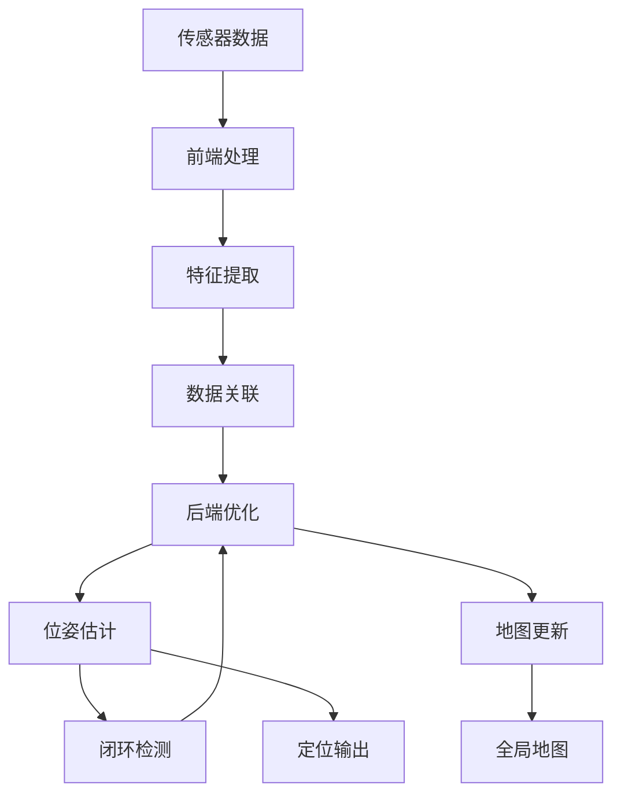
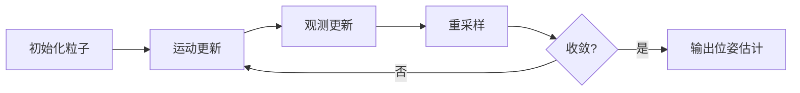

# 22.6 SLAM定位与建图

## 引言

SLAM(Simultaneous Localization and Mapping,同步定位与建图)是移动机器人自主导航的核心技术之一。机器人需要在未知环境中一边构建地图,一边确定自身位置,这本质上是一个"鸡生蛋蛋生鸡"的问题:准确的定位需要精确的地图,而精确的地图又依赖于准确的定位。

本节将深入探讨2D激光SLAM的经典算法,包括粒子滤波定位、占据栅格地图构建、闭环检测等技术,并介绍如何将SLAM集成到机器人控制系统中。

### 本节目标
- 理解SLAM问题的本质与挑战
- 掌握粒子滤波(Monte Carlo Localization)原理
- 学会构建占据栅格地图
- 实现基于激光雷达的2D SLAM系统

## 核心概念

### 1. SLAM问题定义

**贝叶斯形式化**:

给定:
- 运动指令序列 $u_{1:t} = \{u_1, u_2, ..., u_t\}$
- 传感器观测序列 $z_{1:t} = \{z_1, z_2, ..., z_t\}$

求解:
- 机器人位姿轨迹 $x_{1:t} = \{x_1, x_2, ..., x_t\}$
- 环境地图 $m$

目标函数:
$$P(x_{1:t}, m | z_{1:t}, u_{1:t})$$

**SLAM架构**:



### 2. SLAM分类

**按传感器分类**:
- **激光SLAM**: 使用2D/3D激光雷达(精度高,成本高)
- **视觉SLAM**: 使用单目/双目/RGB-D相机(成本低,计算密集)
- **多传感器融合SLAM**: 激光+视觉+IMU

**按方法分类**:
- **基于滤波**: 扩展卡尔曼滤波(EKF-SLAM)、粒子滤波(FastSLAM)
- **基于优化**: 图优化(Graph SLAM)、因子图(g2o)
- **基于深度学习**: CNN特征提取、端到端SLAM

### 3. 粒子滤波定位(MCL)

粒子滤波通过一组带权重的采样粒子表示机器人位姿的概率分布。

**粒子表示**:
$$P(x_t | z_{1:t}, u_{1:t}) \approx \{(x_t^{[i]}, w_t^{[i]})\}_{i=1}^N$$

其中 $x_t^{[i]}$ 是第 $i$ 个粒子的位姿,$w_t^{[i]}$ 是对应权重。

**MCL算法流程**:



## 技术实现

### 1. 粒子滤波定位

**粒子数据结构**:

```java
/**
 * 粒子(机器人位姿假设)
 */
public class Particle {
    private Pose2D pose;      // 位姿(x, y, theta)
    private double weight;    // 权重
    
    public Particle(Pose2D pose, double weight) {
        this.pose = pose;
        this.weight = weight;
    }
    
    public Particle copy() {
        return new Particle(pose.copy(), weight);
    }
    
    // Getters and Setters
    public Pose2D getPose() { return pose; }
    public double getWeight() { return weight; }
    public void setWeight(double weight) { this.weight = weight; }
}

/**
 * 蒙特卡洛定位器
 */
public class MonteCarloLocalizer {
    private List<Particle> particles;
    private int numParticles;
    private OccupancyGrid map;
    private Random random;
    
    // 运动模型噪声参数
    private double alphaTranslation = 0.1;
    private double alphaRotation = 0.1;
    
    // 观测模型参数
    private double zHit = 0.9;      // 击中权重
    private double zRandom = 0.1;   // 随机测量权重
    private double sigmaHit = 0.2;  // 测量噪声标准差
    
    public MonteCarloLocalizer(OccupancyGrid map, int numParticles) {
        this.map = map;
        this.numParticles = numParticles;
        this.particles = new ArrayList<>();
        this.random = new Random();
        
        initializeParticles();
    }
    
    /**
     * 初始化粒子(均匀分布在自由空间)
     */
    private void initializeParticles() {
        for (int i = 0; i < numParticles; i++) {
            Pose2D randomPose = sampleFreeSpacePose();
            particles.add(new Particle(randomPose, 1.0 / numParticles));
        }
    }
    
    /**
     * 在自由空间随机采样位姿
     */
    private Pose2D sampleFreeSpacePose() {
        while (true) {
            double x = map.getMinX() + random.nextDouble() * map.getWidth();
            double y = map.getMinY() + random.nextDouble() * map.getHeight();
            double theta = random.nextDouble() * 2 * Math.PI;
            
            Pose2D pose = new Pose2D(x, y, theta);
            if (map.isFree(pose.getPosition(), 0.2)) {
                return pose;
            }
        }
    }
}
```

**运动更新(预测)**:

```java
/**
 * 运动更新:根据里程计移动粒子
 */
public void motionUpdate(Odometry odom) {
    double dx = odom.getDeltaX();
    double dy = odom.getDeltaY();
    double dtheta = odom.getDeltaTheta();
    
    for (Particle particle : particles) {
        Pose2D pose = particle.getPose();
        
        // 添加运动噪声
        double noisyDx = dx + sampleGaussian(0, alphaTranslation * Math.abs(dx));
        double noisyDy = dy + sampleGaussian(0, alphaTranslation * Math.abs(dy));
        double noisyDtheta = dtheta + sampleGaussian(0, alphaRotation * Math.abs(dtheta));
        
        // 更新粒子位姿
        double newX = pose.getX() + noisyDx * Math.cos(pose.getTheta()) 
                                   - noisyDy * Math.sin(pose.getTheta());
        double newY = pose.getY() + noisyDx * Math.sin(pose.getTheta()) 
                                   + noisyDy * Math.cos(pose.getTheta());
        double newTheta = normalizeAngle(pose.getTheta() + noisyDtheta);
        
        pose.set(newX, newY, newTheta);
    }
}

/**
 * 采样高斯分布
 */
private double sampleGaussian(double mean, double stddev) {
    return mean + random.nextGaussian() * stddev;
}

/**
 * 角度归一化到[-π, π]
 */
private double normalizeAngle(double angle) {
    while (angle > Math.PI) angle -= 2 * Math.PI;
    while (angle < -Math.PI) angle += 2 * Math.PI;
    return angle;
}
```

**观测更新(修正)**:

```java
/**
 * 观测更新:根据激光扫描更新粒子权重
 */
public void observationUpdate(LaserScan scan) {
    double totalWeight = 0.0;
    
    for (Particle particle : particles) {
        // 计算似然权重
        double likelihood = calculateLikelihood(particle.getPose(), scan);
        particle.setWeight(particle.getWeight() * likelihood);
        totalWeight += particle.getWeight();
    }
    
    // 归一化权重
    if (totalWeight > 0) {
        for (Particle particle : particles) {
            particle.setWeight(particle.getWeight() / totalWeight);
        }
    }
}

/**
 * 计算观测似然
 */
private double calculateLikelihood(Pose2D pose, LaserScan scan) {
    double likelihood = 1.0;
    
    // 对激光扫描的每条射线计算似然
    for (int i = 0; i < scan.getRanges().length; i += 10) {  // 每10条取样
        double angle = scan.getAngleMin() + i * scan.getAngleIncrement();
        double measuredRange = scan.getRanges()[i];
        
        // 跳过无效测量
        if (measuredRange < scan.getRangeMin() || 
            measuredRange > scan.getRangeMax()) {
            continue;
        }
        
        // 计算期望测量值(射线投射)
        double expectedRange = rayCast(pose, angle);
        
        // 似然模型:高斯分布
        double diff = measuredRange - expectedRange;
        double pHit = (1.0 / (sigmaHit * Math.sqrt(2 * Math.PI))) *
                      Math.exp(-0.5 * diff * diff / (sigmaHit * sigmaHit));
        double pRandom = 1.0 / scan.getRangeMax();
        
        likelihood *= (zHit * pHit + zRandom * pRandom);
    }
    
    return likelihood;
}

/**
 * 射线投射:计算期望测量距离
 */
private double rayCast(Pose2D pose, double angle) {
    double globalAngle = pose.getTheta() + angle;
    double x = pose.getX();
    double y = pose.getY();
    double dx = Math.cos(globalAngle) * map.getResolution();
    double dy = Math.sin(globalAngle) * map.getResolution();
    
    double maxRange = 10.0;
    for (double r = 0; r < maxRange; r += map.getResolution()) {
        x += dx;
        y += dy;
        
        if (!map.isInBounds(x, y) || map.isOccupied(x, y)) {
            return r;
        }
    }
    
    return maxRange;
}
```

**重采样**:

```java
/**
 * 低方差重采样(Low Variance Resampling)
 */
public void resample() {
    List<Particle> newParticles = new ArrayList<>();
    
    double r = random.nextDouble() / numParticles;
    double c = particles.get(0).getWeight();
    int i = 0;
    
    for (int m = 0; m < numParticles; m++) {
        double u = r + m * (1.0 / numParticles);
        
        while (u > c) {
            i++;
            c += particles.get(i).getWeight();
        }
        
        newParticles.add(particles.get(i).copy());
    }
    
    // 重置权重
    for (Particle particle : newParticles) {
        particle.setWeight(1.0 / numParticles);
    }
    
    particles = newParticles;
}

/**
 * 计算有效粒子数(Effective Sample Size)
 */
private double calculateEffectiveSampleSize() {
    double sumSquaredWeights = 0.0;
    for (Particle particle : particles) {
        sumSquaredWeights += particle.getWeight() * particle.getWeight();
    }
    return 1.0 / sumSquaredWeights;
}

/**
 * 根据有效粒子数决定是否重采样
 */
public void resampleIfNeeded() {
    double neff = calculateEffectiveSampleSize();
    if (neff < numParticles / 2.0) {
        resample();
    }
}

/**
 * 获取位姿估计(加权平均)
 */
public Pose2D getPoseEstimate() {
    double sumX = 0, sumY = 0, sumSinTheta = 0, sumCosTheta = 0;
    
    for (Particle particle : particles) {
        Pose2D pose = particle.getPose();
        double w = particle.getWeight();
        
        sumX += w * pose.getX();
        sumY += w * pose.getY();
        sumSinTheta += w * Math.sin(pose.getTheta());
        sumCosTheta += w * Math.cos(pose.getTheta());
    }
    
    double theta = Math.atan2(sumSinTheta, sumCosTheta);
    return new Pose2D(sumX, sumY, theta);
}
```

### 2. 占据栅格地图构建

```java
/**
 * 占据栅格地图构建器
 */
public class OccupancyGridMapper {
    private OccupancyGrid map;
    private double resolution;
    
    // 对数几率更新参数
    private double lOcc = 0.9;    // 占据时的对数几率增量
    private double lFree = -0.7;  // 自由时的对数几率减量
    
    public OccupancyGridMapper(double resolution, double width, double height) {
        this.resolution = resolution;
        int gridWidth = (int) (width / resolution);
        int gridHeight = (int) (height / resolution);
        this.map = new OccupancyGrid(gridWidth, gridHeight, resolution);
    }
    
    /**
     * 更新地图(逆传感器模型)
     */
    public void updateMap(Pose2D robotPose, LaserScan scan) {
        for (int i = 0; i < scan.getRanges().length; i++) {
            double angle = scan.getAngleMin() + i * scan.getAngleIncrement();
            double range = scan.getRanges()[i];
            
            // 跳过无效测量
            if (range < scan.getRangeMin() || range > scan.getRangeMax()) {
                continue;
            }
            
            // 计算激光终点在全局坐标系中的位置
            double globalAngle = robotPose.getTheta() + angle;
            double endX = robotPose.getX() + range * Math.cos(globalAngle);
            double endY = robotPose.getY() + range * Math.sin(globalAngle);
            
            // 使用Bresenham算法标记射线路径上的栅格为自由
            List<GridCell> rayCells = bresenham(
                robotPose.getX(), robotPose.getY(), endX, endY);
            
            for (int j = 0; j < rayCells.size() - 1; j++) {
                GridCell cell = rayCells.get(j);
                map.updateLogOdds(cell.x, cell.y, lFree);
            }
            
            // 标记终点栅格为占据
            GridCell endCell = rayCells.get(rayCells.size() - 1);
            map.updateLogOdds(endCell.x, endCell.y, lOcc);
        }
    }
    
    /**
     * Bresenham直线算法
     */
    private List<GridCell> bresenham(double x0, double y0, double x1, double y1) {
        List<GridCell> cells = new ArrayList<>();
        
        int gx0 = map.worldToGridX(x0);
        int gy0 = map.worldToGridY(y0);
        int gx1 = map.worldToGridX(x1);
        int gy1 = map.worldToGridY(y1);
        
        int dx = Math.abs(gx1 - gx0);
        int dy = Math.abs(gy1 - gy0);
        int sx = gx0 < gx1 ? 1 : -1;
        int sy = gy0 < gy1 ? 1 : -1;
        int err = dx - dy;
        
        int x = gx0, y = gy0;
        
        while (true) {
            cells.add(new GridCell(x, y));
            
            if (x == gx1 && y == gy1) break;
            
            int e2 = 2 * err;
            if (e2 > -dy) {
                err -= dy;
                x += sx;
            }
            if (e2 < dx) {
                err += dx;
                y += sy;
            }
        }
        
        return cells;
    }
    
    /**
     * 栅格单元
     */
    private static class GridCell {
        int x, y;
        GridCell(int x, int y) {
            this.x = x;
            this.y = y;
        }
    }
}

/**
 * 占据栅格地图(扩展支持对数几率)
 */
public class OccupancyGrid {
    private double[][] logOdds;  // 对数几率值
    private int width, height;
    private double resolution;
    
    public OccupancyGrid(int width, int height, double resolution) {
        this.width = width;
        this.height = height;
        this.resolution = resolution;
        this.logOdds = new double[width][height];
        // 初始化为0(未知,概率0.5)
    }
    
    /**
     * 更新对数几率
     */
    public void updateLogOdds(int x, int y, double delta) {
        if (isInBounds(x, y)) {
            logOdds[x][y] += delta;
            // 限制范围避免溢出
            logOdds[x][y] = Math.max(-10, Math.min(10, logOdds[x][y]));
        }
    }
    
    /**
     * 获取占据概率
     */
    public double getOccupancyProbability(int x, int y) {
        if (!isInBounds(x, y)) return 0.5;
        return 1.0 / (1.0 + Math.exp(-logOdds[x][y]));
    }
    
    /**
     * 判断是否占据
     */
    public boolean isOccupied(int x, int y) {
        return getOccupancyProbability(x, y) > 0.65;
    }
    
    /**
     * 判断是否自由
     */
    public boolean isFree(int x, int y) {
        return getOccupancyProbability(x, y) < 0.35;
    }
    
    public boolean isInBounds(int x, int y) {
        return x >= 0 && x < width && y >= 0 && y < height;
    }
}
```

### 3. 完整SLAM系统集成

```java
/**
 * 2D激光SLAM系统
 */
public class LaserSLAM {
    private MonteCarloLocalizer localizer;
    private OccupancyGridMapper mapper;
    private OccupancyGrid map;
    private Pose2D currentPose;
    private Odometry lastOdometry;
    
    public LaserSLAM(double mapWidth, double mapHeight, double resolution) {
        // 初始化地图
        this.map = new OccupancyGrid(
            (int)(mapWidth / resolution),
            (int)(mapHeight / resolution),
            resolution);
        
        // 初始化定位器
        this.localizer = new MonteCarloLocalizer(map, 1000);
        
        // 初始化建图器
        this.mapper = new OccupancyGridMapper(resolution, mapWidth, mapHeight);
        
        // 初始位姿
        this.currentPose = new Pose2D(0, 0, 0);
    }
    
    /**
     * SLAM主循环
     */
    public void update(Odometry odom, LaserScan scan) {
        // 1. 运动更新
        if (lastOdometry != null) {
            Odometry deltaOdom = odom.subtract(lastOdometry);
            localizer.motionUpdate(deltaOdom);
        }
        lastOdometry = odom;
        
        // 2. 观测更新
        localizer.observationUpdate(scan);
        
        // 3. 重采样
        localizer.resampleIfNeeded();
        
        // 4. 获取位姿估计
        currentPose = localizer.getPoseEstimate();
        
        // 5. 更新地图
        mapper.updateMap(currentPose, scan);
        map = mapper.getMap();
        
        // 6. 使用更新后的地图更新定位器
        localizer.setMap(map);
    }
    
    /**
     * 获取当前位姿估计
     */
    public Pose2D getCurrentPose() {
        return currentPose;
    }
    
    /**
     * 获取当前地图
     */
    public OccupancyGrid getMap() {
        return map;
    }
    
    /**
     * 保存地图到文件
     */
    public void saveMap(String filename) {
        // PGM格式保存
        try (PrintWriter writer = new PrintWriter(filename)) {
            writer.println("P2");
            writer.println(map.getWidth() + " " + map.getHeight());
            writer.println("255");
            
            for (int y = map.getHeight() - 1; y >= 0; y--) {
                for (int x = 0; x < map.getWidth(); x++) {
                    double prob = map.getOccupancyProbability(x, y);
                    int value = (int)((1.0 - prob) * 255);
                    writer.print(value + " ");
                }
                writer.println();
            }
        } catch (Exception e) {
            e.printStackTrace();
        }
    }
}
```

### 4. 闭环检测

```java
/**
 * 简单的闭环检测器(基于距离)
 */
public class LoopClosureDetector {
    private List<Pose2D> keyFrames;
    private double distanceThreshold = 1.0;  // 米
    
    public LoopClosureDetector() {
        this.keyFrames = new ArrayList<>();
    }
    
    /**
     * 添加关键帧
     */
    public void addKeyFrame(Pose2D pose) {
        keyFrames.add(pose.copy());
    }
    
    /**
     * 检测闭环
     */
    public Pose2D detectLoop(Pose2D currentPose) {
        // 跳过最近的关键帧(至少间隔10帧)
        int startIdx = Math.max(0, keyFrames.size() - 10);
        
        for (int i = 0; i < startIdx; i++) {
            Pose2D keyFrame = keyFrames.get(i);
            double distance = currentPose.getPosition()
                .distance(keyFrame.getPosition());
            
            if (distance < distanceThreshold) {
                System.out.println("检测到闭环! 当前位置与关键帧 " + 
                                  i + " 接近");
                return keyFrame;
            }
        }
        
        return null;
    }
}
```

## 性能分析

### 1. 算法复杂度

| 组件 | 时间复杂度 | 空间复杂度 | 说明 |
|------|-----------|-----------|------|
| MCL运动更新 | O(N) | O(N) | N为粒子数 |
| MCL观测更新 | O(N×M) | O(N) | M为激光射线数 |
| 地图更新 | O(M×K) | O(W×H) | K为射线长度,W×H为地图尺寸 |
| 重采样 | O(N) | O(N) | 低方差重采样 |

### 2. 参数调优建议

**粒子数选择**:
```
简单环境: 100-500粒子
中等环境: 500-2000粒子
复杂环境: 2000-5000粒子
```

**地图分辨率**:
```
室内环境: 0.05-0.1米
室外环境: 0.2-0.5米
```

### 3. 性能优化

**并行化粒子更新**:
```java
public void observationUpdateParallel(LaserScan scan) {
    particles.parallelStream().forEach(particle -> {
        double likelihood = calculateLikelihood(particle.getPose(), scan);
        particle.setWeight(particle.getWeight() * likelihood);
    });
    
    // 归一化权重
    normalizeWeights();
}
```

**激光降采样**:
```java
// 每10条射线采样1条
for (int i = 0; i < scan.getRanges().length; i += 10) {
    // 处理射线...
}
```

## 常见问题

### Q1: 定位发散怎么办?

**解答**: 采用自适应粒子数和全局定位恢复:

```java
public void globalLocalization() {
    // 重新随机初始化粒子
    particles.clear();
    initializeParticles();
    System.out.println("触发全局定位");
}

// 检测定位置信度
public boolean isLocalizationConfident() {
    double variance = calculatePoseVariance();
    return variance < 0.5;  // 阈值
}
```

### Q2: 地图漂移如何解决?

**解答**: 使用闭环检测和图优化:

```java
// 检测到闭环后调整轨迹
public void correctTrajectory(Pose2D loopPose, Pose2D currentPose) {
    Pose2D error = currentPose.subtract(loopPose);
    
    // 将误差分布到轨迹上
    for (Pose2D pose : trajectory) {
        pose.adjust(error.scale(0.1));  // 平滑调整
    }
}
```

### Q3: 动态障碍物影响?

**解答**: 使用移动对象滤波:

```java
public void filterDynamicObjects(LaserScan currentScan, LaserScan previousScan) {
    for (int i = 0; i < currentScan.getRanges().length; i++) {
        double diff = Math.abs(currentScan.getRanges()[i] - 
                              previousScan.getRanges()[i]);
        
        if (diff > 0.5) {
            // 测量变化大,可能是动态障碍物,忽略
            currentScan.getRanges()[i] = Float.NaN;
        }
    }
}
```

## 小节总结

本节深入探讨了2D激光SLAM的核心技术:

1. **粒子滤波定位**: 实现了MCL算法的完整流程,包括运动更新、观测更新、重采样
2. **占据栅格建图**: 基于对数几率的地图更新,使用Bresenham算法进行射线投射
3. **SLAM系统集成**: 将定位和建图模块整合,实现同步定位与建图
4. **闭环检测**: 基于距离的简单闭环检测,防止地图漂移

**关键要点**:
- MCL使用粒子集表示位姿概率分布,鲁棒性强
- 对数几率地图更新避免概率相乘的数值问题
- 重采样防止粒子退化,维持多样性
- 闭环检测是长时间SLAM的关键

下一节将进行综合项目:扫地机器人系统,整合本章所有技术。

## 思考题

1. **粒子退化**: 为什么需要重采样?如何判断粒子退化的程度?

2. **绑架问题**: 如果机器人被人为移动到新位置,如何检测并恢复定位?

3. **对称环境**: 在走廊等对称环境中,MCL容易产生多峰分布,如何解决?

4. **3D SLAM**: 如果扩展到3D环境,需要修改哪些部分?

5. **视觉SLAM**: 与激光SLAM相比,视觉SLAM有哪些优缺点?

## 拓展阅读

1. **经典论文**:
   - Thrun, S., et al. "Probabilistic Robotics" (2005) - SLAM经典教材
   - Grisetti, G., et al. "Improved Techniques for Grid Mapping with Rao-Blackwellized Particle Filters" (2007)

2. **开源项目**:
   - `gmapping`: ROS中经典的2D SLAM包
   - `cartographer`: Google的实时SLAM系统
   - `hector_slam`: 无需里程计的SLAM

3. **进阶主题**:
   - 图优化SLAM(g2o, Ceres)
   - 视觉SLAM(ORB-SLAM, VINS)
   - 多机器人协同SLAM
   - 语义SLAM(结合目标检测)
