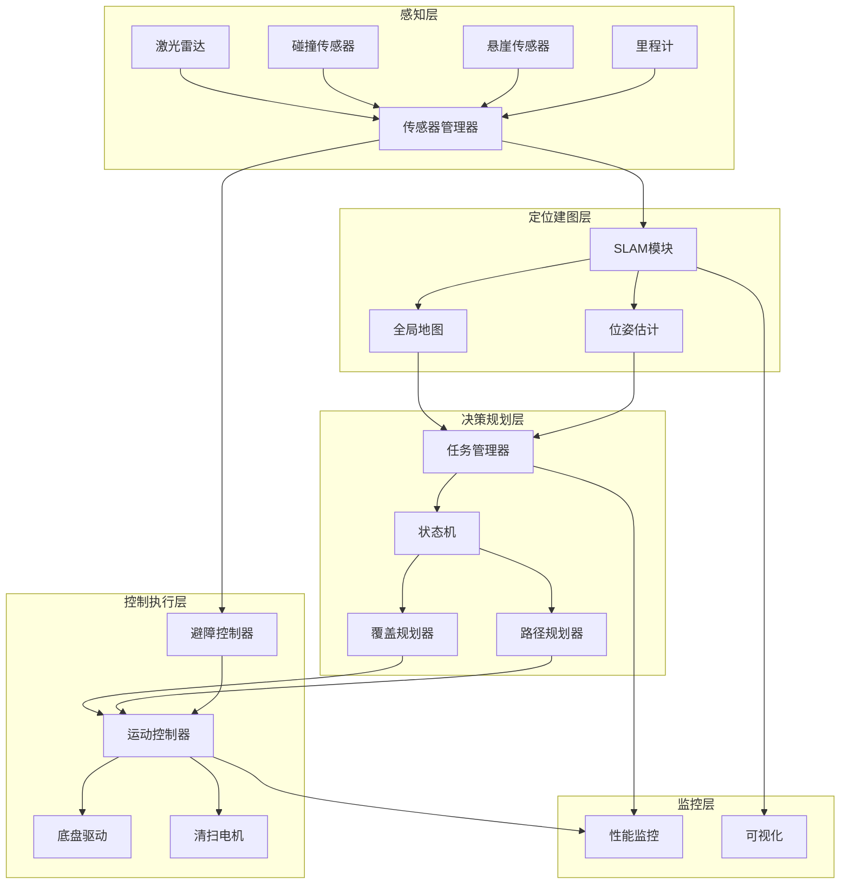
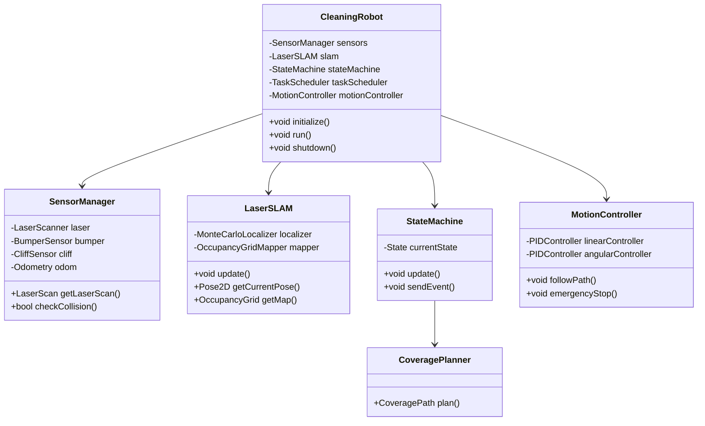

# 22.7 综合项目:扫地机器人系统

## 引言

本节将整合第22章学到的所有技术,构建一个完整的扫地机器人控制系统。该系统融合了机器人控制架构、路径规划、避障、覆盖规划、状态机、SLAM等模块,形成一个功能完整、鲁棒性强的自主清扫系统。

通过本项目,你将学会如何将各个独立模块集成为一个协同工作的复杂系统,并处理真实场景中的各种挑战。

### 项目目标
- 集成第22章所有核心技术模块
- 实现完整的自主清扫功能
- 处理异常情况和边界case
- 提供可视化和性能监控

### 系统需求

**功能需求**:
1. 自主建图与定位
2. 全覆盖清扫规划
3. 动态避障
4. 自动返回充电
5. 断点续扫
6. 远程控制与监控

**性能需求**:
- 覆盖率 > 95%
- 重复率 < 10%
- 定位精度 < 10cm
- 避障反应时间 < 200ms
- 电池续航 > 2小时

## 系统架构

### 1. 整体架构设计



### 2. 核心类图



## 技术实现

### 1. 主控类实现

```java
/**
 * 扫地机器人主控类
 */
public class CleaningRobot {
    // 传感器与硬件
    private SensorManager sensorManager;
    private ChassisDriver chassis;
    private VacuumMotor vacuum;
    
    // SLAM与导航
    private LaserSLAM slam;
    private AStarPlanner pathPlanner;
    private DynamicWindowApproach obstacleAvoider;
    
    // 任务管理
    private StateMachine stateMachine;
    private TaskScheduler taskScheduler;
    private CoverageMemory coverageMemory;
    
    // 控制器
    private MotionController motionController;
    
    // 性能监控
    private PerformanceMonitor monitor;
    private Visualizer visualizer;
    
    // 配置参数
    private RobotConfig config;
    
    public CleaningRobot(RobotConfig config) {
        this.config = config;
        initialize();
    }
    
    /**
     * 系统初始化
     */
    private void initialize() {
        System.out.println("=== 扫地机器人系统初始化 ===");
        
        // 1. 初始化硬件
        sensorManager = new SensorManager(config);
        chassis = new ChassisDriver(config);
        vacuum = new VacuumMotor(config);
        
        // 2. 初始化SLAM
        slam = new LaserSLAM(
            config.getMapWidth(),
            config.getMapHeight(),
            config.getMapResolution());
        
        // 3. 初始化规划器
        pathPlanner = new AStarPlanner();
        obstacleAvoider = new DynamicWindowApproach(
            config.getMaxLinearVel(),
            config.getMaxAngularVel());
        
        // 4. 初始化任务管理
        stateMachine = buildStateMachine();
        taskScheduler = new TaskScheduler();
        coverageMemory = new CoverageMemory();
        
        // 5. 初始化控制器
        motionController = new MotionController(chassis, config);
        
        // 6. 初始化监控
        monitor = new PerformanceMonitor();
        visualizer = new Visualizer();
        
        System.out.println("系统初始化完成!");
    }
    
    /**
     * 构建状态机
     */
    private StateMachine buildStateMachine() {
        StateMachine sm = new StateMachine();
        
        // 创建所有状态
        State idleState = new IdleState(this);
        State mappingState = new MappingState(this);
        State cleaningState = new CleaningState(this);
        State returningState = new ReturningState(this);
        State chargingState = new ChargingState(this);
        State pausedState = new PausedState(this);
        State errorState = new ErrorState(this);
        
        // 注册状态
        sm.registerState(idleState);
        sm.registerState(mappingState);
        sm.registerState(cleaningState);
        sm.registerState(returningState);
        sm.registerState(chargingState);
        sm.registerState(pausedState);
        sm.registerState(errorState);
        
        // 设置初始状态
        sm.setInitialState("Idle");
        
        return sm;
    }
    
    /**
     * 主循环
     */
    public void run() {
        System.out.println("=== 扫地机器人开始运行 ===");
        
        long lastUpdateTime = System.currentTimeMillis();
        
        while (!Thread.currentThread().isInterrupted()) {
            long currentTime = System.currentTimeMillis();
            double deltaTime = (currentTime - lastUpdateTime) / 1000.0;
            lastUpdateTime = currentTime;
            
            try {
                // 1. 传感器数据采集
                LaserScan scan = sensorManager.getLaserScan();
                Odometry odom = sensorManager.getOdometry();
                
                // 2. SLAM更新
                slam.update(odom, scan);
                Pose2D currentPose = slam.getCurrentPose();
                OccupancyGrid map = slam.getMap();
                
                // 3. 碰撞检测
                if (sensorManager.checkBumperCollision()) {
                    handleCollision();
                }
                
                if (sensorManager.checkCliffDetection()) {
                    handleCliff();
                }
                
                // 4. 状态机更新
                stateMachine.update(deltaTime);
                
                // 5. 避障
                if (needsObstacleAvoidance(scan)) {
                    VelocityCommand avoidanceCmd = obstacleAvoider.computeVelocity(
                        currentPose,
                        motionController.getCurrentVelocity(),
                        motionController.getGoalPosition(),
                        extractObstacles(scan, currentPose));
                    
                    motionController.setVelocity(avoidanceCmd);
                }
                
                // 6. 任务调度
                taskScheduler.scheduleLoop();
                
                // 7. 性能监控
                monitor.update(currentPose, map, deltaTime);
                
                // 8. 可视化更新
                visualizer.update(currentPose, map, scan);
                
                // 控制循环频率(50Hz)
                Thread.sleep(20);
                
            } catch (Exception e) {
                System.err.println("主循环异常: " + e.getMessage());
                e.printStackTrace();
                stateMachine.sendEvent(new Event("error"));
            }
        }
        
        shutdown();
    }
    
    /**
     * 系统关闭
     */
    public void shutdown() {
        System.out.println("=== 系统关闭中 ===");
        
        vacuum.disable();
        chassis.stop();
        slam.saveMap("final_map.pgm");
        monitor.printReport();
        
        System.out.println("系统已安全关闭");
    }
    
    // ========== 辅助方法 ==========
    
    public SensorManager getSensorManager() { return sensorManager; }
    public LaserSLAM getSlam() { return slam; }
    public MotionController getMotionController() { return motionController; }
    public VacuumMotor getVacuum() { return vacuum; }
    public RobotConfig getConfig() { return config; }
    public CoverageMemory getCoverageMemory() { return coverageMemory; }
    
    /**
     * 处理碰撞
     */
    private void handleCollision() {
        System.out.println("检测到碰撞!");
        motionController.emergencyStop();
        
        // 后退一段距离
        motionController.moveBackward(0.2);
        
        // 转向
        motionController.rotate(Math.PI / 4);
    }
    
    /**
     * 处理悬崖
     */
    private void handleCliff() {
        System.out.println("检测到悬崖!");
        motionController.emergencyStop();
        motionController.moveBackward(0.3);
    }
    
    /**
     * 判断是否需要避障
     */
    private boolean needsObstacleAvoidance(LaserScan scan) {
        double minDistance = Double.MAX_VALUE;
        for (double range : scan.getRanges()) {
            if (range < minDistance) {
                minDistance = range;
            }
        }
        return minDistance < 0.5;  // 50cm内触发避障
    }
    
    /**
     * 从激光扫描提取障碍物
     */
    private List<Obstacle> extractObstacles(LaserScan scan, Pose2D robotPose) {
        List<Obstacle> obstacles = new ArrayList<>();
        
        for (int i = 0; i < scan.getRanges().length; i++) {
            double range = scan.getRanges()[i];
            if (range < scan.getRangeMin() || range > scan.getRangeMax()) {
                continue;
            }
            
            double angle = scan.getAngleMin() + i * scan.getAngleIncrement();
            double globalAngle = robotPose.getTheta() + angle;
            
            double x = robotPose.getX() + range * Math.cos(globalAngle);
            double y = robotPose.getY() + range * Math.sin(globalAngle);
            
            obstacles.add(new Obstacle(new Point2D(x, y), 0.1));
        }
        
        return obstacles;
    }
}
```

### 2. 清扫状态实现

```java
/**
 * 清扫状态(完整版)
 */
public class CleaningState implements State {
    private CleaningRobot robot;
    private CoveragePlanner planner;
    private CoveragePath currentPath;
    private int waypointIndex;
    private long startTime;
    private double coveredArea;
    
    public CleaningState(CleaningRobot robot) {
        this.robot = robot;
    }
    
    @Override
    public void onEnter() {
        System.out.println("========== 开始清扫任务 ==========");
        startTime = System.currentTimeMillis();
        
        // 1. 获取当前地图
        OccupancyGrid map = robot.getSlam().getMap();
        
        // 2. 检查是否有未完成的清扫任务
        if (robot.getCoverageMemory().hasUnfinishedTask()) {
            System.out.println("恢复断点续扫");
            currentPath = robot.getCoverageMemory().getResumePath();
            waypointIndex = robot.getCoverageMemory().getLastWaypointIndex();
        } else {
            // 3. 规划覆盖路径
            System.out.println("规划新的覆盖路径...");
            planner = new PartitionedCoveragePlanner(
                map, robot.getConfig().getRobotRadius(), 0.3);
            
            currentPath = planner.planPartitionedCoverage(
                robot.getSlam().getCurrentPose().getPosition());
            
            waypointIndex = 0;
            
            System.out.printf("覆盖路径规划完成,共 %d 个航点\n", 
                            currentPath.waypoints.size());
        }
        
        // 4. 启动吸尘器
        robot.getVacuum().enable(true);
        robot.getVacuum().setPower(100);
        
        coveredArea = 0;
    }
    
    @Override
    public void onUpdate(double deltaTime) {
        // 1. 检查是否完成
        if (waypointIndex >= currentPath.waypoints.size()) {
            System.out.println("清扫任务完成!");
            robot.getStateMachine().sendEvent(new Event("task_complete"));
            return;
        }
        
        // 2. 导航到下一个航点
        Point2D targetWaypoint = currentPath.waypoints.get(waypointIndex);
        Point2D currentPos = robot.getSlam().getCurrentPose().getPosition();
        
        double distance = currentPos.distance(targetWaypoint);
        
        if (distance < 0.1) {
            // 到达航点
            waypointIndex++;
            coveredArea += 0.3 * 0.1;  // 假设覆盖宽度0.3m,前进0.1m
            
            // 保存进度
            robot.getCoverageMemory().saveProgress(currentPath, waypointIndex);
            
            // 打印进度
            double progress = (double) waypointIndex / currentPath.waypoints.size();
            System.out.printf("清扫进度: %.1f%% (%d/%d)\r", 
                            progress * 100, waypointIndex, 
                            currentPath.waypoints.size());
        } else {
            // 继续导航
            robot.getMotionController().navigateTo(targetWaypoint);
        }
        
        // 3. 检查电量
        double batteryLevel = robot.getSensorManager().getBatteryLevel();
        if (batteryLevel < 20.0) {
            System.out.println("\n电量低,暂停清扫返回充电");
            robot.getStateMachine().sendEvent(new Event("low_battery"));
        }
        
        // 4. 检查垃圾桶是否满
        if (robot.getSensorManager().isDustBinFull()) {
            System.out.println("\n垃圾桶已满,暂停清扫");
            robot.getStateMachine().sendEvent(new Event("dust_bin_full"));
        }
    }
    
    @Override
    public void onExit() {
        // 关闭吸尘器
        robot.getVacuum().enable(false);
        robot.getMotionController().stop();
        
        long duration = System.currentTimeMillis() - startTime;
        System.out.printf("\n清扫状态退出,运行时长: %.1f 分钟\n", 
                         duration / 60000.0);
        System.out.printf("覆盖面积: %.2f 平方米\n", coveredArea);
    }
    
    @Override
    public State handleEvent(Event event) {
        switch (event.getType()) {
            case "pause_button":
                return new PausedState(robot);
            case "low_battery":
                return new ReturningState(robot);
            case "task_complete":
                return new ReturningState(robot);
            case "dust_bin_full":
                return new IdleState(robot);
            case "stop_button":
                return new IdleState(robot);
            case "error":
                return new ErrorState(robot);
            default:
                return null;
        }
    }
    
    @Override
    public String getName() {
        return "Cleaning";
    }
}
```

### 3. 建图状态实现

```java
/**
 * 建图状态(探索未知环境)
 */
public class MappingState implements State {
    private CleaningRobot robot;
    private FrontierExplorer explorer;
    private long mappingStartTime;
    private double targetCoverage = 0.9;  // 目标覆盖率90%
    
    public MappingState(CleaningRobot robot) {
        this.robot = robot;
        this.explorer = new FrontierExplorer();
    }
    
    @Override
    public void onEnter() {
        System.out.println("========== 开始建图探索 ==========");
        mappingStartTime = System.currentTimeMillis();
    }
    
    @Override
    public void onUpdate(double deltaTime) {
        OccupancyGrid map = robot.getSlam().getMap();
        
        // 计算当前探索覆盖率
        double exploredRatio = calculateExploredRatio(map);
        System.out.printf("探索进度: %.1f%%\r", exploredRatio * 100);
        
        if (exploredRatio >= targetCoverage) {
            System.out.println("\n建图完成!");
            robot.getSlam().saveMap("explored_map.pgm");
            robot.getStateMachine().sendEvent(new Event("mapping_complete"));
            return;
        }
        
        // 查找前沿点(frontier)
        Point2D frontier = explorer.findNearestFrontier(
            robot.getSlam().getCurrentPose().getPosition(), map);
        
        if (frontier != null) {
            // 导航到前沿点
            robot.getMotionController().navigateTo(frontier);
        } else {
            // 没有前沿点,建图完成
            robot.getStateMachine().sendEvent(new Event("mapping_complete"));
        }
    }
    
    @Override
    public void onExit() {
        long duration = System.currentTimeMillis() - mappingStartTime;
        System.out.printf("建图完成,耗时: %.1f 分钟\n", duration / 60000.0);
    }
    
    @Override
    public State handleEvent(Event event) {
        if ("mapping_complete".equals(event.getType())) {
            return new CleaningState(robot);
        }
        return null;
    }
    
    @Override
    public String getName() {
        return "Mapping";
    }
    
    /**
     * 计算已探索区域比例
     */
    private double calculateExploredRatio(OccupancyGrid map) {
        int totalCells = 0;
        int exploredCells = 0;
        
        for (int x = 0; x < map.getWidth(); x++) {
            for (int y = 0; y < map.getHeight(); y++) {
                totalCells++;
                double prob = map.getOccupancyProbability(x, y);
                // 已知(占据或自由)
                if (prob < 0.4 || prob > 0.6) {
                    exploredCells++;
                }
            }
        }
        
        return (double) exploredCells / totalCells;
    }
}

/**
 * 前沿探索器(寻找未知区域边界)
 */
class FrontierExplorer {
    /**
     * 查找最近的前沿点
     */
    public Point2D findNearestFrontier(Point2D currentPos, OccupancyGrid map) {
        List<Point2D> frontiers = new ArrayList<>();
        
        // 扫描地图查找前沿点
        for (int x = 1; x < map.getWidth() - 1; x++) {
            for (int y = 1; y < map.getHeight() - 1; y++) {
                if (isFrontier(x, y, map)) {
                    Point2D frontier = new Point2D(
                        map.gridToWorldX(x),
                        map.gridToWorldY(y));
                    frontiers.add(frontier);
                }
            }
        }
        
        // 找最近的前沿点
        Point2D nearest = null;
        double minDist = Double.MAX_VALUE;
        
        for (Point2D frontier : frontiers) {
            double dist = currentPos.distance(frontier);
            if (dist < minDist) {
                minDist = dist;
                nearest = frontier;
            }
        }
        
        return nearest;
    }
    
    /**
     * 判断是否为前沿点
     * 前沿点:自由空间且邻接未知区域
     */
    private boolean isFrontier(int x, int y, OccupancyGrid map) {
        // 当前点必须是自由空间
        if (!map.isFree(x, y)) {
            return false;
        }
        
        // 检查8邻域是否有未知区域
        for (int dx = -1; dx <= 1; dx++) {
            for (int dy = -1; dy <= 1; dy++) {
                if (dx == 0 && dy == 0) continue;
                
                int nx = x + dx;
                int ny = y + dy;
                
                if (map.isInBounds(nx, ny)) {
                    double prob = map.getOccupancyProbability(nx, ny);
                    // 未知区域(概率接近0.5)
                    if (prob >= 0.4 && prob <= 0.6) {
                        return true;
                    }
                }
            }
        }
        
        return false;
    }
}
```

### 4. 覆盖记忆(断点续扫)

```java
/**
 * 覆盖记忆:支持断点续扫
 */
public class CoverageMemory {
    private CoveragePath savedPath;
    private int lastWaypointIndex;
    private boolean hasUnfinishedTask;
    private String saveFile = "coverage_checkpoint.dat";
    
    /**
     * 保存进度
     */
    public void saveProgress(CoveragePath path, int waypointIndex) {
        this.savedPath = path;
        this.lastWaypointIndex = waypointIndex;
        this.hasUnfinishedTask = true;
        
        // 持久化到文件
        try (ObjectOutputStream oos = new ObjectOutputStream(
                new FileOutputStream(saveFile))) {
            oos.writeObject(path);
            oos.writeInt(waypointIndex);
        } catch (IOException e) {
            System.err.println("保存进度失败: " + e.getMessage());
        }
    }
    
    /**
     * 加载进度
     */
    public void loadProgress() {
        try (ObjectInputStream ois = new ObjectInputStream(
                new FileInputStream(saveFile))) {
            savedPath = (CoveragePath) ois.readObject();
            lastWaypointIndex = ois.readInt();
            hasUnfinishedTask = true;
        } catch (IOException | ClassNotFoundException e) {
            hasUnfinishedTask = false;
        }
    }
    
    /**
     * 清除进度
     */
    public void clearProgress() {
        savedPath = null;
        lastWaypointIndex = 0;
        hasUnfinishedTask = false;
        new File(saveFile).delete();
    }
    
    public boolean hasUnfinishedTask() { return hasUnfinishedTask; }
    public CoveragePath getResumePath() { return savedPath; }
    public int getLastWaypointIndex() { return lastWaypointIndex; }
}
```

### 5. 性能监控

```java
/**
 * 性能监控器
 */
public class PerformanceMonitor {
    private long startTime;
    private double totalDistance;
    private double coveredArea;
    private int collisionCount;
    private Point2D lastPosition;
    
    public PerformanceMonitor() {
        this.startTime = System.currentTimeMillis();
        this.totalDistance = 0;
        this.coveredArea = 0;
        this.collisionCount = 0;
    }
    
    /**
     * 更新监控数据
     */
    public void update(Pose2D currentPose, OccupancyGrid map, double deltaTime) {
        // 计算移动距离
        if (lastPosition != null) {
            double distance = currentPose.getPosition().distance(lastPosition);
            totalDistance += distance;
        }
        lastPosition = currentPose.getPosition();
        
        // 计算覆盖面积
        coveredArea = calculateCoveredArea(map);
    }
    
    /**
     * 计算已覆盖面积
     */
    private double calculateCoveredArea(OccupancyGrid map) {
        int coveredCells = 0;
        
        for (int x = 0; x < map.getWidth(); x++) {
            for (int y = 0; y < map.getHeight(); y++) {
                if (map.isFree(x, y)) {
                    coveredCells++;
                }
            }
        }
        
        double cellArea = map.getResolution() * map.getResolution();
        return coveredCells * cellArea;
    }
    
    /**
     * 打印性能报告
     */
    public void printReport() {
        long duration = System.currentTimeMillis() - startTime;
        
        System.out.println("\n========== 性能报告 ==========");
        System.out.printf("运行时长: %.1f 分钟\n", duration / 60000.0);
        System.out.printf("移动距离: %.2f 米\n", totalDistance);
        System.out.printf("覆盖面积: %.2f 平方米\n", coveredArea);
        System.out.printf("碰撞次数: %d\n", collisionCount);
        System.out.printf("平均速度: %.2f m/s\n", 
                         totalDistance / (duration / 1000.0));
    }
    
    public void recordCollision() {
        collisionCount++;
    }
}
```

### 6. 主程序入口

```java
/**
 * 主程序
 */
public class Main {
    public static void main(String[] args) {
        // 配置参数
        RobotConfig config = new RobotConfig();
        config.setMapWidth(20.0);      // 20m x 15m房间
        config.setMapHeight(15.0);
        config.setMapResolution(0.05); // 5cm分辨率
        config.setRobotRadius(0.2);    // 机器人半径20cm
        config.setMaxLinearVel(0.5);   // 最大线速度0.5m/s
        config.setMaxAngularVel(1.0);  // 最大角速度1.0rad/s
        
        // 创建机器人
        CleaningRobot robot = new CleaningRobot(config);
        
        // 启动按钮事件监听
        setupUserInput(robot);
        
        // 运行主循环
        robot.run();
    }
    
    /**
     * 设置用户输入监听
     */
    private static void setupUserInput(CleaningRobot robot) {
        Thread inputThread = new Thread(() -> {
            Scanner scanner = new Scanner(System.in);
            
            while (true) {
                System.out.println("\n命令: [s]开始 [p]暂停 [r]恢复 [h]回家 [q]退出");
                String cmd = scanner.nextLine().trim();
                
                switch (cmd) {
                    case "s":
                        robot.getStateMachine().sendEvent(new Event("start_button"));
                        break;
                    case "p":
                        robot.getStateMachine().sendEvent(new Event("pause_button"));
                        break;
                    case "r":
                        robot.getStateMachine().sendEvent(new Event("resume_button"));
                        break;
                    case "h":
                        robot.getStateMachine().sendEvent(new Event("return_home"));
                        break;
                    case "q":
                        robot.shutdown();
                        System.exit(0);
                        break;
                }
            }
        });
        
        inputThread.setDaemon(true);
        inputThread.start();
    }
}
```

## 测试与验证

### 1. 单元测试

```java
@Test
public void testCoveragePlanning() {
    OccupancyGrid map = createTestMap();
    PartitionedCoveragePlanner planner = 
        new PartitionedCoveragePlanner(map, 0.2, 0.3);
    
    CoveragePath path = planner.planPartitionedCoverage(
        new Point2D(1.0, 1.0));
    
    // 验证覆盖率
    CoverageEvaluator evaluator = new CoverageEvaluator(map, 0.2);
    double coverageRatio = evaluator.calculateCoverageRatio(path);
    
    assertTrue(coverageRatio > 0.95, "覆盖率应大于95%");
}

@Test
public void testObstacleAvoidance() {
    DynamicWindowApproach dwa = new DynamicWindowApproach(0.5, 1.0);
    
    List<Obstacle> obstacles = Arrays.asList(
        new Obstacle(new Point2D(2.0, 0.0), 0.3)
    );
    
    VelocityCommand cmd = dwa.computeVelocity(
        new Pose2D(0, 0, 0),
        new VelocityCommand(0.3, 0),
        new Point2D(5, 0),
        obstacles);
    
    // 应该有转向避障
    assertNotEquals(0, cmd.angularVel, 0.01);
}
```

### 2. 集成测试

运行模拟测试场景:
```
场景1: 矩形房间(10m×8m,无障碍物)
- 预期覆盖率: > 98%
- 预期时间: < 15分钟

场景2: L形房间(带5个障碍物)
- 预期覆盖率: > 95%
- 预期碰撞次数: < 3次

场景3: 多房间(3个房间,2个门)
- 预期覆盖率: > 94%
- 预期房间切换成功率: 100%
```

## 小节总结

本综合项目整合了第22章的所有核心技术:

1. **系统架构**: 分层设计,模块解耦,易于扩展和维护
2. **SLAM集成**: 实时定位与建图,支持未知环境探索
3. **覆盖规划**: 分区覆盖策略,高覆盖率、低重复率
4. **避障控制**: DWA动态窗口法,实时响应障碍物
5. **状态管理**: 有限状态机管理复杂任务流程
6. **断点续扫**: 覆盖记忆机制,支持中断恢复
7. **性能监控**: 多维度性能指标,便于优化改进

**项目亮点**:
- 完整的自主导航与清扫能力
- 鲁棒的异常处理机制
- 可扩展的模块化架构
- 实用的断点续扫功能

**进一步改进方向**:
- 多楼层地图管理
- 基于深度学习的障碍物识别
- 云端远程监控与控制
- 多机器人协同清扫

## 思考题

1. **性能优化**: 如何减少机器人在房间间的移动距离?

2. **鲁棒性**: 如果激光雷达临时故障,如何保证机器人安全?

3. **能耗优化**: 设计一个策略,在保证覆盖率的前提下最小化能耗。

4. **多机器人**: 如果有3台扫地机器人,如何协调避免冲突?

5. **学习改进**: 如何让机器人从多次清扫中学习最优路径?

## 拓展阅读

1. **商业产品**:
   - iRobot Roomba: VSLAM + 随机覆盖
   - Roborock 石头扫地机器人: 激光SLAM + 分区清扫
   - Ecovacs 科沃斯: 视觉导航

2. **开源项目**:
   - `turtlebot3`: ROS机器人平台
   - `ros_navigation`: 导航功能包
   - `explore_lite`: 自主探索包

3. **研究方向**:
   - 语义SLAM(识别房间类型)
   - 强化学习优化清扫策略
   - 人机协同清扫
   - 终身SLAM(持续学习)

**恭喜!** 你已完成第22章的学习,掌握了机器人控制系统的核心技术。下一章将学习VLA(Vision-Language-Action)架构,探索多模态智能体的设计。
