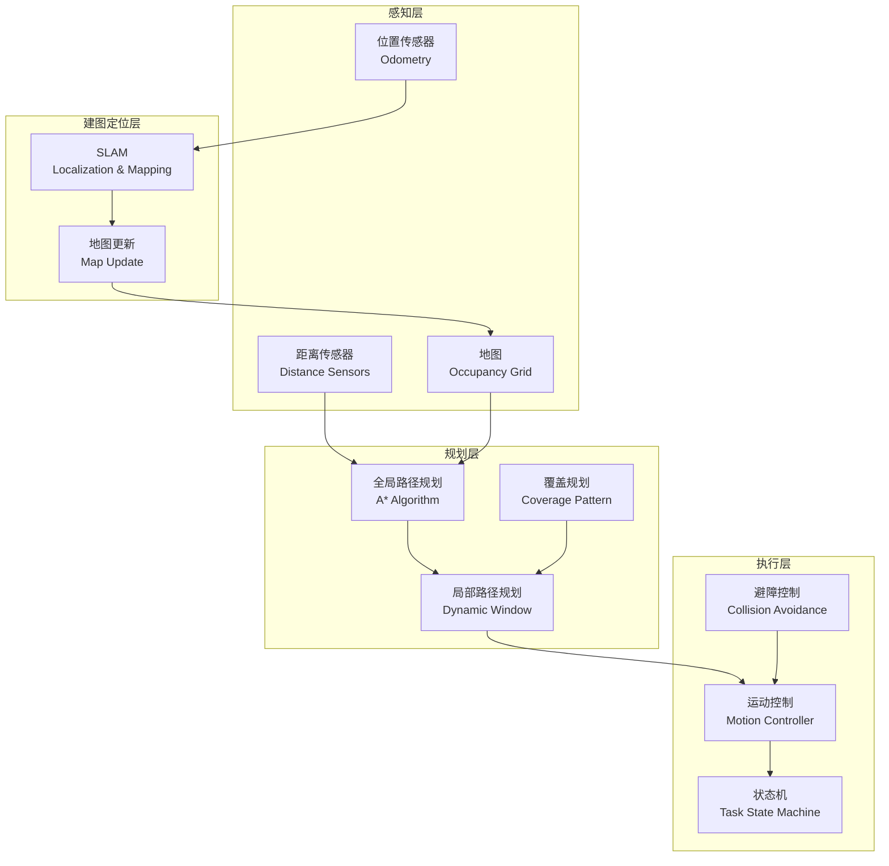

# 第22章:机器人控制系统

## 章节概述

> **设计思想**:掌握移动机器人的核心控制技术,实现自主导航和任务执行

本章将深入探讨移动机器人控制系统的设计与实现。以扫地机器人为典型应用场景,我们将学习路径规划、障碍物避障、全覆盖清扫等核心算法。这些技术不仅适用于扫地机器人,也是所有移动机器人(送餐机器人、巡检机器人、AGV等)的技术基础。

机器人控制的核心挑战在于:如何在动态变化的环境中,高效地完成任务同时保证安全。本章将从算法原理到工程实现,系统性地介绍解决这些挑战的方法。

## 学习目标

完成本章学习后,你将:

- ✅ **掌握控制架构**:理解机器人控制系统的分层架构和模块划分
- ✅ **实现路径规划**:掌握A*、Dijkstra等经典路径规划算法
- ✅ **设计避障策略**:能够实现动态障碍物检测和实时避障
- ✅ **优化清扫覆盖**:掌握全覆盖路径规划算法,提升任务效率
- ✅ **构建SLAM系统**:理解同时定位与建图的基本原理
- ✅ **开发完整系统**:通过扫地机器人项目获得系统开发经验

## 技术架构图

## 章节大纲

### 22.1 机器人控制架构设计
- 分层控制架构:任务层、规划层、执行层
- 模块划分:感知、规划、控制、建图、决策
- 接口设计:模块间的数据交互协议
- 数据流分析:从传感器到执行器的完整数据流

### 22.2 路径规划算法  
- A*算法:启发式搜索的经典实现
- Dijkstra算法:最短路径保证
- RRT算法:快速探索随机树
- 路径平滑:优化路径的连续性和可执行性
- 动态重规划:环境变化时的实时调整

### 22.3 障碍物避障与碰撞检测
- 传感器数据处理:距离传感器的噪声过滤
- 障碍物表示:点云、栅格地图、边界框
- 动态避障:Dynamic Window Approach
- 碰撞检测:安全距离计算和预警
- 紧急停止:安全机制设计

### 22.4 覆盖规划与清扫策略
- 回字形覆盖:最简单的全覆盖策略
- 螺旋形覆盖:中心向外扩展
- 分区清扫:大面积区域的分而治之
- 覆盖率计算:评估清扫完成度
- 重复区域最小化:提升清扫效率

### 22.5 状态机与任务管理
- 状态定义:待机、清扫、返回充电、充电中、故障
- 状态转换:触发条件和转换逻辑
- 任务调度:多任务的优先级管理
- 异常处理:故障检测和恢复策略
- 电量管理:续航时间估计和充电决策

### 22.6 SLAM定位与建图
- SLAM问题:同时定位与地图构建的挑战
- 栅格地图:环境的离散化表示
- 粒子滤波:概率定位方法
- 地图更新:增量式地图构建
- 回环检测:消除累积误差

### 22.7 综合项目:扫地机器人系统
- 项目架构:完整系统的模块集成
- 核心功能:全覆盖清扫、自主避障、自动充电
- 性能优化:清扫效率和电量利用
- 测试验证:不同房间布局的适应性测试

## 性能基准

| 指标 | 目标值 | 说明 |
|------|--------|------|
| 覆盖率 | > 95% | 房间面积的清扫覆盖比例 |
| 清扫效率 | < 2.0 | 行驶距离与房间周长的比值 |
| 避障成功率 | > 99% | 无碰撞避开障碍物的比例 |
| 定位精度 | < 0.1m | SLAM定位的平均误差 |
| 路径规划时间 | < 100ms | A*算法计算时间 |

## 本章小结

### 核心收获

- 掌握了移动机器人控制的完整技术栈
- 理解了路径规划算法的原理和实现
- 学会了设计全覆盖清扫策略
- 了解了SLAM技术的基本原理

### 与后续章节的联系

- **第23章**:VLA架构会将语言指令引入机器人控制
- **第24章**:世界模型可用于预测环境变化,改进规划策略

---

**下一章预告**:下一章我们将学习VLA(视觉-语言-动作)架构,实现基于自然语言指令的机器人操作,开启多模态具身智能的大门! 🤖💬
