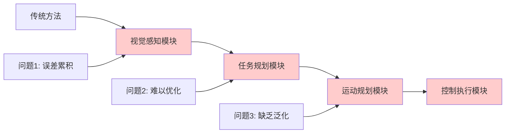
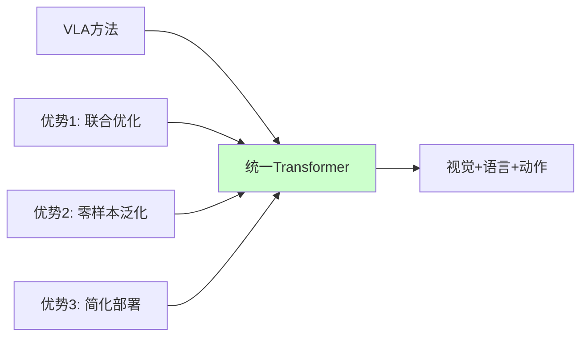
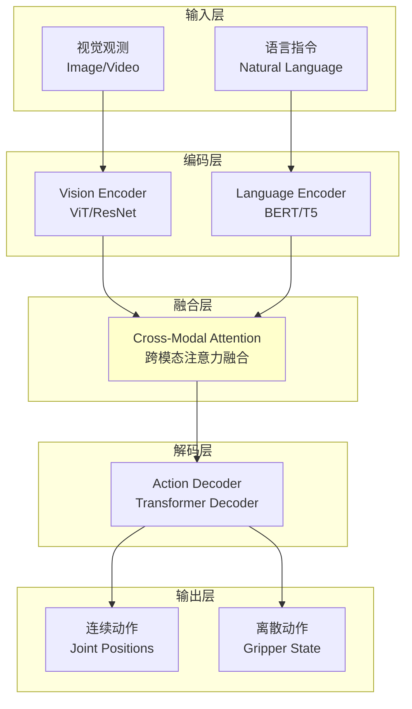

# 23.1 VLA架构概述

## 引言

VLA(Vision-Language-Action)模型代表了具身智能领域的重大突破,它将视觉感知、语言理解和动作执行统一到一个端到端的神经网络架构中。不同于传统的模块化机器人系统(需要分别设计视觉系统、规划系统、控制系统),VLA通过大规模预训练学习视觉-语言-动作的联合表示,实现了从像素到动作的直接映射。

本节将全面介绍VLA架构的设计理念、核心组件和工作原理,为后续章节的深入学习奠定基础。

### 本节目标
- 理解VLA模型的设计动机与核心思想
- 掌握VLA架构的主要组件及其交互
- 了解VLA与传统方法的区别
- 学习VLA的训练和推理流程

## 核心概念

### 1. VLA模型定义

**Vision-Language-Action(VLA)模型**是一种端到端的多模态Transformer架构,能够:
- **输入**: 视觉观测(图像/视频) + 自然语言指令
- **输出**: 机器人动作序列(关节位置、夹爪状态等)
- **能力**: 零样本泛化到未见过的任务和场景

**数学形式化**:
$$a_t = \pi_\theta(o_{1:t}, l)$$

其中:
- $o_{1:t}$: 历史观测序列(图像)
- $l$: 自然语言任务指令
- $a_t$: 当前时刻的动作
- $\theta$: 模型参数

### 2. 为什么需要VLA?

**传统模块化方法的局限**:



**VLA端到端方法的优势**:



| 特性 | 传统模块化方法 | VLA端到端方法 |
|------|--------------|--------------|
| **架构** | 多个独立模块 | 单一Transformer |
| **优化** | 各模块独立训练 | 端到端联合训练 |
| **泛化** | 需要为新任务重新编程 | 零样本泛化 |
| **数据需求** | 每个模块需要标注数据 | 利用大规模无标注数据 |
| **部署** | 复杂(多个模块协调) | 简单(单一模型) |

### 3. VLA架构总览



**核心组件**:

1. **Vision Encoder**: 提取视觉特征
   - 输入: RGB图像 $(H \times W \times 3)$
   - 输出: 视觉token序列 $\mathbf{V} \in \mathbb{R}^{N_v \times d}$

2. **Language Encoder**: 编码语言指令
   - 输入: 文本指令 "拿起红色杯子"
   - 输出: 语言token序列 $\mathbf{L} \in \mathbb{R}^{N_l \times d}$

3. **Cross-Modal Attention**: 融合视觉和语言
   - 输入: $\mathbf{V}$, $\mathbf{L}$
   - 输出: 融合特征 $\mathbf{F} \in \mathbb{R}^{N_f \times d}$

4. **Action Decoder**: 生成动作序列
   - 输入: $\mathbf{F}$
   - 输出: 动作分布 $p(a_t | \mathbf{F})$

## 技术实现

### 1. VLA模型架构实现

**VLA模型框架**:

```java
/**
 * VLA(Vision-Language-Action)模型
 */
public class VLAModel {
    // 编码器
    private VisionEncoder visionEncoder;
    private LanguageEncoder languageEncoder;
    
    // 融合层
    private CrossModalAttention crossAttention;
    
    // 解码器
    private ActionDecoder actionDecoder;
    
    // 模型配置
    private VLAConfig config;
    
    public VLAModel(VLAConfig config) {
        this.config = config;
        
        // 初始化各组件
        this.visionEncoder = new VisionEncoder(config.getVisionConfig());
        this.languageEncoder = new LanguageEncoder(config.getLanguageConfig());
        this.crossAttention = new CrossModalAttention(config.getFusionConfig());
        this.actionDecoder = new ActionDecoder(config.getActionConfig());
    }
    
    /**
     * 前向推理
     * @param image 视觉输入 [batch, height, width, channels]
     * @param instruction 语言指令
     * @return 动作输出
     */
    public Action forward(Tensor image, String instruction) {
        // 1. 视觉编码
        Tensor visualTokens = visionEncoder.encode(image);
        // 形状: [batch, num_visual_tokens, embed_dim]
        
        // 2. 语言编码
        Tensor languageTokens = languageEncoder.encode(instruction);
        // 形状: [batch, num_language_tokens, embed_dim]
        
        // 3. 跨模态融合
        Tensor fusedFeatures = crossAttention.fuse(visualTokens, languageTokens);
        // 形状: [batch, num_fused_tokens, embed_dim]
        
        // 4. 动作解码
        Action action = actionDecoder.decode(fusedFeatures);
        
        return action;
    }
    
    /**
     * 自回归生成动作序列
     * @param image 视觉输入
     * @param instruction 语言指令
     * @param horizon 预测步数
     * @return 动作序列
     */
    public List<Action> generateActionSequence(
            Tensor image, 
            String instruction, 
            int horizon) {
        
        List<Action> actionSequence = new ArrayList<>();
        
        // 编码观测和指令(只需一次)
        Tensor visualTokens = visionEncoder.encode(image);
        Tensor languageTokens = languageEncoder.encode(instruction);
        Tensor fusedFeatures = crossAttention.fuse(visualTokens, languageTokens);
        
        // 自回归生成动作序列
        Tensor actionHistory = null;
        
        for (int t = 0; t < horizon; t++) {
            // 解码下一个动作(条件化在历史动作上)
            Action action = actionDecoder.decodeWithHistory(
                fusedFeatures, actionHistory);
            
            actionSequence.add(action);
            
            // 更新历史
            actionHistory = appendAction(actionHistory, action);
        }
        
        return actionSequence;
    }
}
```

**配置类**:

```java
/**
 * VLA模型配置
 */
public class VLAConfig {
    // 视觉编码器配置
    private VisionEncoderConfig visionConfig;
    
    // 语言编码器配置
    private LanguageEncoderConfig languageConfig;
    
    // 融合层配置
    private FusionConfig fusionConfig;
    
    // 动作解码器配置
    private ActionDecoderConfig actionConfig;
    
    // 全局配置
    private int embedDim = 512;         // 嵌入维度
    private int numLayers = 12;          // Transformer层数
    private int numHeads = 8;            // 注意力头数
    private double dropoutRate = 0.1;    // Dropout比率
    
    // 动作空间配置
    private int actionDim = 7;           // 动作维度(如7-DOF机械臂)
    private ActionType actionType;       // 连续/离散
    
    public enum ActionType {
        CONTINUOUS,  // 连续动作空间
        DISCRETE,    // 离散动作空间
        HYBRID       // 混合动作空间
    }
    
    public VLAConfig() {
        // 默认配置
        this.visionConfig = new VisionEncoderConfig();
        this.languageConfig = new LanguageEncoderConfig();
        this.fusionConfig = new FusionConfig();
        this.actionConfig = new ActionDecoderConfig();
    }
    
    // Getters and Setters
    public VisionEncoderConfig getVisionConfig() { return visionConfig; }
    public LanguageEncoderConfig getLanguageConfig() { return languageConfig; }
    public FusionConfig getFusionConfig() { return fusionConfig; }
    public ActionDecoderConfig getActionConfig() { return actionConfig; }
}
```

### 2. 动作表示

**动作数据结构**:

```java
/**
 * 机器人动作表示
 */
public class Action {
    // 连续动作(如关节位置)
    private double[] continuousActions;
    
    // 离散动作(如夹爪开/关)
    private int[] discreteActions;
    
    // 动作置信度
    private double confidence;
    
    public Action(int continuousDim, int discreteDim) {
        this.continuousActions = new double[continuousDim];
        this.discreteActions = new int[discreteDim];
    }
    
    /**
     * 7-DOF机械臂 + 夹爪示例
     */
    public static Action createManipulatorAction() {
        Action action = new Action(7, 1);
        
        // 7个关节角度(弧度)
        action.continuousActions = new double[] {
            0.0,    // 肩关节旋转
            -0.5,   // 肩关节俯仰
            0.3,    // 肘关节
            -1.2,   // 腕关节1
            0.0,    // 腕关节2
            0.8,    // 腕关节3
            0.0     // 末端旋转
        };
        
        // 夹爪状态 (0=打开, 1=关闭)
        action.discreteActions = new int[] { 1 };
        
        return action;
    }
    
    /**
     * 移动机器人示例
     */
    public static Action createMobileRobotAction() {
        Action action = new Action(2, 0);
        
        // 线速度、角速度
        action.continuousActions = new double[] { 0.3, 0.1 };
        
        return action;
    }
    
    /**
     * 归一化动作到[-1, 1]
     */
    public void normalize(double[] minValues, double[] maxValues) {
        for (int i = 0; i < continuousActions.length; i++) {
            double range = maxValues[i] - minValues[i];
            continuousActions[i] = 2.0 * (continuousActions[i] - minValues[i]) / range - 1.0;
        }
    }
    
    /**
     * 反归一化
     */
    public void denormalize(double[] minValues, double[] maxValues) {
        for (int i = 0; i < continuousActions.length; i++) {
            double range = maxValues[i] - minValues[i];
            continuousActions[i] = (continuousActions[i] + 1.0) / 2.0 * range + minValues[i];
        }
    }
    
    public double[] getContinuousActions() { return continuousActions; }
    public int[] getDiscreteActions() { return discreteActions; }
    public double getConfidence() { return confidence; }
}
```

### 3. 训练流程

```java
/**
 * VLA模型训练器
 */
public class VLATrainer {
    private VLAModel model;
    private Optimizer optimizer;
    private LossFunction lossFunction;
    
    public VLATrainer(VLAModel model, TrainingConfig config) {
        this.model = model;
        this.optimizer = new AdamOptimizer(config.getLearningRate());
        this.lossFunction = createLossFunction(config);
    }
    
    /**
     * 训练一个批次
     */
    public TrainingMetrics trainBatch(Batch batch) {
        // 1. 前向传播
        List<Action> predictedActions = new ArrayList<>();
        for (int i = 0; i < batch.size(); i++) {
            Tensor image = batch.getImage(i);
            String instruction = batch.getInstruction(i);
            Action action = model.forward(image, instruction);
            predictedActions.add(action);
        }
        
        // 2. 计算损失
        List<Action> groundTruthActions = batch.getActions();
        double loss = lossFunction.compute(predictedActions, groundTruthActions);
        
        // 3. 反向传播
        Tensor gradients = lossFunction.backward();
        
        // 4. 参数更新
        optimizer.step(model.getParameters(), gradients);
        
        // 5. 计算指标
        TrainingMetrics metrics = new TrainingMetrics();
        metrics.loss = loss;
        metrics.accuracy = computeAccuracy(predictedActions, groundTruthActions);
        metrics.mse = computeMSE(predictedActions, groundTruthActions);
        
        return metrics;
    }
    
    /**
     * 创建损失函数
     */
    private LossFunction createLossFunction(TrainingConfig config) {
        if (config.getActionType() == VLAConfig.ActionType.CONTINUOUS) {
            // 连续动作:MSE损失
            return new MSELoss();
        } else if (config.getActionType() == VLAConfig.ActionType.DISCRETE) {
            // 离散动作:交叉熵损失
            return new CrossEntropyLoss();
        } else {
            // 混合动作:组合损失
            return new HybridLoss();
        }
    }
    
    /**
     * 完整训练循环
     */
    public void train(Dataset dataset, int numEpochs) {
        for (int epoch = 0; epoch < numEpochs; epoch++) {
            double epochLoss = 0.0;
            int numBatches = dataset.getNumBatches();
            
            for (int i = 0; i < numBatches; i++) {
                Batch batch = dataset.getBatch(i);
                TrainingMetrics metrics = trainBatch(batch);
                
                epochLoss += metrics.loss;
                
                if (i % 100 == 0) {
                    System.out.printf("Epoch %d, Batch %d/%d, Loss: %.4f\n",
                                     epoch, i, numBatches, metrics.loss);
                }
            }
            
            double avgLoss = epochLoss / numBatches;
            System.out.printf("Epoch %d 完成, 平均损失: %.4f\n", epoch, avgLoss);
            
            // 验证
            if ((epoch + 1) % 5 == 0) {
                evaluateOnValidation();
            }
        }
    }
    
    /**
     * 验证集评估
     */
    private void evaluateOnValidation() {
        // 在验证集上评估模型性能
        System.out.println("验证集评估...");
        // 实现省略
    }
}
```

### 4. 推理部署

```java
/**
 * VLA模型推理引擎
 */
public class VLAInference {
    private VLAModel model;
    private RobotController robot;
    
    public VLAInference(VLAModel model, RobotController robot) {
        this.model = model;
        this.robot = robot;
        this.model.eval();  // 设置为评估模式
    }
    
    /**
     * 执行单步推理
     */
    public void executeStep(Tensor observation, String instruction) {
        // 1. 模型推理
        Action action = model.forward(observation, instruction);
        
        // 2. 执行动作
        robot.executeAction(action);
        
        // 3. 等待执行完成
        robot.waitForCompletion();
    }
    
    /**
     * 执行完整任务
     */
    public boolean executeTask(String instruction, int maxSteps) {
        System.out.println("执行任务: " + instruction);
        
        for (int step = 0; step < maxSteps; step++) {
            // 获取当前观测
            Tensor observation = robot.captureObservation();
            
            // 推理动作
            Action action = model.forward(observation, instruction);
            
            // 打印动作
            System.out.printf("步骤 %d: 动作 = %s, 置信度 = %.2f\n",
                             step, actionToString(action), action.getConfidence());
            
            // 执行动作
            robot.executeAction(action);
            
            // 检查任务是否完成
            if (isTaskComplete(observation, instruction)) {
                System.out.println("任务完成!");
                return true;
            }
            
            // 小延迟
            try {
                Thread.sleep(100);
            } catch (InterruptedException e) {
                break;
            }
        }
        
        System.out.println("任务超时未完成");
        return false;
    }
    
    /**
     * 判断任务是否完成(简化版)
     */
    private boolean isTaskComplete(Tensor observation, String instruction) {
        // 实际中可能需要:
        // 1. 视觉检测目标状态
        // 2. 语言模型判断完成条件
        // 3. 强化学习的奖励信号
        return false;  // 简化实现
    }
    
    /**
     * 批量推理
     */
    public List<Action> batchInference(List<Tensor> observations, 
                                       List<String> instructions) {
        List<Action> actions = new ArrayList<>();
        
        for (int i = 0; i < observations.size(); i++) {
            Action action = model.forward(observations.get(i), instructions.get(i));
            actions.add(action);
        }
        
        return actions;
    }
}
```

## 性能分析

### 1. 模型规模对比

| 模型 | 参数量 | 训练数据量 | 推理速度 | 泛化能力 |
|------|--------|-----------|---------|---------|
| **小型VLA** | 50M | 10K演示 | 50 FPS | 有限场景 |
| **中型VLA** | 200M | 100K演示 | 20 FPS | 多种任务 |
| **大型VLA** | 1B+ | 1M+演示 | 5 FPS | 强零样本 |

**典型VLA模型**:
- **RT-1** (Google): 35M参数,130K演示
- **RT-2** (Google): 55B参数(复用PaLM-E),基于互联网数据
- **OpenVLA** (斯坦福): 7B参数,970K演示

### 2. 计算复杂度

**前向推理复杂度**:
- Vision Encoder: $O(H \times W \times d^2)$
- Language Encoder: $O(L \times d^2)$
- Cross-Modal Attention: $O(N_v \times N_l \times d)$
- Action Decoder: $O(T \times d^2)$

**总复杂度**: $O((HW + L + T) \times d^2)$

### 3. 性能基准

**任务成功率**(在真实机器人上):
```
拾取任务:
- 已见物体: 85-95%
- 未见物体: 60-75%

放置任务:
- 精确放置: 70-80%
- 粗略放置: 90-95%

组合任务:
- 3步任务: 50-60%
- 5步以上: 30-40%
```

## 常见问题

### Q1: VLA与模仿学习有什么区别?

**解答**: VLA是一种**架构**,模仿学习是一种**训练方法**。

- **VLA**: 定义了视觉-语言-动作的统一建模方式
- **模仿学习**: 从专家演示中学习策略

VLA模型通常使用模仿学习训练,但也可以结合强化学习等其他方法。

### Q2: 如何处理长序列任务?

**解答**: 采用分层策略:

```java
// 高层规划:将任务分解为子任务
List<String> subtasks = taskPlanner.decompose(
    "整理桌面", 
    currentObservation);
// 返回: ["拿起杯子", "放到架子上", "整理书本", ...]

// 低层执行:VLA执行每个子任务
for (String subtask : subtasks) {
    vla.executeTask(subtask, maxSteps=50);
}
```

### Q3: 如何提高泛化能力?

**解答**: 
1. **数据增强**: 图像变换、语言改写
2. **预训练**: 在大规模视觉-语言数据上预训练
3. **多任务学习**: 同时训练多种任务
4. **域随机化**: 训练时随机化场景参数

## 小节总结

本节全面介绍了VLA架构的核心概念:

1. **设计理念**: 端到端学习视觉-语言-动作映射,统一多模态表示
2. **架构组成**: Vision Encoder + Language Encoder + Cross-Modal Fusion + Action Decoder
3. **优势**: 零样本泛化、简化部署、联合优化
4. **挑战**: 数据需求大、计算成本高、长序列任务困难

**关键要点**:
- VLA是具身智能的重要范式,将感知和控制统一建模
- 核心是Transformer的跨模态注意力机制
- 通过大规模数据预训练获得泛化能力
- 实际应用中常与规划、强化学习结合

下一节将深入探讨Vision Encoder的设计与实现。

## 思考题

1. **架构选择**: 为什么VLA选择Transformer而不是CNN+RNN的组合?

2. **动作表示**: 连续动作空间和离散动作空间各有什么优缺点?

3. **数据效率**: 如何在少量数据下训练有效的VLA模型?

4. **实时性**: 大型VLA模型(如RT-2)推理速度慢,如何在真实机器人上部署?

5. **安全性**: VLA模型可能产生危险动作,如何保证安全?

## 拓展阅读

1. **经典论文**:
   - Brohan et al. "RT-1: Robotics Transformer for Real-World Control at Scale" (2022)
   - Brohan et al. "RT-2: Vision-Language-Action Models Transfer Web Knowledge to Robotic Control" (2023)
   - Driess et al. "PaLM-E: An Embodied Multimodal Language Model" (2023)

2. **开源项目**:
   - **OpenVLA**: 斯坦福开源的7B参数VLA模型
   - **RoboFlamingo**: 基于Flamingo的VLA实现
   - **Octo**: Berkeley的通用机器人策略

3. **进阶主题**:
   - 多模态预训练(CLIP, Flamingo)
   - 视觉-语言对齐
   - 分层强化学习与VLA结合
   - 世界模型辅助VLA
