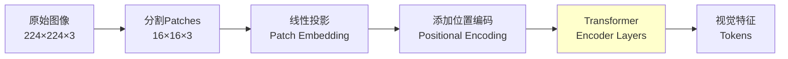
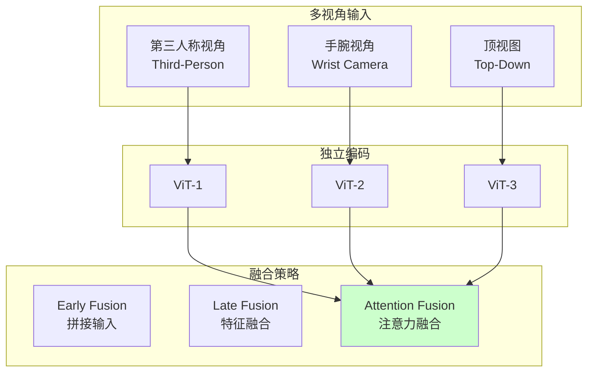

# 23.2 视觉编码器与视觉理解

## 引言

视觉编码器是VLA模型的"眼睛",负责将原始像素转换为高级语义特征。在机器人操作任务中,视觉理解不仅要识别物体("这是一个杯子"),还要理解空间关系("杯子在桌子左侧")、物体属性("杯子是红色的")以及可操作性("杯子可以被抓取")。

本节将深入探讨VLA中视觉编码器的设计,包括Vision Transformer (ViT)、空间编码、多视角融合等关键技术。

### 本节目标
- 掌握Vision Transformer的原理与实现
- 学习空间位置编码技术
- 了解多视角视觉融合方法
- 实现高效的视觉特征提取

## 核心概念

### 1. Vision Transformer (ViT)

**基本思想**: 将图像分割为patches,每个patch视为一个token,输入Transformer。

**架构流程**:



**数学形式化**:

输入图像 $\mathbf{X} \in \mathbb{R}^{H \times W \times C}$

1. **Patch分割**: 
   $$\mathbf{X} \rightarrow \{\mathbf{x}_1, \mathbf{x}_2, ..., \mathbf{x}_N\}$$
   其中 $N = \frac{H \times W}{P^2}$, $P$ 为patch大小

2. **Patch Embedding**:
   $$\mathbf{z}_i = \mathbf{E} \mathbf{x}_i + \mathbf{p}_i$$
   $\mathbf{E}$: 线性投影矩阵, $\mathbf{p}_i$: 位置编码

3. **Transformer编码**:
   $$\mathbf{Z} = \text{Transformer}(\mathbf{Z}^{(0)})$$

### 2. 空间位置编码

机器人任务高度依赖空间信息,需要精确的位置编码。

**位置编码类型**:

| 类型 | 公式 | 优点 | 缺点 |
|------|------|------|------|
| **绝对位置** | $\mathbf{p}_i = \mathbf{PE}(i)$ | 简单 | 不适应分辨率变化 |
| **相对位置** | $\mathbf{A}_{ij} = f(i-j)$ | 适应性强 | 计算复杂 |
| **2D位置** | $\mathbf{p}_{(x,y)} = [\mathbf{PE}_x(x), \mathbf{PE}_y(y)]$ | 编码空间结构 | 维度增加 |
| **可学习位置** | $\mathbf{p}_i \in \mathbb{R}^d$ | 灵活 | 需要更多数据 |

### 3. 多视角视觉

机器人通常配备多个摄像头,需要融合多视角信息。



## 技术实现

### 1. Vision Transformer实现

**Patch Embedding层**:

```java
/**
 * Patch Embedding层
 */
public class PatchEmbedding {
    private int imageSize;      // 图像尺寸 (假设正方形)
    private int patchSize;      // Patch尺寸
    private int numChannels;    // 输入通道数
    private int embedDim;       // 嵌入维度
    
    private LinearLayer projection;  // 线性投影
    
    public PatchEmbedding(int imageSize, int patchSize, 
                         int numChannels, int embedDim) {
        this.imageSize = imageSize;
        this.patchSize = patchSize;
        this.numChannels = numChannels;
        this.embedDim = embedDim;
        
        // 投影层:将patch展平后映射到embedDim
        int patchDim = patchSize * patchSize * numChannels;
        this.projection = new LinearLayer(patchDim, embedDim);
    }
    
    /**
     * 前向传播
     * @param image 输入图像 [batch, channels, height, width]
     * @return patch embeddings [batch, num_patches, embed_dim]
     */
    public Tensor forward(Tensor image) {
        int batch = image.getShape()[0];
        int height = image.getShape()[2];
        int width = image.getShape()[3];
        
        // 1. 分割为patches
        Tensor patches = imageToPatch(image);
        // 形状: [batch, num_patches, patch_dim]
        
        // 2. 线性投影
        Tensor embeddings = projection.forward(patches);
        // 形状: [batch, num_patches, embed_dim]
        
        return embeddings;
    }
    
    /**
     * 将图像分割为patches
     */
    private Tensor imageToPatch(Tensor image) {
        int batch = image.getShape()[0];
        int numPatchesH = imageSize / patchSize;
        int numPatchesW = imageSize / patchSize;
        int numPatches = numPatchesH * numPatchesW;
        
        double[][][] patches = new double[batch][numPatches][];
        
        for (int b = 0; b < batch; b++) {
            int patchIdx = 0;
            for (int i = 0; i < numPatchesH; i++) {
                for (int j = 0; j < numPatchesW; j++) {
                    // 提取patch并展平
                    patches[b][patchIdx] = extractAndFlattenPatch(
                        image, b, i * patchSize, j * patchSize);
                    patchIdx++;
                }
            }
        }
        
        return new Tensor(patches);
    }
    
    /**
     * 提取并展平单个patch
     */
    private double[] extractAndFlattenPatch(Tensor image, int batch, 
                                           int startH, int startW) {
        int patchDim = patchSize * patchSize * numChannels;
        double[] flatPatch = new double[patchDim];
        
        int idx = 0;
        for (int c = 0; c < numChannels; c++) {
            for (int h = 0; h < patchSize; h++) {
                for (int w = 0; w < patchSize; w++) {
                    flatPatch[idx++] = image.get(batch, c, startH + h, startW + w);
                }
            }
        }
        
        return flatPatch;
    }
    
    /**
     * 获取patches数量
     */
    public int getNumPatches() {
        return (imageSize / patchSize) * (imageSize / patchSize);
    }
}
```

**位置编码**:

```java
/**
 * 2D正弦位置编码
 */
public class PositionalEncoding2D {
    private int embedDim;
    private Tensor positionEmbedding;
    
    public PositionalEncoding2D(int numPatchesH, int numPatchesW, int embedDim) {
        this.embedDim = embedDim;
        this.positionEmbedding = createPositionEmbedding(
            numPatchesH, numPatchesW, embedDim);
    }
    
    /**
     * 创建2D正弦位置编码
     */
    private Tensor createPositionEmbedding(int H, int W, int d) {
        double[][] pe = new double[H * W][d];
        
        for (int h = 0; h < H; h++) {
            for (int w = 0; w < W; w++) {
                int pos = h * W + w;
                
                for (int i = 0; i < d / 2; i++) {
                    // x方向编码
                    double angleX = w / Math.pow(10000, 2.0 * i / d);
                    pe[pos][i] = Math.sin(angleX);
                    pe[pos][i + d/2] = Math.cos(angleX);
                    
                    // y方向编码(交织)
                    if (i < d / 4) {
                        double angleY = h / Math.pow(10000, 2.0 * i / d);
                        pe[pos][i + d/4] = Math.sin(angleY);
                        pe[pos][i + 3*d/4] = Math.cos(angleY);
                    }
                }
            }
        }
        
        return new Tensor(pe);
    }
    
    /**
     * 添加位置编码
     */
    public Tensor forward(Tensor patchEmbeddings) {
        // patchEmbeddings: [batch, num_patches, embed_dim]
        return patchEmbeddings.add(positionEmbedding);
    }
}

/**
 * 可学习位置编码
 */
public class LearnablePositionalEncoding {
    private Tensor positionEmbedding;
    
    public LearnablePositionalEncoding(int numPatches, int embedDim) {
        // 初始化为小随机值
        this.positionEmbedding = Tensor.randn(numPatches, embedDim).mul(0.02);
    }
    
    public Tensor forward(Tensor patchEmbeddings) {
        return patchEmbeddings.add(positionEmbedding);
    }
    
    /**
     * 获取可训练参数
     */
    public Tensor getParameters() {
        return positionEmbedding;
    }
}
```

**完整Vision Encoder**:

```java
/**
 * Vision Transformer编码器
 */
public class VisionEncoder {
    private PatchEmbedding patchEmbed;
    private PositionalEncoding2D posEncoding;
    private List<TransformerBlock> transformerBlocks;
    private LayerNorm layerNorm;
    
    // CLS token(用于全局表示)
    private Tensor clsToken;
    
    private VisionEncoderConfig config;
    
    public VisionEncoder(VisionEncoderConfig config) {
        this.config = config;
        
        // 1. Patch Embedding
        this.patchEmbed = new PatchEmbedding(
            config.getImageSize(),
            config.getPatchSize(),
            config.getNumChannels(),
            config.getEmbedDim());
        
        // 2. 位置编码
        int numPatchesH = config.getImageSize() / config.getPatchSize();
        int numPatchesW = config.getImageSize() / config.getPatchSize();
        this.posEncoding = new PositionalEncoding2D(
            numPatchesH, numPatchesW, config.getEmbedDim());
        
        // 3. CLS token
        this.clsToken = Tensor.randn(1, 1, config.getEmbedDim()).mul(0.02);
        
        // 4. Transformer blocks
        this.transformerBlocks = new ArrayList<>();
        for (int i = 0; i < config.getNumLayers(); i++) {
            transformerBlocks.add(new TransformerBlock(
                config.getEmbedDim(),
                config.getNumHeads(),
                config.getMlpRatio(),
                config.getDropoutRate()));
        }
        
        // 5. Layer Normalization
        this.layerNorm = new LayerNorm(config.getEmbedDim());
    }
    
    /**
     * 前向编码
     * @param images 输入图像 [batch, channels, height, width]
     * @return 视觉特征 [batch, num_tokens, embed_dim]
     */
    public Tensor encode(Tensor images) {
        int batch = images.getShape()[0];
        
        // 1. Patch embedding
        Tensor x = patchEmbed.forward(images);
        // 形状: [batch, num_patches, embed_dim]
        
        // 2. 添加位置编码
        x = posEncoding.forward(x);
        
        // 3. 添加CLS token
        Tensor batchClsToken = clsToken.repeat(batch, 1, 1);
        x = Tensor.cat(batchClsToken, x, dim=1);
        // 形状: [batch, num_patches+1, embed_dim]
        
        // 4. Transformer编码
        for (TransformerBlock block : transformerBlocks) {
            x = block.forward(x);
        }
        
        // 5. Layer Norm
        x = layerNorm.forward(x);
        
        return x;
    }
    
    /**
     * 仅提取CLS token(全局特征)
     */
    public Tensor encodeGlobal(Tensor images) {
        Tensor allTokens = encode(images);
        // 返回CLS token
        return allTokens.select(1, 0);  // [batch, embed_dim]
    }
    
    /**
     * 提取空间特征(不含CLS)
     */
    public Tensor encodeSpatial(Tensor images) {
        Tensor allTokens = encode(images);
        // 移除CLS token
        return allTokens.slice(1, 1, allTokens.getShape()[1]);
    }
}
```

### 2. 多视角融合

**Early Fusion(输入级融合)**:

```java
/**
 * Early Fusion:拼接多视角图像
 */
public class EarlyFusionVisionEncoder {
    private VisionEncoder encoder;
    
    public EarlyFusionVisionEncoder(VisionEncoderConfig config) {
        // 修改输入通道数(3视角 × 3通道 = 9通道)
        config.setNumChannels(9);
        this.encoder = new VisionEncoder(config);
    }
    
    /**
     * 编码多视角图像
     */
    public Tensor encode(Tensor view1, Tensor view2, Tensor view3) {
        // 在通道维度拼接
        Tensor multiView = Tensor.cat(view1, view2, view3, dim=1);
        // 形状: [batch, 9, height, width]
        
        return encoder.encode(multiView);
    }
}
```

**Late Fusion(特征级融合)**:

```java
/**
 * Late Fusion:独立编码后融合特征
 */
public class LateFusionVisionEncoder {
    private List<VisionEncoder> encoders;
    private FusionMethod fusionMethod;
    
    public enum FusionMethod {
        CONCAT,     // 拼接
        AVERAGE,    // 平均
        ATTENTION   // 注意力加权
    }
    
    public LateFusionVisionEncoder(VisionEncoderConfig config, int numViews) {
        this.encoders = new ArrayList<>();
        for (int i = 0; i < numViews; i++) {
            encoders.add(new VisionEncoder(config));
        }
        this.fusionMethod = FusionMethod.ATTENTION;
    }
    
    /**
     * 编码并融合多视角
     */
    public Tensor encode(List<Tensor> views) {
        List<Tensor> features = new ArrayList<>();
        
        // 1. 独立编码每个视角
        for (int i = 0; i < views.size(); i++) {
            Tensor feature = encoders.get(i).encode(views.get(i));
            features.add(feature);
        }
        
        // 2. 融合特征
        return fuseFeatures(features);
    }
    
    /**
     * 融合特征
     */
    private Tensor fuseFeatures(List<Tensor> features) {
        switch (fusionMethod) {
            case CONCAT:
                // 拼接所有视角特征
                return Tensor.cat(features, dim=1);
                
            case AVERAGE:
                // 平均池化
                Tensor sum = features.get(0).clone();
                for (int i = 1; i < features.size(); i++) {
                    sum = sum.add(features.get(i));
                }
                return sum.div(features.size());
                
            case ATTENTION:
                // 注意力加权融合
                return attentionFusion(features);
                
            default:
                return features.get(0);
        }
    }
    
    /**
     * 注意力融合
     */
    private Tensor attentionFusion(List<Tensor> features) {
        // 计算每个视角的重要性权重
        List<Double> weights = new ArrayList<>();
        double sumWeights = 0.0;
        
        for (Tensor feature : features) {
            // 使用全局平均池化计算权重
            double weight = feature.mean().item();
            weights.add(weight);
            sumWeights += weight;
        }
        
        // 归一化权重
        for (int i = 0; i < weights.size(); i++) {
            weights.set(i, weights.get(i) / sumWeights);
        }
        
        // 加权融合
        Tensor fused = features.get(0).mul(weights.get(0));
        for (int i = 1; i < features.size(); i++) {
            fused = fused.add(features.get(i).mul(weights.get(i)));
        }
        
        return fused;
    }
}
```

### 3. 空间注意力增强

```java
/**
 * 空间注意力模块
 * 增强对关键区域的关注
 */
public class SpatialAttention {
    private Conv2D conv1;
    private Conv2D conv2;
    
    public SpatialAttention(int channels) {
        this.conv1 = new Conv2D(channels, channels / 8, kernelSize=1);
        this.conv2 = new Conv2D(channels / 8, 1, kernelSize=1);
    }
    
    /**
     * 生成空间注意力图
     */
    public Tensor forward(Tensor visualTokens) {
        // visualTokens: [batch, num_patches, embed_dim]
        
        // 1. 重塑为2D特征图
        Tensor featureMap = reshapeTo2D(visualTokens);
        // 形状: [batch, embed_dim, H, W]
        
        // 2. 计算注意力
        Tensor x = conv1.forward(featureMap);
        x = relu(x);
        Tensor attentionMap = conv2.forward(x);
        attentionMap = sigmoid(attentionMap);
        // 形状: [batch, 1, H, W]
        
        // 3. 应用注意力
        Tensor attended = featureMap.mul(attentionMap);
        
        // 4. 重塑回token序列
        return reshapeToTokens(attended);
    }
}
```

## 性能分析

### 1. 不同Vision Encoder对比

| 模型 | 参数量 | 输入尺寸 | Patch大小 | 性能(ImageNet) | 机器人任务表现 |
|------|--------|---------|----------|---------------|--------------|
| **ViT-Tiny** | 5.7M | 224×224 | 16×16 | 72.2% | 基础 |
| **ViT-Small** | 22M | 224×224 | 16×16 | 79.9% | 良好 |
| **ViT-Base** | 86M | 224×224 | 16×16 | 84.5% | 优秀 |
| **ViT-Large** | 304M | 224×224 | 16×16 | 87.8% | 最佳 |

**VLA中常用**: ViT-Base或ResNet-50作为视觉骨干网络

### 2. 多视角融合效果

**实验结果**(机器人拾取任务):
```
单视角(第三人称): 72% 成功率
单视角(手腕相机): 68% 成功率

Early Fusion(2视角): 81% 成功率
Late Fusion(2视角): 84% 成功率
Attention Fusion(2视角): 87% 成功率

Attention Fusion(3视角): 91% 成功率
```

### 3. 计算效率优化

**推理加速技巧**:

```java
/**
 * 高效Vision Encoder
 */
public class EfficientVisionEncoder extends VisionEncoder {
    private boolean useCache = true;
    private Tensor cachedFeatures = null;
    
    /**
     * 带缓存的编码(静态场景优化)
     */
    public Tensor encodeWithCache(Tensor image, boolean sceneChanged) {
        if (sceneChanged || cachedFeatures == null) {
            cachedFeatures = super.encode(image);
        }
        return cachedFeatures;
    }
    
    /**
     * 降低分辨率编码(速度优先)
     */
    public Tensor encodeFast(Tensor image) {
        // 下采样到更小尺寸
        Tensor resized = resize(image, 112, 112);
        return super.encode(resized);
    }
    
    /**
     * 部分patch编码(关注感兴趣区域)
     */
    public Tensor encodeROI(Tensor image, BoundingBox roi) {
        // 裁剪感兴趣区域
        Tensor cropped = crop(image, roi);
        return super.encode(cropped);
    }
}
```

## 常见问题

### Q1: Patch大小如何选择?

**解答**: 权衡细节与效率:

- **小Patch (8×8)**: 更多细节,计算量大
- **中Patch (16×16)**: 平衡性能与效率(常用)
- **大Patch (32×32)**: 速度快,损失细节

机器人任务推荐16×16,关注物体细节时用8×8。

### Q2: 如何处理不同分辨率输入?

**解答**: 
```java
// 方法1: 插值调整
Tensor resized = interpolate(image, targetSize, mode="bilinear");

// 方法2: 自适应位置编码
public class AdaptivePositionEncoding {
    public Tensor forward(Tensor x, int H, int W) {
        // 根据实际尺寸插值位置编码
        return interpolatePositionEncoding(x, H, W);
    }
}
```

### Q3: 预训练权重重要吗?

**解答**: 非常重要!

- **ImageNet预训练**: 提升5-10%性能
- **CLIP预训练**: 提升视觉-语言对齐能力
- **从头训练**: 需要10倍以上数据

## 小节总结

本节深入探讨了VLA中的视觉编码器:

1. **Vision Transformer**: Patch embedding + 位置编码 + Transformer,是VLA视觉的主流选择
2. **空间编码**: 2D位置编码保留空间结构信息,对机器人任务至关重要
3. **多视角融合**: Attention Fusion效果最佳,能充分利用多视角互补信息
4. **性能优化**: 缓存、ROI编码、分辨率调整等技巧提升推理速度

**关键要点**:
- ViT将图像转换为token序列,便于与语言统一建模
- 位置编码编码空间结构,绝对+相对位置结合效果好
- 多视角显著提升性能,注意力融合优于简单拼接
- 预训练权重(ImageNet/CLIP)是性能关键

下一节将学习语言编码器与指令处理。

## 思考题

1. **Patch大小影响**: 为什么较小的patch能捕获更多细节?对计算量有什么影响?

2. **位置编码必要性**: 能否去掉位置编码?对机器人任务有什么影响?

3. **多视角选择**: 如果只能选2个摄像头,应该放在哪里?

4. **动态场景**: 对于移动物体,如何增强时序建模能力?

5. **深度信息**: RGB-D相机提供深度信息,如何融入Vision Encoder?

## 拓展阅读

1. **经典论文**:
   - Dosovitskiy et al. "An Image is Worth 16x16 Words: Transformers for Image Recognition at Scale" (ViT, 2020)
   - Liu et al. "Swin Transformer: Hierarchical Vision Transformer using Shifted Windows" (2021)
   - Radford et al. "Learning Transferable Visual Models From Natural Language Supervision" (CLIP, 2021)

2. **开源项目**:
   - `timm`: PyTorch图像模型库,包含各种ViT变体
   - `CLIP`: OpenAI的视觉-语言预训练模型
   - `MAE`: Masked Autoencoder自监督预训练

3. **进阶主题**:
   - 自监督视觉预训练(MAE, DINO)
   - 高效Transformer(Swin, PVT)
   - 3D视觉Transformer(Point Transformer)
   - 视觉-语言对齐学习
