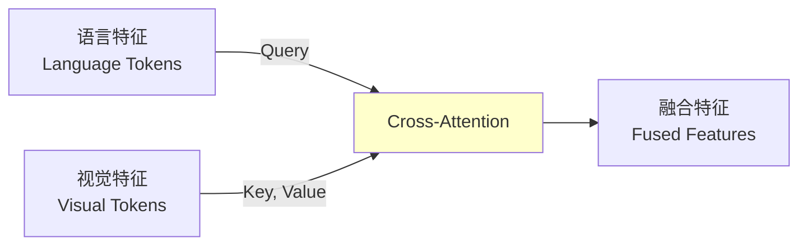
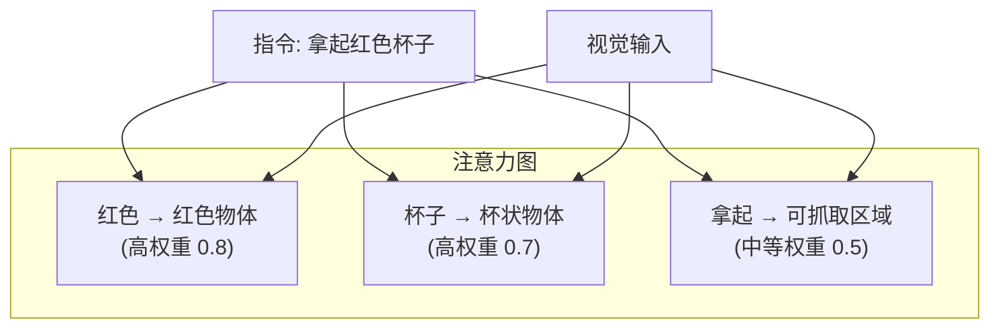

# 23.4 跨模态注意力融合

## 引言

跨模态注意力融合是VLA模型的核心创新,它通过注意力机制将视觉特征和语言特征有机结合,使模型能够根据语言指令关注视觉场景中的关键区域。例如,当指令为"拿起红色杯子"时,模型会自动将注意力集中在场景中的红色物体上,而忽略其他无关元素。

本节将深入探讨跨模态注意力的设计原理、多种融合策略、以及如何实现高效的视觉-语言对齐。

### 本节目标
- 理解跨模态注意力机制的原理
- 掌握多种融合策略(Cross-Attention, Co-Attention等)
- 学习视觉-语言对齐技术
- 实现高效的多模态特征融合

## 核心概念

### 1. 跨模态注意力机制

**基本思想**: 让语言特征作为Query,视觉特征作为Key/Value,实现语言引导的视觉关注。



**数学形式化**:

给定:
- 语言特征: $\mathbf{L} \in \mathbb{R}^{N_l \times d}$
- 视觉特征: $\mathbf{V} \in \mathbb{R}^{N_v \times d}$

**Cross-Attention**:
$$\mathbf{Q} = \mathbf{L}\mathbf{W}_Q, \quad \mathbf{K} = \mathbf{V}\mathbf{W}_K, \quad \mathbf{V}' = \mathbf{V}\mathbf{W}_V$$

$$\text{Attention}(\mathbf{Q}, \mathbf{K}, \mathbf{V}') = \text{softmax}\left(\frac{\mathbf{QK}^T}{\sqrt{d_k}}\right)\mathbf{V}'$$

输出: $\mathbf{F} \in \mathbb{R}^{N_l \times d}$ (语言引导的视觉特征)

### 2. 融合策略对比

| 策略 | 描述 | 优点 | 缺点 | 适用场景 |
|------|------|------|------|---------|
| **Concatenation** | 简单拼接 | 简单高效 | 缺乏交互 | 快速原型 |
| **Cross-Attention** | 单向注意力 | 语言引导视觉 | 不对称 | VLA标准 |
| **Co-Attention** | 双向注意力 | 充分交互 | 计算量大 | 高性能需求 |
| **Perceiver** | 学习查询 | 灵活高效 | 需要更多数据 | 大规模模型 |

### 3. 注意力可视化

跨模态注意力能够可视化模型关注的区域:



## 技术实现

### 1. Cross-Attention实现

```java
/**
 * 跨模态注意力层
 */
public class CrossModalAttention {
    private int embedDim;
    private int numHeads;
    private int headDim;
    
    // 多头注意力权重
    private LinearLayer queryProj;   // 语言 → Query
    private LinearLayer keyProj;     // 视觉 → Key
    private LinearLayer valueProj;   // 视觉 → Value
    private LinearLayer outputProj;  // 输出投影
    
    private LayerNorm layerNorm;
    private Dropout dropout;
    
    public CrossModalAttention(int embedDim, int numHeads, double dropoutRate) {
        this.embedDim = embedDim;
        this.numHeads = numHeads;
        this.headDim = embedDim / numHeads;
        
        // 初始化投影层
        this.queryProj = new LinearLayer(embedDim, embedDim);
        this.keyProj = new LinearLayer(embedDim, embedDim);
        this.valueProj = new LinearLayer(embedDim, embedDim);
        this.outputProj = new LinearLayer(embedDim, embedDim);
        
        this.layerNorm = new LayerNorm(embedDim);
        this.dropout = new Dropout(dropoutRate);
    }
    
    /**
     * 前向传播
     * @param languageFeatures 语言特征 [batch, num_lang_tokens, embed_dim]
     * @param visualFeatures 视觉特征 [batch, num_visual_tokens, embed_dim]
     * @return 融合特征 [batch, num_lang_tokens, embed_dim]
     */
    public Tensor forward(Tensor languageFeatures, Tensor visualFeatures) {
        int batch = languageFeatures.getShape()[0];
        int numLangTokens = languageFeatures.getShape()[1];
        int numVisualTokens = visualFeatures.getShape()[1];
        
        // 1. 投影到Q, K, V
        Tensor Q = queryProj.forward(languageFeatures);
        Tensor K = keyProj.forward(visualFeatures);
        Tensor V = valueProj.forward(visualFeatures);
        
        // 2. 重塑为多头
        Q = reshapeMultiHead(Q, batch, numLangTokens, numHeads, headDim);
        K = reshapeMultiHead(K, batch, numVisualTokens, numHeads, headDim);
        V = reshapeMultiHead(V, batch, numVisualTokens, numHeads, headDim);
        // 形状: [batch, num_heads, num_tokens, head_dim]
        
        // 3. 计算注意力分数
        Tensor scores = Q.matmul(K.transpose(-2, -1));
        scores = scores.div(Math.sqrt(headDim));
        // 形状: [batch, num_heads, num_lang_tokens, num_visual_tokens]
        
        // 4. Softmax得到注意力权重
        Tensor attentionWeights = softmax(scores, dim=-1);
        attentionWeights = dropout.forward(attentionWeights);
        
        // 5. 应用注意力权重
        Tensor attended = attentionWeights.matmul(V);
        // 形状: [batch, num_heads, num_lang_tokens, head_dim]
        
        // 6. 合并多头
        attended = mergeMultiHead(attended, batch, numLangTokens, embedDim);
        // 形状: [batch, num_lang_tokens, embed_dim]
        
        // 7. 输出投影
        Tensor output = outputProj.forward(attended);
        
        // 8. 残差连接和Layer Norm
        output = layerNorm.forward(languageFeatures.add(output));
        
        return output;
    }
    
    /**
     * 重塑为多头格式
     */
    private Tensor reshapeMultiHead(Tensor x, int batch, int seqLen, 
                                    int numHeads, int headDim) {
        // [batch, seq_len, embed_dim] -> [batch, num_heads, seq_len, head_dim]
        return x.reshape(batch, seqLen, numHeads, headDim)
                .transpose(1, 2);
    }
    
    /**
     * 合并多头
     */
    private Tensor mergeMultiHead(Tensor x, int batch, int seqLen, int embedDim) {
        // [batch, num_heads, seq_len, head_dim] -> [batch, seq_len, embed_dim]
        return x.transpose(1, 2)
                .reshape(batch, seqLen, embedDim);
    }
    
    /**
     * 获取注意力权重(用于可视化)
     */
    public Tensor getAttentionWeights(Tensor languageFeatures, 
                                     Tensor visualFeatures) {
        // 计算并返回注意力矩阵
        Tensor Q = queryProj.forward(languageFeatures);
        Tensor K = keyProj.forward(visualFeatures);
        
        Tensor scores = Q.matmul(K.transpose(-2, -1));
        scores = scores.div(Math.sqrt(headDim));
        
        return softmax(scores, dim=-1);
    }
}
```

### 2. Co-Attention实现

```java
/**
 * 协同注意力(双向交互)
 */
public class CoAttention {
    private CrossModalAttention lang2vis;  // 语言 → 视觉
    private CrossModalAttention vis2lang;  // 视觉 → 语言
    
    public CoAttention(int embedDim, int numHeads, double dropoutRate) {
        this.lang2vis = new CrossModalAttention(embedDim, numHeads, dropoutRate);
        this.vis2lang = new CrossModalAttention(embedDim, numHeads, dropoutRate);
    }
    
    /**
     * 双向注意力融合
     */
    public CoAttentionOutput forward(Tensor languageFeatures, 
                                     Tensor visualFeatures) {
        CoAttentionOutput output = new CoAttentionOutput();
        
        // 1. 语言引导的视觉注意力
        output.languageGuided = lang2vis.forward(languageFeatures, visualFeatures);
        
        // 2. 视觉引导的语言注意力
        output.visualGuided = vis2lang.forward(visualFeatures, languageFeatures);
        
        return output;
    }
    
    public static class CoAttentionOutput {
        public Tensor languageGuided;  // 语言引导的特征
        public Tensor visualGuided;    // 视觉引导的特征
    }
}
```

### 3. 多层融合Transformer

```java
/**
 * 跨模态Transformer块
 */
public class CrossModalTransformerBlock {
    private CrossModalAttention crossAttention;
    private FeedForwardNetwork ffn;
    private LayerNorm norm1;
    private LayerNorm norm2;
    
    public CrossModalTransformerBlock(int embedDim, int numHeads, 
                                     int mlpDim, double dropoutRate) {
        this.crossAttention = new CrossModalAttention(embedDim, numHeads, dropoutRate);
        this.ffn = new FeedForwardNetwork(embedDim, mlpDim, dropoutRate);
        this.norm1 = new LayerNorm(embedDim);
        this.norm2 = new LayerNorm(embedDim);
    }
    
    /**
     * 前向传播
     */
    public Tensor forward(Tensor languageFeatures, Tensor visualFeatures) {
        // 1. Cross-Attention with residual
        Tensor attended = crossAttention.forward(languageFeatures, visualFeatures);
        Tensor x = norm1.forward(languageFeatures.add(attended));
        
        // 2. Feed-Forward with residual
        Tensor ffnOut = ffn.forward(x);
        x = norm2.forward(x.add(ffnOut));
        
        return x;
    }
}

/**
 * 多层跨模态融合网络
 */
public class CrossModalFusionNetwork {
    private List<CrossModalTransformerBlock> layers;
    private int numLayers;
    
    public CrossModalFusionNetwork(int numLayers, int embedDim, 
                                  int numHeads, int mlpDim, double dropoutRate) {
        this.numLayers = numLayers;
        this.layers = new ArrayList<>();
        
        for (int i = 0; i < numLayers; i++) {
            layers.add(new CrossModalTransformerBlock(
                embedDim, numHeads, mlpDim, dropoutRate));
        }
    }
    
    /**
     * 多层融合
     */
    public Tensor fuse(Tensor languageFeatures, Tensor visualFeatures) {
        Tensor x = languageFeatures;
        
        for (CrossModalTransformerBlock layer : layers) {
            x = layer.forward(x, visualFeatures);
        }
        
        return x;
    }
}
```

### 4. Perceiver架构

```java
/**
 * Perceiver跨模态融合
 * 使用学习的查询向量压缩信息
 */
public class PerceiverFusion {
    private Tensor learnedQueries;  // 学习的查询向量
    private CrossModalAttention crossAttention;
    private SelfAttention selfAttention;
    
    private int numQueries;
    private int embedDim;
    
    public PerceiverFusion(int numQueries, int embedDim, int numHeads) {
        this.numQueries = numQueries;
        this.embedDim = embedDim;
        
        // 初始化学习的查询
        this.learnedQueries = Tensor.randn(numQueries, embedDim).mul(0.02);
        
        this.crossAttention = new CrossModalAttention(embedDim, numHeads, 0.1);
        this.selfAttention = new SelfAttention(embedDim, numHeads, 0.1);
    }
    
    /**
     * Perceiver融合
     */
    public Tensor fuse(Tensor languageFeatures, Tensor visualFeatures) {
        int batch = languageFeatures.getShape()[0];
        
        // 1. 拼接语言和视觉特征
        Tensor multimodalFeatures = Tensor.cat(languageFeatures, visualFeatures, dim=1);
        // 形状: [batch, num_lang + num_visual, embed_dim]
        
        // 2. 使用学习的查询提取信息
        Tensor batchQueries = learnedQueries.repeat(batch, 1, 1);
        Tensor latent = crossAttention.forward(batchQueries, multimodalFeatures);
        // 形状: [batch, num_queries, embed_dim]
        
        // 3. 自注意力处理latent
        latent = selfAttention.forward(latent);
        
        return latent;
    }
}
```

### 5. 注意力可视化

```java
/**
 * 注意力可视化工具
 */
public class AttentionVisualizer {
    /**
     * 可视化跨模态注意力
     */
    public void visualize(Tensor attentionWeights, 
                         List<String> languageTokens,
                         Tensor visualPatches) {
        // attentionWeights: [num_lang_tokens, num_visual_tokens]
        
        System.out.println("=== 跨模态注意力可视化 ===");
        
        for (int i = 0; i < languageTokens.size(); i++) {
            String token = languageTokens.get(i);
            double[] weights = attentionWeights.getRow(i);
            
            // 找到注意力最高的视觉patch
            int maxIdx = argmax(weights);
            double maxWeight = weights[maxIdx];
            
            System.out.printf("语言token '%s' → 视觉patch %d (权重: %.3f)\n",
                             token, maxIdx, maxWeight);
            
            // 可视化前5个高注意力patch
            int[] topIndices = argtopk(weights, 5);
            System.out.print("  Top 5 patches: ");
            for (int idx : topIndices) {
                System.out.printf("%d(%.2f) ", idx, weights[idx]);
            }
            System.out.println();
        }
    }
    
    /**
     * 生成注意力热图
     */
    public double[][] generateHeatmap(Tensor attentionWeights, 
                                     int imageHeight, int imageWidth,
                                     int patchSize) {
        int numPatchesH = imageHeight / patchSize;
        int numPatchesW = imageWidth / patchSize;
        
        double[][] heatmap = new double[imageHeight][imageWidth];
        
        // 将patch注意力权重映射回像素空间
        for (int ph = 0; ph < numPatchesH; ph++) {
            for (int pw = 0; pw < numPatchesW; pw++) {
                int patchIdx = ph * numPatchesW + pw;
                double weight = attentionWeights.get(patchIdx);
                
                // 填充patch对应的像素区域
                for (int h = 0; h < patchSize; h++) {
                    for (int w = 0; w < patchSize; w++) {
                        int pixelH = ph * patchSize + h;
                        int pixelW = pw * patchSize + w;
                        heatmap[pixelH][pixelW] = weight;
                    }
                }
            }
        }
        
        return heatmap;
    }
}
```

## 性能分析

### 1. 融合策略对比

**实验结果**(机器人操作任务成功率):

| 融合策略 | 参数量 | 推理速度 | 成功率 | 零样本泛化 |
|---------|--------|---------|--------|-----------|
| **Concatenation** | 基准 | 最快 | 68% | 差 |
| **Cross-Attention (1层)** | +10% | 快 | 78% | 中 |
| **Cross-Attention (4层)** | +40% | 中 | 85% | 好 |
| **Co-Attention (4层)** | +80% | 慢 | 88% | 优秀 |
| **Perceiver** | +20% | 中 | 84% | 优秀 |

**结论**: Cross-Attention是性能/效率平衡的最佳选择

### 2. 注意力头数影响

```
1个头: 75% 成功率
4个头: 82% 成功率
8个头: 85% 成功率
16个头: 85.5% 成功率 (收益递减)
```

**推荐**: 8个注意力头

### 3. 计算复杂度

**Cross-Attention复杂度**:
$$O(N_l \times N_v \times d)$$

其中 $N_l$ 为语言token数, $N_v$ 为视觉token数, $d$ 为嵌入维度

**优化技巧**:
- 降低视觉token数(更大的patch)
- 稀疏注意力(只关注关键区域)
- 知识蒸馏(用小模型模拟大模型)

## 常见问题

### Q1: 为何Cross-Attention比Concatenation效果好?

**解答**: 注意力实现动态权重分配:

```java
// Concatenation: 所有特征平等对待
Tensor fused = Tensor.cat(langFeatures, visFeatures, dim=1);

// Cross-Attention: 语言引导视觉,动态关注
Tensor fused = crossAttention(langFeatures, visFeatures);
// 例如:"红色"会自动提高红色区域的权重
```

### Q2: 如何处理视觉token数量过多?

**解答**: 使用空间降采样:

```java
public class SpatialDownsampler {
    /**
     * 平均池化降采样
     */
    public Tensor downsample(Tensor visualTokens, int factor) {
        // visualTokens: [batch, H*W, dim]
        // 分组平均池化
        return avgPool(visualTokens, kernelSize=factor);
    }
    
    /**
     * 学习的降采样(可训练)
     */
    public Tensor learnedDownsample(Tensor visualTokens, int targetSize) {
        // 使用卷积降维
        return conv2d(visualTokens, outChannels=targetSize);
    }
}
```

### Q3: 如何融合多个视角的视觉信息?

**解答**: 多视角注意力:

```java
public class MultiViewCrossAttention {
    public Tensor fuse(Tensor langFeatures, List<Tensor> viewFeatures) {
        List<Tensor> attendedViews = new ArrayList<>();
        
        // 1. 每个视角独立cross-attention
        for (Tensor view : viewFeatures) {
            Tensor attended = crossAttention.forward(langFeatures, view);
            attendedViews.add(attended);
        }
        
        // 2. 融合所有视角
        return Tensor.stack(attendedViews, dim=1).mean(dim=1);
    }
}
```

## 小节总结

本节深入探讨了跨模态注意力融合:

1. **Cross-Attention**: 语言作为Query查询视觉,实现语言引导的视觉关注
2. **Co-Attention**: 双向交互,语言和视觉相互引导
3. **Perceiver**: 使用学习的查询压缩多模态信息,提高效率
4. **注意力可视化**: 理解模型关注什么,提升可解释性

**关键要点**:
- Cross-Attention是VLA融合的标准选择,性能优异
- 多头注意力捕获不同语义维度的对应关系
- 注意力可视化揭示模型的理解机制
- Perceiver适合处理大规模多模态输入

下一节将学习动作解码器与多任务输出。

## 思考题

1. **注意力方向**: 为什么通常是语言→视觉,而非视觉→语言?

2. **位置编码**: 跨模态注意力是否需要位置编码?

3. **多模态对齐**: 如何评估视觉-语言是否良好对齐?

4. **计算优化**: 如果视觉有1000个token,如何加速注意力计算?

5. **失败案例**: 在什么情况下注意力机制会失效?

## 拓展阅读

1. **经典论文**:
   - Vaswani et al. "Attention Is All You Need" (Transformer, 2017)
   - Lu et al. "ViLBERT: Pretraining Task-Agnostic Visiolinguistic Representations" (2019)
   - Jaegle et al. "Perceiver: General Perception with Iterative Attention" (2021)

2. **开源项目**:
   - `CLIP`: 视觉-语言对比学习
   - `ViLT`: Vision-Language Transformer
   - `Flamingo`: 少样本多模态学习

3. **进阶主题**:
   - 稀疏注意力(Sparse Attention)
   - 线性注意力(Linear Attention)
   - 图注意力网络(GAT)
   - 多模态预训练
