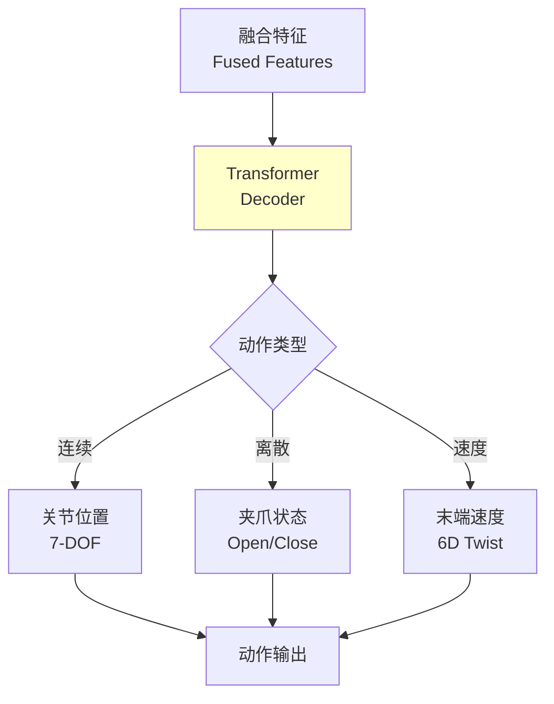
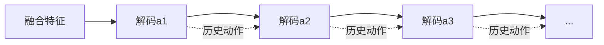

# 23.5 动作解码器与多任务输出

## 引言

动作解码器是VLA模型的"手",将融合后的多模态特征转换为可执行的机器人动作。不同于传统的单一输出,VLA的动作解码器通常需要处理多种动作空间:连续的关节位置、离散的夹爪状态、多步骤的动作序列等。

本节将深入探讨动作解码器的设计,包括多任务输出、自回归生成、动作分布建模等关键技术。

### 本节目标
- 掌握动作解码器的架构设计
- 学习多任务输出的实现方法
- 了解自回归动作生成技术
- 实现混合动作空间的处理

## 核心概念

### 1. 动作解码器架构



**数学形式化**:

给定融合特征 $\mathbf{F} \in \mathbb{R}^{N \times d}$,解码动作:

$$p(a_t | \mathbf{F}) = \text{Decoder}(\mathbf{F})$$

**混合动作空间**:
$$a_t = [a_t^{cont}, a_t^{disc}]$$
- $a_t^{cont} \in \mathbb{R}^{d_c}$: 连续动作(关节角度)
- $a_t^{disc} \in \{0, 1\}^{d_d}$: 离散动作(夹爪状态)

### 2. 输出层设计

| 动作类型 | 输出层 | 损失函数 | 示例 |
|---------|--------|---------|------|
| **连续动作** | Linear + Tanh | MSE Loss | 关节位置 |
| **离散动作** | Linear + Softmax | Cross-Entropy | 夹爪开/关 |
| **分布动作** | 混合高斯(GMM) | Negative Log-Likelihood | 多模态抓取 |
| **序列动作** | 自回归Decoder | Sequence Loss | 多步操作 |

### 3. 自回归生成

对于多步骤任务,逐步生成动作序列:



## 技术实现

### 1. 基础动作解码器

```java
/**
 * 动作解码器
 */
public class ActionDecoder {
    private TransformerDecoder decoder;
    private ActionHeads actionHeads;
    private ActionDecoderConfig config;
    
    public ActionDecoder(ActionDecoderConfig config) {
        this.config = config;
        
        // Transformer解码器
        this.decoder = new TransformerDecoder(
            config.getNumLayers(),
            config.getEmbedDim(),
            config.getNumHeads(),
            config.getMlpDim(),
            config.getDropoutRate());
        
        // 多任务输出头
        this.actionHeads = new ActionHeads(config);
    }
    
    /**
     * 解码动作
     * @param fusedFeatures 融合特征 [batch, seq_len, embed_dim]
     * @return 动作输出
     */
    public Action decode(Tensor fusedFeatures) {
        // 1. Transformer解码
        Tensor decodedFeatures = decoder.forward(fusedFeatures);
        
        // 2. 取最后一个token(或池化)
        Tensor actionFeature = decodedFeatures.select(1, -1);
        // 形状: [batch, embed_dim]
        
        // 3. 多任务输出头
        Action action = actionHeads.forward(actionFeature);
        
        return action;
    }
    
    /**
     * 自回归解码动作序列
     */
    public List<Action> decodeSequence(Tensor fusedFeatures, int horizon) {
        List<Action> actions = new ArrayList<>();
        Tensor actionHistory = null;
        
        for (int t = 0; t < horizon; t++) {
            // 拼接动作历史
            Tensor input = fusedFeatures;
            if (actionHistory != null) {
                input = Tensor.cat(fusedFeatures, actionHistory, dim=1);
            }
            
            // 解码当前动作
            Tensor decodedFeatures = decoder.forward(input);
            Tensor actionFeature = decodedFeatures.select(1, -1);
            Action action = actionHeads.forward(actionFeature);
            
            actions.add(action);
            
            // 更新历史
            actionHistory = encodeAction(action);
        }
        
        return actions;
    }
}
```

### 2. 多任务输出头

```java
/**
 * 多任务动作输出头
 */
public class ActionHeads {
    // 连续动作头
    private LinearLayer continuousHead;
    
    // 离散动作头
    private LinearLayer discreteHead;
    
    // 末端速度头(可选)
    private LinearLayer twistHead;
    
    private ActionDecoderConfig config;
    
    public ActionHeads(ActionDecoderConfig config) {
        this.config = config;
        
        int embedDim = config.getEmbedDim();
        
        // 连续动作: 7-DOF机械臂
        this.continuousHead = new LinearLayer(embedDim, 7);
        
        // 离散动作: 夹爪(2分类)
        this.discreteHead = new LinearLayer(embedDim, 2);
        
        // 末端速度: 6D twist (可选)
        if (config.isUseEndEffectorControl()) {
            this.twistHead = new LinearLayer(embedDim, 6);
        }
    }
    
    /**
     * 前向传播
     */
    public Action forward(Tensor actionFeature) {
        Action action = new Action();
        
        // 1. 连续动作(关节位置)
        Tensor continuousLogits = continuousHead.forward(actionFeature);
        action.jointPositions = tanh(continuousLogits).toArray();
        // 归一化到[-1, 1]
        
        // 2. 离散动作(夹爪)
        Tensor discreteLogits = discreteHead.forward(actionFeature);
        Tensor gripperProbs = softmax(discreteLogits, dim=-1);
        action.gripperState = argmax(gripperProbs);
        action.gripperConfidence = gripperProbs.max().item();
        
        // 3. 末端速度(可选)
        if (config.isUseEndEffectorControl()) {
            Tensor twistLogits = twistHead.forward(actionFeature);
            action.endEffectorTwist = tanh(twistLogits).toArray();
        }
        
        return action;
    }
}

/**
 * 动作数据结构
 */
public class Action {
    public double[] jointPositions;        // 关节位置 (7维)
    public int gripperState;               // 夹爪状态 (0=开, 1=关)
    public double gripperConfidence;       // 夹爪置信度
    public double[] endEffectorTwist;      // 末端速度 (6维, 可选)
    
    /**
     * 反归一化到真实动作空间
     */
    public void denormalize(double[] minValues, double[] maxValues) {
        for (int i = 0; i < jointPositions.length; i++) {
            double range = maxValues[i] - minValues[i];
            jointPositions[i] = (jointPositions[i] + 1.0) / 2.0 * range + minValues[i];
        }
    }
}
```

### 3. 混合高斯分布输出

```java
/**
 * 混合高斯模型(GMM)输出头
 * 用于多模态动作分布
 */
public class GMMActionHead {
    private int numComponents;      // 高斯分量数
    private int actionDim;          // 动作维度
    
    private LinearLayer meansHead;     // 均值
    private LinearLayer stdHead;       // 标准差
    private LinearLayer weightsHead;   // 混合权重
    
    public GMMActionHead(int embedDim, int actionDim, int numComponents) {
        this.actionDim = actionDim;
        this.numComponents = numComponents;
        
        // 每个高斯分量的参数
        this.meansHead = new LinearLayer(embedDim, numComponents * actionDim);
        this.stdHead = new LinearLayer(embedDim, numComponents * actionDim);
        this.weightsHead = new LinearLayer(embedDim, numComponents);
    }
    
    /**
     * 前向传播
     */
    public GMMDistribution forward(Tensor actionFeature) {
        // 1. 预测均值
        Tensor meansFlat = meansHead.forward(actionFeature);
        Tensor means = meansFlat.reshape(-1, numComponents, actionDim);
        // 形状: [batch, num_components, action_dim]
        
        // 2. 预测标准差(确保为正)
        Tensor stdFlat = stdHead.forward(actionFeature);
        Tensor std = softplus(stdFlat).reshape(-1, numComponents, actionDim);
        
        // 3. 预测混合权重
        Tensor weightsLogits = weightsHead.forward(actionFeature);
        Tensor weights = softmax(weightsLogits, dim=-1);
        // 形状: [batch, num_components]
        
        return new GMMDistribution(means, std, weights);
    }
    
    /**
     * GMM分布
     */
    public static class GMMDistribution {
        public Tensor means;    // [batch, num_components, action_dim]
        public Tensor std;      // [batch, num_components, action_dim]
        public Tensor weights;  // [batch, num_components]
        
        public GMMDistribution(Tensor means, Tensor std, Tensor weights) {
            this.means = means;
            this.std = std;
            this.weights = weights;
        }
        
        /**
         * 采样动作
         */
        public double[] sample() {
            // 1. 根据权重选择高斯分量
            int component = categoricalSample(weights);
            
            // 2. 从选中的高斯分布采样
            double[] mean = means.select(1, component).toArray();
            double[] stdDev = std.select(1, component).toArray();
            
            double[] action = new double[mean.length];
            Random rand = new Random();
            for (int i = 0; i < action.length; i++) {
                action[i] = mean[i] + stdDev[i] * rand.nextGaussian();
            }
            
            return action;
        }
        
        /**
         * 计算负对数似然损失
         */
        public double negativeLogLikelihood(Tensor targetActions) {
            // targetActions: [batch, action_dim]
            double nll = 0.0;
            
            // 计算每个分量的概率密度
            for (int k = 0; k < weights.getShape()[1]; k++) {
                Tensor mu = means.select(1, k);
                Tensor sigma = std.select(1, k);
                
                // 高斯概率密度
                Tensor diff = targetActions.sub(mu);
                Tensor exponent = diff.pow(2).div(sigma.pow(2).mul(2));
                Tensor prob = exp(exponent.neg()).div(
                    sigma.mul(Math.sqrt(2 * Math.PI)));
                
                // 加权
                nll += weights.select(1, k).item() * prob.mean().item();
            }
            
            return -Math.log(nll);
        }
    }
}
```

### 4. Transformer Decoder

```java
/**
 * Transformer解码器
 */
public class TransformerDecoder {
    private List<TransformerDecoderLayer> layers;
    private LayerNorm finalNorm;
    
    public TransformerDecoder(int numLayers, int embedDim, 
                             int numHeads, int mlpDim, double dropoutRate) {
        this.layers = new ArrayList<>();
        for (int i = 0; i < numLayers; i++) {
            layers.add(new TransformerDecoderLayer(
                embedDim, numHeads, mlpDim, dropoutRate));
        }
        this.finalNorm = new LayerNorm(embedDim);
    }
    
    /**
     * 前向传播
     */
    public Tensor forward(Tensor fusedFeatures) {
        Tensor x = fusedFeatures;
        
        for (TransformerDecoderLayer layer : layers) {
            x = layer.forward(x);
        }
        
        x = finalNorm.forward(x);
        return x;
    }
}

/**
 * Transformer解码器层
 */
public class TransformerDecoderLayer {
    private SelfAttention selfAttention;
    private FeedForwardNetwork ffn;
    private LayerNorm norm1;
    private LayerNorm norm2;
    
    public TransformerDecoderLayer(int embedDim, int numHeads, 
                                  int mlpDim, double dropoutRate) {
        this.selfAttention = new SelfAttention(embedDim, numHeads, dropoutRate);
        this.ffn = new FeedForwardNetwork(embedDim, mlpDim, dropoutRate);
        this.norm1 = new LayerNorm(embedDim);
        this.norm2 = new LayerNorm(embedDim);
    }
    
    public Tensor forward(Tensor x) {
        // 自注意力 + 残差
        Tensor attended = selfAttention.forward(x);
        x = norm1.forward(x.add(attended));
        
        // FFN + 残差
        Tensor ffnOut = ffn.forward(x);
        x = norm2.forward(x.add(ffnOut));
        
        return x;
    }
}
```

### 5. 动作后处理

```java
/**
 * 动作后处理器
 */
public class ActionPostProcessor {
    private double[] jointLimitsMin;
    private double[] jointLimitsMax;
    private double[] maxVelocities;
    
    public ActionPostProcessor(RobotConfig config) {
        this.jointLimitsMin = config.getJointLimitsMin();
        this.jointLimitsMax = config.getJointLimitsMax();
        this.maxVelocities = config.getMaxJointVelocities();
    }
    
    /**
     * 限制到关节范围
     */
    public Action clip(Action action) {
        for (int i = 0; i < action.jointPositions.length; i++) {
            action.jointPositions[i] = Math.max(jointLimitsMin[i],
                Math.min(jointLimitsMax[i], action.jointPositions[i]));
        }
        return action;
    }
    
    /**
     * 速度限制(平滑)
     */
    public Action smoothVelocity(Action currentAction, Action previousAction) {
        if (previousAction == null) return currentAction;
        
        for (int i = 0; i < currentAction.jointPositions.length; i++) {
            double delta = currentAction.jointPositions[i] - 
                          previousAction.jointPositions[i];
            
            // 限制速度
            if (Math.abs(delta) > maxVelocities[i]) {
                double sign = Math.signum(delta);
                currentAction.jointPositions[i] = previousAction.jointPositions[i] +
                    sign * maxVelocities[i];
            }
        }
        
        return currentAction;
    }
    
    /**
     * 时序平滑(指数移动平均)
     */
    public Action temporalSmooth(Action currentAction, Action previousAction, 
                                double alpha) {
        if (previousAction == null) return currentAction;
        
        for (int i = 0; i < currentAction.jointPositions.length; i++) {
            currentAction.jointPositions[i] = 
                alpha * currentAction.jointPositions[i] + 
                (1 - alpha) * previousAction.jointPositions[i];
        }
        
        return currentAction;
    }
}
```

## 性能分析

### 1. 输出表示对比

| 输出类型 | 优点 | 缺点 | 适用场景 |
|---------|------|------|---------|
| **确定性(Tanh)** | 简单,快速 | 无不确定性估计 | 简单任务 |
| **高斯分布** | 捕获不确定性 | 单峰假设 | 中等复杂度 |
| **GMM** | 多模态分布 | 参数多,训练难 | 复杂多解任务 |
| **扩散模型** | 高质量采样 | 推理慢 | 离线规划 |

**实验结果**(抓取任务成功率):
```
确定性输出: 75%
高斯输出: 82%
GMM(3分量): 88%
GMM(5分量): 89% (收益递减)
```

### 2. 序列长度影响

```
单步动作: 85% 成功率, 50ms延迟
3步序列: 78% 成功率, 120ms延迟
5步序列: 72% 成功率, 200ms延迟
10步序列: 65% 成功率, 400ms延迟
```

**结论**: 长序列需要更强的时序建模

### 3. 计算开销

**解码器开销**(NVIDIA RTX 3090):
- Transformer Decoder(4层): 15ms
- 输出头: 2ms
- GMM采样: 3ms
- **总计**: ~20ms (50 FPS)

## 常见问题

### Q1: 如何处理动作空间不匹配?

**解答**: 使用适配层:

```java
public class ActionAdapter {
    /**
     * 7-DOF → 6-DOF适配
     */
    public double[] adapt7DOFto6DOF(double[] action7dof) {
        // 移除冗余关节
        double[] action6dof = new double[6];
        System.arraycopy(action7dof, 0, action6dof, 0, 6);
        return action6dof;
    }
    
    /**
     * 关节空间 → 笛卡尔空间
     */
    public double[] jointToCartesian(double[] jointPositions) {
        // 正运动学
        return forwardKinematics(jointPositions);
    }
}
```

### Q2: 如何处理长时延任务?

**解答**: 分层策略:

```java
// 高层: 子目标生成
List<Subgoal> subgoals = highLevelPlanner.plan("整理桌面");

// 低层: VLA执行每个子目标
for (Subgoal subgoal : subgoals) {
    Action action = vla.decode(obs, subgoal.instruction);
    robot.execute(action);
}
```

### Q3: 如何提高动作安全性?

**解答**: 安全过滤器:

```java
public class SafetyFilter {
    public Action filter(Action action, RobotState state) {
        // 1. 碰撞检测
        if (willCollide(action, state)) {
            return emergencyStop();
        }
        
        // 2. 工作空间限制
        if (outsideWorkspace(action)) {
            return clipToWorkspace(action);
        }
        
        // 3. 速度限制
        return clipVelocity(action);
    }
}
```

## 小节总结

本节深入探讨了VLA的动作解码器:

1. **多任务输出**: 统一处理连续/离散/混合动作空间
2. **分布建模**: GMM捕获多模态动作分布,提升鲁棒性
3. **自回归生成**: 逐步解码动作序列,处理长时任务
4. **动作后处理**: 限幅、平滑、安全过滤保证可执行性

**关键要点**:
- 多任务头设计使VLA适应不同机器人
- GMM输出优于确定性输出,但计算开销更大
- 动作后处理是实际部署的必要环节
- 长序列任务需要分层或世界模型辅助

下一节将学习零样本泛化能力。

## 思考题

1. **输出空间**: 为什么用Tanh归一化而非Sigmoid?

2. **多模态**: 什么情况下需要GMM而非单高斯?

3. **序列建模**: 自回归vs一次性生成,各有什么优缺点?

4. **实时性**: 如何在保证性能的前提下加速解码?

5. **失败恢复**: 如果动作执行失败,如何重新规划?

## 拓展阅读

1. **经典论文**:
   - Zhao et al. "Diffusion Policy: Visuomotor Policy Learning via Action Diffusion" (2023)
   - Janner et al. "Planning with Diffusion for Flexible Behavior Synthesis" (2022)

2. **开源项目**:
   - `diffusion_policy`: 扩散模型动作生成
   - `robomimic`: 模仿学习框架

3. **进阶主题**:
   - 条件扩散模型
   - 流匹配(Flow Matching)
   - 强化学习微调
