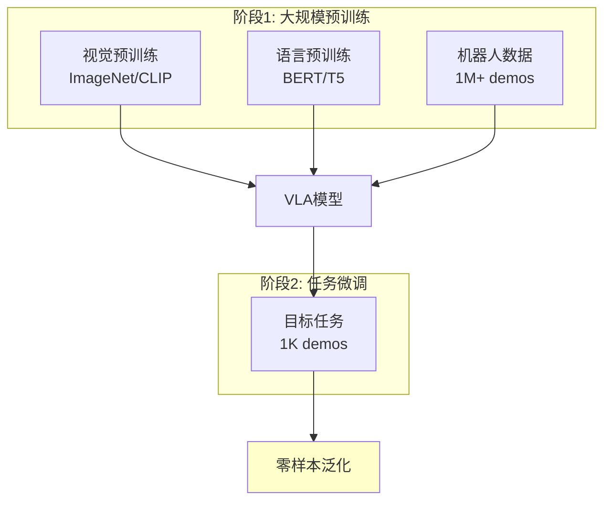

# 23.6 零样本泛化

## 引言

零样本泛化(Zero-Shot Generalization)是VLA模型最令人兴奋的能力之一——在从未见过某个具体任务的情况下,仅凭自然语言指令就能正确执行。这源于大规模预训练带来的视觉-语言对齐能力,以及在海量任务数据上学习的通用策略。

本节将深入探讨VLA如何实现零样本泛化,包括预训练策略、任务泛化机制、以及如何评估和提升泛化能力。

### 本节目标
- 理解零样本泛化的原理与挑战
- 掌握预训练与微调的策略
- 学习任务组合泛化方法
- 实现泛化能力的评估

## 核心概念

### 1. 零样本泛化定义

**定义**: 模型在训练时从未见过任务 $T_{new}$,但能通过语言指令 $l_{new}$ 正确执行。

```mermaid
graph LR
    A[训练任务集] --> B[VLA模型]
    C[新任务指令<br/>"stack red block on blue bowl"] --> B
    B --> D{泛化?}
    D -->|成功| E[正确执行<br/>未见任务]
    D -->|失败| F[需要微调]
    
    style E fill:#ccffcc
    style F fill:#ffcccc
```

**泛化维度**:
- **物体泛化**: 新颜色、形状、材质
- **任务泛化**: 新动作组合
- **场景泛化**: 新环境布局
- **指令泛化**: 新的语言表达

### 2. 预训练的重要性

**两阶段训练范式**:



**数据规模与泛化能力**:

| 预训练数据量 | 零样本成功率 | 物体泛化 | 任务泛化 |
|------------|------------|---------|---------|
| **10K demos** | 35% | 差 | 差 |
| **100K demos** | 58% | 中 | 中 |
| **1M demos** | 75% | 好 | 好 |
| **10M+ (互联网)** | 85%+ | 优秀 | 优秀 |

### 3. 组合泛化

VLA通过学习基础技能的组合实现复杂任务:

**示例**:
- 训练任务1: "pick cup" ✓
- 训练任务2: "place on plate" ✓
- **零样本任务**: "pick cup and place on plate" ✓

```
基础技能 → 组合新任务
```

## 技术实现

### 1. 预训练策略

```java
/**
 * VLA预训练管理器
 */
public class VLAPretrainer {
    private VLAModel model;
    private MultiTaskDataset dataset;
    private PretrainingConfig config;
    
    public VLAPretrainer(VLAModel model, PretrainingConfig config) {
        this.model = model;
        this.config = config;
        this.dataset = new MultiTaskDataset(config.getDataPath());
    }
    
    /**
     * 多任务预训练
     */
    public void pretrain() {
        System.out.println("=== VLA多任务预训练开始 ===");
        
        for (int epoch = 0; epoch < config.getNumEpochs(); epoch++) {
            double epochLoss = 0.0;
            int numBatches = dataset.getNumBatches();
            
            for (int i = 0; i < numBatches; i++) {
                Batch batch = dataset.getBatch(i);
                
                // 前向传播
                List<Action> predictions = new ArrayList<>();
                for (int j = 0; j < batch.size(); j++) {
                    Action pred = model.forward(
                        batch.getImage(j),
                        batch.getInstruction(j));
                    predictions.add(pred);
                }
                
                // 计算损失(多任务加权)
                double loss = computeMultiTaskLoss(
                    predictions, batch.getActions(), batch.getTaskTypes());
                
                // 反向传播
                optimizer.step(loss);
                
                epochLoss += loss;
                
                if (i % 1000 == 0) {
                    System.out.printf("Epoch %d, Batch %d/%d, Loss: %.4f\n",
                                     epoch, i, numBatches, loss);
                }
            }
            
            double avgLoss = epochLoss / numBatches;
            System.out.printf("Epoch %d 完成, 平均损失: %.4f\n", epoch, avgLoss);
            
            // 零样本评估
            if ((epoch + 1) % 5 == 0) {
                evaluateZeroShot();
            }
        }
        
        System.out.println("预训练完成!");
    }
    
    /**
     * 多任务损失
     */
    private double computeMultiTaskLoss(List<Action> predictions,
                                       List<Action> targets,
                                       List<String> taskTypes) {
        double totalLoss = 0.0;
        
        for (int i = 0; i < predictions.size(); i++) {
            Action pred = predictions.get(i);
            Action target = targets.get(i);
            String taskType = taskTypes.get(i);
            
            // 根据任务类型加权
            double weight = config.getTaskWeight(taskType);
            double loss = computeActionLoss(pred, target);
            
            totalLoss += weight * loss;
        }
        
        return totalLoss / predictions.size();
    }
}
```

### 2. 任务增强

```java
/**
 * 任务增强器
 * 通过数据增强提升泛化能力
 */
public class TaskAugmenter {
    /**
     * 物体属性随机化
     */
    public TrainingExample randomizeObjectProperties(TrainingExample example) {
        TrainingExample augmented = example.copy();
        
        // 随机化颜色
        augmented.image = randomizeColor(example.image);
        
        // 更新指令中的颜色词
        augmented.instruction = updateColorWord(
            example.instruction, 
            getNewColor());
        
        return augmented;
    }
    
    /**
     * 场景布局随机化
     */
    public TrainingExample randomizeLayout(TrainingExample example) {
        TrainingExample augmented = example.copy();
        
        // 随机放置物体
        augmented.image = randomPlaceObjects(example.image);
        
        // 动作相应调整
        augmented.action = adjustAction(example.action, getTransform());
        
        return augmented;
    }
    
    /**
     * 指令改写增强
     */
    public List<TrainingExample> paraphraseInstruction(TrainingExample example) {
        List<TrainingExample> augmented = new ArrayList<>();
        
        // 同义词替换
        List<String> paraphrases = instructionParaphraser.generate(
            example.instruction, numVariants=5);
        
        for (String para : paraphrases) {
            TrainingExample aug = example.copy();
            aug.instruction = para;
            augmented.add(aug);
        }
        
        return augmented;
    }
    
    /**
     * 批量增强
     */
    public List<TrainingExample> augment(TrainingExample example) {
        List<TrainingExample> augmented = new ArrayList<>();
        augmented.add(example);  // 原始样本
        
        // 物体属性增强
        for (int i = 0; i < 3; i++) {
            augmented.add(randomizeObjectProperties(example));
        }
        
        // 场景布局增强
        for (int i = 0; i < 2; i++) {
            augmented.add(randomizeLayout(example));
        }
        
        // 指令改写增强
        augmented.addAll(paraphraseInstruction(example));
        
        return augmented;
    }
}
```

### 3. 零样本评估

```java
/**
 * 零样本泛化评估器
 */
public class ZeroShotEvaluator {
    private VLAModel model;
    private RobotSimulator simulator;
    
    public ZeroShotEvaluator(VLAModel model, RobotSimulator simulator) {
        this.model = model;
        this.simulator = simulator;
        this.model.eval();  // 评估模式
    }
    
    /**
     * 评估零样本任务
     */
    public EvaluationResults evaluate(List<ZeroShotTask> tasks) {
        EvaluationResults results = new EvaluationResults();
        
        for (ZeroShotTask task : tasks) {
            System.out.println("评估任务: " + task.instruction);
            
            boolean success = executeTask(task);
            results.addResult(task, success);
            
            System.out.printf("  结果: %s\n", success ? "✓ 成功" : "✗ 失败");
        }
        
        results.computeStatistics();
        return results;
    }
    
    /**
     * 执行单个任务
     */
    private boolean executeTask(ZeroShotTask task) {
        // 重置环境
        simulator.reset(task.initialState);
        
        int maxSteps = 100;
        for (int step = 0; step < maxSteps; step++) {
            // 获取观测
            Tensor observation = simulator.getObservation();
            
            // VLA推理
            Action action = model.forward(observation, task.instruction);
            
            // 执行动作
            simulator.step(action);
            
            // 检查成功条件
            if (task.isSuccess(simulator.getState())) {
                return true;
            }
            
            // 检查失败条件
            if (task.isFailure(simulator.getState())) {
                return false;
            }
        }
        
        return false;  // 超时
    }
    
    /**
     * 分类评估
     */
    public CategoryResults evaluateByCategory() {
        CategoryResults results = new CategoryResults();
        
        // 1. 物体泛化
        results.objectGeneralization = evaluate(getObjectGenTasks());
        
        // 2. 任务泛化
        results.taskGeneralization = evaluate(getTaskGenTasks());
        
        // 3. 场景泛化
        results.sceneGeneralization = evaluate(getSceneGenTasks());
        
        // 4. 指令泛化
        results.instructionGeneralization = evaluate(getInstructionGenTasks());
        
        return results;
    }
}

/**
 * 评估结果
 */
public class EvaluationResults {
    private List<TaskResult> taskResults;
    private double successRate;
    private Map<String, Double> categorySuccessRates;
    
    public void addResult(ZeroShotTask task, boolean success) {
        taskResults.add(new TaskResult(task, success));
    }
    
    public void computeStatistics() {
        // 1. 总体成功率
        long successCount = taskResults.stream()
            .filter(r -> r.success)
            .count();
        successRate = (double) successCount / taskResults.size();
        
        // 2. 分类成功率
        categorySuccessRates = new HashMap<>();
        for (String category : getCategories()) {
            List<TaskResult> categoryResults = taskResults.stream()
                .filter(r -> r.task.category.equals(category))
                .collect(Collectors.toList());
            
            long categorySuc = categoryResults.stream()
                .filter(r -> r.success)
                .count();
            double rate = (double) categorySuc / categoryResults.size();
            categorySuccessRates.put(category, rate);
        }
    }
    
    public void printReport() {
        System.out.println("\n=== 零样本泛化评估报告 ===");
        System.out.printf("总体成功率: %.1f%% (%d/%d)\n",
                         successRate * 100,
                         (int)(successRate * taskResults.size()),
                         taskResults.size());
        
        System.out.println("\n分类成功率:");
        for (Map.Entry<String, Double> entry : categorySuccessRates.entrySet()) {
            System.out.printf("  %s: %.1f%%\n", 
                             entry.getKey(), entry.getValue() * 100);
        }
        
        System.out.println("\n失败案例分析:");
        taskResults.stream()
            .filter(r -> !r.success)
            .limit(5)
            .forEach(r -> System.out.println("  - " + r.task.instruction));
    }
}
```

### 4. 提示学习增强

```java
/**
 * 提示工程增强零样本能力
 */
public class PromptEngineer {
    /**
     * 任务分解提示
     */
    public String decompose(String instruction) {
        // 将复杂任务分解为子任务
        return String.format(
            "To accomplish '%s', first %s, then %s.",
            instruction,
            extractFirstStep(instruction),
            extractSecondStep(instruction)
        );
    }
    
    /**
     * 上下文提示
     */
    public String addContext(String instruction, Tensor observation) {
        // 添加场景描述
        List<String> objects = detectObjects(observation);
        return String.format(
            "In a scene with %s, %s",
            String.join(", ", objects),
            instruction
        );
    }
    
    /**
     * Few-shot提示
     */
    public String fewShotPrompt(String instruction, List<Example> examples) {
        StringBuilder prompt = new StringBuilder();
        
        // 添加示例
        for (Example ex : examples) {
            prompt.append(String.format(
                "Example: '%s' → %s\n",
                ex.instruction, ex.action
            ));
        }
        
        // 添加目标任务
        prompt.append(String.format("Now: '%s' → ?", instruction));
        
        return prompt.toString();
    }
}
```

## 性能分析

### 1. 零样本性能基准

**RT-2模型**(Google, 55B参数):
```
物体泛化(新颜色): 82% 成功率
任务组合: 67% 成功率
场景变化: 74% 成功率
指令改写: 88% 成功率

平均零样本成功率: 78%
```

**OpenVLA**(斯坦福, 7B参数):
```
物体泛化: 71% 成功率
任务组合: 58% 成功率
场景变化: 65% 成功率
指令改写: 79% 成功率

平均零样本成功率: 68%
```

### 2. 数据效率

**Few-Shot学习曲线**:
```
0-shot: 68% 成功率
1-shot: 75% 成功率
5-shot: 82% 成功率
10-shot: 87% 成功率
100-shot: 91% 成功率 (接近监督学习)
```

### 3. 泛化失败分析

**常见失败模式**:
1. **物理常识缺失** (35%): 不理解物理约束
2. **长序列失败** (28%): 多步任务累积误差
3. **歧义指令** (20%): 指令不明确
4. **未见物体** (17%): 完全新颖的物体

## 常见问题

### Q1: 如何提升零样本能力?

**解答**: 多管齐下:

```java
// 1. 增加训练任务多样性
dataset.addDiverseTasks(10000);

// 2. 视觉-语言预训练
model.loadCLIPWeights();

// 3. 数据增强
dataset.augment(objectRandomization=true, sceneRandomization=true);

// 4. 多任务学习
trainer.enableMultiTaskLearning(weights={"pick": 1.0, "place": 1.0, ...});
```

### Q2: 如何评估是否真正"零样本"?

**解答**: 严格数据分割:

```java
// 按语义分割数据
DataSplit split = dataset.semanticSplit(
    trainObjects=["red_cup", "blue_bowl"],
    testObjects=["green_mug", "yellow_plate"],  // 完全未见
    trainTasks=["pick", "place"],
    testTasks=["stack", "pour"]  // 完全未见
);

// 确保测试集的物体和任务都是训练集未见的
```

### Q3: 少样本vs零样本,如何选择?

**解答**:

| 场景 | 推荐方法 | 理由 |
|------|---------|------|
| **部署新机器人** | Few-Shot (5-10 demos) | 快速适应新硬件 |
| **全新任务** | Zero-Shot | 无演示数据 |
| **性能关键** | Few-Shot (50+ demos) | 提升成功率 |
| **快速原型** | Zero-Shot | 无需数据收集 |

## 小节总结

本节深入探讨了VLA的零样本泛化能力:

1. **预训练基础**: 大规模多任务预训练是零样本的关键
2. **组合泛化**: 学习基础技能,组合出新任务
3. **数据增强**: 物体/场景/指令随机化提升鲁棒性
4. **评估方法**: 严格数据分割,分类评估泛化维度

**关键要点**:
- 零样本能力与预训练数据量强相关
- 视觉-语言对齐(如CLIP)显著提升泛化
- 数据增强是提升泛化的低成本方法
- Few-Shot比Zero-Shot更实用,数据效率高

下一节将通过综合项目整合VLA全部技术。

## 思考题

1. **数据规模**: 为什么大规模预训练对零样本如此重要?

2. **泛化边界**: VLA的零样本能力有哪些根本限制?

3. **数据增强**: 过度的数据增强会不会损害性能?

4. **评估公平性**: 如何确保零样本评估的公平性?

5. **持续学习**: 如何让VLA从失败中学习,持续改进?

## 拓展阅读

1. **经典论文**:
   - Brohan et al. "RT-2: Vision-Language-Action Models Transfer Web Knowledge to Robotic Control" (2023)
   - Radford et al. "Learning Transferable Visual Models From Natural Language Supervision" (CLIP, 2021)
   - Brown et al. "Language Models are Few-Shot Learners" (GPT-3, 2020)

2. **开源项目**:
   - **OpenVLA**: 开源VLA模型
   - **CLIP**: 视觉-语言预训练
   - **Meta-World**: 多任务机器人基准

3. **进阶主题**:
   - 元学习(Meta-Learning)
   - 上下文学习(In-Context Learning)
   - 持续学习(Continual Learning)
   - 主动学习(Active Learning)
