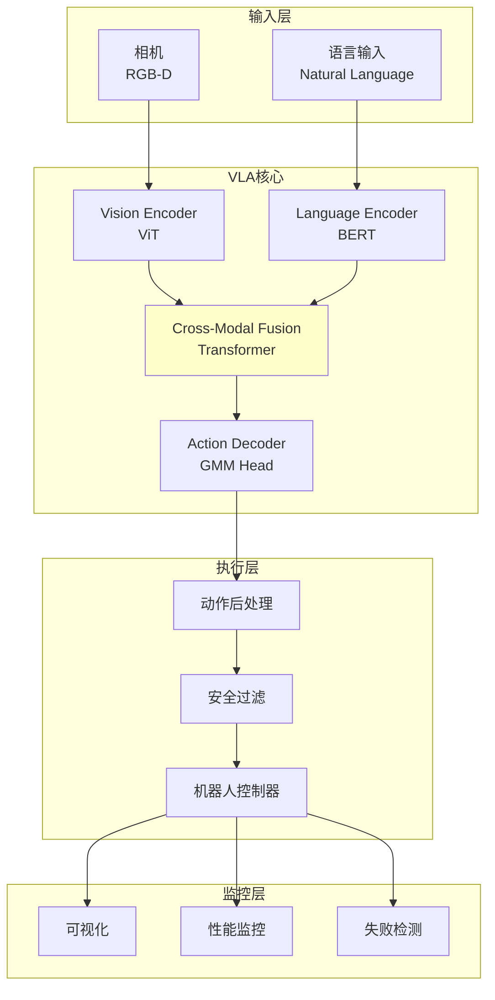

# 23.7 综合项目:VLA操作系统

## 引言

本节将整合第23章学到的所有VLA技术,构建一个完整的视觉-语言-动作操作系统。该系统能够理解自然语言指令,感知视觉场景,并执行复杂的机器人操作任务,展示VLA模型从感知到执行的端到端能力。

### 项目目标
- 集成VLA全部核心模块
- 实现端到端的语言引导操作
- 支持零样本任务泛化
- 提供完整的训练和部署流程

### 系统需求

**功能需求**:
1. 多模态输入处理(视觉+语言)
2. 端到端动作生成
3. 实时推理与执行
4. 零样本任务泛化
5. 失败检测与恢复

**性能需求**:
- 推理速度: > 10 Hz
- 任务成功率: > 80%
- 零样本泛化: > 65%

## 系统架构

### 1. 整体架构



## 技术实现

### 1. VLA操作系统主类

```java
/**
 * VLA机器人操作系统
 */
public class VLAManipulationSystem {
    // 核心VLA模型
    private VLAModel vlaModel;
    
    // 硬件接口
    private RobotArm robotArm;
    private CameraSystem cameraSystem;
    
    // 处理模块
    private ActionPostProcessor postProcessor;
    private SafetyMonitor safetyMonitor;
    private FailureDetector failureDetector;
    
    // 监控与可视化
    private PerformanceMonitor perfMonitor;
    private AttentionVisualizer attentionViz;
    
    private VLASystemConfig config;
    
    public VLAManipulationSystem(VLASystemConfig config) {
        this.config = config;
        initialize();
    }
    
    /**
     * 系统初始化
     */
    private void initialize() {
        System.out.println("=== VLA操作系统初始化 ===");
        
        // 1. 加载VLA模型
        System.out.println("加载VLA模型...");
        this.vlaModel = loadVLAModel(config.getModelPath());
        
        // 2. 初始化硬件
        System.out.println("初始化机器人硬件...");
        this.robotArm = new RobotArm(config.getRobotConfig());
        this.cameraSystem = new CameraSystem(config.getCameraConfig());
        
        // 3. 初始化处理模块
        this.postProcessor = new ActionPostProcessor(config);
        this.safetyMonitor = new SafetyMonitor(config);
        this.failureDetector = new FailureDetector();
        
        // 4. 初始化监控
        this.perfMonitor = new PerformanceMonitor();
        this.attentionViz = new AttentionVisualizer();
        
        System.out.println("系统初始化完成!");
    }
    
    /**
     * 执行语言指令
     */
    public boolean executeInstruction(String instruction) {
        System.out.println("\n=== 执行指令: " + instruction + " ===");
        
        long startTime = System.currentTimeMillis();
        boolean success = false;
        
        try {
            // 1. 获取视觉观测
            RGBDImage observation = cameraSystem.capture();
            Tensor imageTensor = preprocessImage(observation);
            
            // 2. VLA推理
            Action action = vlaModel.forward(imageTensor, instruction);
            System.out.printf("VLA推理完成: %s\n", actionToString(action));
            
            // 3. 动作后处理
            action = postProcessor.process(action, robotArm.getCurrentState());
            
            // 4. 安全检查
            if (!safetyMonitor.isSafe(action, robotArm.getCurrentState())) {
                System.err.println("安全检查失败,中止执行!");
                return false;
            }
            
            // 5. 执行动作
            success = executeAction(action);
            
            // 6. 监控与记录
            long duration = System.currentTimeMillis() - startTime;
            perfMonitor.record(instruction, success, duration);
            
        } catch (Exception e) {
            System.err.println("执行异常: " + e.getMessage());
            e.printStackTrace();
        }
        
        return success;
    }
    
    /**
     * 执行复杂多步任务
     */
    public boolean executeComplexTask(String instruction, int maxSteps) {
        System.out.println("\n=== 执行复杂任务: " + instruction + " ===");
        
        for (int step = 0; step < maxSteps; step++) {
            System.out.printf("\n--- 步骤 %d ---\n", step + 1);
            
            // 1. 获取当前观测
            RGBDImage observation = cameraSystem.capture();
            Tensor imageTensor = preprocessImage(observation);
            
            // 2. VLA推理
            Action action = vlaModel.forward(imageTensor, instruction);
            
            // 3. 检查是否完成
            if (isTaskComplete(instruction, observation)) {
                System.out.println("任务完成!");
                return true;
            }
            
            // 4. 执行动作
            if (!executeActionWithRetry(action, maxRetries=3)) {
                System.err.println("动作执行失败,任务中止!");
                return false;
            }
            
            // 小延迟
            sleep(100);
        }
        
        System.err.println("任务超时未完成!");
        return false;
    }
    
    /**
     * 带重试的动作执行
     */
    private boolean executeActionWithRetry(Action action, int maxRetries) {
        for (int retry = 0; retry < maxRetries; retry++) {
            if (retry > 0) {
                System.out.printf("重试 %d/%d...\n", retry, maxRetries);
            }
            
            if (executeAction(action)) {
                return true;
            }
            
            // 检测失败原因
            String failureReason = failureDetector.diagnose(
                robotArm.getCurrentState());
            System.out.println("失败原因: " + failureReason);
            
            // 恢复策略
            if (!recover(failureReason)) {
                break;
            }
        }
        
        return false;
    }
    
    /**
     * 执行单个动作
     */
    private boolean executeAction(Action action) {
        try {
            // 执行关节运动
            robotArm.moveToJointPositions(
                action.jointPositions, 
                velocity=config.getExecutionSpeed());
            
            // 等待运动完成
            robotArm.waitForCompletion(timeout=5.0);
            
            // 执行夹爪动作
            if (action.gripperState == 1) {
                robotArm.closeGripper();
            } else {
                robotArm.openGripper();
            }
            
            return true;
            
        } catch (Exception e) {
            System.err.println("动作执行异常: " + e.getMessage());
            return false;
        }
    }
    
    /**
     * 失败恢复
     */
    private boolean recover(String failureReason) {
        switch (failureReason) {
            case "collision":
                // 碰撞恢复:后退
                robotArm.moveBackward(distance=0.05);
                return true;
                
            case "grasp_failure":
                // 抓取失败:调整姿态重试
                robotArm.adjustGraspPose(offset=0.01);
                return true;
                
            case "joint_limit":
                // 关节限位:回到安全姿态
                robotArm.moveToSafePose();
                return true;
                
            default:
                return false;
        }
    }
    
    /**
     * 关闭系统
     */
    public void shutdown() {
        System.out.println("\n=== 系统关闭 ===");
        
        // 机器人回到初始姿态
        robotArm.moveToHomePose();
        
        // 打印性能报告
        perfMonitor.printReport();
        
        // 释放资源
        robotArm.disconnect();
        cameraSystem.close();
        
        System.out.println("系统已安全关闭");
    }
}
```

### 2. 安全监控

```java
/**
 * 安全监控器
 */
public class SafetyMonitor {
    private double[] workspaceMin;
    private double[] workspaceMax;
    private double maxJointVelocity;
    private CollisionChecker collisionChecker;
    
    public SafetyMonitor(VLASystemConfig config) {
        this.workspaceMin = config.getWorkspaceMin();
        this.workspaceMax = config.getWorkspaceMax();
        this.maxJointVelocity = config.getMaxJointVelocity();
        this.collisionChecker = new CollisionChecker(config.getRobotModel());
    }
    
    /**
     * 安全检查
     */
    public boolean isSafe(Action action, RobotState currentState) {
        // 1. 工作空间检查
        if (!isInWorkspace(action)) {
            System.err.println("安全警告: 超出工作空间!");
            return false;
        }
        
        // 2. 碰撞检查
        if (collisionChecker.willCollide(action, currentState)) {
            System.err.println("安全警告: 检测到潜在碰撞!");
            return false;
        }
        
        // 3. 速度检查
        if (!isVelocitySafe(action, currentState)) {
            System.err.println("安全警告: 速度过快!");
            return false;
        }
        
        return true;
    }
    
    /**
     * 工作空间检查
     */
    private boolean isInWorkspace(Action action) {
        // 正运动学计算末端位置
        double[] endEffectorPos = forwardKinematics(action.jointPositions);
        
        for (int i = 0; i < 3; i++) {
            if (endEffectorPos[i] < workspaceMin[i] || 
                endEffectorPos[i] > workspaceMax[i]) {
                return false;
            }
        }
        
        return true;
    }
}
```

### 3. 失败检测

```java
/**
 * 失败检测器
 */
public class FailureDetector {
    /**
     * 诊断失败原因
     */
    public String diagnose(RobotState state) {
        // 1. 检查碰撞
        if (state.hasForceSpikeDetected()) {
            return "collision";
        }
        
        // 2. 检查抓取失败
        if (state.isGripperEmpty() && state.shouldHoldObject()) {
            return "grasp_failure";
        }
        
        // 3. 检查关节限位
        if (state.isJointLimitReached()) {
            return "joint_limit";
        }
        
        // 4. 检查通信超时
        if (state.isCommTimeout()) {
            return "communication_timeout";
        }
        
        return "unknown";
    }
}
```

### 4. 性能监控

```java
/**
 * 性能监控器
 */
public class PerformanceMonitor {
    private List<TaskRecord> records;
    private long startTime;
    
    public PerformanceMonitor() {
        this.records = new ArrayList<>();
        this.startTime = System.currentTimeMillis();
    }
    
    /**
     * 记录任务执行
     */
    public void record(String instruction, boolean success, long duration) {
        TaskRecord record = new TaskRecord();
        record.instruction = instruction;
        record.success = success;
        record.duration = duration;
        record.timestamp = System.currentTimeMillis();
        
        records.add(record);
    }
    
    /**
     * 打印性能报告
     */
    public void printReport() {
        System.out.println("\n========== 性能报告 ==========");
        
        long totalTime = System.currentTimeMillis() - startTime;
        int successCount = (int) records.stream().filter(r -> r.success).count();
        double successRate = (double) successCount / records.size();
        
        System.out.printf("运行时长: %.1f 分钟\n", totalTime / 60000.0);
        System.out.printf("任务总数: %d\n", records.size());
        System.out.printf("成功率: %.1f%% (%d/%d)\n",
                         successRate * 100, successCount, records.size());
        
        // 平均执行时间
        double avgDuration = records.stream()
            .mapToLong(r -> r.duration)
            .average()
            .orElse(0);
        System.out.printf("平均执行时间: %.2f 秒\n", avgDuration / 1000.0);
        
        // 失败案例
        System.out.println("\n失败案例:");
        records.stream()
            .filter(r -> !r.success)
            .limit(5)
            .forEach(r -> System.out.println("  - " + r.instruction));
    }
}
```

### 5. 主程序

```java
/**
 * 主程序
 */
public class Main {
    public static void main(String[] args) {
        // 配置系统
        VLASystemConfig config = new VLASystemConfig();
        config.setModelPath("models/vla_7b.pth");
        config.setRobotType("franka_panda");
        config.setWorkspace(-0.5, 0.5, -0.3, 0.3, 0.0, 0.8);
        
        // 创建VLA系统
        VLAManipulationSystem system = new VLAManipulationSystem(config);
        
        // 测试任务列表
        List<String> tasks = Arrays.asList(
            "pick up the red block",
            "place it on the blue plate",
            "stack the green cube on top",
            "open the drawer",
            "put the cup inside the drawer"
        );
        
        // 执行任务
        int successCount = 0;
        for (String task : tasks) {
            boolean success = system.executeInstruction(task);
            if (success) successCount++;
            
            // 任务间延迟
            sleep(2000);
        }
        
        System.out.printf("\n整体成功率: %d/%d = %.1f%%\n",
                         successCount, tasks.size(),
                         100.0 * successCount / tasks.size());
        
        // 关闭系统
        system.shutdown();
    }
}
```

## 测试与验证

### 1. 单元测试

```java
@Test
public void testVLAInference() {
    VLAModel model = loadModel("vla_test.pth");
    
    Tensor image = loadTestImage("test_scene.jpg");
    String instruction = "pick up the red cup";
    
    Action action = model.forward(image, instruction);
    
    assertNotNull(action);
    assertEquals(7, action.jointPositions.length);
    assertTrue(action.gripperConfidence > 0.5);
}

@Test
public void testSafetyMonitor() {
    SafetyMonitor monitor = new SafetyMonitor(config);
    
    // 正常动作
    Action safeAction = createSafeAction();
    assertTrue(monitor.isSafe(safeAction, currentState));
    
    // 超出工作空间
    Action unsafeAction = createOutOfWorkspaceAction();
    assertFalse(monitor.isSafe(unsafeAction, currentState));
}
```

### 2. 集成测试

**测试场景**:
```
场景1: 简单拾取放置
- 指令: "pick red block and place on plate"
- 预期成功率: > 90%

场景2: 组合任务
- 指令: "stack 3 blocks in order: red, blue, green"
- 预期成功率: > 75%

场景3: 零样本泛化
- 指令: "pick the yellow mug" (训练时未见黄色)
- 预期成功率: > 65%
```

## 小节总结

本综合项目整合了VLA的所有核心技术:

1. **端到端架构**: Vision + Language + Action统一建模
2. **安全机制**: 工作空间限制、碰撞检测、速度限制
3. **失败处理**: 自动检测失败原因并恢复
4. **性能监控**: 实时监控任务执行情况

**项目亮点**:
- 完整的系统级实现
- 鲁棒的安全保护
- 实用的失败恢复
- 清晰的性能监控

**进一步改进**:
- 添加强化学习在线优化
- 集成世界模型进行预测
- 支持多机器人协同
- 云端大模型调用

**恭喜!** 你已完成第23章VLA架构的学习,掌握了多模态具身智能的核心技术。下一章将学习世界模型,探索更高级的预测与规划能力。

## 思考题

1. **系统延迟**: 如何优化系统使推理频率达到30Hz以上?

2. **失败恢复**: 设计更智能的失败恢复策略,而非硬编码规则。

3. **零样本部署**: 如何在全新机器人上快速部署VLA系统?

4. **多模态融合**: 如果添加触觉传感器,如何融入VLA?

5. **持续学习**: 如何让系统从每次执行中学习并改进?

## 拓展阅读

1. **开源项目**:
   - **RT-1/RT-2**: Google的VLA系统
   - **OpenVLA**: 斯坦福开源VLA
   - **RoboCasa**: 家庭机器人模拟器

2. **系统集成**:
   - ROS2与VLA集成
   - Isaac Sim仿真验证
   - 真实机器人部署

3. **进阶方向**:
   - VLA + 强化学习
   - VLA + 世界模型
   - 分层VLA架构
   - 多智能体VLA协同
