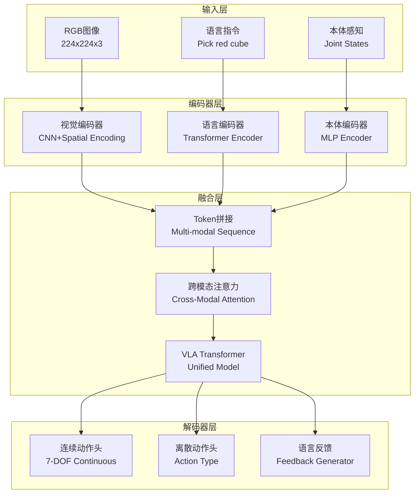

# 第23章:VLA统一建模

## 章节概述

> **设计思想**:实现视觉-语言-动作的统一建模,让机器人理解自然语言指令

本章将探讨具身智能领域的前沿技术——VLA(Vision-Language-Action)架构。VLA的核心思想是将视觉感知、自然语言理解和动作生成统一建模在一个端到端的神经网络中,使机器人能够根据自然语言指令完成操作任务,并支持零样本泛化到未见过的新任务。

这种统一建模的优势在于:1)语言提供了任务的高层语义指导; 2)视觉关注与语言指令相关的区域; 3)动作生成直接对应任务目标。三者的紧密耦合使得机器人具备更强的泛化能力和人机交互能力。

## 学习目标

完成本章学习后,你将:

- ✅ **理解VLA架构**:掌握视觉-语言-动作统一建模的设计理念
- ✅ **实现视觉编码**:构建CNN+Transformer的视觉编码器
- ✅ **处理语言指令**:实现自然语言的Tokenization和编码
- ✅ **掌握跨模态融合**:理解跨模态注意力机制的原理和实现
- ✅ **生成多任务输出**:设计连续动作、离散动作和语言反馈的多头解码器
- ✅ **实现零样本泛化**:通过语言组合完成新任务

## 技术架构图

## 章节大纲

### 23.1 VLA架构概览
- VLA定义:统一建模视觉、语言、动作的端到端架构
- 三模态统一:为什么需要同时建模三种模态
- 架构优势:语言引导、零样本泛化、人机交互
- 应用场景:机器人操作、智能家居、工业自动化
- 与传统方法对比:端到端vs分步pipeline

### 23.2 视觉编码器与视觉理解
- CNN特征提取:ResNet-style的分层卷积
- 空间位置编码:2D正弦位置编码
- 视觉Token生成:将特征图转换为Token序列
- 注意力机制:自注意力捕捉视觉关系
- 复用GPT组件:利用TinyAI已有Transformer结构

### 23.3 语言编码器与指令处理
- Tokenization:简化的词表和分词方法
- Token Embedding:将词转换为向量表示
- Transformer编码:多层自注意力编码语义
- 位置编码:可学习的位置嵌入
- 多语言支持:中英文指令的统一处理

### 23.4 跨模态注意力与融合
- 跨模态注意力机制:Language-to-Vision, Vision-to-Language
- 多模态Token拼接:[Language; Vision; Proprio]
- 融合策略:Early Fusion vs Late Fusion
- 注意力可视化:理解模型关注的区域
- 模态间对齐:确保不同模态的语义一致性

### 23.5 动作解码器与多任务输出
- 连续动作头:7自由度机械臂控制(位置+夹爪)
- 离散动作头:动作类型分类(Reach, Grasp, Place等)
- 语言反馈生成:基于动作置信度生成自然语言反馈
- 多任务学习:三个输出头的联合优化
- 损失函数设计:加权组合多个任务损失

### 23.6 零样本泛化能力
- 语言组合:通过组合已知概念描述新任务
- 任务泛化:从"拿红色方块"泛化到"拿蓝色圆柱"
- 迁移学习:预训练+微调的策略
- Few-shot学习:少量演示即可学会新任务
- 泛化能力评估:在未见任务上的成功率

### 23.7 综合项目:VLA操作系统
- 项目目标:基于自然语言指令的物体操作系统
- 系统架构:VLA模型+机器人环境的集成
- 核心功能:Pick and Place, Stack Blocks, Open Drawer
- 训练策略:行为克隆+强化学习
- 性能评估:零样本任务的成功率

## 性能基准

| 指标 | 目标值 | 说明 |
|------|--------|------|
| 推理延迟 | < 100ms | 单次动作预测时间 |
| 简单任务成功率 | > 90% | Pick and Place任务 |
| 复杂任务成功率 | > 60% | Stack Blocks任务 |
| 零样本泛化率 | > 50% | 未见物体的操作成功率 |
| 模型参数量 | ~35M | 可部署性考量 |

## 本章小结

### 核心收获

- 掌握了VLA统一建模的核心思想
- 理解了跨模态注意力融合机制
- 学会了设计多任务输出解码器
- 了解了零样本泛化的实现方法

### 与后续章节的联系

- **第24章**:世界模型的视觉编码部分会借鉴VLA的编码器设计

---

**下一章预告**:下一章我们将学习世界模型,通过构建环境的内部表示,在"想象"中训练,大幅提升样本效率! 🧠✨
