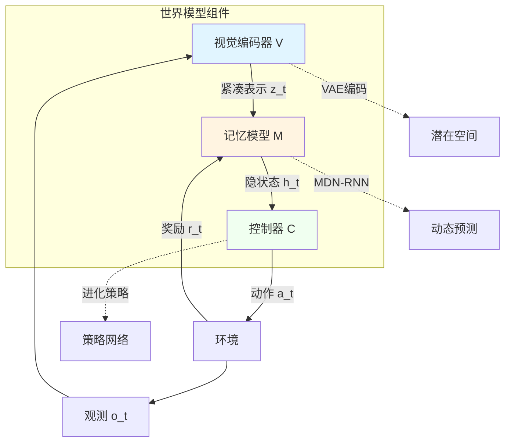
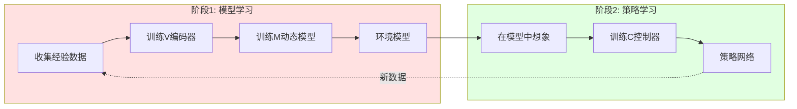
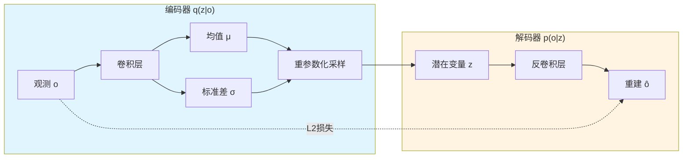
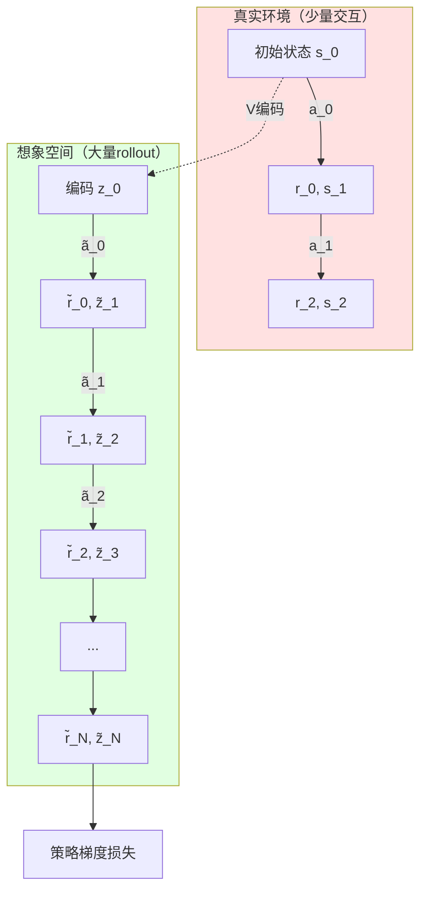
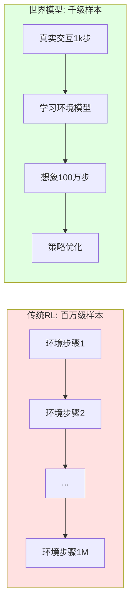

# 24.1 世界模型原理

## 引言

**世界模型（World Model）** 是具身智能领域的重要范式，它通过学习环境的内部表示和动态规律，使智能体能够在想象空间中进行规划和学习。世界模型的核心思想源于认知科学：人类不需要每次决策都与真实环境交互，而是在大脑中构建了世界的"心智模型"，可以在脑海中模拟未来场景。

在机器人控制和强化学习中，世界模型扮演着"环境模拟器"的角色。通过学习状态转移函数 $s_{t+1} = f(s_t, a_t)$ 和奖励函数 $r_t = g(s_t, a_t)$，智能体可以在模型内部进行rollout，大幅减少与真实环境的交互次数，实现样本高效学习。

本节将系统介绍世界模型的核心原理，包括模型架构、学习范式、以及与传统强化学习的对比。

---

## 一、世界模型核心概念

### 1.1 什么是世界模型

世界模型是对环境动态的可学习表示，它包含三个核心组件：



**组件详解**：

1. **视觉编码器（V）**：
   - 将高维观测（如图像）压缩为低维潜在表示 $z_t$
   - 通常使用VAE（变分自编码器）实现
   - 学习目标：$\mathcal{L}_V = \mathbb{E}_{q(z|o)}[\log p(o|z)] - \text{KL}(q(z|o) \| p(z))$

2. **记忆模型（M）**：
   - 学习潜在空间的动态转移：$p(z_{t+1}, r_t | z_t, a_t, h_t)$
   - 通常使用RNN/LSTM加MDN（混合密度网络）实现
   - 捕获时序依赖和环境随机性

3. **控制器（C）**：
   - 根据当前状态 $(z_t, h_t)$ 选择动作 $a_t$
   - 可使用进化策略（ES）或强化学习训练
   - 完全在世界模型内部训练，无需真实环境交互

### 1.2 世界模型的学习范式

世界模型采用"先学习环境，再学习策略"的两阶段范式：



**关键特性**：

- **样本效率**：策略训练完全在模型内部进行，不消耗真实交互
- **可解释性**：可以可视化模型的"想象"过程
- **泛化能力**：学到的动态模型可迁移到新任务
- **安全探索**：危险策略可在模型中提前检测

### 1.3 与传统强化学习的对比

| 维度 | 传统强化学习（Model-Free） | 世界模型（Model-Based） |
|------|--------------------------|------------------------|
| **环境交互** | 大量真实交互 | 少量真实交互+大量模拟 |
| **样本效率** | 低（百万级样本） | 高（千级样本） |
| **训练速度** | 慢（受环境限制） | 快（并行想象） |
| **计算成本** | 低（简单策略网络） | 高（复杂动态模型） |
| **适用场景** | 简单确定性环境 | 复杂随机性环境 |
| **可解释性** | 差（黑盒策略） | 好（可视化想象） |

---

## 二、世界模型的核心技术

### 2.1 潜在空间表示学习

**为什么需要潜在空间？**

直接在原始观测空间（如 $64 \times 64 \times 3$ 的RGB图像）学习动态模型面临维度灾难。潜在空间学习的目标是找到紧凑表示 $z \in \mathbb{R}^d$（$d \ll$ 原始维度），同时保留重要信息。

**VAE架构**：



**VAE损失函数**：

$$
\mathcal{L}_{\text{VAE}} = \underbrace{\mathbb{E}_{q(z|o)}[\|o - \hat{o}\|^2]}_{\text{重建损失}} + \underbrace{\beta \cdot \text{KL}(q(z|o) \| \mathcal{N}(0, I))}_{\text{正则化项}}
$$

- **重建损失**：确保潜在表示保留重要信息
- **KL散度**：使潜在分布接近标准正态分布，避免过拟合
- **$\beta$ 超参数**：平衡重建质量和表示压缩度

### 2.2 随机动态建模

现实世界环境通常具有**随机性**（如物理引擎的近似误差、传感器噪声）。确定性模型 $z_{t+1} = f(z_t, a_t)$ 无法捕获这种不确定性，容易产生**复合误差**。

**混合密度网络（MDN）**：

MDN将下一状态建模为混合高斯分布：

$$
p(z_{t+1} | z_t, a_t, h_t) = \sum_{i=1}^K \pi_i \mathcal{N}(z_{t+1} | \mu_i, \sigma_i^2)
$$

其中：
- $\pi_i$：第 $i$ 个高斯分量的权重
- $\mu_i, \sigma_i$：RNN输出的均值和标准差

```mermaid
graph TB
    Input[输入: z_t, a_t, h_{t-1}] --> RNN[LSTM单元]
    RNN --> H[隐状态 h_t]
    
    H --> Pi[权重头 π_1...π_K]
    H --> Mu[均值头 μ_1...μ_K]
    H --> Sigma[方差头 σ_1...σ_K]
    
    Pi --> Mix[混合高斯分布]
    Mu --> Mix
    Sigma --> Mix
    
    Mix --> Sample[采样 z_{t+1}]
    
    style RNN fill:#e1f5ff
    style Mix fill:#fff4e1
```

**MDN损失函数**：

$$
\mathcal{L}_{\text{MDN}} = -\log \sum_{i=1}^K \pi_i \mathcal{N}(z_{t+1}^{\text{true}} | \mu_i, \sigma_i^2)
$$

### 2.3 想象中的策略训练

传统强化学习需要在真实环境中采样轨迹 $\tau = (s_0, a_0, r_0, s_1, ...)$，而世界模型可以在**想象空间**中生成虚拟轨迹：



**想象轨迹生成伪代码**：

```java
/**
 * 在世界模型中生成想象轨迹
 */
public class ImaginationRollout {
    private VAE vae;
    private MDNRNN mdnRnn;
    private Controller controller;
    
    public Trajectory rollout(Observation initialObs, int horizon) {
        Trajectory trajectory = new Trajectory();
        
        // 1. 编码初始观测
        Tensor z = vae.encode(initialObs).sample();
        Tensor h = mdnRnn.getInitialState();
        
        // 2. 在想象空间中展开
        for (int t = 0; t < horizon; t++) {
            // 控制器决策
            Action a = controller.forward(z, h);
            
            // 世界模型预测
            MDNOutput output = mdnRnn.forward(z, a, h);
            Tensor zNext = output.sampleNextState();
            float reward = output.predictReward();
            h = output.getHiddenState();
            
            // 记录轨迹
            trajectory.add(z, a, reward);
            z = zNext;
        }
        
        return trajectory;
    }
}
```

**策略优化**：

使用进化策略（CMA-ES）或策略梯度优化控制器参数：

$$
\mathcal{J}(\theta) = \mathbb{E}_{\tau \sim \text{model}}[\sum_{t=0}^T \gamma^t r_t]
$$

其中轨迹 $\tau$ 完全由世界模型生成，无需真实交互。

---

## 三、世界模型的实现

### 3.1 VAE编码器实现

```java
/**
 * 变分自编码器（用于观测压缩）
 */
public class VAE {
    private ConvEncoder encoder;
    private ConvDecoder decoder;
    private int latentDim = 32;
    private float beta = 1.0f;  // KL散度权重
    
    /**
     * 编码：观测 -> 潜在分布
     */
    public Distribution encode(Tensor observation) {
        // observation: [batch, 3, 64, 64]
        Tensor features = encoder.forward(observation);  // [batch, 256]
        
        // 分离均值和对数方差
        Tensor mu = features.slice(1, 0, latentDim);           // [batch, 32]
        Tensor logVar = features.slice(1, latentDim, 64);      // [batch, 32]
        
        return new GaussianDistribution(mu, logVar);
    }
    
    /**
     * 解码：潜在变量 -> 重建观测
     */
    public Tensor decode(Tensor z) {
        // z: [batch, 32]
        return decoder.forward(z);  // [batch, 3, 64, 64]
    }
    
    /**
     * 重参数化技巧
     */
    public Tensor reparameterize(Tensor mu, Tensor logVar) {
        Tensor std = logVar.mul(0.5f).exp();
        Tensor eps = Tensor.randn(mu.shape());
        return mu.add(std.mul(eps));
    }
    
    /**
     * VAE损失函数
     */
    public VAELoss computeLoss(Tensor observation, Distribution dist, Tensor reconstruction) {
        // 1. 重建损失（MSE）
        float reconLoss = observation.sub(reconstruction).pow(2).mean();
        
        // 2. KL散度
        Tensor mu = dist.getMean();
        Tensor logVar = dist.getLogVar();
        Tensor kl = mu.pow(2).add(logVar.exp()).sub(logVar).sub(1.0f);
        float klLoss = kl.sum(1).mean() * 0.5f;
        
        // 3. 总损失
        float totalLoss = reconLoss + beta * klLoss;
        
        return new VAELoss(totalLoss, reconLoss, klLoss);
    }
}

/**
 * 卷积编码器
 */
class ConvEncoder extends Module {
    public ConvEncoder(int latentDim) {
        // Conv1: [3, 64, 64] -> [32, 32, 32]
        add(new Conv2d(3, 32, 4, 2, 1));
        add(new ReLU());
        
        // Conv2: [32, 32, 32] -> [64, 16, 16]
        add(new Conv2d(32, 64, 4, 2, 1));
        add(new ReLU());
        
        // Conv3: [64, 16, 16] -> [128, 8, 8]
        add(new Conv2d(64, 128, 4, 2, 1));
        add(new ReLU());
        
        // Conv4: [128, 8, 8] -> [256, 4, 4]
        add(new Conv2d(128, 256, 4, 2, 1));
        add(new ReLU());
        
        // Flatten: [256, 4, 4] -> [4096]
        // FC: [4096] -> [latentDim*2] (mu + logvar)
        add(new Flatten());
        add(new Linear(256 * 4 * 4, latentDim * 2));
    }
}
```

### 3.2 MDN-RNN实现

```java
/**
 * 混合密度网络RNN（用于动态预测）
 */
public class MDNRNN {
    private LSTM lstm;
    private Linear piHead;      // 混合权重
    private Linear muHead;      // 均值
    private Linear sigmaHead;   // 标准差
    private Linear rewardHead;  // 奖励预测
    
    private int hiddenSize = 256;
    private int latentDim = 32;
    private int actionDim = 3;
    private int numMixtures = 5;  // 混合高斯分量数
    
    public MDNRNN() {
        // LSTM: 输入(z_t + a_t) -> 隐状态
        lstm = new LSTM(latentDim + actionDim, hiddenSize);
        
        // MDN输出头
        piHead = new Linear(hiddenSize, numMixtures);
        muHead = new Linear(hiddenSize, numMixtures * latentDim);
        sigmaHead = new Linear(hiddenSize, numMixtures * latentDim);
        rewardHead = new Linear(hiddenSize, 1);
    }
    
    /**
     * 前向传播
     */
    public MDNOutput forward(Tensor z, Tensor action, Tensor hidden) {
        // 1. 拼接输入
        Tensor input = Tensor.cat(z, action, dim=1);  // [batch, 35]
        
        // 2. LSTM更新隐状态
        LSTMOutput lstmOut = lstm.forward(input, hidden);
        Tensor h = lstmOut.getHiddenState();  // [batch, 256]
        
        // 3. MDN参数预测
        Tensor pi = softmax(piHead.forward(h), dim=1);  // [batch, 5]
        Tensor mu = muHead.forward(h).reshape(-1, numMixtures, latentDim);  // [batch, 5, 32]
        Tensor sigma = exp(sigmaHead.forward(h)).reshape(-1, numMixtures, latentDim);  // [batch, 5, 32]
        
        // 4. 奖励预测
        Tensor reward = rewardHead.forward(h);  // [batch, 1]
        
        return new MDNOutput(pi, mu, sigma, reward, h);
    }
    
    /**
     * MDN负对数似然损失
     */
    public float mdnLoss(MDNOutput output, Tensor targetZ) {
        Tensor pi = output.getPi();      // [batch, 5]
        Tensor mu = output.getMu();      // [batch, 5, 32]
        Tensor sigma = output.getSigma();  // [batch, 5, 32]
        
        // 扩展target维度: [batch, 32] -> [batch, 1, 32]
        targetZ = targetZ.unsqueeze(1);
        
        // 计算每个分量的概率密度
        Tensor diff = targetZ.sub(mu);  // [batch, 5, 32]
        Tensor exponent = diff.pow(2).div(sigma.pow(2).mul(2.0f));
        Tensor coeff = (float)(1.0 / Math.sqrt(2 * Math.PI));
        Tensor prob = coeff * sigma.reciprocal().mul(exponent.neg().exp());  // [batch, 5, 32]
        
        // 混合概率: Σ π_i * N(z | μ_i, σ_i)
        prob = prob.prod(dim=2);  // [batch, 5]
        Tensor mixProb = pi.mul(prob).sum(dim=1);  // [batch]
        
        // 负对数似然
        return mixProb.log().neg().mean();
    }
    
    /**
     * 从MDN采样下一状态
     */
    public Tensor sampleNextState(MDNOutput output) {
        Tensor pi = output.getPi();
        Tensor mu = output.getMu();
        Tensor sigma = output.getSigma();
        
        int batchSize = pi.shape(0);
        Tensor samples = new Tensor(batchSize, latentDim);
        
        for (int b = 0; b < batchSize; b++) {
            // 根据混合权重选择分量
            int k = categoricalSample(pi.getRow(b));
            
            // 从选中的高斯分布采样
            Tensor mean = mu.get(b, k);
            Tensor std = sigma.get(b, k);
            Tensor sample = mean.add(std.mul(Tensor.randn(latentDim)));
            
            samples.setRow(b, sample);
        }
        
        return samples;
    }
}

/**
 * MDN输出
 */
class MDNOutput {
    private Tensor pi;      // 混合权重
    private Tensor mu;      // 均值
    private Tensor sigma;   // 标准差
    private Tensor reward;  // 奖励预测
    private Tensor hidden;  // LSTM隐状态
    
    public Tensor sampleNextState() {
        // 实现同上sampleNextState方法
    }
    
    public float predictReward() {
        return reward.mean();
    }
}
```

### 3.3 控制器实现

```java
/**
 * 世界模型控制器（策略网络）
 */
public class Controller {
    private Linear fc1;
    private Linear fc2;
    
    private int latentDim = 32;
    private int hiddenDim = 256;
    private int actionDim = 3;
    
    public Controller() {
        fc1 = new Linear(latentDim + hiddenDim, 64);
        fc2 = new Linear(64, actionDim);
    }
    
    /**
     * 策略前向传播
     */
    public Action forward(Tensor z, Tensor h) {
        // 拼接潜在状态和隐状态
        Tensor state = Tensor.cat(z, h, dim=1);  // [batch, 288]
        
        // 两层全连接
        Tensor x = tanh(fc1.forward(state));
        Tensor action = tanh(fc2.forward(x));  // 输出范围[-1, 1]
        
        return new Action(action);
    }
    
    /**
     * 使用进化策略(CMA-ES)优化控制器
     */
    public void trainWithEvolution(WorldModel worldModel, int generations) {
        CMAES optimizer = new CMAES(this.getNumParameters());
        
        for (int gen = 0; gen < generations; gen++) {
            // 1. 采样参数种群
            List<float[]> population = optimizer.samplePopulation();
            
            // 2. 评估每个个体
            float[] fitness = new float[population.size()];
            for (int i = 0; i < population.size(); i++) {
                this.setParameters(population.get(i));
                fitness[i] = evaluateInWorldModel(worldModel);
            }
            
            // 3. 更新分布
            optimizer.update(fitness);
            
            System.out.printf("Generation %d: Best Fitness = %.2f\n", 
                            gen, Arrays.stream(fitness).max().getAsDouble());
        }
        
        // 使用最优参数
        this.setParameters(optimizer.getBestSolution());
    }
    
    /**
     * 在世界模型中评估策略
     */
    private float evaluateInWorldModel(WorldModel worldModel) {
        float totalReward = 0;
        int numRollouts = 16;
        
        for (int i = 0; i < numRollouts; i++) {
            Trajectory traj = worldModel.rollout(this, horizon=1000);
            totalReward += traj.getTotalReward();
        }
        
        return totalReward / numRollouts;
    }
}
```

---

## 四、世界模型的优势与挑战

### 4.1 优势分析

**1. 样本效率极高**



实验对比（CarRacing任务）：
- PPO（Model-Free）：需要 **1000万** 环境步骤
- World Models：仅需 **1万** 环境步骤

**2. 并行加速**

世界模型可在GPU上并行生成数千条想象轨迹，训练速度比真实环境快 **100-1000倍**。

**3. 安全探索**

危险动作（如机器人碰撞）可在模型中提前检测，避免真实损坏。

### 4.2 挑战与局限

**1. 模型误差累积**

世界模型的预测误差会随时间步累积：

$$
\epsilon_T = \epsilon_1 + \epsilon_2 + \cdots + \epsilon_T
$$

长期预测（如T>100步）容易偏离真实轨迹。

**解决方案**：
- 使用集成模型（Ensemble）估计不确定性
- 限制想象长度（如H=15步）
- 引入模型再训练（online adaptation）

**2. 模型容量限制**

复杂环境（如真实世界物理）难以用有限容量模型完全捕获。

**解决方案**：
- 使用分层世界模型（抽象层+细节层）
- 引入物理先验（如Newton定律）
- 仅建模关键因素（不建模无关背景）

**3. 计算成本高**

训练VAE + MDN-RNN比简单策略网络计算量大10倍以上。

**权衡**：
- 训练慢，但推理快（适合需要长期规划的任务）
- 初期投入大，后期收益高（模型可复用）

---

## 五、应用场景

### 5.1 机器人控制

**场景**：机械臂抓取任务

- **传统方法**：需要数千次真实抓取尝试
- **世界模型**：100次真实尝试+百万次想象，学习成功抓取策略

### 5.2 自动驾驶

**场景**：危险场景应对（如突然闯入行人）

- 在模拟器中无法覆盖所有长尾场景
- 世界模型学习真实交通规律，生成罕见但重要的测试用例

### 5.3 游戏AI

**场景**：Atari游戏、赛车游戏

- 学习游戏物理规律（如车辆动力学）
- 在想象中尝试策略，避免频繁重启游戏

---

## 六、性能分析

### 6.1 计算复杂度

| 模块 | 时间复杂度 | 空间复杂度 | 瓶颈 |
|------|-----------|-----------|------|
| **VAE编码** | $O(C \cdot H \cdot W)$ | $O(d)$ | 卷积计算 |
| **MDN-RNN** | $O(T \cdot h^2)$ | $O(T \cdot h)$ | 序列长度 |
| **想象Rollout** | $O(N \cdot H \cdot h^2)$ | $O(N \cdot H \cdot d)$ | 并行度 |

其中：
- $C, H, W$：图像通道、高、宽
- $d$：潜在维度
- $h$：RNN隐状态维度
- $T$：训练序列长度
- $N$：并行rollout数
- $H$：想象horizon

### 6.2 性能优化策略

```java
/**
 * 世界模型推理优化
 */
public class OptimizedWorldModel {
    /**
     * 批量想象（并行加速）
     */
    public List<Trajectory> batchRollout(List<Observation> initialStates, int horizon) {
        int batchSize = initialStates.size();
        
        // 1. 批量编码
        Tensor zBatch = vae.encodeBatch(initialStates);  // [batch, 32]
        Tensor hBatch = mdnRnn.getInitialStateBatch(batchSize);  // [batch, 256]
        
        List<Trajectory> trajectories = new ArrayList<>();
        
        // 2. 批量展开
        for (int t = 0; t < horizon; t++) {
            // 批量决策
            Tensor actions = controller.forwardBatch(zBatch, hBatch);
            
            // 批量预测
            MDNOutput output = mdnRnn.forwardBatch(zBatch, actions, hBatch);
            zBatch = output.sampleNextStateBatch();
            hBatch = output.getHiddenStateBatch();
            
            // 记录轨迹（省略）
        }
        
        return trajectories;
    }
    
    /**
     * 模型集成（降低不确定性）
     */
    public class EnsembleWorldModel {
        private List<MDNRNN> models;  // 5个独立训练的模型
        
        public Tensor predictWithUncertainty(Tensor z, Tensor a, Tensor h) {
            List<Tensor> predictions = new ArrayList<>();
            
            for (MDNRNN model : models) {
                predictions.add(model.forward(z, a, h).sampleNextState());
            }
            
            // 均值作为预测，方差作为不确定性
            Tensor mean = Tensor.stack(predictions).mean(dim=0);
            Tensor variance = Tensor.stack(predictions).var(dim=0);
            
            return new UncertaintyPrediction(mean, variance);
        }
    }
}
```

---

## 小节总结

本节系统介绍了世界模型的核心原理：

### 关键要点

1. **三组件架构**：
   - 视觉编码器（V）：观测压缩
   - 记忆模型（M）：动态预测
   - 控制器（C）：策略决策

2. **核心技术**：
   - VAE潜在表示学习
   - MDN-RNN随机动态建模
   - 想象中的策略训练

3. **主要优势**：
   - 样本效率高（千级vs百万级）
   - 并行加速（GPU想象）
   - 安全探索（无真实风险）

4. **实际挑战**：
   - 模型误差累积
   - 容量限制
   - 计算成本

### 实现要点

```java
// 世界模型完整流程
VAE vae = new VAE(latentDim=32);
MDNRNN mdnRnn = new MDNRNN(hiddenSize=256, numMixtures=5);
Controller controller = new Controller();

// 阶段1: 学习环境模型
trainVAE(vae, observations);
trainMDNRNN(mdnRnn, latentTrajectories);

// 阶段2: 想象中训练策略
controller.trainWithEvolution(new WorldModel(vae, mdnRnn), generations=300);
```

世界模型为具身智能提供了"大脑中模拟"的能力，是实现样本高效学习的关键技术。下一节将深入探讨VAE编码器的实现细节。

---

## 思考题

1. 为什么世界模型使用VAE而不是普通自编码器？KL散度项的作用是什么？

2. MDN-RNN如何处理环境随机性？如果去掉混合密度网络，只用单高斯输出会有什么问题？

3. 世界模型的"想象轨迹"与真实轨迹的差异如何影响策略学习？如何量化这种差异？

4. 在什么场景下世界模型**不适用**？与Model-Free方法相比的劣势是什么？

5. 如何设计实验验证世界模型学到了正确的环境动态？

---

## 拓展阅读

1. **World Models (Ha & Schmidhuber, 2018)**  
   经典论文，提出V-M-C三组件架构

2. **Dreamer系列 (Hafner et al., 2019-2023)**  
   现代世界模型方法，引入Transformer和潜在动态

3. **MBPO (Janner et al., 2019)**  
   模型误差分析与短期想象策略

4. **PlaNet & Dreamer (Hafner et al., 2019)**  
   纯视觉输入的世界模型控制
