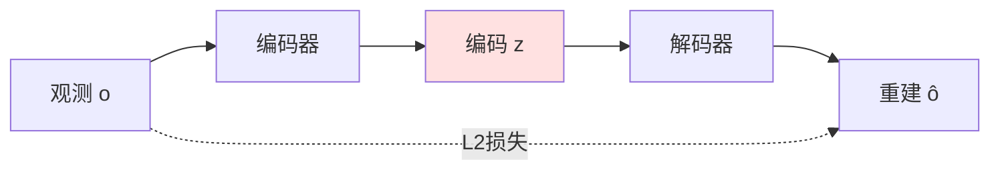
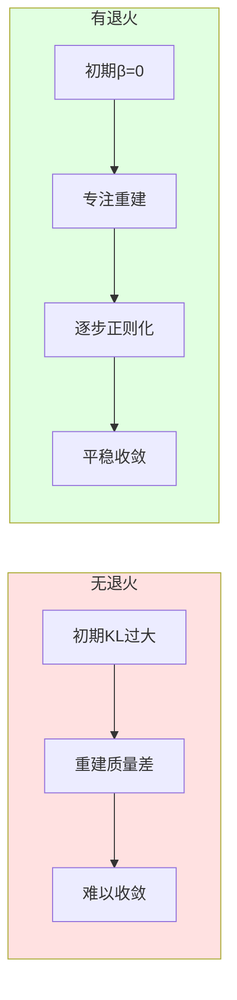

# 24.2 VAE编码器与表示学习

## 引言

在世界模型架构中，**VAE（Variational Autoencoder，变分自编码器）** 扮演着"感知压缩器"的关键角色。它将高维的原始观测（如 $64 \times 64 \times 3 = 12,288$ 维的RGB图像）压缩为低维的潜在表示（如 $32$ 维向量），在保留关键信息的同时大幅降低后续动态建模的复杂度。

相比普通自编码器，VAE的核心创新在于：
1. **概率建模**：学习潜在空间的分布 $p(z)$，而非确定性映射
2. **正则化约束**：通过KL散度使潜在分布平滑，避免过拟合
3. **可生成性**：可从先验分布 $p(z)$ 采样生成新观测

本节将深入探讨VAE的理论基础、架构设计、训练技巧，以及在世界模型中的应用细节。

---

## 一、VAE理论基础

### 1.1 从自编码器到变分自编码器

**普通自编码器的局限**：



普通自编码器学习确定性映射：
- 编码：$z = f_{\text{enc}}(o)$
- 解码：$\hat{o} = f_{\text{dec}}(z)$

**问题**：
1. **过拟合**：潜在空间不连续，相似输入的编码可能相距很远
2. **不可生成**：无法从潜在空间随机采样生成合理图像
3. **无正则化**：编码可能集中在潜在空间的某个角落

**VAE的改进**：

```mermaid
graph TB
    O[观测 o] --> Enc[编码器 q(z|o)]
    Enc --> |μ, σ| Dist[潜在分布]
    Dist --> |采样| Z[z ~ N(μ, σ²)]
    Z --> Dec[解码器 p(o|z)]
    Dec --> Recon[重建 ô]
    
    Prior[先验 p(z) = N(0,I)] -.-> |KL散度| Dist
    O -.-> |重建损失| Recon
    
    style Dist fill:#e1f5ff
    style Prior fill:#fff4e1
```

VAE学习概率分布：
- 编码器输出分布参数：$q(z|o) = \mathcal{N}(\mu(o), \sigma^2(o))$
- 解码器建模条件分布：$p(o|z)$
- 先验分布约束：$p(z) = \mathcal{N}(0, I)$

### 1.2 变分推断与ELBO

**生成模型视角**：

我们希望学习数据的生成过程：
$$
p(o) = \int p(o|z) p(z) dz
$$

但直接计算后验分布 $p(z|o) = \frac{p(o|z)p(z)}{p(o)}$ 是不可行的（分母难以计算）。

**变分推断**：

引入近似后验 $q(z|o)$ 来逼近真实后验 $p(z|o)$，最小化KL散度：

$$
\text{KL}(q(z|o) \| p(z|o)) = \mathbb{E}_{q(z|o)}[\log q(z|o) - \log p(z|o)]
$$

通过变分推断推导，得到**证据下界（ELBO）**：

$$
\begin{align}
\log p(o) &\geq \mathbb{E}_{q(z|o)}[\log p(o|z)] - \text{KL}(q(z|o) \| p(z)) \\
&= \underbrace{\mathbb{E}_{q(z|o)}[\log p(o|z)]}_{\text{重建项}} - \underbrace{\text{KL}(q(z|o) \| p(z))}_{\text{正则化项}}
\end{align}
$$

**直观理解**：

1. **重建项**：确保编码后能准确重建原始观测
2. **正则化项**：使编码分布接近先验分布 $\mathcal{N}(0, I)$，避免过拟合

### 1.3 重参数化技巧

**问题**：如何对随机采样 $z \sim q(z|o)$ 进行反向传播？

直接采样是不可微的，无法传递梯度。

**重参数化技巧（Reparameterization Trick）**：

将随机性移到外部噪声：

$$
\begin{align}
z &\sim \mathcal{N}(\mu, \sigma^2) \\
&\Downarrow \\
z &= \mu + \sigma \cdot \epsilon, \quad \epsilon \sim \mathcal{N}(0, 1)
\end{align}
$$

```mermaid
graph TB
    Input[输入 o] --> Enc[编码器]
    Enc --> Mu[均值 μ]
    Enc --> Sigma[标准差 σ]
    
    Noise[噪声 ε ~ N(0,1)] --> Mul[×]
    Sigma --> Mul
    Mul --> Add[+]
    Mu --> Add
    
    Add --> Z[潜在变量 z]
    Z --> Dec[解码器]
    Dec --> Output[重建 ô]
    
    style Noise fill:#ffe1e1
    style Z fill:#e1f5ff
```

现在梯度可以流经 $\mu$ 和 $\sigma$：

$$
\frac{\partial z}{\partial \mu} = 1, \quad \frac{\partial z}{\partial \sigma} = \epsilon
$$

---

## 二、VAE架构设计

### 2.1 卷积编码器

针对图像输入，使用卷积神经网络提取特征：

```java
/**
 * 卷积编码器（观测 -> 潜在分布参数）
 */
public class ConvEncoder {
    private Conv2d conv1;
    private Conv2d conv2;
    private Conv2d conv3;
    private Conv2d conv4;
    private Linear fc;
    
    private int latentDim;
    
    public ConvEncoder(int latentDim) {
        this.latentDim = latentDim;
        
        // 输入: [batch, 3, 64, 64]
        // Conv1: [3, 64, 64] -> [32, 32, 32]
        conv1 = new Conv2d(
            inChannels=3, 
            outChannels=32, 
            kernelSize=4, 
            stride=2, 
            padding=1
        );
        
        // Conv2: [32, 32, 32] -> [64, 16, 16]
        conv2 = new Conv2d(32, 64, 4, 2, 1);
        
        // Conv3: [64, 16, 16] -> [128, 8, 8]
        conv3 = new Conv2d(64, 128, 4, 2, 1);
        
        // Conv4: [128, 8, 8] -> [256, 4, 4]
        conv4 = new Conv2d(128, 256, 4, 2, 1);
        
        // FC: [256*4*4=4096] -> [latentDim*2]
        // 输出μ和log(σ²)
        fc = new Linear(256 * 4 * 4, latentDim * 2);
    }
    
    /**
     * 前向传播
     */
    public EncoderOutput forward(Tensor image) {
        // image: [batch, 3, 64, 64]
        
        Tensor x = relu(conv1.forward(image));     // [batch, 32, 32, 32]
        x = relu(conv2.forward(x));                // [batch, 64, 16, 16]
        x = relu(conv3.forward(x));                // [batch, 128, 8, 8]
        x = relu(conv4.forward(x));                // [batch, 256, 4, 4]
        
        x = x.flatten(startDim=1);                 // [batch, 4096]
        Tensor params = fc.forward(x);             // [batch, latentDim*2]
        
        // 分离均值和对数方差
        Tensor mu = params.slice(1, 0, latentDim);              // [batch, latentDim]
        Tensor logVar = params.slice(1, latentDim, latentDim*2); // [batch, latentDim]
        
        return new EncoderOutput(mu, logVar);
    }
}

/**
 * 编码器输出
 */
class EncoderOutput {
    private Tensor mu;
    private Tensor logVar;
    
    public EncoderOutput(Tensor mu, Tensor logVar) {
        this.mu = mu;
        this.logVar = logVar;
    }
    
    /**
     * 重参数化采样
     */
    public Tensor sample() {
        Tensor std = logVar.mul(0.5f).exp();       // std = exp(0.5 * log(σ²)) = σ
        Tensor eps = Tensor.randn(mu.shape());     // ε ~ N(0, 1)
        return mu.add(std.mul(eps));               // z = μ + σ * ε
    }
    
    public Tensor getMu() { return mu; }
    public Tensor getLogVar() { return logVar; }
}
```

**架构要点**：

1. **步长卷积**：使用stride=2代替池化，减少信息丢失
2. **特征维度递增**：32 → 64 → 128 → 256，逐步提取抽象特征
3. **输出log(σ²)**：确保方差为正，且数值稳定

### 2.2 反卷积解码器

解码器需要将潜在向量 $z$ 重建为原始分辨率图像：

```java
/**
 * 反卷积解码器（潜在变量 -> 重建观测）
 */
public class ConvDecoder {
    private Linear fc;
    private ConvTranspose2d deconv1;
    private ConvTranspose2d deconv2;
    private ConvTranspose2d deconv3;
    private ConvTranspose2d deconv4;
    
    private int latentDim;
    
    public ConvDecoder(int latentDim) {
        this.latentDim = latentDim;
        
        // FC: [latentDim] -> [256*4*4]
        fc = new Linear(latentDim, 256 * 4 * 4);
        
        // Deconv1: [256, 4, 4] -> [128, 8, 8]
        deconv1 = new ConvTranspose2d(
            inChannels=256, 
            outChannels=128, 
            kernelSize=4, 
            stride=2, 
            padding=1
        );
        
        // Deconv2: [128, 8, 8] -> [64, 16, 16]
        deconv2 = new ConvTranspose2d(128, 64, 4, 2, 1);
        
        // Deconv3: [64, 16, 16] -> [32, 32, 32]
        deconv3 = new ConvTranspose2d(64, 32, 4, 2, 1);
        
        // Deconv4: [32, 32, 32] -> [3, 64, 64]
        deconv4 = new ConvTranspose2d(32, 3, 4, 2, 1);
    }
    
    /**
     * 前向传播
     */
    public Tensor forward(Tensor z) {
        // z: [batch, latentDim]
        
        Tensor x = fc.forward(z);                  // [batch, 4096]
        x = x.reshape(-1, 256, 4, 4);              // [batch, 256, 4, 4]
        
        x = relu(deconv1.forward(x));              // [batch, 128, 8, 8]
        x = relu(deconv2.forward(x));              // [batch, 64, 16, 16]
        x = relu(deconv3.forward(x));              // [batch, 32, 32, 32]
        x = sigmoid(deconv4.forward(x));           // [batch, 3, 64, 64]
        
        return x;  // 输出范围[0, 1]
    }
}
```

**关键细节**：

1. **ConvTranspose2d**：也称反卷积或转置卷积，上采样特征图
2. **对称结构**：解码器与编码器镜像对称
3. **Sigmoid激活**：将输出限制在 $[0, 1]$，匹配归一化图像

### 2.3 完整VAE模型

```java
/**
 * 变分自编码器
 */
public class VAE {
    private ConvEncoder encoder;
    private ConvDecoder decoder;
    private float beta = 1.0f;  // KL散度权重（β-VAE）
    
    public VAE(int latentDim, float beta) {
        this.encoder = new ConvEncoder(latentDim);
        this.decoder = new ConvDecoder(latentDim);
        this.beta = beta;
    }
    
    /**
     * 完整前向传播
     */
    public VAEOutput forward(Tensor observation) {
        // 1. 编码
        EncoderOutput encOut = encoder.forward(observation);
        Tensor mu = encOut.getMu();
        Tensor logVar = encOut.getLogVar();
        
        // 2. 重参数化采样
        Tensor z = encOut.sample();
        
        // 3. 解码
        Tensor reconstruction = decoder.forward(z);
        
        return new VAEOutput(reconstruction, mu, logVar, z);
    }
    
    /**
     * 计算ELBO损失
     */
    public VAELoss computeLoss(Tensor observation, VAEOutput output) {
        Tensor recon = output.getReconstruction();
        Tensor mu = output.getMu();
        Tensor logVar = output.getLogVar();
        
        // 1. 重建损失（二进制交叉熵或MSE）
        float reconLoss = binaryCrossEntropy(observation, recon);
        // 或者使用MSE: float reconLoss = mse(observation, recon);
        
        // 2. KL散度损失
        // KL(N(μ, σ²) || N(0, 1)) = 0.5 * Σ(μ² + σ² - log(σ²) - 1)
        Tensor kl = mu.pow(2)
                     .add(logVar.exp())
                     .sub(logVar)
                     .sub(1.0f)
                     .mul(0.5f);
        float klLoss = kl.sum(dim=1).mean();
        
        // 3. 总损失（β-VAE）
        float totalLoss = reconLoss + beta * klLoss;
        
        return new VAELoss(totalLoss, reconLoss, klLoss);
    }
    
    /**
     * 从先验分布生成样本
     */
    public Tensor generate(int numSamples) {
        Tensor z = Tensor.randn(numSamples, encoder.latentDim);  // z ~ N(0, I)
        return decoder.forward(z);
    }
    
    /**
     * 编码观测（推理模式）
     */
    public Tensor encode(Tensor observation) {
        EncoderOutput encOut = encoder.forward(observation);
        // 推理时通常使用均值而非采样
        return encOut.getMu();
    }
}

/**
 * VAE输出
 */
class VAEOutput {
    private Tensor reconstruction;
    private Tensor mu;
    private Tensor logVar;
    private Tensor z;
    
    // 构造函数和getter省略
}

/**
 * VAE损失
 */
class VAELoss {
    private float totalLoss;
    private float reconLoss;
    private float klLoss;
    
    // 构造函数和getter省略
}
```

---

## 三、训练技巧与优化

### 3.1 β-VAE：平衡重建与正则化

标准VAE的问题：KL损失可能过小，导致潜在空间不够解耦。

**β-VAE** 引入可调权重：

$$
\mathcal{L}_{\beta\text{-VAE}} = \mathbb{E}_{q(z|o)}[\log p(o|z)] - \beta \cdot \text{KL}(q(z|o) \| p(z))
$$

**β值选择**：

- $\beta < 1$：重建优先，适合需要高保真重建的任务
- $\beta = 1$：标准VAE
- $\beta > 1$：正则化优先，促进解耦表示（如 $\beta = 4$）

```java
/**
 * β-VAE训练循环
 */
public class VAETrainer {
    private VAE vae;
    private Optimizer optimizer;
    private float beta;
    
    public void train(DataLoader dataLoader, int epochs) {
        for (int epoch = 0; epoch < epochs; epoch++) {
            float totalLoss = 0;
            float totalRecon = 0;
            float totalKL = 0;
            
            for (Batch batch : dataLoader) {
                Tensor observations = batch.getData();  // [batch, 3, 64, 64]
                
                // 前向传播
                VAEOutput output = vae.forward(observations);
                VAELoss loss = vae.computeLoss(observations, output);
                
                // 反向传播
                optimizer.zeroGrad();
                loss.getTotalLoss().backward();
                optimizer.step();
                
                // 记录统计
                totalLoss += loss.getTotalLoss();
                totalRecon += loss.getReconLoss();
                totalKL += loss.getKlLoss();
            }
            
            // 打印进度
            int numBatches = dataLoader.size();
            System.out.printf("Epoch %d: Loss=%.4f, Recon=%.4f, KL=%.4f\n",
                epoch, 
                totalLoss / numBatches,
                totalRecon / numBatches,
                totalKL / numBatches
            );
            
            // 可视化重建
            if (epoch % 10 == 0) {
                visualizeReconstruction(vae, dataLoader.getSample());
            }
        }
    }
}
```

### 3.2 KL退火（KL Annealing）

**问题**：训练初期，编码器输出接近先验 $\mathcal{N}(0, I)$，导致重建质量差，难以学习。

**解决方案**：逐步增加KL损失权重

$$
\beta(t) = \min\left(\beta_{\max}, \beta_{\max} \cdot \frac{t}{T_{\text{warmup}}}\right)
$$

```java
/**
 * KL退火调度器
 */
public class KLAnnealing {
    private float betaMax;
    private int warmupSteps;
    private int currentStep = 0;
    
    public KLAnnealing(float betaMax, int warmupSteps) {
        this.betaMax = betaMax;
        this.warmupSteps = warmupSteps;
    }
    
    /**
     * 获取当前β值
     */
    public float getCurrentBeta() {
        if (currentStep >= warmupSteps) {
            return betaMax;
        }
        return betaMax * (float)currentStep / warmupSteps;
    }
    
    public void step() {
        currentStep++;
    }
}

// 使用示例
KLAnnealing scheduler = new KLAnnealing(betaMax=1.0f, warmupSteps=10000);

for (Batch batch : dataLoader) {
    vae.setBeta(scheduler.getCurrentBeta());
    // ... 训练代码 ...
    scheduler.step();
}
```

**效果对比**：



### 3.3 梯度裁剪与正则化

**梯度爆炸问题**：

解码器输出sigmoid激活，梯度可能饱和或爆炸。

**解决方案**：

```java
/**
 * 梯度裁剪
 */
public void trainStep(Tensor observation) {
    VAEOutput output = vae.forward(observation);
    VAELoss loss = vae.computeLoss(observation, output);
    
    optimizer.zeroGrad();
    loss.getTotalLoss().backward();
    
    // 裁剪梯度范数
    clipGradNorm(vae.parameters(), maxNorm=1.0f);
    
    optimizer.step();
}

/**
 * 权重正则化
 */
public class RegularizedVAE extends VAE {
    private float weightDecay = 1e-5f;
    
    @Override
    public VAELoss computeLoss(Tensor observation, VAEOutput output) {
        VAELoss baseLoss = super.computeLoss(observation, output);
        
        // L2权重正则化
        float l2Loss = 0;
        for (Parameter param : this.parameters()) {
            l2Loss += param.getData().pow(2).sum();
        }
        
        float totalLoss = baseLoss.getTotalLoss() + weightDecay * l2Loss;
        return new VAELoss(totalLoss, baseLoss.getReconLoss(), baseLoss.getKlLoss());
    }
}
```

---

## 四、潜在空间分析

### 4.1 潜在空间可视化

**t-SNE降维可视化**：

```java
/**
 * 潜在空间可视化
 */
public class LatentSpaceVisualizer {
    private VAE vae;
    
    /**
     * 编码数据集到潜在空间
     */
    public float[][] encodeDataset(List<Tensor> dataset) {
        int n = dataset.size();
        int latentDim = vae.getLatentDim();
        
        float[][] latents = new float[n][latentDim];
        
        for (int i = 0; i < n; i++) {
            Tensor z = vae.encode(dataset.get(i));
            latents[i] = z.toArray();
        }
        
        return latents;
    }
    
    /**
     * t-SNE降维到2D
     */
    public float[][] visualize2D(float[][] latents) {
        TSNE tsne = new TSNE(nComponents=2, perplexity=30);
        return tsne.fitTransform(latents);
    }
    
    /**
     * 潜在空间插值
     */
    public List<Tensor> interpolate(Tensor z1, Tensor z2, int steps) {
        List<Tensor> interpolations = new ArrayList<>();
        
        for (int i = 0; i <= steps; i++) {
            float alpha = (float)i / steps;
            Tensor z = z1.mul(1 - alpha).add(z2.mul(alpha));
            Tensor image = vae.decode(z);
            interpolations.add(image);
        }
        
        return interpolations;
    }
}
```

### 4.2 解耦表示评估

**解耦度量**：评估每个潜在维度是否对应独立的生成因子（如颜色、形状、位置）

```java
/**
 * 解耦度量：SAP分数
 */
public class DisentanglementMetrics {
    /**
     * Separated Attribute Predictability (SAP)
     */
    public float computeSAP(VAE vae, DisentanglementDataset dataset) {
        // 1. 编码数据
        float[][] latents = new float[dataset.size()][];
        float[][] factors = new float[dataset.size()][];
        
        for (int i = 0; i < dataset.size(); i++) {
            latents[i] = vae.encode(dataset.get(i).getImage()).toArray();
            factors[i] = dataset.get(i).getFactors();  // 真实生成因子
        }
        
        // 2. 计算每个因子与潜在维度的相关性
        int numFactors = factors[0].length;
        int latentDim = latents[0].length;
        
        float[][] correlation = new float[numFactors][latentDim];
        for (int f = 0; f < numFactors; f++) {
            for (int d = 0; d < latentDim; d++) {
                correlation[f][d] = computeCorrelation(
                    getColumn(factors, f), 
                    getColumn(latents, d)
                );
            }
        }
        
        // 3. 计算SAP分数
        float sapScore = 0;
        for (int f = 0; f < numFactors; f++) {
            // 找到最相关和次相关的维度
            float[] scores = correlation[f];
            Arrays.sort(scores);
            float top1 = scores[latentDim - 1];
            float top2 = scores[latentDim - 2];
            
            sapScore += (top1 - top2);
        }
        
        return sapScore / numFactors;
    }
}
```

---

## 五、在世界模型中的应用

### 5.1 观测序列编码

世界模型需要处理时序观测 $(o_1, o_2, ..., o_T)$：

```java
/**
 * 批量编码观测序列
 */
public class SequenceVAE {
    private VAE vae;
    
    /**
     * 编码整个轨迹
     */
    public Tensor[] encodeTrajectory(Tensor[] observations) {
        int T = observations.length;
        Tensor[] latents = new Tensor[T];
        
        for (int t = 0; t < T; t++) {
            // 使用均值作为确定性编码
            EncoderOutput encOut = vae.getEncoder().forward(observations[t]);
            latents[t] = encOut.getMu();
        }
        
        return latents;
    }
    
    /**
     * 并行批量编码（GPU加速）
     */
    public Tensor encodeBatch(Tensor observations) {
        // observations: [batch, 3, 64, 64]
        EncoderOutput encOut = vae.getEncoder().forward(observations);
        return encOut.getMu();  // [batch, latentDim]
    }
}
```

### 5.2 重建质量评估

```java
/**
 * 评估VAE重建质量
 */
public class ReconstructionEvaluator {
    /**
     * 计算峰值信噪比（PSNR）
     */
    public float computePSNR(Tensor original, Tensor reconstruction) {
        Tensor mse = original.sub(reconstruction).pow(2).mean();
        float maxPixelValue = 1.0f;  // 归一化后
        return (float)(20 * Math.log10(maxPixelValue) - 10 * Math.log10(mse.item()));
    }
    
    /**
     * 计算结构相似性（SSIM）
     */
    public float computeSSIM(Tensor original, Tensor reconstruction) {
        // 简化版SSIM实现
        float muX = original.mean();
        float muY = reconstruction.mean();
        float sigmaX = original.std();
        float sigmaY = reconstruction.std();
        float sigmaXY = original.sub(muX).mul(reconstruction.sub(muY)).mean();
        
        float c1 = 0.01f * 0.01f;
        float c2 = 0.03f * 0.03f;
        
        float numerator = (2 * muX * muY + c1) * (2 * sigmaXY + c2);
        float denominator = (muX * muX + muY * muY + c1) * (sigmaX * sigmaX + sigmaY * sigmaY + c2);
        
        return numerator / denominator;
    }
    
    /**
     * 可视化重建结果
     */
    public void visualize(VAE vae, Tensor[] testImages) {
        for (int i = 0; i < testImages.length; i++) {
            Tensor original = testImages[i];
            VAEOutput output = vae.forward(original);
            Tensor reconstruction = output.getReconstruction();
            
            float psnr = computePSNR(original, reconstruction);
            float ssim = computeSSIM(original, reconstruction);
            
            System.out.printf("Image %d: PSNR=%.2f, SSIM=%.4f\n", i, psnr, ssim);
            
            // 保存对比图（伪代码）
            saveImage(original, "original_" + i + ".png");
            saveImage(reconstruction, "recon_" + i + ".png");
        }
    }
}
```

### 5.3 潜在空间动态学习

VAE编码后的潜在序列 $(z_1, z_2, ..., z_T)$ 作为MDN-RNN的输入：

```java
/**
 * 世界模型数据预处理
 */
public class WorldModelDataPreprocessor {
    private VAE vae;
    
    /**
     * 将原始轨迹转换为潜在空间轨迹
     */
    public LatentTrajectory preprocessTrajectory(Trajectory rawTraj) {
        Tensor[] observations = rawTraj.getObservations();
        Action[] actions = rawTraj.getActions();
        float[] rewards = rawTraj.getRewards();
        
        // 编码观测
        Tensor[] latents = new Tensor[observations.length];
        for (int t = 0; t < observations.length; t++) {
            latents[t] = vae.encode(observations[t]);
        }
        
        return new LatentTrajectory(latents, actions, rewards);
    }
    
    /**
     * 批量预处理
     */
    public List<LatentTrajectory> preprocessDataset(List<Trajectory> dataset) {
        return dataset.stream()
                     .map(this::preprocessTrajectory)
                     .collect(Collectors.toList());
    }
}
```

---

## 六、性能分析与优化

### 6.1 计算复杂度

| 操作 | 时间复杂度 | 空间复杂度 | 备注 |
|------|-----------|-----------|------|
| **编码** | $O(C \cdot H \cdot W \cdot K^2)$ | $O(d)$ | K=卷积核大小 |
| **解码** | $O(C \cdot H \cdot W \cdot K^2)$ | $O(H \cdot W \cdot C)$ | 输出图像 |
| **重参数化** | $O(d)$ | $O(d)$ | 采样操作 |
| **KL损失** | $O(d)$ | $O(1)$ | 解析计算 |

**瓶颈**：卷积计算（可通过GPU并行加速）

### 6.2 内存优化

```java
/**
 * 内存高效的VAE训练
 */
public class MemoryEfficientVAE {
    /**
     * 梯度检查点（Gradient Checkpointing）
     */
    public VAEOutput forwardWithCheckpointing(Tensor observation) {
        // 仅保存关键中间结果，反向传播时重新计算
        Tensor z;
        try (NoGradContext ctx = new NoGradContext()) {
            EncoderOutput encOut = encoder.forward(observation);
            z = encOut.sample();
        }
        
        // 重新启用梯度
        z.requiresGrad(true);
        Tensor reconstruction = decoder.forward(z);
        
        return new VAEOutput(reconstruction, null, null, z);
    }
    
    /**
     * 混合精度训练
     */
    public void trainWithMixedPrecision(Tensor observation) {
        // 使用FP16计算，FP32存储梯度
        try (AutocastContext ctx = new AutocastContext()) {
            VAEOutput output = vae.forward(observation.half());
            VAELoss loss = vae.computeLoss(observation.half(), output);
            
            // 损失缩放防止下溢
            (loss.getTotalLoss() * 128).backward();
        }
        
        optimizer.step();
    }
}
```

### 6.3 推理加速

```java
/**
 * VAE推理优化
 */
public class OptimizedVAEInference {
    private VAE vae;
    
    /**
     * 批量编码（避免循环）
     */
    public Tensor encodeBatch(List<Tensor> images) {
        // 堆叠为batch
        Tensor batch = Tensor.stack(images, dim=0);  // [N, 3, 64, 64]
        
        // 一次性编码
        return vae.encode(batch);  // [N, latentDim]
    }
    
    /**
     * TorchScript导出（部署优化）
     */
    public void exportTorchScript(String savePath) {
        // 追踪模型
        Tensor dummyInput = Tensor.randn(1, 3, 64, 64);
        ScriptModule scriptModule = torch.jit.trace(vae, dummyInput);
        
        // 保存
        scriptModule.save(savePath);
    }
    
    /**
     * 量化加速（INT8）
     */
    public VAE quantize() {
        // 动态量化
        return torch.quantization.quantizeDynamic(
            vae, 
            qconfigSpec={Linear.class, Conv2d.class},
            dtype=torch.qint8
        );
    }
}
```

---

## 小节总结

本节深入探讨了VAE在世界模型中的应用：

### 关键要点

1. **理论基础**：
   - 变分推断与ELBO
   - 重参数化技巧
   - β-VAE与解耦表示

2. **架构设计**：
   - 卷积编码器（步长卷积）
   - 反卷积解码器（对称结构）
   - 潜在空间建模

3. **训练技巧**：
   - KL退火缓解初期崩溃
   - 梯度裁剪防止爆炸
   - β超参数调节

4. **实际应用**：
   - 观测序列编码
   - 潜在空间可视化
   - 重建质量评估

### 实现清单

```java
// 完整VAE流程
VAE vae = new VAE(latentDim=32, beta=1.0f);
VAETrainer trainer = new VAETrainer(vae, learningRate=1e-3);

// KL退火
KLAnnealing scheduler = new KLAnnealing(betaMax=1.0f, warmupSteps=10000);

// 训练
for (Batch batch : dataLoader) {
    vae.setBeta(scheduler.getCurrentBeta());
    trainer.trainStep(batch.getData());
    scheduler.step();
}

// 评估
ReconstructionEvaluator evaluator = new ReconstructionEvaluator();
float psnr = evaluator.computePSNR(original, vae.forward(original).getReconstruction());
```

VAE为世界模型提供了紧凑高效的观测表示，是后续动态建模的基础。下一节将介绍MDN-RNN如何在潜在空间学习环境动态。

---

## 思考题

1. 为什么VAE输出log(σ²)而不是直接输出σ？数值稳定性如何体现？

2. β-VAE中β>1会促进解耦，但为什么不能无限增大β？

3. 重参数化技巧如何使随机采样变得可微？能否用于其他分布（如Bernoulli）？

4. 在世界模型中，编码时应使用采样z~q(z|o)还是均值μ？为什么？

5. 如何检测VAE是否出现"后验崩溃"（Posterior Collapse）现象？

---

## 拓展阅读

1. **Auto-Encoding Variational Bayes (Kingma & Welling, 2013)**  
   VAE原始论文，变分推断详解

2. **β-VAE (Higgins et al., 2017)**  
   解耦表示学习与β超参数

3. **Understanding disentangling in β-VAE (Burgess et al., 2018)**  
   解耦机制的理论分析

4. **Taming VAEs (Razavi et al., 2019)**  
   大规模高分辨率VAE训练技巧
