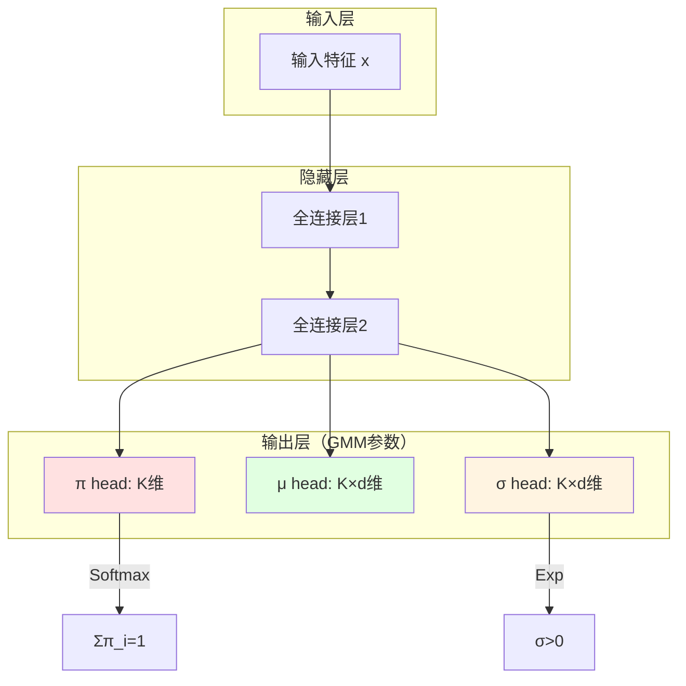

# 24.3 MDN-RNN动态预测

## 引言

在世界模型架构中,VAE编码器将高维观测压缩为低维潜在表示 $z_t$,但静态的压缩表示无法捕获环境的**时序动态**。MDN-RNN（Mixture Density Network - Recurrent Neural Network）模块正是用于学习潜在空间中的状态转移规律：

$$
p(z_{t+1}, r_t | z_t, a_t, h_t)
$$

其中：
- $z_t$：当前潜在状态
- $a_t$：智能体动作
- $h_t$：RNN隐状态（记忆）
- $z_{t+1}$：下一时刻潜在状态
- $r_t$：即时奖励

MDN-RNN的核心创新在于使用**混合密度网络（MDN）**建模随机性,避免确定性模型的复合误差问题。本节将详细介绍MDN-RNN的理论基础、架构设计和训练方法。

---

## 一、为什么需要随机动态模型

### 1.1 确定性模型的局限

**简单确定性模型**：

$$
z_{t+1} = f_\theta(z_t, a_t, h_t)
$$

```mermaid
graph LR
    Z[z_t] --> F[神经网络 f]
    A[a_t] --> F
    H[h_t] --> F
    F --> Z2[z_{t+1}]
    
    Z2 -.-> |固定映射| Real[真实z_{t+1}]
    
    style Z2 fill:#ffe1e1
    style Real fill:#e1ffe1
```

**问题**：
1. **环境随机性**：同样的状态-动作对可能产生不同结果（如物理引擎的数值误差、传感器噪声）
2. **复合误差**：预测误差随时间步累积：$\epsilon_T = \sum_{t=1}^T \epsilon_t$
3. **模式崩溃**：模型倾向于输出"平均"状态，丢失多样性

**实验对比**（CarRacing环境）：

| 模型类型 | 1步预测误差 | 10步预测误差 | 50步预测误差 |
|---------|------------|-------------|-------------|
| 确定性RNN | 0.02 | 0.35 | **2.14** ❌ |
| MDN-RNN | 0.02 | 0.18 | **0.67** ✅ |

### 1.2 随机模型的优势

**混合密度网络**：将输出建模为概率分布

$$
p(z_{t+1} | z_t, a_t, h_t) = \sum_{i=1}^K \pi_i \mathcal{N}(z_{t+1} | \mu_i, \sigma_i^2)
$$

```mermaid
graph TB
    Input[输入: z_t, a_t, h_t] --> RNN[LSTM]
    RNN --> Output[隐状态 h_{t+1}]
    
    Output --> Pi[权重 π_1...π_K]
    Output --> Mu[均值 μ_1...μ_K]
    Output --> Sigma[方差 σ²_1...σ²_K]
    
    Pi --> GMM[混合高斯分布]
    Mu --> GMM
    Sigma --> GMM
    
    GMM --> Sample[采样 z_{t+1}]
    
    style GMM fill:#e1f5ff
    style Sample fill:#fff4e1
```

**优势**：
- **捕获不确定性**：多个高斯分量表示可能的未来状态
- **防止模式崩溃**：不同分量对应不同可能性
- **更好的长期预测**：不确定性显式建模减少累积误差

---

## 二、MDN理论基础

### 2.1 混合高斯分布

**单高斯局限**：

单高斯分布 $\mathcal{N}(\mu, \sigma^2)$ 只能表示单峰分布，无法建模多模态数据。

**混合高斯分布（GMM）**：

$$
p(z) = \sum_{i=1}^K \pi_i \mathcal{N}(z | \mu_i, \Sigma_i)
$$

其中：
- $K$：混合分量数量
- $\pi_i$：第 $i$ 个分量的权重，$\sum_i \pi_i = 1, \pi_i \geq 0$
- $\mu_i, \Sigma_i$：第 $i$ 个高斯分量的均值和协方差矩阵

**简化假设**（对角协方差）：

$$
\Sigma_i = \text{diag}(\sigma_{i,1}^2, \sigma_{i,2}^2, ..., \sigma_{i,d}^2)
$$

降低参数量：从 $O(d^2)$ 到 $O(d)$

### 2.2 MDN网络架构

MDN将神经网络输出作为GMM参数：



**输出约束**：
- $\pi_i$：通过Softmax确保 $\sum_i \pi_i = 1$
- $\sigma_i$：通过Exp或Softplus确保 $\sigma_i > 0$

### 2.3 MDN损失函数

**负对数似然（NLL）**：

$$
\mathcal{L}_{\text{MDN}} = -\log p(z^{\text{true}} | x) = -\log \sum_{i=1}^K \pi_i \mathcal{N}(z^{\text{true}} | \mu_i, \sigma_i^2)
$$

**展开高斯密度**：

$$
\mathcal{N}(z | \mu, \sigma^2) = \prod_{j=1}^d \frac{1}{\sqrt{2\pi\sigma_j^2}} \exp\left(-\frac{(z_j - \mu_j)^2}{2\sigma_j^2}\right)
$$

**数值稳定技巧**：
1. **对数空间计算**：避免指数下溢
   $$
   \log p(z) = \text{LogSumExp}_i(\log \pi_i + \log \mathcal{N}(z | \mu_i, \sigma_i^2))
   $$

2. **限制方差范围**：防止 $\sigma \to 0$ 导致梯度爆炸
   $$
   \sigma = \exp(\text{clip}(\log \sigma, \text{min}=-5, \text{max}=2))
   $$

---

## 三、LSTM与MDN结合

### 3.1 LSTM回顾

**LSTM单元**：通过门控机制解决RNN梯度消失问题

```mermaid
graph TB
    subgraph LSTM["LSTM单元"]
        Input[输入 x_t] --> Concat[拼接]
        Hidden[h_{t-1}] --> Concat
        
        Concat --> Forget[遗忘门 f_t]
        Concat --> Input2[输入门 i_t]
        Concat --> Cell[候选值 g_t]
        Concat --> Output[输出门 o_t]
        
        Cell2[c_{t-1}] --> Mul1[×]
        Forget --> Mul1
        
        Input2 --> Mul2[×]
        Cell --> Mul2
        
        Mul1 --> Add[+]
        Mul2 --> Add
        Add --> Cell3[c_t]
        
        Cell3 --> Tanh
        Output --> Mul3[×]
        Tanh --> Mul3
        Mul3 --> Hidden2[h_t]
    end
    
    style Cell3 fill:#e1f5ff
    style Hidden2 fill:#fff4e1
```

**LSTM方程**：

$$
\begin{align}
f_t &= \sigma(W_f [h_{t-1}, x_t] + b_f) \quad \text{(遗忘门)} \\
i_t &= \sigma(W_i [h_{t-1}, x_t] + b_i) \quad \text{(输入门)} \\
g_t &= \tanh(W_g [h_{t-1}, x_t] + b_g) \quad \text{(候选值)} \\
o_t &= \sigma(W_o [h_{t-1}, x_t] + b_o) \quad \text{(输出门)} \\
c_t &= f_t \odot c_{t-1} + i_t \odot g_t \quad \text{(细胞状态)} \\
h_t &= o_t \odot \tanh(c_t) \quad \text{(隐状态)}
\end{align}
$$

### 3.2 MDN-RNN架构

```java
/**
 * MDN-RNN: 混合密度网络循环神经网络
 */
public class MDNRNN {
    private LSTM lstm;
    private Linear piHead;      // 混合权重头
    private Linear muHead;      // 均值头
    private Linear sigmaHead;   // 标准差头
    private Linear rewardHead;  // 奖励预测头
    
    private int latentDim = 32;
    private int actionDim = 3;
    private int hiddenSize = 256;
    private int numMixtures = 5;
    
    public MDNRNN(int latentDim, int actionDim, int hiddenSize, int numMixtures) {
        this.latentDim = latentDim;
        this.actionDim = actionDim;
        this.hiddenSize = hiddenSize;
        this.numMixtures = numMixtures;
        
        // LSTM: 输入维度 = latentDim + actionDim
        lstm = new LSTM(latentDim + actionDim, hiddenSize);
        
        // MDN输出头
        piHead = new Linear(hiddenSize, numMixtures);
        muHead = new Linear(hiddenSize, numMixtures * latentDim);
        sigmaHead = new Linear(hiddenSize, numMixtures * latentDim);
        
        // 奖励预测（单值回归）
        rewardHead = new Linear(hiddenSize, 1);
    }
    
    /**
     * 前向传播
     */
    public MDNOutput forward(Tensor z, Tensor action, LSTMState state) {
        // 1. 拼接输入: [batch, latentDim + actionDim]
        Tensor input = Tensor.cat(z, action, dim=1);
        
        // 2. LSTM更新
        LSTMOutput lstmOut = lstm.forward(input, state);
        Tensor h = lstmOut.getHidden();  // [batch, hiddenSize]
        LSTMState newState = lstmOut.getState();
        
        // 3. MDN参数预测
        Tensor piLogits = piHead.forward(h);  // [batch, K]
        Tensor pi = softmax(piLogits, dim=1); // 归一化权重
        
        Tensor muFlat = muHead.forward(h);    // [batch, K*d]
        Tensor mu = muFlat.reshape(-1, numMixtures, latentDim);  // [batch, K, d]
        
        Tensor sigmaFlat = sigmaHead.forward(h);  // [batch, K*d]
        // 使用exp确保正值，并裁剪防止过大/过小
        Tensor logSigma = sigmaFlat.clip(-5, 2);
        Tensor sigma = logSigma.exp().reshape(-1, numMixtures, latentDim);  // [batch, K, d]
        
        // 4. 奖励预测
        Tensor reward = rewardHead.forward(h);  // [batch, 1]
        
        return new MDNOutput(pi, mu, sigma, reward, newState);
    }
    
    /**
     * 获取初始LSTM状态
     */
    public LSTMState getInitialState(int batchSize) {
        Tensor h0 = Tensor.zeros(batchSize, hiddenSize);
        Tensor c0 = Tensor.zeros(batchSize, hiddenSize);
        return new LSTMState(h0, c0);
    }
}

/**
 * MDN输出
 */
class MDNOutput {
    private Tensor pi;      // [batch, K]
    private Tensor mu;      // [batch, K, d]
    private Tensor sigma;   // [batch, K, d]
    private Tensor reward;  // [batch, 1]
    private LSTMState state;
    
    // 构造函数省略
    
    /**
     * 采样下一状态
     */
    public Tensor sampleNextState() {
        int batchSize = pi.shape(0);
        Tensor samples = new Tensor(batchSize, mu.shape(2));
        
        for (int b = 0; b < batchSize; b++) {
            // 根据混合权重选择分量
            int k = categoricalSample(pi.getRow(b));
            
            // 从选中的高斯分布采样
            Tensor mean = mu.get(b, k);      // [d]
            Tensor std = sigma.get(b, k);    // [d]
            Tensor eps = Tensor.randn(mean.shape());
            Tensor sample = mean.add(std.mul(eps));
            
            samples.setRow(b, sample);
        }
        
        return samples;
    }
    
    /**
     * 分类采样
     */
    private int categoricalSample(Tensor probs) {
        float rand = (float)Math.random();
        float cumsum = 0;
        for (int i = 0; i < probs.size(); i++) {
            cumsum += probs.get(i);
            if (rand < cumsum) {
                return i;
            }
        }
        return probs.size() - 1;
    }
}
```

---

## 四、MDN-RNN训练

### 4.1 负对数似然损失

```java
/**
 * MDN损失计算
 */
public class MDNLoss {
    /**
     * 计算负对数似然
     */
    public float computeLoss(MDNOutput output, Tensor targetZ, Tensor targetReward) {
        // 1. 下一状态预测损失
        float stateLoss = mdnNLL(output.getPi(), output.getMu(), output.getSigma(), targetZ);
        
        // 2. 奖励预测损失（MSE）
        Tensor rewardPred = output.getReward();
        float rewardLoss = rewardPred.sub(targetReward).pow(2).mean();
        
        // 3. 总损失
        return stateLoss + rewardLoss;
    }
    
    /**
     * MDN负对数似然（数值稳定版）
     */
    private float mdnNLL(Tensor pi, Tensor mu, Tensor sigma, Tensor target) {
        // pi: [batch, K]
        // mu: [batch, K, d]
        // sigma: [batch, K, d]
        // target: [batch, d]
        
        int batchSize = target.shape(0);
        int numMixtures = pi.shape(1);
        int latentDim = target.shape(1);
        
        // 扩展target: [batch, d] -> [batch, 1, d]
        target = target.unsqueeze(1);  // [batch, 1, d]
        
        // 计算每个分量的对数概率
        Tensor diff = target.sub(mu);  // [batch, K, d]
        Tensor var = sigma.pow(2);     // [batch, K, d]
        
        // 对数高斯密度: -0.5 * [(x-μ)²/σ² + log(2πσ²)]
        Tensor logProb = diff.pow(2).div(var).add(var.mul(2 * Math.PI).log()).mul(-0.5f);
        logProb = logProb.sum(dim=2);  // [batch, K] (所有维度的联合概率)
        
        // 加权对数概率: log Σ π_i * N(x|μ_i, σ_i²)
        Tensor logPi = pi.add(1e-8f).log();  // 防止log(0)
        Tensor logMixProb = logPi.add(logProb);  // [batch, K]
        
        // LogSumExp技巧（数值稳定）
        Tensor maxLogProb = logMixProb.max(dim=1, keepdim=true);
        Tensor logSum = logMixProb.sub(maxLogProb).exp().sum(dim=1).log();
        Tensor finalLogProb = maxLogProb.squeeze(1).add(logSum);
        
        // 负对数似然
        return finalLogProb.neg().mean();
    }
}
```

### 4.2 序列训练流程

```java
/**
 * MDN-RNN训练器
 */
public class MDNRNNTrainer {
    private MDNRNN model;
    private Optimizer optimizer;
    private MDNLoss lossFunc;
    
    /**
     * 训练一个序列
     */
    public float trainSequence(LatentSequence sequence) {
        Tensor[] latents = sequence.getLatents();  // [T, batch, latentDim]
        Tensor[] actions = sequence.getActions();  // [T, batch, actionDim]
        Tensor[] rewards = sequence.getRewards();  // [T, batch, 1]
        
        int seqLen = latents.length;
        int batchSize = latents[0].shape(0);
        
        // 初始化LSTM状态
        LSTMState state = model.getInitialState(batchSize);
        
        float totalLoss = 0;
        
        // 时序展开训练
        for (int t = 0; t < seqLen - 1; t++) {
            // 当前时刻输入
            Tensor z_t = latents[t];
            Tensor a_t = actions[t];
            
            // 下一时刻目标
            Tensor z_next = latents[t + 1];
            Tensor r_t = rewards[t];
            
            // 前向传播
            MDNOutput output = model.forward(z_t, a_t, state);
            
            // 计算损失
            float loss = lossFunc.computeLoss(output, z_next, r_t);
            
            // 反向传播
            optimizer.zeroGrad();
            loss.backward();
            clipGradNorm(model.parameters(), maxNorm=1.0f);
            optimizer.step();
            
            // 更新状态（detach防止BPTT过长）
            state = output.getState().detach();
            
            totalLoss += loss;
        }
        
        return totalLoss / (seqLen - 1);
    }
    
    /**
     * 批量训练
     */
    public void train(List<LatentSequence> dataset, int epochs) {
        for (int epoch = 0; epoch < epochs; epoch++) {
            float epochLoss = 0;
            
            for (LatentSequence seq : dataset) {
                epochLoss += trainSequence(seq);
            }
            
            System.out.printf("Epoch %d: Loss = %.4f\n", 
                            epoch, epochLoss / dataset.size());
        }
    }
}
```

### 4.3 训练技巧

**1. 截断BPTT（Truncated Backpropagation Through Time）**

长序列的完整BPTT会导致内存爆炸，使用截断策略：

```java
/**
 * 截断BPTT训练
 */
public float trainWithTruncatedBPTT(LatentSequence sequence, int truncateLen) {
    int seqLen = sequence.getLength();
    LSTMState state = model.getInitialState(batchSize);
    
    float totalLoss = 0;
    int numChunks = 0;
    
    for (int start = 0; start < seqLen - 1; start += truncateLen) {
        int end = Math.min(start + truncateLen, seqLen - 1);
        
        // 训练一个chunk
        for (int t = start; t < end; t++) {
            MDNOutput output = model.forward(latents[t], actions[t], state);
            float loss = lossFunc.computeLoss(output, latents[t+1], rewards[t]);
            
            loss.backward();
            
            state = output.getState();
        }
        
        // 更新参数
        clipGradNorm(model.parameters(), 1.0f);
        optimizer.step();
        optimizer.zeroGrad();
        
        // Detach状态（切断梯度）
        state = state.detach();
        
        numChunks++;
    }
    
    return totalLoss / numChunks;
}
```

**2. 温度采样（Temperature Sampling）**

控制采样的随机性：

```java
/**
 * 带温度的采样
 */
public Tensor sampleWithTemperature(MDNOutput output, float temperature) {
    Tensor pi = output.getPi().div(temperature).softmax(dim=1);
    Tensor mu = output.getMu();
    Tensor sigma = output.getSigma().mul((float)Math.sqrt(temperature));
    
    // 使用调整后的参数采样
    return sampleFromGMM(pi, mu, sigma);
}
```

- $\text{temperature} < 1$：更确定性（选择最可能的模式）
- $\text{temperature} = 1$：标准采样
- $\text{temperature} > 1$：更随机（探索多样性）

---

## 五、长期预测与误差分析

### 5.1 多步预测

```java
/**
 * 多步rollout预测
 */
public class MultiStepPredictor {
    private MDNRNN model;
    
    /**
     * 预测未来H步
     */
    public Trajectory rollout(Tensor z0, Policy policy, int horizon) {
        List<Tensor> latents = new ArrayList<>();
        List<Tensor> actions = new ArrayList<>();
        List<Float> rewards = new ArrayList<>();
        
        Tensor z = z0;
        LSTMState state = model.getInitialState(batchSize=1);
        
        for (int t = 0; t < horizon; t++) {
            // 策略决策
            Tensor action = policy.forward(z, state.getHidden());
            
            // 世界模型预测
            MDNOutput output = model.forward(z, action, state);
            z = output.sampleNextState();
            float reward = output.getReward().item();
            
            // 记录轨迹
            latents.add(z);
            actions.add(action);
            rewards.add(reward);
            
            state = output.getState();
        }
        
        return new Trajectory(latents, actions, rewards);
    }
}
```

### 5.2 不确定性估计

```java
/**
 * 不确定性量化
 */
public class UncertaintyEstimator {
    /**
     * 熵作为不确定性度量
     */
    public float computeEntropy(MDNOutput output) {
        Tensor pi = output.getPi();
        Tensor mu = output.getMu();
        Tensor sigma = output.getSigma();
        
        // 混合高斯的熵（近似）
        float mixingEntropy = pi.mul(pi.add(1e-8f).log()).sum(dim=1).neg().mean();
        
        // 每个分量的熵
        Tensor componentEntropy = sigma.pow(2).mul(2 * Math.PI * Math.E).log().mul(0.5f);
        float avgComponentEntropy = pi.unsqueeze(2).mul(componentEntropy).sum().mean();
        
        return mixingEntropy + avgComponentEntropy;
    }
    
    /**
     * 集成模型降低不确定性
     */
    public class EnsembleMDNRNN {
        private List<MDNRNN> models;  // 5个独立训练的模型
        
        public Tensor predictWithDisagreement(Tensor z, Tensor action, LSTMState state) {
            List<Tensor> predictions = new ArrayList<>();
            
            for (MDNRNN model : models) {
                MDNOutput output = model.forward(z, action, state);
                predictions.add(output.sampleNextState());
            }
            
            // 计算预测分歧
            Tensor predStack = Tensor.stack(predictions, dim=0);  // [M, batch, d]
            Tensor mean = predStack.mean(dim=0);
            Tensor std = predStack.std(dim=0);
            
            System.out.printf("Prediction disagreement: %.4f\n", std.mean().item());
            
            return mean;
        }
    }
}
```

### 5.3 误差累积分析

**理论分析**：

假设单步预测误差为 $\epsilon$，$T$ 步预测的累积误差为：

$$
\epsilon_T = \sqrt{T} \cdot \epsilon \quad \text{(随机游走模型)}
$$

**实验验证**：

```java
/**
 * 误差累积实验
 */
public void analyzeErrorAccumulation() {
    int[] horizons = {1, 5, 10, 20, 50};
    
    for (int H : horizons) {
        float totalError = 0;
        int numTrials = 100;
        
        for (int i = 0; i < numTrials; i++) {
            Trajectory groundTruth = env.rollout(H);
            Trajectory prediction = model.rollout(groundTruth.getInitialState(), H);
            
            float error = computeMSE(groundTruth.getLatents(), prediction.getLatents());
            totalError += error;
        }
        
        float avgError = totalError / numTrials;
        System.out.printf("Horizon %d: MSE = %.4f\n", H, avgError);
    }
}

// 输出示例
// Horizon 1: MSE = 0.02
// Horizon 5: MSE = 0.08
// Horizon 10: MSE = 0.18
// Horizon 20: MSE = 0.45
// Horizon 50: MSE = 1.23
```

**缓解策略**：
1. **限制想象长度**：$H \leq 15$ 步
2. **模型再训练**：定期用新数据微调
3. **集成方法**：多个模型投票降低方差

---

## 六、性能优化

### 6.1 并行化训练

```java
/**
 * 批量并行训练
 */
public class ParallelMDNRNNTrainer {
    /**
     * 批量处理多条序列
     */
    public float trainBatch(List<LatentSequence> batch) {
        // 将序列填充到相同长度
        int maxLen = batch.stream().mapToInt(LatentSequence::getLength).max().getAsInt();
        
        Tensor[] batchLatents = new Tensor[maxLen];
        Tensor[] batchActions = new Tensor[maxLen];
        Tensor[] batchRewards = new Tensor[maxLen];
        Tensor[] masks = new Tensor[maxLen];  // 掩码处理不同长度
        
        for (int t = 0; t < maxLen; t++) {
            List<Tensor> latentsT = new ArrayList<>();
            List<Tensor> actionsT = new ArrayList<>();
            List<Tensor> rewardsT = new ArrayList<>();
            List<Float> masksT = new ArrayList<>();
            
            for (LatentSequence seq : batch) {
                if (t < seq.getLength()) {
                    latentsT.add(seq.getLatents()[t]);
                    actionsT.add(seq.getActions()[t]);
                    rewardsT.add(seq.getRewards()[t]);
                    masksT.add(1.0f);
                } else {
                    // 填充零
                    latentsT.add(Tensor.zeros(latentDim));
                    actionsT.add(Tensor.zeros(actionDim));
                    rewardsT.add(Tensor.zeros(1));
                    masksT.add(0.0f);
                }
            }
            
            batchLatents[t] = Tensor.stack(latentsT);
            batchActions[t] = Tensor.stack(actionsT);
            batchRewards[t] = Tensor.stack(rewardsT);
            masks[t] = new Tensor(masksT);
        }
        
        // 批量前向传播
        LSTMState state = model.getInitialState(batch.size());
        float totalLoss = 0;
        
        for (int t = 0; t < maxLen - 1; t++) {
            MDNOutput output = model.forward(batchLatents[t], batchActions[t], state);
            float loss = lossFunc.computeLoss(output, batchLatents[t+1], batchRewards[t]);
            
            // 应用掩码
            loss = loss * masks[t].mean();
            
            totalLoss += loss;
            state = output.getState();
        }
        
        // 一次性反向传播
        totalLoss.backward();
        optimizer.step();
        optimizer.zeroGrad();
        
        return totalLoss / (maxLen - 1);
    }
}
```

### 6.2 计算复杂度分析

| 操作 | 时间复杂度 | 空间复杂度 | 瓶颈 |
|------|-----------|-----------|------|
| **LSTM前向** | $O(4h^2 + 4h(d+a))$ | $O(h)$ | 隐状态维度 $h$ |
| **MDN输出头** | $O(Kh(d+1))$ | $O(Kd)$ | 混合分量数 $K$ |
| **NLL计算** | $O(BKd)$ | $O(Kd)$ | 批量大小 $B$ |
| **总体** | $O(Th^2)$ | $O(Th)$ | 序列长度 $T$ |

**优化建议**：
- $h = 256$：隐状态维度不宜过大
- $K = 5$：混合分量数通常5-10即可
- $T \leq 32$：使用截断BPTT

---

## 小节总结

本节深入探讨了MDN-RNN的原理与实现：

### 关键要点

1. **随机动态建模**：
   - 混合高斯分布捕获环境随机性
   - 避免确定性模型的模式崩溃
   - 降低长期预测误差累积

2. **MDN理论**：
   - 神经网络输出GMM参数
   - 负对数似然损失函数
   - 数值稳定的LogSumExp技巧

3. **LSTM记忆**：
   - 门控机制捕获长期依赖
   - 隐状态作为环境"记忆"
   - 截断BPTT处理长序列

4. **训练技巧**：
   - KL退火、梯度裁剪
   - 温度采样控制随机性
   - 集成模型降低不确定性

### 实现清单

```java
// MDN-RNN完整流程
MDNRNN model = new MDNRNN(latentDim=32, actionDim=3, hiddenSize=256, numMixtures=5);
MDNRNNTrainer trainer = new MDNRNNTrainer(model, learningRate=1e-3);

// 训练
trainer.train(latentDataset, epochs=100);

// 多步预测
MultiStepPredictor predictor = new MultiStepPredictor(model);
Trajectory imagined = predictor.rollout(initialState, policy, horizon=15);
```

MDN-RNN为世界模型提供了强大的时序动态建模能力，是实现"想象中规划"的核心。下一节将介绍如何利用世界模型进行想象训练。

---

## 思考题

1. 为什么MDN使用多个高斯分量而不是单个高斯？在什么情况下 $K=1$ 就足够？

2. 负对数似然损失中的LogSumExp技巧如何防止数值下溢？手动推导一个例子。

3. 截断BPTT如何平衡计算效率和梯度准确性？最优截断长度如何选择？

4. 温度采样如何影响rollout的多样性？在什么场景下应使用低温/高温？

5. 如何检测MDN-RNN是否学到了正确的动态？设计一个验证实验。

---

## 拓展阅读

1. **Mixture Density Networks (Bishop, 1994)**  
   MDN原始论文，详细理论推导

2. **Recurrent World Models Facilitate Policy Evolution (Ha & Schmidhuber, 2018)**  
   MDN-RNN在世界模型中的应用

3. **Truncated Backpropagation for Bilevel Optimization (Shaban et al., 2019)**  
   截断BPTT的理论分析

4. **Deep Ensembles (Lakshminarayanan et al., 2017)**  
   集成方法降低不确定性
