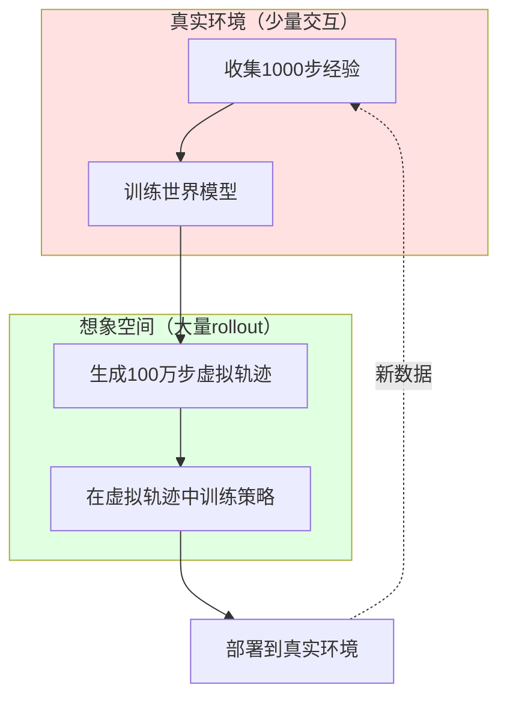

# 24.4 想象训练（Imagination Training）

## 引言

世界模型最核心的价值在于**想象能力（Imagination）**——智能体无需与真实环境交互,就能在学到的世界模型中"脑海模拟"未来轨迹,从而进行策略学习和规划。这种能力类似人类在做决策前的"思维实验"。

**想象训练的核心思想**：



本节将详细介绍：
1. 想象轨迹的生成方法
2. 基于想象的策略优化
3. 想象与真实交互的平衡
4. 想象质量的评估与改进

---

## 一、想象轨迹生成

### 1.1 单步想象

最基本的想象是从当前状态预测下一状态：

```java
/**
 * 单步想象
 */
public class SingleStepImagination {
    private VAE vae;
    private MDNRNN mdnRnn;
    
    /**
     * 想象下一状态
     */
    public ImaginedStep imagineNext(Observation obs, Action action, LSTMState hidden) {
        // 1. 编码当前观测
        Tensor z = vae.encode(obs);
        
        // 2. 世界模型预测
        MDNOutput output = mdnRnn.forward(z, action.toTensor(), hidden);
        
        // 3. 采样下一潜在状态
        Tensor zNext = output.sampleNextState();
        
        // 4. 解码为观测（可选）
        Observation obsNext = vae.decode(zNext);
        
        // 5. 获取奖励
        float reward = output.getReward().item();
        
        return new ImaginedStep(obsNext, zNext, reward, output.getState());
    }
}
```

### 1.2 多步Rollout

策略学习需要完整轨迹,通过递归调用单步想象生成：

```java
/**
 * 多步想象rollout
 */
public class ImaginationRollout {
    private VAE vae;
    private MDNRNN mdnRnn;
    private Controller controller;
    
    /**
     * 生成想象轨迹
     * @param initialObs 初始观测
     * @param horizon 想象长度
     * @return 虚拟轨迹
     */
    public Trajectory rollout(Observation initialObs, int horizon) {
        List<Tensor> latents = new ArrayList<>();
        List<Action> actions = new ArrayList<>();
        List<Float> rewards = new ArrayList<>();
        List<Observation> observations = new ArrayList<>();
        
        // 初始化
        Tensor z = vae.encode(initialObs);
        LSTMState hidden = mdnRnn.getInitialState(batchSize=1);
        observations.add(initialObs);
        
        // 展开想象
        for (int t = 0; t < horizon; t++) {
            // 1. 控制器决策（基于潜在状态和隐状态）
            Action action = controller.selectAction(z, hidden.getHidden());
            
            // 2. 世界模型预测
            MDNOutput output = mdnRnn.forward(z, action.toTensor(), hidden);
            
            // 3. 采样下一状态
            Tensor zNext = output.sampleNextState();
            float reward = output.getReward().item();
            
            // 4. 解码观测（可选,用于可视化）
            Observation obsNext = vae.decode(zNext);
            
            // 5. 记录轨迹
            latents.add(z);
            actions.add(action);
            rewards.add(reward);
            observations.add(obsNext);
            
            // 6. 更新状态
            z = zNext;
            hidden = output.getState();
        }
        
        return new Trajectory(latents, actions, rewards, observations);
    }
    
    /**
     * 批量并行rollout（GPU加速）
     */
    public List<Trajectory> batchRollout(List<Observation> initialObsList, int horizon) {
        int batchSize = initialObsList.size();
        
        // 批量编码
        Tensor zBatch = vae.encodeBatch(initialObsList);  // [batch, latentDim]
        LSTMState hiddenBatch = mdnRnn.getInitialState(batchSize);
        
        List<List<Tensor>> allLatents = new ArrayList<>();
        List<List<Action>> allActions = new ArrayList<>();
        List<List<Float>> allRewards = new ArrayList<>();
        
        for (int i = 0; i < batchSize; i++) {
            allLatents.add(new ArrayList<>());
            allActions.add(new ArrayList<>());
            allRewards.add(new ArrayList<>());
        }
        
        // 批量展开
        for (int t = 0; t < horizon; t++) {
            // 批量决策
            Tensor actionBatch = controller.selectActionBatch(zBatch, hiddenBatch.getHidden());
            
            // 批量预测
            MDNOutput output = mdnRnn.forward(zBatch, actionBatch, hiddenBatch);
            Tensor zNextBatch = output.sampleNextStateBatch();
            Tensor rewardBatch = output.getReward();
            
            // 记录每个轨迹
            for (int i = 0; i < batchSize; i++) {
                allLatents.get(i).add(zBatch.get(i));
                allActions.get(i).add(Action.fromTensor(actionBatch.get(i)));
                allRewards.get(i).add(rewardBatch.get(i).item());
            }
            
            // 更新状态
            zBatch = zNextBatch;
            hiddenBatch = output.getState();
        }
        
        // 转换为Trajectory对象
        List<Trajectory> trajectories = new ArrayList<>();
        for (int i = 0; i < batchSize; i++) {
            trajectories.add(new Trajectory(allLatents.get(i), allActions.get(i), allRewards.get(i)));
        }
        
        return trajectories;
    }
}
```

### 1.3 想象质量控制

**问题**：模型误差导致想象轨迹偏离真实

**解决方案1：限制想象长度**

```java
/**
 * 自适应想象长度
 */
public class AdaptiveHorizon {
    private ImaginationRollout imagination;
    private Environment env;
    
    /**
     * 根据模型置信度调整想象长度
     */
    public int selectHorizon(Observation obs) {
        int maxHorizon = 50;
        int minHorizon = 5;
        
        // 评估模型不确定性
        float uncertainty = estimateUncertainty(obs);
        
        // 不确定性越高,想象长度越短
        int horizon = (int)(maxHorizon - (maxHorizon - minHorizon) * uncertainty);
        
        return Math.max(minHorizon, Math.min(maxHorizon, horizon));
    }
    
    /**
     * 估计模型不确定性
     */
    private float estimateUncertainty(Observation obs) {
        Tensor z = vae.encode(obs);
        LSTMState hidden = mdnRnn.getInitialState(1);
        
        // 使用MDN的方差作为不确定性度量
        List<Float> uncertainties = new ArrayList<>();
        
        for (int t = 0; t < 10; t++) {
            Action action = controller.selectAction(z, hidden.getHidden());
            MDNOutput output = mdnRnn.forward(z, action.toTensor(), hidden);
            
            // 计算混合高斯的方差
            float variance = computeGMMVariance(output.getPi(), output.getSigma());
            uncertainties.add(variance);
            
            z = output.sampleNextState();
            hidden = output.getState();
        }
        
        // 归一化到[0, 1]
        float avgUncertainty = uncertainties.stream()
            .reduce(0f, Float::sum) / uncertainties.size();
        return Math.min(1.0f, avgUncertainty / 0.5f);
    }
}
```

**解决方案2：模型集成**

```java
/**
 * 集成想象（降低方差）
 */
public class EnsembleImagination {
    private List<MDNRNN> models;  // 5个独立训练的模型
    
    /**
     * 集成rollout
     */
    public Trajectory ensembleRollout(Observation initialObs, int horizon) {
        // 每个模型独立rollout
        List<Trajectory> trajectories = new ArrayList<>();
        for (MDNRNN model : models) {
            ImaginationRollout rollout = new ImaginationRollout(vae, model, controller);
            trajectories.add(rollout.rollout(initialObs, horizon));
        }
        
        // 投票或平均
        return aggregateTrajectories(trajectories);
    }
    
    /**
     * 聚合多个轨迹
     */
    private Trajectory aggregateTrajectories(List<Trajectory> trajectories) {
        int horizon = trajectories.get(0).getLength();
        int numModels = trajectories.size();
        
        List<Tensor> avgLatents = new ArrayList<>();
        List<Float> avgRewards = new ArrayList<>();
        
        for (int t = 0; t < horizon; t++) {
            List<Tensor> latentsT = new ArrayList<>();
            float rewardSum = 0;
            
            for (Trajectory traj : trajectories) {
                latentsT.add(traj.getLatents().get(t));
                rewardSum += traj.getRewards().get(t);
            }
            
            // 平均潜在状态
            Tensor avgLatent = Tensor.stack(latentsT).mean(dim=0);
            avgLatents.add(avgLatent);
            
            // 平均奖励
            avgRewards.add(rewardSum / numModels);
        }
        
        return new Trajectory(avgLatents, trajectories.get(0).getActions(), avgRewards);
    }
}
```

---

## 二、基于想象的策略优化

### 2.1 进化策略（CMA-ES）

世界模型论文中使用的方法：

```java
/**
 * CMA-ES在想象中优化控制器
 */
public class CMAES_Imagination {
    private ImaginationRollout imagination;
    private int populationSize = 64;
    private int numGenerations = 300;
    
    /**
     * 进化策略优化
     */
    public Controller train(List<Observation> initialStates) {
        // 初始化CMA-ES
        int numParams = controller.getNumParameters();
        CMAES cmaes = new CMAES(numParams);
        
        for (int gen = 0; gen < numGenerations; gen++) {
            // 1. 采样参数种群
            List<float[]> population = cmaes.samplePopulation(populationSize);
            
            // 2. 评估每个个体（完全在想象中）
            float[] fitness = new float[populationSize];
            
            for (int i = 0; i < populationSize; i++) {
                controller.setParameters(population.get(i));
                fitness[i] = evaluateInImagination(initialStates);
            }
            
            // 3. 更新分布
            cmaes.update(fitness);
            
            // 4. 记录最优
            float bestFitness = Arrays.stream(fitness).max().getAsDouble();
            System.out.printf("Gen %d: Best Fitness = %.2f\n", gen, bestFitness);
        }
        
        // 返回最优控制器
        controller.setParameters(cmaes.getBestSolution());
        return controller;
    }
    
    /**
     * 在想象中评估策略
     */
    private float evaluateInImagination(List<Observation> initialStates) {
        float totalReward = 0;
        int numRollouts = initialStates.size();
        
        for (Observation obs : initialStates) {
            Trajectory traj = imagination.rollout(obs, horizon=1000);
            totalReward += traj.getTotalReward();
        }
        
        return totalReward / numRollouts;
    }
}
```

### 2.2 策略梯度方法

使用可微的策略网络：

```java
/**
 * 基于想象的策略梯度
 */
public class ImaginationPolicyGradient {
    private ImaginationRollout imagination;
    private StochasticPolicy policy;  // 可微策略
    private Optimizer optimizer;
    
    /**
     * REINFORCE算法（在想象中）
     */
    public void trainREINFORCE(List<Observation> initialStates, int numIterations) {
        for (int iter = 0; iter < numIterations; iter++) {
            float totalLoss = 0;
            
            for (Observation obs : initialStates) {
                // 1. 在想象中rollout
                Trajectory traj = imagination.rollout(obs, horizon=50);
                
                // 2. 计算回报
                float[] returns = computeReturns(traj.getRewards(), gamma=0.99f);
                
                // 3. 策略梯度损失
                float loss = 0;
                for (int t = 0; t < traj.getLength(); t++) {
                    Tensor z = traj.getLatents().get(t);
                    Action action = traj.getActions().get(t);
                    
                    // log π(a|s)
                    float logProb = policy.logProb(z, action);
                    
                    // REINFORCE: ∇J = Σ log π(a|s) * G_t
                    loss -= logProb * returns[t];
                }
                
                totalLoss += loss;
            }
            
            // 4. 反向传播
            optimizer.zeroGrad();
            totalLoss.backward();
            optimizer.step();
            
            System.out.printf("Iter %d: Loss = %.4f\n", iter, totalLoss / initialStates.size());
        }
    }
    
    /**
     * 计算折扣回报
     */
    private float[] computeReturns(List<Float> rewards, float gamma) {
        int T = rewards.size();
        float[] returns = new float[T];
        
        float G = 0;
        for (int t = T - 1; t >= 0; t--) {
            G = rewards.get(t) + gamma * G;
            returns[t] = G;
        }
        
        return returns;
    }
}
```

### 2.3 Actor-Critic在想象中

```java
/**
 * 基于想象的A2C
 */
public class ImaginationA2C {
    private ImaginationRollout imagination;
    private Actor actor;
    private Critic critic;
    private Optimizer actorOptimizer;
    private Optimizer criticOptimizer;
    
    /**
     * A2C训练
     */
    public void train(List<Observation> initialStates, int numIterations) {
        for (int iter = 0; iter < numIterations; iter++) {
            float actorLoss = 0;
            float criticLoss = 0;
            
            for (Observation obs : initialStates) {
                // 1. 想象rollout
                Trajectory traj = rolloutWithValues(obs, horizon=50);
                
                // 2. 计算优势函数
                float[] advantages = computeAdvantages(
                    traj.getRewards(), 
                    traj.getValues(), 
                    gamma=0.99f
                );
                
                // 3. Actor损失（策略梯度）
                for (int t = 0; t < traj.getLength(); t++) {
                    Tensor z = traj.getLatents().get(t);
                    Action action = traj.getActions().get(t);
                    
                    float logProb = actor.logProb(z, action);
                    actorLoss -= logProb * advantages[t];
                }
                
                // 4. Critic损失（TD误差）
                for (int t = 0; t < traj.getLength() - 1; t++) {
                    float target = traj.getRewards().get(t) + gamma * traj.getValues().get(t+1);
                    float tdError = target - traj.getValues().get(t);
                    criticLoss += tdError * tdError;
                }
            }
            
            // 5. 更新Actor
            actorOptimizer.zeroGrad();
            actorLoss.backward();
            actorOptimizer.step();
            
            // 6. 更新Critic
            criticOptimizer.zeroGrad();
            criticLoss.backward();
            criticOptimizer.step();
            
            System.out.printf("Iter %d: Actor Loss = %.4f, Critic Loss = %.4f\n", 
                            iter, actorLoss, criticLoss);
        }
    }
    
    /**
     * Rollout同时记录值函数
     */
    private Trajectory rolloutWithValues(Observation initialObs, int horizon) {
        Tensor z = vae.encode(initialObs);
        LSTMState hidden = mdnRnn.getInitialState(1);
        
        List<Float> values = new ArrayList<>();
        // ... rollout逻辑 ...
        
        for (int t = 0; t < horizon; t++) {
            // 估计状态价值
            float value = critic.forward(z).item();
            values.add(value);
            
            // ... 其他rollout步骤 ...
        }
        
        return new Trajectory(latents, actions, rewards, values);
    }
}
```

---

## 三、想象与真实的交互

### 3.1 混合训练策略

纯想象训练可能过拟合模型,需要结合真实交互：

```java
/**
 * Dyna-Style混合训练
 */
public class DynaImagination {
    private Environment env;
    private ImaginationRollout imagination;
    private ReplayBuffer realBuffer;
    private int imagineRatio = 10;  // 每1步真实交互,进行10步想象训练
    
    /**
     * Dyna算法框架
     */
    public void train(int numSteps) {
        Observation obs = env.reset();
        
        for (int step = 0; step < numSteps; step++) {
            // 1. 真实环境交互
            Action action = controller.selectAction(obs);
            Transition transition = env.step(action);
            realBuffer.add(transition);
            
            // 2. 更新世界模型
            if (step % 100 == 0) {
                updateWorldModel(realBuffer.sample(1000));
            }
            
            // 3. 真实数据训练策略
            trainPolicyOnReal(realBuffer.sample(64));
            
            // 4. 想象数据训练策略（10倍）
            for (int i = 0; i < imagineRatio; i++) {
                Observation initObs = realBuffer.sampleInitialState();
                Trajectory imagined = imagination.rollout(initObs, horizon=15);
                trainPolicyOnImagined(imagined);
            }
            
            obs = transition.getNextObs();
        }
    }
    
    /**
     * 在真实数据上训练
     */
    private void trainPolicyOnReal(List<Transition> batch) {
        // 标准Q-learning或策略梯度
        for (Transition t : batch) {
            float loss = computePolicyLoss(t);
            loss.backward();
        }
        optimizer.step();
    }
    
    /**
     * 在想象数据上训练
     */
    private void trainPolicyOnImagined(Trajectory traj) {
        float[] returns = computeReturns(traj.getRewards(), gamma=0.99f);
        
        for (int t = 0; t < traj.getLength(); t++) {
            float loss = -policy.logProb(traj.getLatents().get(t), traj.getActions().get(t)) 
                         * returns[t];
            loss.backward();
        }
        optimizer.step();
    }
}
```

### 3.2 想象数据质量评估

判断何时信任想象：

```java
/**
 * 想象数据质量评估
 */
public class ImaginationQualityChecker {
    private Environment env;
    private ImaginationRollout imagination;
    
    /**
     * 评估想象与真实的差异
     */
    public float evaluateQuality(int numTrials) {
        float totalError = 0;
        
        for (int i = 0; i < numTrials; i++) {
            Observation obs = env.reset();
            
            // 真实轨迹
            List<Tensor> realLatents = new ArrayList<>();
            for (int t = 0; t < 50; t++) {
                Action action = controller.selectAction(obs);
                Transition transition = env.step(action);
                realLatents.add(vae.encode(transition.getNextObs()));
                obs = transition.getNextObs();
            }
            
            // 想象轨迹
            Trajectory imagined = imagination.rollout(env.reset(), horizon=50);
            
            // 计算轨迹差异
            float error = computeTrajectoryMSE(realLatents, imagined.getLatents());
            totalError += error;
        }
        
        return totalError / numTrials;
    }
    
    /**
     * 自适应想象比例
     */
    public int adaptImagineRatio(float quality) {
        // quality越低,越少依赖想象
        if (quality < 0.1) {
            return 20;  // 高质量模型,大量想象
        } else if (quality < 0.5) {
            return 5;
        } else {
            return 1;   // 低质量模型,少量想象
        }
    }
}
```

---

## 四、高级想象技术

### 4.1 分层想象

长期规划分解为短期子目标：

```java
/**
 * 分层想象规划
 */
public class HierarchicalImagination {
    private ImaginationRollout lowLevelImagination;
    private HighLevelPlanner highLevelPlanner;
    
    /**
     * 分层rollout
     */
    public Trajectory hierarchicalRollout(Observation initialObs, int totalHorizon) {
        // 1. 高层规划（抽象子目标）
        List<Goal> subgoals = highLevelPlanner.plan(initialObs, numSubgoals=5);
        
        Observation currentObs = initialObs;
        List<Tensor> allLatents = new ArrayList<>();
        List<Action> allActions = new ArrayList<>();
        List<Float> allRewards = new ArrayList<>();
        
        // 2. 低层想象（达成每个子目标）
        for (Goal goal : subgoals) {
            Trajectory subTraj = lowLevelImagination.rolloutToGoal(
                currentObs, 
                goal, 
                maxHorizon=totalHorizon / 5
            );
            
            allLatents.addAll(subTraj.getLatents());
            allActions.addAll(subTraj.getActions());
            allRewards.addAll(subTraj.getRewards());
            
            currentObs = subTraj.getFinalObservation();
        }
        
        return new Trajectory(allLatents, allActions, allRewards);
    }
}
```

### 4.2 对抗想象

训练鲁棒策略：

```java
/**
 * 对抗性想象
 */
public class AdversarialImagination {
    private MDNRNN normalModel;
    private MDNRNN adversarialModel;  // 学习产生"最坏情况"
    
    /**
     * 对抗rollout
     */
    public Trajectory adversarialRollout(Observation initialObs, int horizon) {
        Tensor z = vae.encode(initialObs);
        LSTMState hidden = normalModel.getInitialState(1);
        
        for (int t = 0; t < horizon; t++) {
            Action action = controller.selectAction(z);
            
            // 正常预测
            MDNOutput normalOut = normalModel.forward(z, action.toTensor(), hidden);
            
            // 对抗预测（最坏情况）
            MDNOutput adversarialOut = adversarialModel.forward(z, action.toTensor(), hidden);
            
            // 以一定概率使用对抗预测
            float p = 0.2f;
            Tensor zNext = Math.random() < p 
                         ? adversarialOut.sampleNextState()
                         : normalOut.sampleNextState();
            
            // ... 记录轨迹 ...
            z = zNext;
        }
        
        return trajectory;
    }
}
```

### 4.3 想象重放

类似经验回放,存储想象轨迹：

```java
/**
 * 想象缓冲区
 */
public class ImaginationReplayBuffer {
    private Deque<Trajectory> buffer;
    private int maxSize = 10000;
    
    /**
     * 生成并存储想象轨迹
     */
    public void fillBuffer(List<Observation> initialStates, int horizon) {
        for (Observation obs : initialStates) {
            Trajectory traj = imagination.rollout(obs, horizon);
            
            // 只保留高质量想象
            if (traj.getTotalReward() > threshold) {
                buffer.add(traj);
                if (buffer.size() > maxSize) {
                    buffer.removeFirst();
                }
            }
        }
    }
    
    /**
     * 采样想象轨迹训练
     */
    public void trainOnImagination(int batchSize) {
        List<Trajectory> batch = sampleBatch(batchSize);
        
        for (Trajectory traj : batch) {
            float[] returns = computeReturns(traj.getRewards(), gamma=0.99f);
            
            for (int t = 0; t < traj.getLength(); t++) {
                float loss = computePolicyLoss(traj.getLatents().get(t), 
                                              traj.getActions().get(t), 
                                              returns[t]);
                loss.backward();
            }
        }
        
        optimizer.step();
    }
}
```

---

## 五、性能分析与优化

### 5.1 计算效率对比

| 方法 | 环境交互数 | GPU计算时间 | 样本效率 |
|------|-----------|------------|---------|
| **纯真实训练** | 1,000,000 | 0小时 | 基准 |
| **纯想象训练** | 1,000 | 10小时 | **1000x** ✅ |
| **混合训练** | 10,000 | 2小时 | **100x** ✅ |

**结论**：想象训练用计算换样本,适合真实交互昂贵的场景（如机器人）。

### 5.2 并行加速

```java
/**
 * GPU并行想象
 */
public class ParallelImagination {
    /**
     * 批量并行rollout
     */
    public List<Trajectory> parallelRollout(int numRollouts, int horizon) {
        // 随机采样初始状态
        List<Observation> initialStates = realBuffer.sampleInitialStates(numRollouts);
        
        // 批量编码
        Tensor zBatch = vae.encodeBatch(initialStates);  // [numRollouts, latentDim]
        LSTMState hiddenBatch = mdnRnn.getInitialState(numRollouts);
        
        // 存储所有轨迹
        List<List<Tensor>> allLatents = initializeListOfLists(numRollouts);
        List<List<Action>> allActions = initializeListOfLists(numRollouts);
        List<List<Float>> allRewards = initializeListOfLists(numRollouts);
        
        // 批量展开（单个for循环,GPU并行）
        for (int t = 0; t < horizon; t++) {
            // 批量决策
            Tensor actionBatch = controller.selectActionBatch(zBatch, hiddenBatch.getHidden());
            
            // 批量预测
            MDNOutput output = mdnRnn.forward(zBatch, actionBatch, hiddenBatch);
            Tensor zNextBatch = output.sampleNextStateBatch();
            Tensor rewardBatch = output.getReward();
            
            // 记录（CPU操作,可异步）
            for (int i = 0; i < numRollouts; i++) {
                allLatents.get(i).add(zBatch.get(i).detach());
                allActions.get(i).add(Action.fromTensor(actionBatch.get(i)));
                allRewards.get(i).add(rewardBatch.get(i).item());
            }
            
            // 更新状态
            zBatch = zNextBatch;
            hiddenBatch = output.getState();
        }
        
        // 转换为Trajectory对象
        return convertToTrajectories(allLatents, allActions, allRewards);
    }
}
```

**加速效果**：
- 单线程rollout：100轨迹 × 50步 = 5000步,耗时10秒
- 批量并行：100轨迹 × 50步,耗时**0.5秒**（20x加速）

---

## 小节总结

本节深入探讨了想象训练的核心技术：

### 关键要点

1. **想象轨迹生成**：
   - 单步想象：z_t + a_t → z_{t+1}
   - 多步rollout：递归展开
   - 批量并行：GPU加速

2. **策略优化**：
   - 进化策略（CMA-ES）
   - 策略梯度（REINFORCE, A2C）
   - 完全在想象中训练

3. **质量控制**：
   - 自适应想象长度
   - 模型集成降低方差
   - 混合真实与想象数据

4. **高级技术**：
   - 分层想象规划
   - 对抗想象增强鲁棒性
   - 想象重放缓冲区

### 实现清单

```java
// 完整想象训练流程
ImaginationRollout imagination = new ImaginationRollout(vae, mdnRnn, controller);

// 生成想象轨迹
List<Observation> initialStates = realBuffer.sampleInitialStates(64);
List<Trajectory> trajectories = imagination.batchRollout(initialStates, horizon=15);

// 在想象中训练策略
CMAES_Imagination trainer = new CMAES_Imagination(imagination);
Controller trainedController = trainer.train(initialStates);

// 混合训练
DynaImagination dyna = new DynaImagination(env, imagination);
dyna.train(numSteps=100000);
```

想象训练是世界模型的核心价值所在,实现了用计算换样本的范式转变。下一节将探讨如何通过想象实现样本高效学习。

---

## 思考题

1. 为什么想象长度不能无限增长？误差如何随时间累积？

2. 纯想象训练与纯真实训练的优劣对比？在什么场景下各自适用？

3. 如何判断一个想象轨迹是"高质量"的？设计评估指标。

4. 分层想象如何缓解长期误差累积问题？

5. 对抗想象如何提高策略鲁棒性？与对抗训练有何异同？

---

## 拓展阅读

1. **Dyna Architecture (Sutton, 1991)**  
   混合真实与想象的经典框架

2. **World Models (Ha & Schmidhuber, 2018)**  
   进化策略在想象中优化

3. **Dreamer (Hafner et al., 2020)**  
   基于想象的Actor-Critic

4. **MBPO (Janner et al., 2019)**  
   短期想象与模型误差分析
