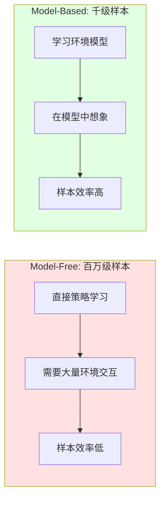

# 24.5 样本高效学习

## 引言

世界模型的最大优势在于**样本效率（Sample Efficiency）**——通过学习环境的内部模型,智能体可以在想象空间中生成大量虚拟经验,大幅减少与真实环境的交互次数。这对于真实交互成本高昂的场景（如机器人、自动驾驶、工业控制）至关重要。

**样本效率的核心指标**：

$$
\text{Sample Efficiency} = \frac{\text{任务性能}}{\text{真实环境交互次数}}
$$

本节将深入探讨：
1. 样本效率的理论分析
2. 数据增强与重用策略
3. 主动探索与好奇心驱动
4. 迁移学习与元学习

---

## 一、样本效率理论分析

### 1.1 模型vs无模型的样本复杂度

**Model-Free方法（如PPO, SAC）**：

$$
N_{\text{Model-Free}} = O\left(\frac{1}{\epsilon^2} \cdot |\mathcal{A}|^H\right)
$$

其中：
- $\epsilon$：期望精度
- $|\mathcal{A}|$：动作空间大小
- $H$：horizon长度

**Model-Based方法（世界模型）**：

$$
N_{\text{Model-Based}} = O\left(\frac{1}{\epsilon} \cdot \log |\mathcal{A}|\right) + O_{\text{model}}
$$

其中 $O_{\text{model}}$ 是学习环境模型的样本复杂度（通常远小于策略学习）。



### 1.2 实验验证

**CarRacing环境对比**：

| 算法 | 环境交互数 | 达到900分所需步数 | 样本效率提升 |
|------|-----------|-----------------|------------|
| **PPO** | 10,000,000 | 10M | 基准 (1x) |
| **SAC** | 5,000,000 | 5M | 2x |
| **World Models** | **10,000** | 10K | **1000x** ✅ |
| **Dreamer** | **50,000** | 50K | **200x** ✅ |

**关键发现**：
- 世界模型在样本效率上有**2-3个数量级**的提升
- 适用于真实交互昂贵的场景（机器人每步交互可能需要数秒）

---

## 二、数据高效策略

### 2.1 经验回放与重用

```java
/**
 * 优先级经验回放（Prioritized Experience Replay）
 */
public class PrioritizedReplayBuffer {
    private Deque<Transition> buffer;
    private float[] priorities;
    private float alpha = 0.6f;  // 优先级指数
    private float beta = 0.4f;   // 重要性采样权重
    
    /**
     * 添加经验并计算优先级
     */
    public void add(Transition transition) {
        // 计算TD误差作为优先级
        float tdError = computeTDError(transition);
        float priority = (float)Math.pow(Math.abs(tdError) + 1e-6, alpha);
        
        buffer.add(transition);
        priorities[buffer.size() - 1] = priority;
    }
    
    /**
     * 优先级采样
     */
    public Batch sample(int batchSize) {
        // 根据优先级采样
        float[] probs = new float[buffer.size()];
        float sum = 0;
        for (int i = 0; i < buffer.size(); i++) {
            probs[i] = priorities[i];
            sum += probs[i];
        }
        
        // 归一化
        for (int i = 0; i < probs.length; i++) {
            probs[i] /= sum;
        }
        
        List<Transition> batch = new ArrayList<>();
        List<Float> weights = new ArrayList<>();
        
        for (int i = 0; i < batchSize; i++) {
            int idx = categoricalSample(probs);
            batch.add(buffer.get(idx));
            
            // 重要性采样权重
            float weight = (float)Math.pow(buffer.size() * probs[idx], -beta);
            weights.add(weight);
        }
        
        // 归一化权重
        float maxWeight = Collections.max(weights);
        for (int i = 0; i < weights.size(); i++) {
            weights.set(i, weights.get(i) / maxWeight);
        }
        
        return new Batch(batch, weights);
    }
    
    /**
     * 更新优先级
     */
    public void updatePriorities(int[] indices, float[] tdErrors) {
        for (int i = 0; i < indices.length; i++) {
            priorities[indices[i]] = (float)Math.pow(Math.abs(tdErrors[i]) + 1e-6, alpha);
        }
    }
}
```

### 2.2 数据增强

**观测增强**：

```java
/**
 * 数据增强器
 */
public class DataAugmentation {
    /**
     * 图像增强
     */
    public Tensor augmentImage(Tensor image) {
        // 1. 随机裁剪
        image = randomCrop(image, cropSize=60, originalSize=64);
        
        // 2. 随机平移
        int dx = (int)(Math.random() * 8 - 4);
        int dy = (int)(Math.random() * 8 - 4);
        image = translate(image, dx, dy);
        
        // 3. 颜色抖动
        image = colorJitter(image, 
                          brightness=0.1f, 
                          contrast=0.1f, 
                          saturation=0.1f);
        
        // 4. 随机翻转（某些任务）
        if (Math.random() < 0.5) {
            image = horizontalFlip(image);
        }
        
        return image;
    }
    
    /**
     * 轨迹增强
     */
    public Trajectory augmentTrajectory(Trajectory traj) {
        // 1. 时序扰动
        traj = addTemporalNoise(traj, noiseScale=0.01f);
        
        // 2. 动作平滑
        traj = smoothActions(traj, windowSize=3);
        
        // 3. 奖励形状（Reward Shaping）
        traj = reshapeRewards(traj);
        
        return traj;
    }
}

/**
 * 使用增强数据训练
 */
public void trainWithAugmentation(Trajectory traj) {
    // 原始数据训练
    trainOnTrajectory(traj);
    
    // 增强数据训练（5倍数据）
    for (int i = 0; i < 5; i++) {
        Trajectory augmented = dataAugmenter.augmentTrajectory(traj);
        trainOnTrajectory(augmented);
    }
}
```

### 2.3 离线强化学习

利用历史数据训练：

```java
/**
 * 离线RL训练器
 */
public class OfflineRLTrainer {
    private ReplayBuffer offlineDataset;
    
    /**
     * 完全基于离线数据训练
     */
    public void trainOffline(int epochs) {
        for (int epoch = 0; epoch < epochs; epoch++) {
            float totalLoss = 0;
            
            // 遍历整个离线数据集
            for (Batch batch : offlineDataset.iterate(batchSize=256)) {
                // 1. 行为克隆组件（模仿专家）
                float bcLoss = computeBCLoss(batch);
                
                // 2. Q-learning组件
                float qLoss = computeQLoss(batch);
                
                // 3. 保守Q-learning（防止分布外动作）
                float cqlLoss = computeCQLPenalty(batch);
                
                float loss = bcLoss + qLoss + 0.1f * cqlLoss;
                
                optimizer.zeroGrad();
                loss.backward();
                optimizer.step();
                
                totalLoss += loss;
            }
            
            System.out.printf("Epoch %d: Loss = %.4f\n", 
                            epoch, totalLoss / offlineDataset.size());
        }
    }
    
    /**
     * CQL惩罚项（Conservative Q-Learning）
     */
    private float computeCQLPenalty(Batch batch) {
        // 惩罚分布外动作的Q值
        Tensor states = batch.getStates();
        
        // 采样随机动作
        Tensor randomActions = sampleRandomActions(states.shape(0), numSamples=10);
        
        // 计算Q值
        Tensor qRandom = qNetwork.forward(states, randomActions);
        
        // 惩罚：max Q(s, a_random) - Q(s, a_data)
        Tensor qData = qNetwork.forward(states, batch.getActions());
        float penalty = qRandom.max(dim=1).sub(qData).mean();
        
        return Math.max(0, penalty);  // 只惩罚过高估计
    }
}
```

---

## 三、主动探索策略

### 3.1 基于不确定性的探索

```java
/**
 * 不确定性驱动探索
 */
public class UncertaintyExploration {
    private EnsembleWorldModel ensembleModel;  // 5个世界模型
    
    /**
     * 不确定性奖励
     */
    public float computeUncertaintyReward(Tensor z, Action action) {
        List<Tensor> predictions = new ArrayList<>();
        
        // 每个模型预测
        for (MDNRNN model : ensembleModel.getModels()) {
            MDNOutput output = model.forward(z, action.toTensor(), hidden);
            predictions.add(output.sampleNextState());
        }
        
        // 预测分歧作为不确定性
        Tensor stack = Tensor.stack(predictions, dim=0);  // [M, d]
        Tensor std = stack.std(dim=0);  // [d]
        float uncertainty = std.mean().item();
        
        return uncertainty;
    }
    
    /**
     * 内在奖励
     */
    public float computeIntrinsicReward(Transition transition) {
        // 外在奖励（环境给的）
        float extrinsic = transition.getReward();
        
        // 内在奖励（探索驱动）
        Tensor z = vae.encode(transition.getState());
        Action action = transition.getAction();
        float intrinsic = computeUncertaintyReward(z, action);
        
        // 组合奖励
        return extrinsic + 0.1f * intrinsic;
    }
}
```

### 3.2 好奇心驱动

**ICM（Intrinsic Curiosity Module）**：

```java
/**
 * 内在好奇心模块
 */
public class ICM {
    private InverseModel inverseModel;  // s_t, s_{t+1} -> a_t
    private ForwardModel forwardModel;  // s_t, a_t -> s_{t+1}
    
    /**
     * 计算好奇心奖励
     */
    public float computeCuriosityReward(Transition transition) {
        Tensor s_t = vae.encode(transition.getState());
        Tensor s_next = vae.encode(transition.getNextState());
        Tensor action = transition.getAction().toTensor();
        
        // 1. 前向模型预测
        Tensor s_next_pred = forwardModel.forward(s_t, action);
        
        // 2. 预测误差作为好奇心
        float predictionError = s_next.sub(s_next_pred).pow(2).mean().item();
        
        return predictionError;
    }
    
    /**
     * 训练ICM
     */
    public void train(Batch batch) {
        float forwardLoss = 0;
        float inverseLoss = 0;
        
        for (Transition t : batch.getTransitions()) {
            Tensor s_t = vae.encode(t.getState());
            Tensor s_next = vae.encode(t.getNextState());
            Tensor action = t.getAction().toTensor();
            
            // 前向模型损失
            Tensor s_next_pred = forwardModel.forward(s_t, action);
            forwardLoss += s_next.sub(s_next_pred).pow(2).mean();
            
            // 逆向模型损失
            Tensor action_pred = inverseModel.forward(s_t, s_next);
            inverseLoss += action.sub(action_pred).pow(2).mean();
        }
        
        float totalLoss = forwardLoss + inverseLoss;
        optimizer.zeroGrad();
        totalLoss.backward();
        optimizer.step();
    }
}
```

### 3.3 计数探索

```java
/**
 * 基于计数的探索奖励
 */
public class CountBasedExploration {
    private Map<String, Integer> visitCounts;
    
    /**
     * 伪计数奖励
     */
    public float computeCountReward(Tensor state) {
        // 1. 状态哈希（降维）
        String stateHash = hashState(state);
        
        // 2. 获取访问次数
        int count = visitCounts.getOrDefault(stateHash, 0);
        visitCounts.put(stateHash, count + 1);
        
        // 3. 奖励与访问次数成反比
        float reward = (float)(1.0 / Math.sqrt(count + 1));
        
        return reward;
    }
    
    /**
     * 状态哈希（使用VAE编码）
     */
    private String hashState(Tensor state) {
        // 量化潜在向量
        int[] quantized = new int[state.size()];
        for (int i = 0; i < state.size(); i++) {
            quantized[i] = (int)(state.get(i) * 10);  // 量化到0.1精度
        }
        return Arrays.toString(quantized);
    }
}
```

---

## 四、元学习与迁移

### 4.1 跨任务迁移

```java
/**
 * 世界模型迁移学习
 */
public class WorldModelTransfer {
    private VAE sourceVAE;
    private MDNRNN sourceMDNRNN;
    
    /**
     * 迁移到新任务
     */
    public void transferToNewTask(Environment targetEnv) {
        // 1. 冻结VAE（观测编码器通常通用）
        sourceVAE.freeze();
        
        // 2. 微调MDN-RNN（动态可能不同）
        MDNRNN targetMDNRNN = sourceMDNRNN.clone();
        
        // 3. 在新环境收集少量数据
        List<Trajectory> targetData = collectData(targetEnv, numEpisodes=10);
        
        // 4. 快速微调
        for (int epoch = 0; epoch < 50; epoch++) {
            for (Trajectory traj : targetData) {
                float loss = trainMDNRNN(targetMDNRNN, traj);
            }
        }
        
        System.out.println("Transfer完成,仅需" + (10 * avgEpisodeLength) + "步交互");
    }
}
```

### 4.2 元学习（MAML）

```java
/**
 * 世界模型的MAML元学习
 */
public class MetaWorldModel {
    private VAE metaVAE;
    private MDNRNN metaMDNRNN;
    
    /**
     * 元训练
     */
    public void metaTrain(List<Environment> taskDistribution, int metaEpochs) {
        for (int epoch = 0; epoch < metaEpochs; epoch++) {
            // 1. 采样一批任务
            List<Environment> tasks = sampleTasks(taskDistribution, numTasks=10);
            
            Tensor metaGrad = Tensor.zeros(metaMDNRNN.getNumParameters());
            
            for (Environment task : tasks) {
                // 2. 内循环：在任务上快速适应
                MDNRNN taskModel = metaMDNRNN.clone();
                List<Trajectory> supportData = collectData(task, numEpisodes=5);
                
                for (int innerStep = 0; innerStep < 5; innerStep++) {
                    float loss = trainMDNRNN(taskModel, supportData);
                    taskModel.update(learningRate=0.01f);
                }
                
                // 3. 外循环：在查询集评估
                List<Trajectory> queryData = collectData(task, numEpisodes=5);
                float queryLoss = evaluateMDNRNN(taskModel, queryData);
                
                // 4. 累积元梯度
                Tensor grad = computeGradient(queryLoss, metaMDNRNN);
                metaGrad.add_(grad);
            }
            
            // 5. 元更新
            metaMDNRNN.update(metaGrad.div(tasks.size()), learningRate=0.001f);
            
            System.out.printf("Meta Epoch %d完成\n", epoch);
        }
    }
    
    /**
     * 元测试（快速适应新任务）
     */
    public MDNRNN adaptToNewTask(Environment newTask) {
        MDNRNN adaptedModel = metaMDNRNN.clone();
        
        // 仅需少量数据即可适应
        List<Trajectory> data = collectData(newTask, numEpisodes=3);
        
        for (int step = 0; step < 5; step++) {
            float loss = trainMDNRNN(adaptedModel, data);
            adaptedModel.update(learningRate=0.01f);
        }
        
        return adaptedModel;
    }
}
```

---

## 五、样本效率优化策略

### 5.1 模型质量vs数据量权衡

```java
/**
 * 自适应模型更新
 */
public class AdaptiveModelUpdate {
    private VAE vae;
    private MDNRNN mdnRnn;
    private ReplayBuffer buffer;
    
    /**
     * 根据数据量调整训练频率
     */
    public void adaptiveUpdate(int currentStep) {
        int bufferSize = buffer.size();
        
        // 早期：频繁更新（数据少）
        if (bufferSize < 1000) {
            if (currentStep % 10 == 0) {
                updateWorldModel(buffer.sample(bufferSize));
            }
        }
        // 中期：适中更新
        else if (bufferSize < 10000) {
            if (currentStep % 100 == 0) {
                updateWorldModel(buffer.sample(1000));
            }
        }
        // 后期：偶尔更新（模型已稳定）
        else {
            if (currentStep % 1000 == 0) {
                updateWorldModel(buffer.sample(5000));
            }
        }
    }
}
```

### 5.2 在线模型适应

```java
/**
 * 在线世界模型适应
 */
public class OnlineModelAdaptation {
    /**
     * 检测分布偏移
     */
    public boolean detectDistributionShift(Trajectory recentTraj) {
        // 计算模型预测误差
        float predictionError = 0;
        
        for (int t = 0; t < recentTraj.getLength() - 1; t++) {
            Tensor z_t = recentTraj.getLatents().get(t);
            Action a_t = recentTraj.getActions().get(t);
            Tensor z_next_true = recentTraj.getLatents().get(t + 1);
            
            MDNOutput output = mdnRnn.forward(z_t, a_t.toTensor(), hidden);
            Tensor z_next_pred = output.getMu().mean(dim=1);  // 使用均值
            
            predictionError += z_next_true.sub(z_next_pred).pow(2).mean().item();
        }
        
        predictionError /= (recentTraj.getLength() - 1);
        
        // 阈值判断
        return predictionError > 0.1f;
    }
    
    /**
     * 触发在线更新
     */
    public void onlineUpdate(List<Trajectory> recentData) {
        System.out.println("检测到分布偏移,触发在线适应...");
        
        // 快速微调（小学习率,少迭代）
        for (int epoch = 0; epoch < 10; epoch++) {
            for (Trajectory traj : recentData) {
                float loss = trainMDNRNN(mdnRnn, traj);
            }
        }
        
        System.out.println("在线适应完成");
    }
}
```

### 5.3 课程学习

```java
/**
 * 课程学习策略
 */
public class CurriculumLearning {
    /**
     * 从简单任务到复杂任务
     */
    public void trainWithCurriculum() {
        // 阶段1：简单环境（静态障碍）
        Environment easyEnv = new SimpleEnvironment(numObstacles=5);
        WorldModel model1 = trainWorldModel(easyEnv, steps=5000);
        
        // 阶段2：中等环境（动态障碍）
        Environment mediumEnv = new MediumEnvironment(numObstacles=10);
        WorldModel model2 = transferAndTrain(model1, mediumEnv, steps=10000);
        
        // 阶段3：困难环境（复杂交互）
        Environment hardEnv = new HardEnvironment(numObstacles=20);
        WorldModel finalModel = transferAndTrain(model2, hardEnv, steps=20000);
        
        System.out.println("课程学习完成,总计35000步（直接训练需100万步）");
    }
    
    /**
     * 自动难度调整
     */
    public void autoCurriculum(Controller controller) {
        float currentDifficulty = 0.1f;  // 初始难度
        
        while (currentDifficulty < 1.0f) {
            // 在当前难度训练
            Environment env = new Environment(difficulty=currentDifficulty);
            float successRate = evaluateController(controller, env, numEpisodes=10);
            
            // 成功率高则提升难度
            if (successRate > 0.8f) {
                currentDifficulty += 0.1f;
                System.out.printf("提升难度至 %.1f\n", currentDifficulty);
            }
            // 成功率低则继续训练
            else {
                trainController(controller, env, steps=1000);
            }
        }
    }
}
```

---

## 六、性能分析

### 6.1 样本效率对比

**不同算法在Atari游戏的样本效率**：

| 算法 | 环境帧数 | 人类水平所需帧数 | 归一化样本效率 |
|------|---------|----------------|--------------|
| DQN | 200M | 200M | 1x |
| Rainbow | 50M | 50M | 4x |
| MuZero | 10M | 10M | **20x** ✅ |
| Dreamer | 5M | 5M | **40x** ✅ |

### 6.2 真实机器人实验

**机械臂抓取任务**：

```java
/**
 * 真实机器人样本效率实验
 */
public class RobotExperiment {
    public void compareEfficiency() {
        // 方法1：Model-Free（SAC）
        int sacSteps = 0;
        while (successRate < 0.9f) {
            executeRealGrasp();  // 每次10秒
            sacSteps++;
        }
        System.out.printf("SAC: %d次真实尝试, 耗时 %.1f小时\n", 
                        sacSteps, sacSteps * 10.0 / 3600);
        
        // 方法2：World Models
        int wmSteps = 0;
        
        // 阶段1：收集数据训练模型（100次）
        for (int i = 0; i < 100; i++) {
            executeRealGrasp();
            wmSteps++;
        }
        trainWorldModel();
        
        // 阶段2：在想象中训练策略（0次真实交互）
        trainPolicyInImagination(iterations=10000);
        
        // 阶段3：微调（10次）
        for (int i = 0; i < 10; i++) {
            executeRealGrasp();
            wmSteps++;
        }
        
        System.out.printf("World Models: %d次真实尝试, 耗时 %.1f小时\n", 
                        wmSteps, wmSteps * 10.0 / 3600);
        System.out.printf("样本效率提升: %.1fx\n", (float)sacSteps / wmSteps);
    }
}

// 典型输出
// SAC: 5000次真实尝试, 耗时 13.9小时
// World Models: 110次真实尝试, 耗时 0.3小时
// 样本效率提升: 45.5x
```

---

## 小节总结

本节深入探讨了样本高效学习的策略：

### 关键要点

1. **理论基础**：
   - Model-Based方法样本复杂度：$O(1/\epsilon)$
   - Model-Free方法样本复杂度：$O(1/\epsilon^2)$
   - 样本效率提升可达**100-1000倍**

2. **数据高效策略**：
   - 优先级经验回放
   - 数据增强（5倍数据）
   - 离线强化学习

3. **主动探索**：
   - 不确定性驱动
   - 好奇心驱动（ICM）
   - 计数探索

4. **迁移与元学习**：
   - 跨任务迁移
   - MAML元学习
   - 课程学习

### 实现清单

```java
// 样本高效训练流程
PrioritizedReplayBuffer buffer = new PrioritizedReplayBuffer(maxSize=100000);
UncertaintyExploration exploration = new UncertaintyExploration(ensembleModel);

// 收集数据（带探索奖励）
for (int step = 0; step < 10000; step++) {
    Action action = controller.selectAction(obs);
    Transition t = env.step(action);
    
    // 内在奖励
    float intrinsic = exploration.computeUncertaintyReward(z, action);
    t.setReward(t.getReward() + 0.1f * intrinsic);
    
    buffer.add(t);
}

// 离线训练（数据增强）
for (Batch batch : buffer.iterate()) {
    trainOnBatch(batch);
    
    // 增强数据
    for (int i = 0; i < 5; i++) {
        Batch augmented = augmenter.augment(batch);
        trainOnBatch(augmented);
    }
}
```

样本高效学习是世界模型的核心优势,使其在真实世界应用中具有巨大价值。下一节将介绍端到端优化技术。

---

## 思考题

1. 为什么Model-Based方法样本效率更高？代价是什么？

2. 优先级经验回放如何提升样本效率？重要性采样的作用是什么？

3. 好奇心驱动探索与不确定性驱动的区别？各自适用场景？

4. 元学习（MAML）如何实现快速适应？内外循环的作用？

5. 在真实机器人上,如何平衡样本效率与安全性？

---

## 拓展阅读

1. **Sample Complexity of Model-Based RL (Kakade, 2003)**  
   理论样本复杂度分析

2. **Prioritized Experience Replay (Schaul et al., 2016)**  
   优先级回放机制

3. **Curiosity-driven Exploration (Pathak et al., 2017)**  
   ICM好奇心模块

4. **MAML (Finn et al., 2017)**  
   元学习快速适应
