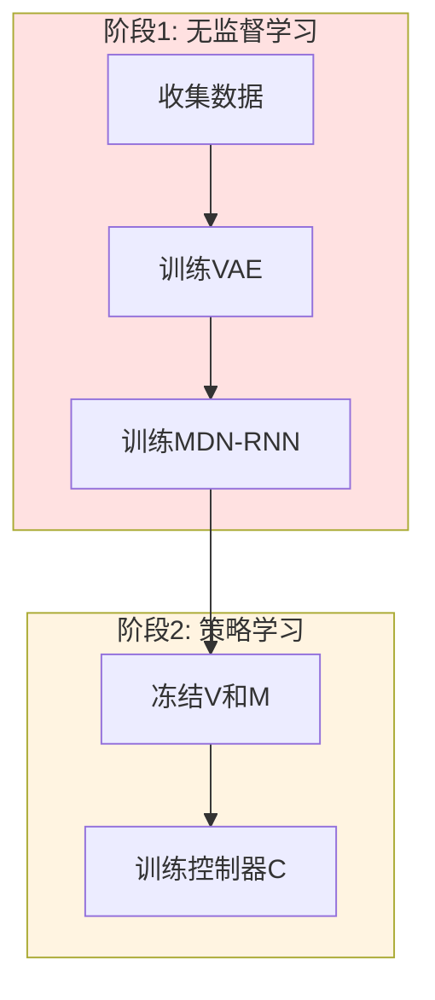
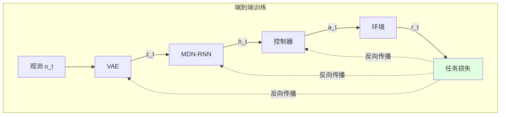

# 24.6 端到端优化

## 引言

传统世界模型采用**分阶段训练（Staged Training）**：先独立训练VAE和MDN-RNN，再训练控制器。这种方式存在**目标不一致**问题——环境模型优化的是重建精度，而控制器关心的是任务性能。

**端到端优化（End-to-End Optimization）** 将世界模型的所有组件联合训练，直接优化任务目标：

$$
\max_{\theta_V, \theta_M, \theta_C} \mathbb{E}_{\tau \sim p_{\theta}(\tau)}[R(\tau)]
$$

其中：
- $\theta_V$：VAE参数
- $\theta_M$：MDN-RNN参数
- $\theta_C$：控制器参数
- $R(\tau)$：轨迹累计奖励

本节将探讨：
1. 端到端训练的理论基础
2. 梯度传播技术
3. 联合优化策略
4. 实际工程实现

---

## 一、端到端训练理论

### 1.1 分阶段训练的局限

**传统流程**：



**问题**：
1. **目标不一致**：VAE优化像素重建，但控制器只需要任务相关特征
2. **梯度截断**：控制器无法传递梯度改进世界模型
3. **次优表示**：潜在空间可能包含无关信息（如背景纹理）

### 1.2 端到端训练优势

**联合优化**：



**优势**：
- 所有组件针对任务目标优化
- 学到任务相关的紧凑表示
- 避免次优的局部最优

### 1.3 数学表述

**目标函数**：

$$
\mathcal{J}(\theta) = \mathbb{E}_{\tau \sim \pi_\theta}[\sum_{t=0}^T \gamma^t r_t] - \lambda_V \mathcal{L}_{\text{VAE}} - \lambda_M \mathcal{L}_{\text{MDN}}
$$

其中：
- 第一项：任务性能（主目标）
- 第二项：VAE重建损失（辅助目标）
- 第三项：MDN预测损失（辅助目标）
- $\lambda_V, \lambda_M$：权重系数

---

## 二、梯度传播技术

### 2.1 通过离散采样的梯度

**问题**：重参数化采样 $z = \mu + \sigma \epsilon$ 是随机的，如何传播梯度？

**解决方案1：直通估计器（Straight-Through Estimator）**

```java
/**
 * 直通估计器
 */
public class StraightThroughEstimator {
    /**
     * 前向：使用采样
     * 反向：使用均值
     */
    public Tensor forward(Tensor mu, Tensor logVar) {
        // 前向传播：采样
        Tensor std = logVar.mul(0.5f).exp();
        Tensor eps = Tensor.randn(mu.shape());
        Tensor z = mu.add(std.mul(eps));
        
        // 反向传播时，假装直接用均值
        // z.grad 会直接传给 mu.grad
        return z;
    }
}
```

**解决方案2：重参数化技巧（已在VAE中使用）**

梯度可以流经 $\mu$ 和 $\sigma$：

$$
\frac{\partial z}{\partial \mu} = 1, \quad \frac{\partial z}{\partial \sigma} = \epsilon
$$

### 2.2 通过RNN的梯度

**BPTT（Backpropagation Through Time）**：

```java
/**
 * 通过时间反向传播
 */
public class BPTTGradient {
    /**
     * 完整BPTT（计算全部梯度）
     */
    public void fullBPTT(Trajectory traj) {
        int T = traj.getLength();
        LSTMState state = mdnRnn.getInitialState(1);
        
        List<Tensor> latents = new ArrayList<>();
        List<Tensor> actions = new ArrayList<>();
        List<Float> rewards = new ArrayList<>();
        
        // 前向展开（构建计算图）
        for (int t = 0; t < T; t++) {
            Tensor z = vae.encode(traj.getObs(t));
            latents.add(z);
            
            Action a = controller.forward(z, state.getHidden());
            actions.add(a.toTensor());
            
            MDNOutput output = mdnRnn.forward(z, a.toTensor(), state);
            rewards.add(output.getReward().item());
            
            state = output.getState();
        }
        
        // 计算总回报
        float totalReward = 0;
        for (float r : rewards) {
            totalReward += r;
        }
        
        // 反向传播（自动求导）
        optimizer.zeroGrad();
        (-totalReward).backward();  // 负号因为最大化奖励
        optimizer.step();
    }
}
```

**截断BPTT（减少内存）**：

```java
/**
 * 截断BPTT（限制梯度传播长度）
 */
public void truncatedBPTT(Trajectory traj, int truncateLen) {
    int T = traj.getLength();
    LSTMState state = mdnRnn.getInitialState(1);
    
    for (int start = 0; start < T; start += truncateLen) {
        int end = Math.min(start + truncateLen, T);
        
        float chunkReward = 0;
        
        // 前向展开chunk
        for (int t = start; t < end; t++) {
            Tensor z = vae.encode(traj.getObs(t));
            Action a = controller.forward(z, state.getHidden());
            MDNOutput output = mdnRnn.forward(z, a.toTensor(), state);
            
            chunkReward += output.getReward().item();
            state = output.getState();
        }
        
        // 反向传播chunk
        optimizer.zeroGrad();
        (-chunkReward).backward();
        optimizer.step();
        
        // Detach状态（切断梯度）
        state = state.detach();
    }
}
```

### 2.3 策略梯度技巧

使用REINFORCE估计梯度：

```java
/**
 * REINFORCE策略梯度
 */
public class REINFORCEEndToEnd {
    /**
     * 计算策略梯度
     */
    public void train(Trajectory traj) {
        float[] returns = computeReturns(traj.getRewards(), gamma=0.99f);
        
        LSTMState state = mdnRnn.getInitialState(1);
        float totalLoss = 0;
        
        for (int t = 0; t < traj.getLength(); t++) {
            // 1. VAE编码（可微）
            Tensor z = vae.encode(traj.getObs(t));
            
            // 2. 控制器决策（随机策略）
            ActionDistribution dist = controller.forward(z, state.getHidden());
            Action action = dist.sample();
            float logProb = dist.logProb(action);
            
            // 3. 策略梯度损失
            float loss = -logProb * returns[t];
            totalLoss += loss;
            
            // 4. MDN更新状态
            MDNOutput output = mdnRnn.forward(z, action.toTensor(), state);
            state = output.getState();
        }
        
        // 反向传播（梯度流经VAE, MDNRNN, Controller）
        optimizer.zeroGrad();
        totalLoss.backward();
        optimizer.step();
    }
}
```

---

## 三、联合优化策略

### 3.1 多目标优化

```java
/**
 * 多目标联合训练
 */
public class MultiObjectiveTrainer {
    private VAE vae;
    private MDNRNN mdnRnn;
    private Controller controller;
    
    private float lambdaRecon = 1.0f;   // 重建损失权重
    private float lambdaDyn = 1.0f;     // 动态损失权重
    private float lambdaPolicy = 10.0f; // 策略损失权重
    
    /**
     * 联合损失函数
     */
    public float computeJointLoss(Trajectory traj) {
        float reconLoss = 0;
        float dynLoss = 0;
        float policyLoss = 0;
        
        LSTMState state = mdnRnn.getInitialState(1);
        float[] returns = computeReturns(traj.getRewards(), gamma=0.99f);
        
        for (int t = 0; t < traj.getLength() - 1; t++) {
            Observation obs_t = traj.getObs(t);
            Observation obs_next = traj.getObs(t + 1);
            
            // 1. VAE重建损失
            VAEOutput vaeOut = vae.forward(obs_t);
            reconLoss += vae.computeLoss(obs_t, vaeOut).getTotalLoss();
            
            Tensor z_t = vaeOut.getZ();
            
            // 2. MDN动态预测损失
            Action action = traj.getActions().get(t);
            MDNOutput mdnOut = mdnRnn.forward(z_t, action.toTensor(), state);
            
            Tensor z_next_true = vae.encode(obs_next);
            dynLoss += mdnLoss.computeLoss(mdnOut, z_next_true, traj.getRewards().get(t));
            
            // 3. 策略梯度损失
            ActionDistribution dist = controller.forward(z_t, state.getHidden());
            policyLoss -= dist.logProb(action) * returns[t];
            
            state = mdnOut.getState();
        }
        
        // 加权求和
        return lambdaRecon * reconLoss 
             + lambdaDyn * dynLoss 
             + lambdaPolicy * policyLoss;
    }
    
    /**
     * 训练一个epoch
     */
    public void trainEpoch(List<Trajectory> trajectories) {
        float totalLoss = 0;
        
        for (Trajectory traj : trajectories) {
            float loss = computeJointLoss(traj);
            
            optimizer.zeroGrad();
            loss.backward();
            clipGradNorm(allParameters(), maxNorm=1.0f);
            optimizer.step();
            
            totalLoss += loss;
        }
        
        System.out.printf("Epoch Loss: %.4f\n", totalLoss / trajectories.size());
    }
}
```

### 3.2 交替优化

避免某个目标主导：

```java
/**
 * 交替优化策略
 */
public class AlternatingOptimization {
    /**
     * 交替训练各组件
     */
    public void train(List<Trajectory> dataset, int epochs) {
        for (int epoch = 0; epoch < epochs; epoch++) {
            // 1. 训练世界模型（冻结控制器）
            controller.freeze();
            for (int i = 0; i < 5; i++) {
                trainWorldModel(dataset);
            }
            controller.unfreeze();
            
            // 2. 训练控制器（冻结世界模型）
            vae.freeze();
            mdnRnn.freeze();
            for (int i = 0; i < 10; i++) {
                trainController(dataset);
            }
            vae.unfreeze();
            mdnRnn.unfreeze();
            
            // 3. 联合微调
            trainJointly(dataset);
        }
    }
}
```

### 3.3 损失权重调度

动态调整损失权重：

```java
/**
 * 自适应权重调度
 */
public class AdaptiveWeightScheduler {
    private float lambdaReconInit = 1.0f;
    private float lambdaDynInit = 1.0f;
    private float lambdaPolicyInit = 0.1f;  // 初期小
    
    private int currentStep = 0;
    
    /**
     * 获取当前权重
     */
    public Weights getWeights() {
        // 策略权重逐步增大
        float lambdaPolicy = lambdaPolicyInit * Math.min(1.0f, (float)currentStep / 10000);
        
        // 重建权重逐步减小
        float lambdaRecon = lambdaReconInit * Math.max(0.1f, 1.0f - (float)currentStep / 50000);
        
        currentStep++;
        
        return new Weights(lambdaRecon, lambdaDynInit, lambdaPolicy);
    }
}

// 使用示例
AdaptiveWeightScheduler scheduler = new AdaptiveWeightScheduler();

for (Batch batch : dataLoader) {
    Weights weights = scheduler.getWeights();
    float loss = weights.recon * reconLoss 
               + weights.dyn * dynLoss 
               + weights.policy * policyLoss;
    loss.backward();
    optimizer.step();
}
```

---

## 四、高级技术

### 4.1 任务相关表示学习

学习对任务有用的潜在表示：

```java
/**
 * 任务相关VAE
 */
public class TaskOrientedVAE extends VAE {
    /**
     * 添加值函数预测头
     */
    public class ValueHead extends Module {
        private Linear fc;
        
        public ValueHead(int latentDim) {
            fc = new Linear(latentDim, 1);
        }
        
        public float forward(Tensor z) {
            return fc.forward(z).item();
        }
    }
    
    private ValueHead valueHead;
    
    /**
     * 联合损失：重建 + 值函数预测
     */
    @Override
    public VAELoss computeLoss(Tensor observation, VAEOutput output, float trueValue) {
        VAELoss baseLoss = super.computeLoss(observation, output);
        
        // 值函数预测损失
        Tensor z = output.getZ();
        float valuePred = valueHead.forward(z);
        float valueLoss = (valuePred - trueValue) * (valuePred - trueValue);
        
        // 组合损失（强制潜在表示编码价值信息）
        float totalLoss = baseLoss.getTotalLoss() + 0.1f * valueLoss;
        
        return new VAELoss(totalLoss, baseLoss.getReconLoss(), baseLoss.getKlLoss(), valueLoss);
    }
}
```

### 4.2 对比学习增强

使用对比学习学习更好的表示：

```java
/**
 * 对比学习VAE
 */
public class ContrastiveVAE extends VAE {
    /**
     * InfoNCE损失
     */
    public float contrastiveLoss(Tensor z_anchor, Tensor z_positive, List<Tensor> z_negatives) {
        // 正样本：同一轨迹的相邻帧
        float posScore = z_anchor.dot(z_positive);
        
        // 负样本：不同轨迹的帧
        List<Float> negScores = new ArrayList<>();
        for (Tensor z_neg : z_negatives) {
            negScores.add(z_anchor.dot(z_neg));
        }
        
        // InfoNCE: -log(exp(pos) / (exp(pos) + Σexp(neg)))
        float expPos = (float)Math.exp(posScore / temperature);
        float expNegSum = negScores.stream()
            .map(score -> Math.exp(score / temperature))
            .reduce(0.0, Double::sum);
        
        return -(float)Math.log(expPos / (expPos + expNegSum));
    }
    
    /**
     * 联合训练
     */
    public void trainWithContrastive(Trajectory traj) {
        for (int t = 0; t < traj.getLength() - 1; t++) {
            Tensor z_t = vae.encode(traj.getObs(t));
            Tensor z_next = vae.encode(traj.getObs(t + 1));
            
            // 采样负样本
            List<Tensor> negatives = sampleNegatives(traj, currentIdx=t, numNeg=8);
            
            // 对比损失
            float contrastLoss = contrastiveLoss(z_t, z_next, negatives);
            
            // VAE重建损失
            VAEOutput output = vae.forward(traj.getObs(t));
            float reconLoss = vae.computeLoss(traj.getObs(t), output).getTotalLoss();
            
            // 总损失
            float totalLoss = reconLoss + 0.1f * contrastLoss;
            totalLoss.backward();
        }
        
        optimizer.step();
    }
}
```

### 4.3 元梯度优化

学习损失权重：

```java
/**
 * 元梯度学习权重
 */
public class MetaGradientOptimization {
    private Tensor lambdaRecon;  // 可学习的权重
    private Tensor lambdaDyn;
    private Tensor lambdaPolicy;
    
    public MetaGradientOptimization() {
        // 初始化权重（可学习参数）
        lambdaRecon = new Tensor(1.0f).requireGrad(true);
        lambdaDyn = new Tensor(1.0f).requireGrad(true);
        lambdaPolicy = new Tensor(0.1f).requireGrad(true);
    }
    
    /**
     * 内循环：用当前权重训练模型
     */
    public WorldModel innerLoop(List<Trajectory> trainData, int steps) {
        WorldModel model = new WorldModel();
        
        for (int step = 0; step < steps; step++) {
            float loss = lambdaRecon.item() * reconLoss 
                       + lambdaDyn.item() * dynLoss 
                       + lambdaPolicy.item() * policyLoss;
            
            modelOptimizer.zeroGrad();
            loss.backward();
            modelOptimizer.step();
        }
        
        return model;
    }
    
    /**
     * 外循环：更新权重以最大化验证性能
     */
    public void outerLoop(List<Trajectory> trainData, List<Trajectory> valData) {
        // 内循环训练
        WorldModel model = innerLoop(trainData, steps=100);
        
        // 验证集评估
        float valPerformance = evaluatePerformance(model, valData);
        
        // 更新权重（元梯度）
        metaOptimizer.zeroGrad();
        (-valPerformance).backward();  // 最大化性能
        metaOptimizer.step();
        
        // 确保权重非负
        lambdaRecon.clampMin(0);
        lambdaDyn.clampMin(0);
        lambdaPolicy.clampMin(0);
    }
}
```

---

## 五、实现细节

### 5.1 完整端到端训练流程

```java
/**
 * 端到端世界模型训练器
 */
public class EndToEndWorldModelTrainer {
    private VAE vae;
    private MDNRNN mdnRnn;
    private Controller controller;
    private Environment env;
    
    private Optimizer optimizer;
    private AdaptiveWeightScheduler weightScheduler;
    
    /**
     * 主训练循环
     */
    public void train(int numIterations) {
        for (int iter = 0; iter < numIterations; iter++) {
            // 1. 收集轨迹（使用当前策略）
            List<Trajectory> trajectories = collectTrajectories(numEpisodes=10);
            
            // 2. 端到端训练
            for (Trajectory traj : trajectories) {
                trainOnTrajectory(traj);
            }
            
            // 3. 评估性能
            if (iter % 100 == 0) {
                float avgReward = evaluate(numEpisodes=10);
                System.out.printf("Iter %d: Avg Reward = %.2f\n", iter, avgReward);
            }
        }
    }
    
    /**
     * 在单条轨迹上训练
     */
    private void trainOnTrajectory(Trajectory traj) {
        Weights weights = weightScheduler.getWeights();
        
        float reconLoss = 0;
        float dynLoss = 0;
        float policyLoss = 0;
        
        LSTMState state = mdnRnn.getInitialState(1);
        float[] returns = computeReturns(traj.getRewards(), gamma=0.99f);
        
        // 前向传播（构建计算图）
        for (int t = 0; t < traj.getLength() - 1; t++) {
            // VAE编码
            VAEOutput vaeOut = vae.forward(traj.getObs(t));
            Tensor z_t = vaeOut.getZ();
            
            // VAE重建损失
            reconLoss += vae.computeLoss(traj.getObs(t), vaeOut).getTotalLoss();
            
            // 控制器决策
            ActionDistribution dist = controller.forward(z_t, state.getHidden());
            Action action = traj.getActions().get(t);
            
            // 策略梯度损失
            policyLoss -= dist.logProb(action) * returns[t];
            
            // MDN预测
            MDNOutput mdnOut = mdnRnn.forward(z_t, action.toTensor(), state);
            Tensor z_next = vae.encode(traj.getObs(t + 1));
            
            // MDN动态损失
            dynLoss += mdnLoss.computeLoss(mdnOut, z_next, traj.getRewards().get(t));
            
            state = mdnOut.getState();
        }
        
        // 组合损失
        float totalLoss = weights.recon * reconLoss 
                        + weights.dyn * dynLoss 
                        + weights.policy * policyLoss;
        
        // 反向传播
        optimizer.zeroGrad();
        totalLoss.backward();
        clipGradNorm(getAllParameters(), maxNorm=1.0f);
        optimizer.step();
    }
    
    /**
     * 收集轨迹
     */
    private List<Trajectory> collectTrajectories(int numEpisodes) {
        List<Trajectory> trajectories = new ArrayList<>();
        
        for (int ep = 0; ep < numEpisodes; ep++) {
            Trajectory traj = new Trajectory();
            Observation obs = env.reset();
            LSTMState state = mdnRnn.getInitialState(1);
            
            for (int t = 0; t < maxSteps; t++) {
                // 使用当前策略
                Tensor z = vae.encode(obs);
                ActionDistribution dist = controller.forward(z, state.getHidden());
                Action action = dist.sample();
                
                Transition transition = env.step(action);
                traj.add(transition);
                
                // 更新MDN状态
                MDNOutput mdnOut = mdnRnn.forward(z, action.toTensor(), state);
                state = mdnOut.getState();
                
                obs = transition.getNextObs();
                
                if (transition.isDone()) {
                    break;
                }
            }
            
            trajectories.add(traj);
        }
        
        return trajectories;
    }
}
```

### 5.2 梯度裁剪与稳定性

```java
/**
 * 梯度裁剪工具
 */
public class GradientClipper {
    /**
     * 全局梯度范数裁剪
     */
    public static void clipGradNorm(List<Tensor> parameters, float maxNorm) {
        // 计算总梯度范数
        float totalNorm = 0;
        for (Tensor param : parameters) {
            if (param.grad() != null) {
                totalNorm += param.grad().pow(2).sum().item();
            }
        }
        totalNorm = (float)Math.sqrt(totalNorm);
        
        // 裁剪
        float clipCoef = maxNorm / (totalNorm + 1e-6f);
        if (clipCoef < 1.0f) {
            for (Tensor param : parameters) {
                if (param.grad() != null) {
                    param.grad().mul_(clipCoef);
                }
            }
        }
    }
    
    /**
     * 梯度值裁剪
     */
    public static void clipGradValue(List<Tensor> parameters, float clipValue) {
        for (Tensor param : parameters) {
            if (param.grad() != null) {
                param.grad().clamp(-clipValue, clipValue);
            }
        }
    }
}
```

---

## 小节总结

本节深入探讨了端到端优化技术：

### 关键要点

1. **端到端优势**：
   - 所有组件联合优化任务目标
   - 学到任务相关的紧凑表示
   - 避免分阶段训练的次优解

2. **梯度传播**：
   - 重参数化技巧
   - BPTT/截断BPTT
   - 策略梯度估计

3. **联合优化**：
   - 多目标加权
   - 交替优化策略
   - 自适应权重调度

4. **高级技术**：
   - 任务相关表示学习
   - 对比学习增强
   - 元梯度优化权重

### 实现清单

```java
// 端到端训练完整流程
EndToEndWorldModelTrainer trainer = new EndToEndWorldModelTrainer(
    vae, mdnRnn, controller, env
);

// 配置优化器（所有参数）
List<Tensor> allParams = new ArrayList<>();
allParams.addAll(vae.parameters());
allParams.addAll(mdnRnn.parameters());
allParams.addAll(controller.parameters());

Optimizer optimizer = new Adam(allParams, lr=1e-4);
trainer.setOptimizer(optimizer);

// 自适应权重
AdaptiveWeightScheduler scheduler = new AdaptiveWeightScheduler();
trainer.setWeightScheduler(scheduler);

// 训练
trainer.train(numIterations=10000);
```

端到端优化使世界模型的各组件协同工作，直接优化任务性能，是现代世界模型（如Dreamer）的核心技术。下一节将展示完整的综合项目实现。

---

## 思考题

1. 为什么端到端训练比分阶段训练效果更好？代价是什么？

2. 截断BPTT如何影响梯度准确性？如何选择截断长度？

3. 多目标优化中，如何平衡重建损失和策略损失？

4. 对比学习如何帮助学习更好的潜在表示？

5. 元梯度优化权重的优势是什么？计算成本如何？

---

## 拓展阅读

1. **Dreamer (Hafner et al., 2020)**  
   端到端世界模型经典实现

2. **DreamerV2 (Hafner et al., 2021)**  
   改进的端到端训练策略

3. **TD-MPC (Hansen et al., 2022)**  
   端到端Model-Based强化学习

4. **CURL (Laskin et al., 2020)**  
   对比学习增强表示
