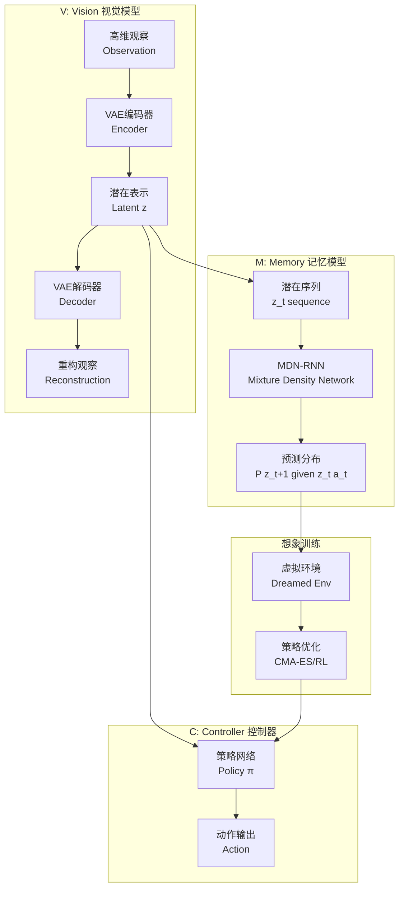

# 第24章:世界模型与想象学习

## 章节概述

> **设计思想**:构建环境的内部模型,在"想象"中训练,大幅提升样本效率

本章将探讨具身智能领域的创新技术——世界模型(World Models)。世界模型的核心思想是让智能体学习环境的内部表示,能够在脑海中"想象"未来会发生什么,从而在虚拟的想象空间中进行训练,大幅减少与真实环境的交互次数。

这种方法特别适合机器人学习场景,因为真实的物理交互往往成本高昂、耗时且可能存在安全风险。通过世界模型,智能体可以用1%的真实交互获得100%的训练效果,实现10-100倍的样本效率提升。

## 学习目标

完成本章学习后,你将:

- ✅ **理解世界模型原理**:掌握V-M-C三组件架构的设计思想
- ✅ **实现VAE编码器**:学会将高维观察压缩为低维潜在表示
- ✅ **构建MDN-RNN**:掌握混合密度网络和GRU的环境动态预测
- ✅ **实现想象训练**:能够在纯想象空间中训练策略
- ✅ **提升样本效率**:理解如何大幅减少真实交互需求
- ✅ **端到端优化**:掌握联合训练多个组件的方法

## 技术架构图

## 章节大纲

### 24.1 世界模型原理
- V-M-C架构:Vision + Memory + Controller的三层设计
- 内部模型:智能体对环境动态的学习表示
- 想象能力:在内部模型中预测未来
- 样本效率:为什么想象训练更高效
- 应用场景:机器人学习、游戏AI、自动驾驶

### 24.2 VAE编码器与表示学习
- VAE原理:变分自编码器的数学基础
- 编码器设计:将高维图像压缩为低维向量
- 潜在空间:有意义的连续表示空间
- 重参数化技巧:使梯度可以反向传播
- 表示质量:如何评估学到的表示

### 24.3 MDN-RNN动态预测
- 混合密度网络:预测概率分布而非单一值
- GRU记忆:门控循环单元建模时序依赖
- 时序建模:如何预测状态的演变
- 不确定性量化:捕捉环境的随机性
- 训练策略:真实轨迹上的监督学习

### 24.4 想象训练
- 纯想象训练:完全在内部模型中进行
- 梦境生成:从想象的初始状态开始模拟
- 虚拟交互:在想象空间执行动作和观察结果
- 策略优化:CMA-ES、进化策略、强化学习
- 训练效率:对比真实交互的样本需求

### 24.5 样本高效学习
- 样本效率对比:1% vs 100%真实数据的效果
- 数据复用:充分利用有限的真实交互
- 迁移学习:从仿真到真实的知识迁移
- 在线适应:少量真实交互后快速调整
- Sim-to-Real:缩小想象与现实的差距

### 24.6 端到端优化
- 联合训练:V、M、C三个组件的协同优化
- 梯度流:端到端的可微分训练
- 损失函数设计:
  - VAE重构损失 + KL散度
  - MDN-RNN预测损失
  - 控制器任务奖励
- 训练流程:分阶段训练vs端到端训练
- 超参数调优:学习率、权重衰减、批大小

### 24.7 综合项目:世界模型系统
- 项目目标:基于想象训练的高效学习系统
- 系统架构:VAE+MDN-RNN+Controller的完整集成
- 核心功能:
  - 观察压缩与重构
  - 环境动态预测
  - 纯想象训练
  - Sim-to-Real部署
- 性能评估:样本效率、任务成功率
- 对比实验:世界模型vs传统强化学习

## 性能基准

| 指标 | 目标值 | 说明 |
|------|--------|------|
| 样本效率提升 | 10-100x | 相比传统RL的真实交互次数 |
| VAE重构误差 | < 0.01 | MSE on test set |
| MDN-RNN预测准确度 | > 85% | 一步预测的准确率 |
| 控制器成功率 | > 80% | 在真实环境测试 |
| 训练时间 | < 2小时 | 在标准硬件上 |

## 本章小结

### 核心收获

- 掌握了世界模型的V-M-C架构
- 理解了VAE和MDN-RNN的原理和实现
- 学会了在想象空间中训练策略
- 了解了如何大幅提升样本效率

### 第四部分总结

通过第四部分的学习,我们完成了从虚拟到现实的AI技术跨越:

- **第21章**:建立了具身智能的基础认知和技术框架
- **第22章**:掌握了机器人控制的核心算法
- **第23章**:学习了多模态融合的前沿技术
- **第24章**:探索了高效学习的创新方法

这四章内容涵盖了具身智能的完整技术栈,从基础到前沿,从理论到实践,为你打开了AI与物理世界交互的大门。

---

**恭喜完成第四部分!** 你已经掌握了具身智能的核心技术,可以开始构建真正能够感知和操作物理世界的智能系统了! 🎉🤖

**下一步建议**:
- 运行所有综合项目,巩固理解
- 尝试将技术应用到新的场景
- 关注具身智能领域的最新研究进展
- 思考如何将具身智能与其他AI技术(LLM、多智能体等)结合
