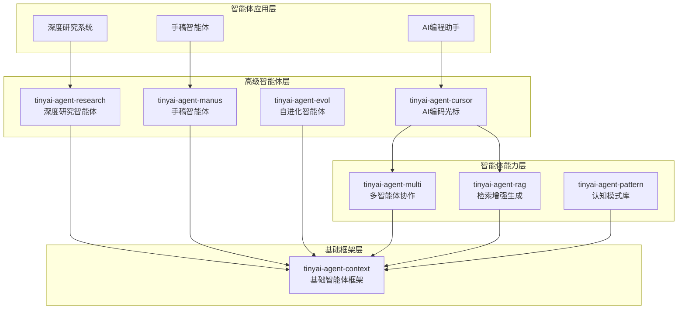

# TinyAI 智能体系统层

[](https://openjdk.org/projects/jdk/17/)
[](https://maven.apache.org/)
[](https://opensource.org/licenses/Apache-2.0)

## 📋 模块概述

`tinyai-agent` 是 TinyAI 框架的智能体系统层，提供了从基础智能体框架到高级认知模式的完整智能体解决方案。该层包含 **8个核心模块**，涵盖记忆管理、检索增强生成、多智能体协作、自进化学习、认知模式、AI编程助手、深度研究和手稿智能体等先进功能。

### 🎯 设计目标

- **完整的智能体生态**：从基础框架到高级应用的全栈智能体系统
- **模块化设计**：各模块独立可用，也可灵活组合
- **生产就绪**：企业级架构设计，支持实际应用场景
- **易于扩展**：开放的接口设计，便于定制和二次开发

## 🏗️ 模块架构



## 📦 核心模块

### 基础框架模块

| 模块 | 说明 | 核心特性 |
|------|------|---------|
| [**tinyai-agent-context**](tinyai-agent-context/README.md) | 基础智能体框架 | 记忆管理、RAG检索、工具调用、上下文工程、MCP协议支持 |

### 能力增强模块

| 模块 | 说明 | 核心特性 |
|------|------|---------|
| [**tinyai-agent-rag**](tinyai-agent-rag/README.md) | 检索增强生成系统 | 语义检索、向量数据库、TF-IDF向量化、相似度计算 |
| [**tinyai-agent-multi**](tinyai-agent-multi/README.md) | 多智能体协作系统 | 消息总线、异步通信、任务分配、团队协调 |
| [**tinyai-agent-pattern**](tinyai-agent-pattern/README.md) | 认知模式库 | ReAct、Reflection、Planning、Collaborative等模式 |

### 高级智能体模块

| 模块 | 说明 | 核心特性 |
|------|------|---------|
| [**tinyai-agent-evol**](tinyai-agent-evol/README.md) | 自进化智能体 | 经验学习、策略优化、知识图谱构建、反思机制、LLM增强 |
| [**tinyai-agent-cursor**](tinyai-agent-cursor/README.md) | AI编程助手 | 代码分析、智能生成、重构建议、调试辅助 |
| [**tinyai-agent-research**](tinyai-agent-research/README.md) | 深度研究智能体 | 多阶段推理、知识图谱、自适应学习、文献检索 |
| [**tinyai-agent-manus**](tinyai-agent-manus/README.md) | 手稿智能体 | OpenManus架构、双执行机制、计划驱动、Flow编排 |

## 🚀 快速开始

### 环境要求

- **Java**: JDK 17+
- **Maven**: 3.6+
- **内存**: 推荐 4GB+

### 编译安装

```bash
# 编译所有智能体模块
cd tinyai-agent
mvn clean compile

# 运行测试
mvn test

# 打包安装
mvn install
```

### 基础使用示例

```java
// 1. 创建基础智能体
import io.leavesfly.tinyai.agent.AdvancedAgent;

AdvancedAgent agent = new AdvancedAgent("我的助手", "你是一个智能助手");
agent.addKnowledge("Java是一种面向对象的编程语言", "java_info");
String response = agent.processMessage("什么是Java？");

// 2. 使用RAG检索增强
import io.leavesfly.tinyai.agent.rag.RAGSystem;

RAGSystem rag = new RAGSystem();
rag.addDocument("文档内容...", "doc_1");
List<RetrievalResult> results = rag.retrieve("查询问题", 3);

// 3. 多智能体协作
import io.leavesfly.tinyai.agent.multi.*;

MultiAgentSystem system = new MultiAgentSystem();
system.registerAgent(new AnalystAgent("analyst_1"));
system.registerAgent(new ResearcherAgent("researcher_1"));
system.sendMessage(new AgentMessage("task_1", MessageType.TASK));

// 4. 自进化智能体
import io.leavesfly.tinyai.agent.evol.SelfEvolvingAgent;

SelfEvolvingAgent evolAgent = new SelfEvolvingAgent("学习助手");
TaskResult result = evolAgent.processTask("复杂任务", context);
evolAgent.selfEvolve(); // 触发自我进化
```

## 🎯 应用场景

### 企业级应用

- **智能客服系统**: 基于RAG的企业知识库问答
- **代码生成助手**: AI编程辅助工具（Cursor风格）
- **文档智能处理**: 多智能体协作的文档分析
- **业务流程自动化**: 自进化智能体的决策优化
- **研究辅助系统**: 深度研究智能体的学术支持

### 创新应用

- **自适应推荐系统**: 具备自主学习能力的推荐引擎
- **智能运维助手**: 多专家协作的运维问题解决
- **个性化学习平台**: 基于认知模式的自适应教育
- **创意内容生成**: 手稿智能体的内容创作
- **自动化编程**: 从需求到代码的全流程智能化

## 📊 模块统计

### 代码规模

| 指标 | 数值 |
|------|------|
| 总模块数 | 8个 |
| Java类文件 | 200+ |
| 测试用例 | 250+ |
| 代码行数 | 30,000+ |
| 文档页数 | 100+ |

### 测试覆盖

| 模块 | 测试数量 | 覆盖率 | 状态 |
|------|----------|--------|------|
| tinyai-agent-context | 45+ | 95%+ | ✅ 通过 |
| tinyai-agent-rag | 30+ | 90%+ | ✅ 通过 |
| tinyai-agent-multi | 40+ | 95%+ | ✅ 通过 |
| tinyai-agent-evol | 35+ | 90%+ | ✅ 通过 |
| tinyai-agent-pattern | 25+ | 85%+ | ✅ 通过 |
| tinyai-agent-cursor | 30+ | 90%+ | ✅ 通过 |
| tinyai-agent-research | 25+ | 85%+ | ✅ 通过 |
| tinyai-agent-manus | 20+ | 85%+ | ✅ 通过 |
| **总计** | **250+** | **90%+** | **✅ 全部通过** |

## 🎓 学习路径

### 初级：基础智能体开发

1. 学习 [tinyai-agent-context](tinyai-agent-context/README.md) - 理解智能体基础架构
2. 掌握记忆管理、工具调用、上下文工程等核心概念
3. 完成基础智能体的创建和配置

### 中级：能力增强

1. 学习 [tinyai-agent-rag](tinyai-agent-rag/README.md) - 掌握检索增强生成
2. 学习 [tinyai-agent-multi](tinyai-agent-multi/README.md) - 理解多智能体协作
3. 学习 [tinyai-agent-pattern](tinyai-agent-pattern/README.md) - 应用认知模式

### 高级：专业智能体开发

1. 学习 [tinyai-agent-evol](tinyai-agent-evol/README.md) - 构建自进化系统
2. 学习 [tinyai-agent-cursor](tinyai-agent-cursor/README.md) - 开发AI编程助手
3. 学习 [tinyai-agent-research](tinyai-agent-research/README.md) - 实现深度研究系统
4. 学习 [tinyai-agent-manus](tinyai-agent-manus/README.md) - 掌握手稿智能体架构

## 📖 演示程序

### 运行示例

```bash
# 基础智能体演示
mvn exec:java -Dexec.mainClass="io.leavesfly.tinyai.agent.AgentDemo" -pl tinyai-agent-context

# 自进化智能体演示
mvn exec:java -Dexec.mainClass="io.leavesfly.tinyai.agent.evol.EvolDemo" -pl tinyai-agent-evol

# 多智能体系统演示
mvn exec:java -Dexec.mainClass="io.leavesfly.tinyai.agent.multi.MultiAgentDemo" -pl tinyai-agent-multi

# AI编程助手演示
mvn exec:java -Dexec.mainClass="io.leavesfly.tinyai.agent.cursor.CursorDemo" -pl tinyai-agent-cursor

# 手稿智能体演示
mvn exec:java -Dexec.mainClass="io.leavesfly.tinyai.agent.manus.ManusDemo" -pl tinyai-agent-manus
```

## 🔧 扩展开发

### 自定义智能体

```java
public class CustomAgent extends BaseAgent {
    @Override
    protected Object performTask(AgentTask task) throws Exception {
        // 实现自定义任务处理逻辑
        return processCustomTask(task);
    }
    
    @Override
    protected void initializeCapabilities() {
        capabilities.add("自定义能力1");
        capabilities.add("自定义能力2");
    }
}
```

### 自定义认知模式

```java
public class CustomPattern implements CognitivePattern {
    @Override
    public String executePattern(String input, AgentContext context) {
        // 实现自定义认知模式逻辑
        return processWithPattern(input, context);
    }
}
```

## 📚 技术文档

### 核心文档

- [基础智能体框架文档](tinyai-agent-context/README.md)
- [检索增强生成系统文档](tinyai-agent-rag/README.md)
- [多智能体协作系统文档](tinyai-agent-multi/README.md)
- [自进化智能体文档](tinyai-agent-evol/README.md)
- [AI编程助手文档](tinyai-agent-cursor/README.md)
- [深度研究智能体文档](tinyai-agent-research/README.md)
- [手稿智能体文档](tinyai-agent-manus/README.md)
- [认知模式库文档](tinyai-agent-pattern/README.md)

### 架构设计文档

- [智能体系统技术架构](tinyai-agent-context/doc/技术架构文档.md)
- [多智能体通信机制](tinyai-agent-multi/doc/技术文档.md)
- [自进化学习机制](tinyai-agent-evol/doc/技术文档.md)
- [深度研究智能体架构](tinyai-agent-research/doc/技术架构文档.md)

## 🤝 贡献指南

### 开发规范

1. **代码规范**: 遵循Java编码规范，添加详细中文注释
2. **测试覆盖**: 新功能必须包含完整的单元测试
3. **文档更新**: 重要功能需要更新相应的README和技术文档
4. **性能优化**: 注意内存使用和响应时间

### 提交流程

1. Fork 项目仓库
2. 创建功能分支 (`git checkout -b feature/AmazingFeature`)
3. 提交更改 (`git commit -m 'Add some AmazingFeature'`)
4. 推送到分支 (`git push origin feature/AmazingFeature`)
5. 创建 Pull Request

## 📄 许可证

本项目采用 Apache License 2.0 开源许可证。详情请参阅 [LICENSE](../LICENSE) 文件。

## 🙏 致谢

感谢所有为 TinyAI 智能体系统做出贡献的开发者！

---

<div align="center">

**🎯 构建下一代智能体系统！**

**如果这个项目对您有帮助，请给我们一个 ⭐️**

[⚡ 快速开始](#🚀-快速开始) | [📖 查看文档](#📚-技术文档) | [🤝 参与贡献](#🤝-贡献指南)

</div>
