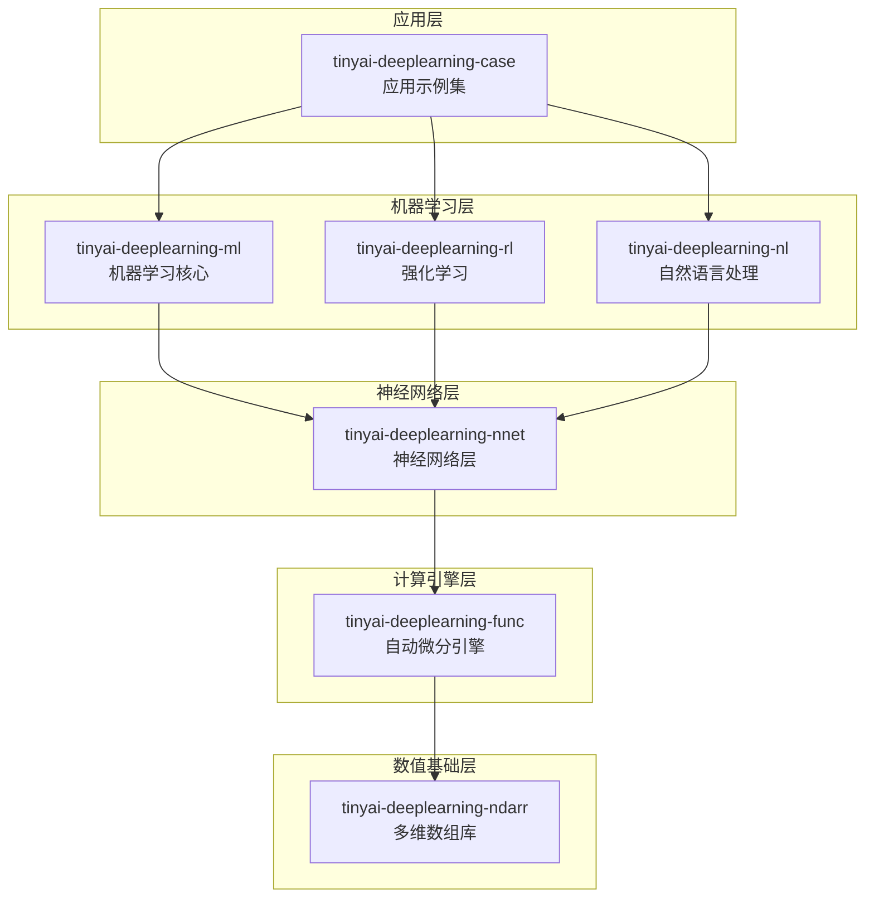

# TinyAI 深度学习框架层

[](https://openjdk.org/projects/jdk/17/)
[](https://maven.apache.org/)
[](https://opensource.org/licenses/Apache-2.0)

## 📋 模块概述

`tinyai-deeplearning` 是 TinyAI 框架的深度学习核心层，提供了从底层数值计算到高层神经网络构建的完整深度学习解决方案。该层包含 **7个核心模块**，构成了从基础计算到应用实现的完整技术栈。

### 🎯 设计目标

- **纯Java实现**: 零第三方依赖的核心计算引擎
- **教育友好**: 清晰的代码结构和详尽的中文注释
- **模块化架构**: 高度解耦的组件设计，支持灵活组合
- **生产就绪**: 企业级的架构设计，支持并行训练
- **扩展性强**: 开放的接口设计，便于添加新算法

## 🏗️ 模块架构



## 📦 核心模块

### 数值基础层

| 模块 | 说明 | 核心特性 |
|------|------|---------|
| [**tinyai-deeplearning-ndarr**](tinyai-deeplearning-ndarr/README.md) | 多维数组库 | N维数组操作、广播机制、内存优化、数值稳定性 |

### 计算引擎层

| 模块 | 说明 | 核心特性 |
|------|------|---------|
| [**tinyai-deeplearning-func**](tinyai-deeplearning-func/README.md) | 自动微分引擎 | 动态计算图、反向传播、丰富的数学函数、梯度检查 |

### 神经网络层

| 模块 | 说明 | 核心特性 |
|------|------|---------|
| [**tinyai-deeplearning-nnet**](tinyai-deeplearning-nnet/README.md) | 神经网络层 | 全连接、卷积、循环、Transformer、注意力机制 |

### 机器学习层

| 模块 | 说明 | 核心特性 |
|------|------|---------|
| [**tinyai-deeplearning-ml**](tinyai-deeplearning-ml/README.md) | 机器学习核心 | 模型管理、并行训练、优化器、损失函数、评估器 |
| [**tinyai-deeplearning-rl**](tinyai-deeplearning-rl/README.md) | 强化学习 | DQN、REINFORCE、多臂老虎机、策略梯度、经验回放 |
| [**tinyai-deeplearning-nl**](tinyai-deeplearning-nl/README.md) | 自然语言处理 | 词嵌入、RNN、LSTM、GRU、序列建模、注意力机制 |

### 应用示例层

| 模块 | 说明 | 核心特性 |
|------|------|---------|
| [**tinyai-deeplearning-case**](tinyai-deeplearning-case/README.md) | 应用示例集 | 计算机视觉、NLP、强化学习、分类、回归等完整示例 |

## 🚀 快速开始

### 环境要求

- **Java**: JDK 17+
- **Maven**: 3.6+
- **内存**: 推荐 4GB+

### 编译安装

```bash
# 编译所有深度学习模块
cd tinyai-deeplearning
mvn clean compile

# 运行测试
mvn test

# 打包安装
mvn install
```

### 基础使用示例

#### 1. 多维数组操作

```java
import io.leavesfly.tinyai.ndarr.NdArray;
import io.leavesfly.tinyai.ndarr.Shape;

// 创建数组
NdArray a = NdArray.of(new float[][]{{1, 2}, {3, 4}});
NdArray b = NdArray.zeros(Shape.of(2, 3));
NdArray c = NdArray.randn(Shape.of(100, 50));

// 数学运算
NdArray result = a.add(b)      // 加法
                 .mul(c)       // 对应元素相乘
                 .dot(d)       // 矩阵乘法
                 .sigmoid()    // Sigmoid激活
                 .transpose(); // 转置
```

#### 2. 自动微分

```java
import io.leavesfly.tinyai.func.Variable;

// 创建变量
Variable x = new Variable(NdArray.of(new float[][]{{1, 2}, {3, 4}}), "x");
Variable y = new Variable(NdArray.of(new float[][]{{2, 3}, {4, 5}}), "y");

// 计算
Variable z = x.add(y);
Variable w = z.sigmoid();

// 反向传播
w.backward();

// 获取梯度
NdArray xGrad = x.getGrad();
System.out.println("x的梯度: " + xGrad);
```

#### 3. 神经网络构建

```java
import io.leavesfly.tinyai.nnet.block.*;
import io.leavesfly.tinyai.nnet.v1.dnn.layer.LinearLayer;
import io.leavesfly.tinyai.nnet.v1.activate.layer.ReLuLayer;

// 构建MLP
MlpBlock mlp = new MlpBlock("classifier", 784, new int[]{128, 64, 10});

// 或者手动构建
SequentialBlock model = new SequentialBlock("manual_model");
model.addLayer(new LinearLayer("fc1", 784, 256));
model.addLayer(new ReLuLayer("relu1"));
model.addLayer(new LinearLayer("fc2", 256, 10));

// 前向传播
Variable output = model.blockForward(input);
```

#### 4. 模型训练

```java
import io.leavesfly.tinyai.ml.*;

// 准备数据
DataSet dataSet = new ArrayDataset(xData, yData);

// 创建模型
MlpBlock mlpBlock = new MlpBlock("classifier", 784, new int[]{128, 64, 10});
Model model = new Model("mnist_classifier", mlpBlock);

// 配置训练器
Monitor monitor = new Monitor();
Evaluator evaluator = new Evaluator();
Trainer trainer = new Trainer(100, monitor, evaluator, true, 4); // 并行训练

// 初始化训练器
trainer.init(dataSet, model, new SoftmaxCrossEntropyLoss(), new Adam(0.001));

// 开始训练
trainer.train(true);
```

#### 5. 强化学习

```java
import io.leavesfly.tinyai.rl.*;

// 创建环境
CartPoleEnvironment env = new CartPoleEnvironment();

// 创建DQN智能体
DQNAgent agent = new DQNAgent(
    "CartPole-DQN",
    stateDim,
    actionDim,
    hiddenSizes,
    learningRate,
    epsilon,
    gamma,
    batchSize,
    bufferSize,
    updateFreq
);

// 训练循环
for (int episode = 0; episode < maxEpisodes; episode++) {
    State state = env.reset();
    while (!done) {
        Action action = agent.selectAction(state);
        StepResult result = env.step(action);
        agent.store(state, action, result.reward, result.nextState, result.done);
        agent.train();
        state = result.nextState;
    }
}
```

#### 6. 自然语言处理

```java
import io.leavesfly.tinyai.nl.*;

// 词嵌入
WordEmbedding embedding = new WordEmbedding("embedding", vocabSize, embeddingDim);
Variable embedded = embedding.layerForward(inputIds);

// LSTM
LSTM lstm = new LSTM("lstm", inputSize, hiddenSize, numLayers, dropout);
Variable output = lstm.layerForward(embedded);

// 注意力机制
Attention attention = new Attention("attention", hiddenSize);
Variable context = attention.layerForward(query, key, value);
```

## 🎯 应用场景

### 计算机视觉

- **图像分类**: MNIST手写数字识别、CIFAR-10分类
- **目标检测**: 基于卷积网络的目标检测
- **图像生成**: GAN、VAE等生成模型

### 自然语言处理

- **文本分类**: 情感分析、主题分类
- **序列标注**: 命名实体识别、词性标注
- **序列生成**: 机器翻译、文本摘要
- **语言模型**: RNN、LSTM、GRU语言模型

### 强化学习

- **游戏AI**: CartPole、GridWorld等经典环境
- **决策优化**: 多臂老虎机、策略优化
- **控制问题**: 机器人控制、自动驾驶

### 传统机器学习

- **分类任务**: 逻辑回归、多分类
- **回归任务**: 线性回归、多元回归
- **聚类分析**: K-Means、层次聚类

## 📊 模块统计

### 代码规模

| 指标 | 数值 |
|------|------|
| 总模块数 | 7个 |
| Java类文件 | 300+ |
| 测试用例 | 400+ |
| 代码行数 | 50,000+ |
| 文档页数 | 150+ |

### 测试覆盖

| 模块 | 测试数量 | 覆盖率 | 状态 |
|------|----------|--------|------|
| tinyai-deeplearning-ndarr | 80+ | 98%+ | ✅ 通过 |
| tinyai-deeplearning-func | 90+ | 97%+ | ✅ 通过 |
| tinyai-deeplearning-nnet | 100+ | 96%+ | ✅ 通过 |
| tinyai-deeplearning-ml | 70+ | 95%+ | ✅ 通过 |
| tinyai-deeplearning-rl | 30+ | 90%+ | ✅ 通过 |
| tinyai-deeplearning-nl | 20+ | 85%+ | ✅ 通过 |
| tinyai-deeplearning-case | 10+ | 100% | ✅ 通过 |
| **总计** | **400+** | **95%+** | **✅ 全部通过** |

## 🎓 学习路径

### 初级：理解基础概念

1. 学习 [tinyai-deeplearning-ndarr](tinyai-deeplearning-ndarr/README.md) - 理解多维数组操作
2. 学习 [tinyai-deeplearning-func](tinyai-deeplearning-func/README.md) - 掌握自动微分原理
3. 完成简单的数学运算和梯度计算

### 中级：神经网络构建

1. 学习 [tinyai-deeplearning-nnet](tinyai-deeplearning-nnet/README.md) - 掌握网络层构建
2. 学习 [tinyai-deeplearning-ml](tinyai-deeplearning-ml/README.md) - 理解训练流程
3. 实现基础的分类和回归模型

### 高级：专业领域应用

1. 学习 [tinyai-deeplearning-rl](tinyai-deeplearning-rl/README.md) - 掌握强化学习
2. 学习 [tinyai-deeplearning-nl](tinyai-deeplearning-nl/README.md) - 理解序列建模
3. 学习 [tinyai-deeplearning-case](tinyai-deeplearning-case/README.md) - 完整应用案例

## 📖 演示程序

### 运行示例

```bash
# MNIST手写数字识别
mvn exec:java -Dexec.mainClass="io.leavesfly.tinyai.example.classify.MnistMlpExam" \
  -pl tinyai-deeplearning-case

# CartPole强化学习
mvn exec:java -Dexec.mainClass="io.leavesfly.tinyai.example.rl.CartPoleDQNExample" \
  -pl tinyai-deeplearning-case

# 简单RNN示例
mvn exec:java -Dexec.mainClass="io.leavesfly.tinyai.example.nlp.SimpleRNNExample" \
  -pl tinyai-deeplearning-case

# 线性回归示例
mvn exec:java -Dexec.mainClass="io.leavesfly.tinyai.example.regression.LinearRegressionExample" \
  -pl tinyai-deeplearning-case
```

## 🔬 技术特性

### 1. 多维数组库特性

- ✅ **N维数组支持**: 标量、向量、矩阵、高维张量
- ✅ **广播机制**: 自动处理不同形状的数组运算
- ✅ **内存优化**: 零拷贝操作、内存池管理
- ✅ **数值稳定性**: 精心设计的数值算法

### 2. 自动微分引擎特性

- ✅ **动态计算图**: 类似PyTorch的Eager模式
- ✅ **反向传播**: 递归和迭代两种实现
- ✅ **丰富的函数**: 50+ 数学函数和激活函数
- ✅ **梯度检查**: 内置数值梯度验证

### 3. 神经网络层特性

- ✅ **全连接层**: Linear、Dense
- ✅ **卷积层**: Conv1d、Conv2d、ConvTranspose
- ✅ **循环层**: SimpleRNN、LSTM、GRU
- ✅ **注意力层**: MultiHeadAttention、SelfAttention
- ✅ **归一化层**: BatchNorm、LayerNorm、GroupNorm
- ✅ **Transformer**: 完整的Transformer架构

### 4. 训练引擎特性

- ✅ **并行训练**: 多线程批次并行处理
- ✅ **优化器**: SGD、Momentum、Adam、AdamW、RMSprop
- ✅ **损失函数**: MSE、CrossEntropy、SoftmaxCrossEntropy
- ✅ **监控评估**: 训练监控、性能评估、指标统计
- ✅ **模型序列化**: 模型保存和加载

### 5. 强化学习特性

- ✅ **DQN算法**: 深度Q网络、经验回放、目标网络
- ✅ **REINFORCE**: 策略梯度、Monte Carlo方法
- ✅ **多臂老虎机**: ε-贪心、UCB、Thompson采样
- ✅ **环境仿真**: CartPole、GridWorld等经典环境

### 6. 自然语言处理特性

- ✅ **词嵌入**: Word2Vec、GloVe风格的词向量
- ✅ **序列模型**: RNN、LSTM、GRU
- ✅ **注意力机制**: Bahdanau、Luong、Self-Attention
- ✅ **序列到序列**: Encoder-Decoder架构

## 🔧 扩展开发

### 自定义神经网络层

```java
import io.leavesfly.tinyai.nnet.Layer;

public class CustomLayer extends Layer {
    @Override
    public Variable layerForward(Variable... inputs) {
        // 实现自定义前向传播
        return customComputation(inputs[0]);
    }
    
    @Override
    public void init() {
        // 参数初始化
        addParameter("weight", NdArray.randn(inputShape, outputShape));
        addParameter("bias", NdArray.zeros(outputShape));
    }
}
```

### 自定义优化器

```java
import io.leavesfly.tinyai.ml.Optimizer;

public class CustomOptimizer extends Optimizer {
    @Override
    public void step() {
        // 实现自定义参数更新逻辑
        for (Map.Entry<String, Variable> entry : parameters.entrySet()) {
            Variable param = entry.getValue();
            NdArray grad = param.getGrad();
            // 自定义更新规则
            updateParameter(param, grad);
        }
    }
}
```

### 自定义损失函数

```java
import io.leavesfly.tinyai.ml.LossFunction;

public class CustomLoss implements LossFunction {
    @Override
    public Variable computeLoss(Variable predicted, Variable target) {
        // 实现自定义损失计算
        return customLossComputation(predicted, target);
    }
}
```

## 📚 技术文档

### 核心文档

- [多维数组库文档](tinyai-deeplearning-ndarr/README.md)
- [自动微分引擎文档](tinyai-deeplearning-func/README.md)
- [神经网络层文档](tinyai-deeplearning-nnet/README.md)
- [机器学习核心文档](tinyai-deeplearning-ml/README.md)
- [强化学习文档](tinyai-deeplearning-rl/README.md)
- [自然语言处理文档](tinyai-deeplearning-nl/README.md)
- [应用示例文档](tinyai-deeplearning-case/README.md)

### 架构设计文档

- [NdArray技术架构](tinyai-deeplearning-ndarr/doc/技术架构文档.md)
- [自动微分原理](tinyai-deeplearning-func/doc/技术架构文档.md)
- [神经网络架构](tinyai-deeplearning-nnet/doc/技术架构文档.md)
- [训练引擎设计](tinyai-deeplearning-ml/doc/技术架构文档.md)

### API参考文档

- [Variable API参考](tinyai-deeplearning-func/doc/API参考文档.md)
- [Layer API参考](tinyai-deeplearning-nnet/doc/API参考文档.md)
- [Model API参考](tinyai-deeplearning-ml/doc/API参考文档.md)

## 🤝 贡献指南

### 开发规范

1. **代码规范**: 遵循Java编码规范，添加详细中文注释
2. **测试覆盖**: 新功能必须包含完整的单元测试
3. **文档更新**: 重要功能需要更新相应的README和技术文档
4. **性能优化**: 注意内存使用和计算效率

### 提交流程

1. Fork 项目仓库
2. 创建功能分支 (`git checkout -b feature/NewFeature`)
3. 提交更改 (`git commit -m 'Add some NewFeature'`)
4. 推送到分支 (`git push origin feature/NewFeature`)
5. 创建 Pull Request

## 📄 许可证

本项目采用 Apache License 2.0 开源许可证。详情请参阅 [LICENSE](../LICENSE) 文件。

## 🙏 致谢

感谢所有为 TinyAI 深度学习框架做出贡献的开发者！

特别感谢：
- Java 开源社区的技术支持
- 深度学习领域的理论基础
- 所有提供反馈和建议的用户

---

<div align="center">

**🎯 让深度学习在Java中焕发新的活力！**

**如果这个项目对您有帮助，请给我们一个 ⭐️**

[⚡ 快速开始](#🚀-快速开始) | [📖 查看文档](#📚-技术文档) | [🤝 参与贡献](#🤝-贡献指南)

</div>
