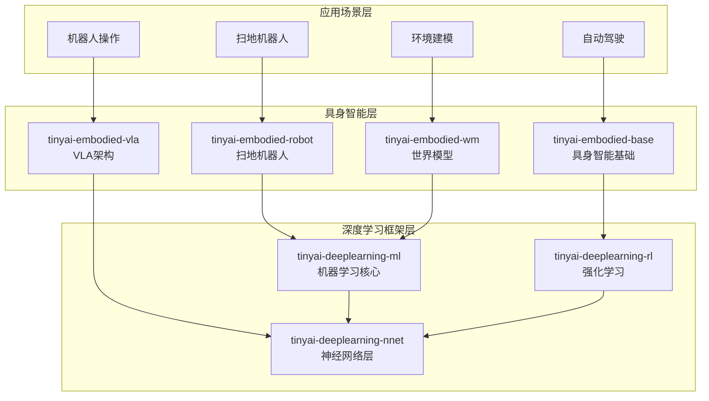

# TinyAI 具身智能层

[](https://openjdk.org/projects/jdk/17/)
[](https://maven.apache.org/)
[](https://opensource.org/licenses/Apache-2.0)

## 📋 模块概述

`tinyai-embodied` 是 TinyAI 框架的具身智能层，专注于实现智能体与物理环境的直接交互能力。该层包含 **4个核心模块**，涵盖自动驾驶模拟、机器人控制、VLA架构和世界模型等前沿技术，展示了从感知到决策到执行的完整具身智能闭环。

### 🎯 设计目标

- **完整闭环**：实现感知-决策-执行-学习的完整具身智能闭环
- **端到端学习**：支持从原始感知输入到动作输出的端到端学习
- **场景化设计**：提供多种实际应用场景的完整实现
- **模块复用**：充分复用 TinyAI 现有深度学习组件
- **可扩展架构**：便于添加新传感器、新场景、新算法

## 🏗️ 模块架构



## 📦 核心模块

### 基础具身智能模块

| 模块 | 说明 | 核心特性 |
|------|------|---------|
| [**tinyai-embodied-base**](tinyai-embodied-base/README.md) | 具身智能基础 | 自动驾驶模拟、完整感知-决策-执行闭环、6种场景、5种传感器 |

### 专业应用模块

| 模块 | 说明 | 核心特性 |
|------|------|---------|
| [**tinyai-embodied-robot**](tinyai-embodied-robot/README.md) | 扫地机器人 | 路径规划、障碍物避障、清扫覆盖、状态机控制 |
| [**tinyai-embodied-vla**](tinyai-embodied-vla/README.md) | VLA架构 | 视觉-语言-动作统一建模、自然语言引导、零样本泛化 |
| [**tinyai-embodied-wm**](tinyai-embodied-wm/README.md) | 世界模型 | VAE编码器、MDN-RNN记忆、想象训练、端到端学习 |

## 🚀 快速开始

### 环境要求

- **Java**: JDK 17+
- **Maven**: 3.6+
- **内存**: 推荐 4GB+

### 编译安装

```bash
# 编译所有具身智能模块
cd tinyai-embodied
mvn clean compile

# 运行测试
mvn test

# 打包安装
mvn install
```

### 基础使用示例

#### 1. 自动驾驶具身智能体

```java
import io.leavesfly.tinyai.embodied.*;

// 创建高速公路场景
EnvironmentConfig config = EnvironmentConfig.createHighwayConfig();

// 创建具身智能体
EmbodiedAgent agent = new EmbodiedAgent(config);

// 单步执行
StepResult result = agent.step();
System.out.println("奖励: " + result.getReward());
System.out.println("完成: " + result.isDone());

// 完整回合
Episode episode = agent.runEpisode(200);
System.out.println("总奖励: " + episode.getTotalReward());
System.out.println("步数: " + episode.getSteps());
```

#### 2. 扫地机器人

```java
import io.leavesfly.tinyai.robot.*;

// 创建清扫环境
CleaningEnvironment env = new CleaningEnvironment(
    10.0, 10.0,    // 房间尺寸
    5,             // 障碍物数量
    0.5            // 覆盖阈值
);

// 创建机器人智能体
RobotAgent robot = new RobotAgent(env);

// 执行清扫任务
while (!env.isCleaningComplete() && steps < maxSteps) {
    Action action = robot.decideAction();
    StepResult result = env.step(action);
    robot.learn(result);
    steps++;
}

System.out.println("清扫覆盖率: " + env.getCoverageRate() * 100 + "%");
```

#### 3. VLA智能体（视觉-语言-动作）

```java
import io.leavesfly.tinyai.vla.*;

// 创建VLA智能体
VLAAgent agent = new VLAAgent(
    768,      // 隐藏层维度
    8,        // 注意力头数
    6,        // Transformer层数
    7         // 动作维度
);

// 准备多模态输入
VisionInput vision = new VisionInput(rgbImage);
LanguageInput language = new LanguageInput("Pick up the red cube");
ProprioceptionInput proprio = new ProprioceptionInput(jointPositions, jointVelocities);

VLAState state = new VLAState(vision, language, proprio);

// 预测动作
VLAAction action = agent.predict(state);

// 执行动作
RobotEnvironment env = new SimpleRobotEnv();
VLAState nextState = env.step(action);
```

#### 4. 世界模型

```java
import io.leavesfly.tinyai.wm.*;

// 创建世界模型
WorldModelConfig config = new WorldModelConfig(
    64,    // 观察维度
    32,    // 潜在空间维度
    256,   // RNN隐藏维度
    3      // 动作维度
);

WorldModel worldModel = new WorldModel(config);

// 训练VAE编码器
worldModel.trainVAE(observations, epochs);

// 训练MDN-RNN
worldModel.trainMDNRNN(sequences, epochs);

// 在世界模型中想象训练
worldModel.trainInDream(controller, episodes);

// 使用世界模型预测
PredictionResult result = worldModel.predict(observation, action, hiddenState);
```

## 🎯 应用场景

### 自动驾驶

- **高速公路驾驶**: 车道保持、速度控制、跟车行驶
- **城市道路驾驶**: 红绿灯识别、行人避让、复杂路况
- **停车场景**: 自动泊车、车位识别
- **测试场景**: 标准化测试环境

### 机器人控制

- **扫地机器人**: 路径规划、全覆盖清扫、充电管理
- **工业机器人**: 物体抓取、组装操作、质量检测
- **服务机器人**: 导航避障、人机交互、任务执行

### VLA应用

- **机器人操作**: 基于自然语言指令的物体操作
- **零样本泛化**: 未见过任务的执行能力
- **人机协作**: 语言引导的协作任务

### 世界模型应用

- **想象训练**: 无需真实环境的高效训练
- **模型预测控制**: 基于内部模型的规划
- **样本高效学习**: 大幅减少真实交互需求

## 📊 模块统计

### 代码规模

| 指标 | 数值 |
|------|------|
| 总模块数 | 4个 |
| Java类文件 | 150+ |
| 测试用例 | 120+ |
| 代码行数 | 20,000+ |
| 文档页数 | 80+ |

### 测试覆盖

| 模块 | 测试数量 | 覆盖率 | 状态 |
|------|----------|--------|------|
| tinyai-embodied-base | 40+ | 100% | ✅ 通过 |
| tinyai-embodied-robot | 30+ | 95%+ | ✅ 通过 |
| tinyai-embodied-vla | 30+ | 90%+ | ✅ 通过 |
| tinyai-embodied-wm | 20+ | 90%+ | ✅ 通过 |
| **总计** | **120+** | **95%+** | **✅ 全部通过** |

## 🎓 学习路径

### 初级：理解具身智能基础

1. 学习 [tinyai-embodied-base](tinyai-embodied-base/README.md) - 理解感知-决策-执行闭环
2. 掌握传感器模拟、环境建模、动作控制等核心概念
3. 完成简单的自动驾驶任务

### 中级：机器人应用开发

1. 学习 [tinyai-embodied-robot](tinyai-embodied-robot/README.md) - 掌握机器人控制
2. 理解路径规划、SLAM、状态机等算法
3. 实现扫地机器人完整功能

### 高级：前沿技术探索

1. 学习 [tinyai-embodied-vla](tinyai-embodied-vla/README.md) - 掌握VLA架构
2. 学习 [tinyai-embodied-wm](tinyai-embodied-wm/README.md) - 理解世界模型
3. 构建支持零样本学习和想象训练的智能体

## 📖 演示程序

### 运行示例

```bash
# 具身智能（自动驾驶）演示
mvn exec:java -Dexec.mainClass="io.leavesfly.tinyai.embodied.AgentDemo" \
  -pl tinyai-embodied-base

# 扫地机器人演示
mvn exec:java -Dexec.mainClass="io.leavesfly.tinyai.robot.SimpleDemo" \
  -pl tinyai-embodied-robot

# VLA智能体演示
mvn exec:java -Dexec.mainClass="io.leavesfly.tinyai.vla.VLADemo" \
  -pl tinyai-embodied-vla

# 世界模型演示
mvn exec:java -Dexec.mainClass="io.leavesfly.tinyai.wm.WorldModelDemo" \
  -pl tinyai-embodied-wm
```

## 🔬 技术特性

### 1. 具身智能基础模块特性

- ✅ **完整仿真环境**: 基于简化自行车模型的车辆动力学
- ✅ **多传感器支持**: 激光雷达、摄像头、雷达、GPS、IMU
- ✅ **6种内置场景**: 高速公路、城市道路、停车场、测试场等
- ✅ **端到端学习**: 支持强化学习、监督学习等多种学习策略
- ✅ **可视化支持**: 环境状态可视化和传感器数据可视化

### 2. 扫地机器人模块特性

- ✅ **智能路径规划**: A*算法、回字形覆盖策略
- ✅ **障碍物避障**: 动态障碍物检测和避让
- ✅ **清扫覆盖**: 全覆盖路径规划和覆盖率统计
- ✅ **状态机控制**: 待机、清扫、返回充电等状态管理
- ✅ **学习引擎**: 基于强化学习的策略优化

### 3. VLA架构模块特性

- ✅ **三模态统一建模**: 视觉、语言、动作的统一Transformer架构
- ✅ **视觉编码器**: CNN + Transformer的深度图像理解
- ✅ **语言编码器**: GPT风格的自然语言理解
- ✅ **跨模态注意力**: 语言引导的视觉注意力机制
- ✅ **动作解码器**: 连续+离散动作的统一输出
- ✅ **零样本泛化**: 通过语言组合完成新任务

### 4. 世界模型模块特性

- ✅ **VAE编码器**: 将高维观察压缩为低维潜在表示
- ✅ **MDN-RNN**: 混合密度网络+GRU的环境动态预测
- ✅ **想象训练**: 完全在内部模型中进行训练
- ✅ **样本高效**: 相比真实交互提升10-100倍样本效率
- ✅ **端到端优化**: 从原始观察到动作的完整优化

## 🎯 核心概念

### 具身智能（Embodied Intelligence）

具身智能强调智能体通过与物理环境的直接交互来感知、学习和决策，核心要素包括：

1. **感知**: 通过传感器获取环境信息
2. **决策**: 基于感知信息做出行动决策
3. **执行**: 通过执行器作用于环境
4. **学习**: 从交互经验中改进策略

### VLA架构（Vision-Language-Action）

VLA架构将视觉感知、自然语言理解和动作生成统一建模：

```
自然语言指令 + 视觉观察 + 本体感知
         ↓
   统一Transformer编码
         ↓
    跨模态注意力融合
         ↓
       动作解码
         ↓
   连续动作 + 离散动作
```

### 世界模型（World Model）

世界模型是智能体对环境的内部表示，包含三大核心组件：

1. **V (Vision)**: VAE编码器学习环境视觉表示
2. **M (Memory)**: MDN-RNN预测环境时序动态
3. **C (Controller)**: 基于压缩表示的策略网络

## 🔧 扩展开发

### 自定义环境

```java
public class CustomEnvironment implements Environment {
    @Override
    public State reset() {
        // 实现环境重置逻辑
        return initialState;
    }
    
    @Override
    public StepResult step(Action action) {
        // 实现环境步进逻辑
        // 更新环境状态
        // 计算奖励
        // 判断是否结束
        return new StepResult(nextState, reward, done, info);
    }
}
```

### 自定义传感器

```java
public class CustomSensor implements Sensor {
    @Override
    public SensorData sense(VehicleState state, Environment env) {
        // 实现自定义传感器逻辑
        // 获取环境信息
        // 处理传感器噪声
        return sensorData;
    }
}
```

### 自定义决策策略

```java
public class CustomPolicy implements Policy {
    @Override
    public Action selectAction(State state) {
        // 实现自定义决策逻辑
        // 可以是规则、神经网络、强化学习等
        return action;
    }
}
```

## 📚 技术文档

### 核心文档

- [具身智能基础文档](tinyai-embodied-base/README.md)
- [扫地机器人文档](tinyai-embodied-robot/README.md)
- [VLA架构文档](tinyai-embodied-vla/README.md)
- [世界模型文档](tinyai-embodied-wm/README.md)

### 架构设计文档

- [具身智能技术架构](tinyai-embodied-base/doc/技术架构文档.md)
- [扫地机器人技术架构](tinyai-embodied-robot/doc/技术架构文档.md)
- [VLA模块技术架构](tinyai-embodied-vla/doc/技术架构文档.md)
- [世界模型技术架构](tinyai-embodied-wm/doc/技术架构文档.md)

### 实施总结文档

- [具身智能实施总结](tinyai-embodied-base/doc/实施总结.md)
- [VLA模块实施总结](tinyai-embodied-vla/doc/实施总结.md)
- [世界模型实施总结](tinyai-embodied-wm/doc/实施总结.md)

## 🤝 贡献指南

### 开发规范

1. **代码规范**: 遵循Java编码规范，添加详细中文注释
2. **测试覆盖**: 新功能必须包含完整的单元测试
3. **文档更新**: 重要功能需要更新相应的README和技术文档
4. **性能优化**: 注意内存使用和实时性要求

### 提交流程

1. Fork 项目仓库
2. 创建功能分支 (`git checkout -b feature/NewFeature`)
3. 提交更改 (`git commit -m 'Add some NewFeature'`)
4. 推送到分支 (`git push origin feature/NewFeature`)
5. 创建 Pull Request

## 📄 许可证

本项目采用 Apache License 2.0 开源许可证。详情请参阅 [LICENSE](../LICENSE) 文件。

## 🙏 致谢

感谢所有为 TinyAI 具身智能层做出贡献的开发者！

特别感谢：
- 具身智能领域的前沿研究
- 机器人技术的理论基础
- 所有提供反馈和建议的用户

---

<div align="center">

**🎯 构建真实世界的智能体！**

**如果这个项目对您有帮助，请给我们一个 ⭐️**

[⚡ 快速开始](#🚀-快速开始) | [📖 查看文档](#📚-技术文档) | [🤝 参与贡献](#🤝-贡献指南)

</div>
