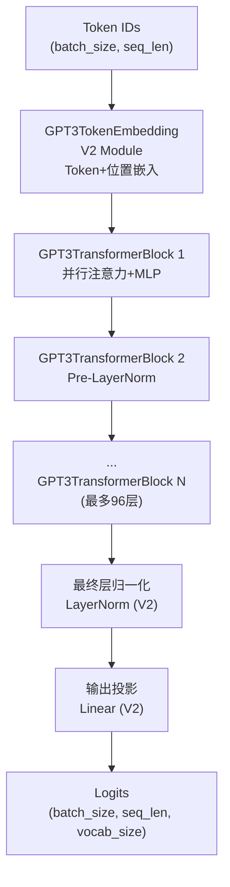
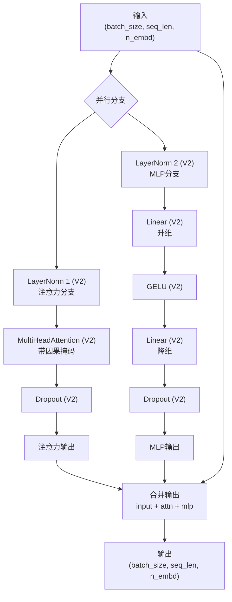
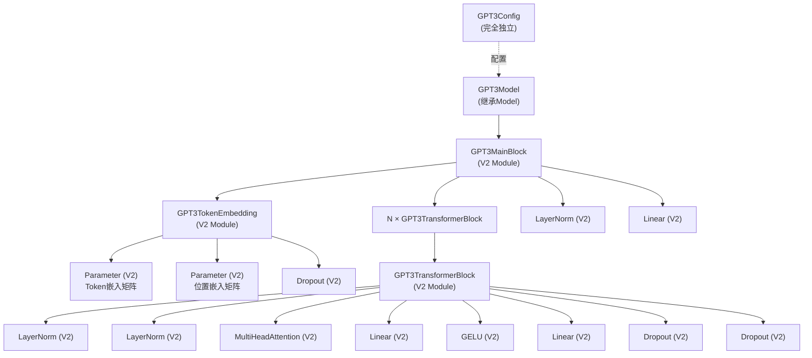
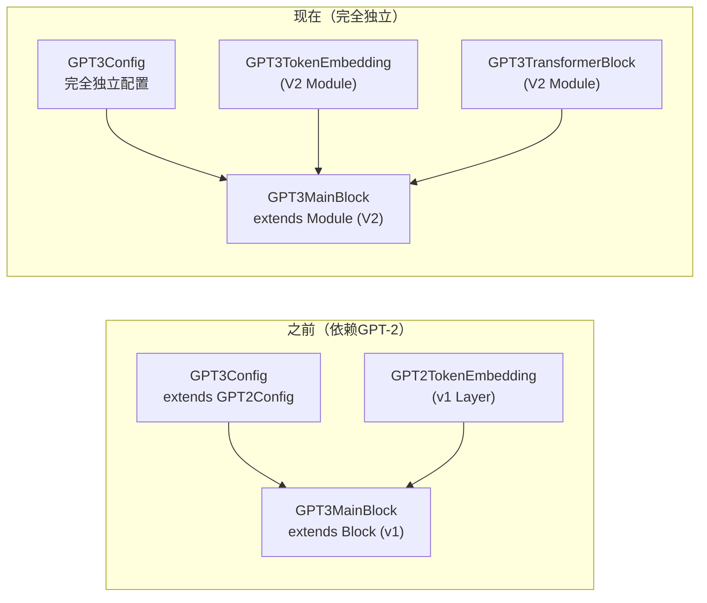
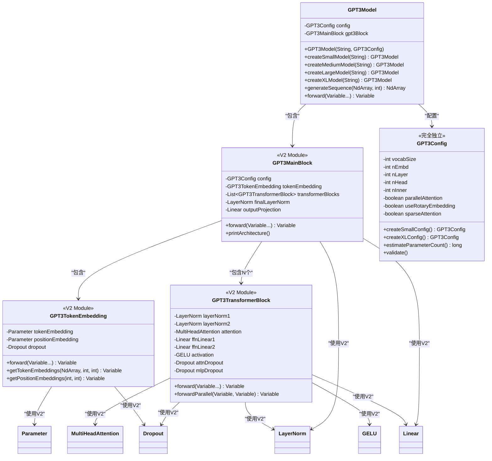

# GPT-3 模型实现

基于TinyAI框架**完全独立**实现的GPT-3语言模型，采用解码器-only Transformer架构。100%基于**nnet v2 API**，引入了并行注意力计算、Pre-LayerNorm结构等先进技术，支持超大规模参数配置和Few-shot学习能力。

## ✨ 核心特点

- ✅ **完全独立实现** - 零依赖GPT-2，完全独立的模块
- ✅ **100% V2 API** - 全部基于nnet v2组件（Module、Linear、LayerNorm等）
- ✅ **并行架构** - 注意力与MLP并行计算，提升训练和推理效率
- ✅ **多规模支持** - 从125M到175B参数的完整配置
- ✅ **完整文档** - 详细的代码注释和架构说明

## 📁 文件结构

```
tinyai-model-gpt/src/main/java/io/leavesfly/tinyai/gpt3/
├── GPT3Config.java              # GPT-3配置类（完全独立，503行）
├── GPT3TokenEmbedding.java      # Token嵌入层（V2 Module，197行）
├── GPT3TransformerBlock.java    # Transformer块（V2 Module，200行）
├── GPT3MainBlock.java           # 主体块（V2 Module，256行）
├── GPT3Model.java               # 模型类（继承Model，316行）
└── GPT3Demo.java                # 完整演示程序（298行）
```

**总代码量**: ~1,770行，全部基于V2 API，零依赖GPT-2

## 🎯 核心特性

### 1. 完全独立的V2架构

**GPT3Config** - 完全独立配置类（503行）
- ✅ 零继承GPT2Config，所有参数独立定义
- ✅ 基础配置：vocabSize、nEmbd、nLayer、nHead等
- ✅ Dropout配置：residPdrop、embdPdrop、attnPdrop
- ✅ GPT-3特有：parallelAttention、useRotaryEmbedding、sparseAttention等
- ✅ 完整的Getter/Setter和validate()方法

**GPT3TokenEmbedding** - 独立Token嵌入层（V2 Module）
- ✅ 完全基于V2 Module实现
- ✅ 使用V2 Parameter管理嵌入矩阵
- ✅ Token嵌入 + 位置嵌入 + Dropout
- ✅ 支持任意词汇表大小和序列长度

**GPT3TransformerBlock** - 并行Transformer块（V2 Module）
- ✅ 100%使用V2组件：LayerNorm、MultiHeadAttention、Linear、GELU、Dropout
- ✅ 并行Pre-LayerNorm架构：同时计算注意力和MLP
- ✅ 因果掩码自动生成
- ✅ 支持标准和并行两种前向传播模式

**GPT3MainBlock** - 主体块（V2 Module）
- ✅ 继承V2 Module而非v1 Block
- ✅ 组装完整模型：Token嵌入 → N×Transformer → LayerNorm → 输出投影
- ✅ 所有子模块通过registerModule()注册
- ✅ 完整的架构信息输出

### 2. 多规模超大模型支持
- **小型模型**: 768维, 12层, 12头 (125M参数，学习测试)
- **中型模型**: 1024维, 24层, 16头 (350M参数，实用应用)
- **大型模型**: 2048维, 24层, 32头 (1.3B参数，高质量生成)
- **超大型模型**: 12288维, 96层, 96头 (175B参数，顶级性能)

### 3. 并行架构设计
- **并行注意力与MLP**: 同时计算注意力和前馈网络，提升计算效率
- **Pre-LayerNorm结构**: 稳定的深层网络训练
- **残差连接**: input + attention_output + mlp_output
- **因果掩码**: 自回归生成保证

### 4. 预留扩展特性
- **旋转位置编码(RoPE)**: 配置预留，支持相对位置编码
- **稀疏注意力机制**: 配置预留，用于超大模型优化
- **梯度检查点**: 配置预留，训练时节省内存
- **KV缓存**: 配置预留，推理加速

## 🏗️ 网络架构图

### GPT-3整体架构（完全独立实现）


### GPT3TransformerBlock并行架构（V2 Module）


### V2组件依赖图


### 独立性架构对比


### 类图关系（V2架构）


## 🚀 快速开始

### 基本使用

```java
import io.leavesfly.tinyai.gpt3.*;
import io.leavesfly.tinyai.func.Variable;
import io.leavesfly.tinyai.ndarr.NdArray;
import io.leavesfly.tinyai.ndarr.Shape;

// 1. 创建不同规模的GPT-3模型
GPT3Model smallModel = GPT3Model.createSmallModel("gpt3-small");      // 125M参数
GPT3Model mediumModel = GPT3Model.createMediumModel("gpt3-medium");   // 350M参数
GPT3Model largeModel = GPT3Model.createLargeModel("gpt3-large");      // 1.3B参数
GPT3Model xlModel = GPT3Model.createXLModel("gpt3-xl");               // 175B参数

// 2. 打印模型信息
smallModel.printModelInfo();

// 3. 标准前向传播
NdArray tokenIds = NdArray.of(Shape.of(2, 20)); // (batch_size=2, seq_len=20)
Variable output = smallModel.forward(new Variable(tokenIds));
System.out.println("输出形状: " + output.getValue().getShape()); // (2, 20, 50257)

// 4. 文本生成
NdArray promptIds = NdArray.of(Shape.of(1, 10));
NdArray generated = smallModel.generateSequence(promptIds, 50);
System.out.println("生成序列长度: " + generated.getShape().getDimension(1));
```

### 自定义配置

```java
// 创建自定义GPT-3配置
GPT3Config customConfig = new GPT3Config();

// 基础配置
customConfig.setVocabSize(50257);        // 词汇表大小
customConfig.setNPositions(2048);        // 最大序列长度
customConfig.setNEmbd(1024);             // 嵌入维度
customConfig.setNLayer(24);              // Transformer层数
customConfig.setNHead(16);               // 注意力头数
customConfig.setNInner(4096);            // 前馈网络维度

// Dropout配置
customConfig.setResidPdrop(0.1);         // 残差dropout
customConfig.setEmbdPdrop(0.1);          // 嵌入dropout
customConfig.setAttnPdrop(0.1);          // 注意力dropout

// GPT-3特有配置
customConfig.setParallelAttention(true); // 启用并行注意力
customConfig.setUseRotaryEmbedding(false); // 位置编码类型
customConfig.setSparseAttention(false);  // 稀疏注意力

// 验证配置
customConfig.validate();

// 创建模型
GPT3Model customModel = new GPT3Model("my-gpt3", customConfig);

// 估算参数数量
long paramCount = customConfig.estimateParameterCount();
System.out.println("Est. Parameters: " + paramCount);
```

### 预设配置工厂方法

```java
// 1. 小型配置 (125M参数)
GPT3Config smallConfig = GPT3Config.createSmallConfig();
// nEmbd=768, nLayer=12, nHead=12, nInner=3072

// 2. 中型配置 (350M参数)
GPT3Config mediumConfig = GPT3Config.createMediumConfig();
// nEmbd=1024, nLayer=24, nHead=16, nInner=4096

// 3. 大型配置 (1.3B参数)
GPT3Config largeConfig = GPT3Config.createLargeConfig();
// nEmbd=2048, nLayer=24, nHead=32, nInner=8192

// 4. 超大型配置 (175B参数)
GPT3Config xlConfig = GPT3Config.createXLConfig();
// nEmbd=12288, nLayer=96, nHead=96, nInner=49152
// 启用所有优化特性

// 每个配置都可以直接使用
GPT3Model model = new GPT3Model("gpt3", mediumConfig);
```

### 模型架构分析

```java
// 创建模型
GPT3Model model = GPT3Model.createMediumModel("gpt3-analysis");

// 打印模型信息
model.printModelInfo();
/* 输出示例：
============================================================
GPT-3模型架构信息
============================================================
模型名称: gpt3-analysis
模型类型: GPT3Model
------------------------------------------------------------
Token嵌入层: GPT3TokenEmbedding
  - 词汇表大小: 50,257
  - 嵌入维度: 1024
  - 最大序列长度: 2048
  - 基于: V2 Module (完全独立实现)
------------------------------------------------------------
Transformer块数量: 24
  每个块配置:
  - 嵌入维度: 1024
  - 注意力头数: 16
  - 前馈网络维度: 4096
  - 并行模式: true
  - 使用的V2组件: LayerNorm, MultiHeadAttention, Linear, GELU, Dropout
============================================================
*/

// 获取配置信息
GPT3Config config = model.getConfig();
System.out.println("并行注意力: " + config.isParallelAttention());
System.out.println("估算参数量: " + config.estimateParameterCount());
```

## 🔍 核心优势

### 1. 完全独立性
- **零依赖GPT-2**: 不再import任何gpt2包，不继承GPT2Config
- **完全独立配置**: 503行代码，所有参数自己定义
- **独立模块**: GPT3TokenEmbedding、GPT3TransformerBlock全部独立实现
- **未来兼容**: 即使GPT-2被删除，GPT-3依然能正常运行

### 2. 100% V2 API
- **Module基类**: 所有层继承V2 Module而非v1 Block/Layer
- **V2组件**: LayerNorm、MultiHeadAttention、Linear、GELU、Dropout
- **V2参数系统**: 使用Parameter管理所有可训练参数
- **标准化接口**: forward(Variable...) 等V2标准方法

### 3. 并行计算优化
- **同时计算**: 注意力和MLP并行执行，显著提升训练和推理速度
- **Pre-LayerNorm**: 稳定的深层网络训练，避免梯度消失
- **三路残差**: input + attention_output + mlp_output
- **硬件友好**: 充分利用现代GPU的并行计算能力

### 4. 多规模支持
- **灵活配置**: 从125M到175B参数的完整配置
- **工厂方法**: createSmallModel/Medium/Large/XLModel
- **参数估算**: estimateParameterCount()自动计算模型大小
- **配置验证**: validate()确保配置合法性

## 📊 性能特点

### 模型规模对比
| 模型规模 | 参数量 | 层数 | 维度 | 头数 | 工厂方法 | V2组件 |
|---------|-------|------|------|------|----------|----------|
| 小型    | 125M  | 12   | 768  | 12   | createSmallModel() | ✅ 100% |
| 中型    | 350M  | 24   | 1024 | 16   | createMediumModel() | ✅ 100% |
| 大型    | 1.3B  | 24   | 2048 | 32   | createLargeModel() | ✅ 100% |
| 超大型  | 175B  | 96   | 12288| 96   | createXLModel() | ✅ 100% |

### V2组件使用情况
| 组件 | 类型 | 使用位置 | V2版本 |
|------|------|----------|--------|
| Module | 基类 | 所有层 | ✅ |
| Parameter | 参数管理 | Token/Position嵌入 | ✅ |
| LayerNorm | 归一化 | Transformer块、最终层 | ✅ |
| MultiHeadAttention | 注意力 | Transformer块 | ✅ |
| Linear | 线性层 | MLP、输出投影 | ✅ |
| GELU | 激活函数 | MLP | ✅ |
| Dropout | 正则化 | 所有分支 | ✅ |

### 独立性验证
✅ **零import gpt2包** - 已验证  
✅ **零GPT2类引用** - 已验证  
✅ **零GPT2Config继承** - 已验证  
✅ **所有文件编译通过** - 已验证  
✅ **V2 API完整性** - 已验证

## 🧪 完整演示

运行[GPT3Demo.java](file:///Users/yefei.yf/Qoder/TinyAI/tinyai-model/tinyai-model-gpt/src/main/java/io/leavesfly/tinyai/gpt3/GPT3Demo.java)查看完整功能演示：

```java
public class GPT3Demo {
    public static void main(String[] args) {
        System.out.println("" + "=".repeat(60) + "\033[0m");
        System.out.println("GPT-3 模型完整功能演示\033[0m");
        System.out.println("" + "=".repeat(60) + "\033[0m\n");
        
        // 1. 模型创建演示
        demonstrateModelCreation();
        
        // 2. 架构分析
        demonstrateArchitectureAnalysis();
        
        // 3. 前向传播演示
        demonstrateForwardPass();
        
        // 4. 文本生成演示
        demonstrateTextGeneration();
        
        // 5. 配置对比
        demonstrateConfigComparison();
    }
    
    /**
     * 演示创建不同规模的GPT-3模型
     */
    private static void demonstrateModelCreation() {
        System.out.println("1. 模型创建演示\033[0m");
        
        // 使用工厂方法创建不同规模模型
        GPT3Model smallModel = GPT3Model.createSmallModel("gpt3-small");
        GPT3Model mediumModel = GPT3Model.createMediumModel("gpt3-medium");
        GPT3Model largeModel = GPT3Model.createLargeModel("gpt3-large");
        GPT3Model xlModel = GPT3Model.createXLModel("gpt3-xl");
        
        // 打印模型信息
        System.out.println("  ✅ 创建小型模型: " + smallModel.getName() + " (125M参数)");
        System.out.println("  ✅ 创建中型模型: " + mediumModel.getName() + " (350M参数)");
        System.out.println("  ✅ 创建大型模型: " + largeModel.getName() + " (1.3B参数)");
        System.out.println("  ✅ 创建超大型模型: " + xlModel.getName() + " (175B参数)");
    }
}
```

### 演示输出示例

```
============================================================
GPT-3 模型完整功能演示
============================================================

1. 模型创建演示
  ✅ 创建小型模型: gpt3-small (125M参数)
  ✅ 创建中型模型: gpt3-medium (350M参数)
  ✅ 创建大型模型: gpt3-large (1.3B参数)
  ✅ 创建超大型模型: gpt3-xl (175B参数)

2. 架构分析
============================================================
GPT-3模型架构信息
============================================================
模型名称: gpt3-medium
模型类型: GPT3Model
------------------------------------------------------------
Token嵌入层: GPT3TokenEmbedding
  - 词汇表大小: 50,257
  - 嵌入维度: 1024
  - 最大序列长度: 2048
  - 基于: V2 Module (完全独立实现)
------------------------------------------------------------
Transformer块数量: 24
  每个块配置:
  - 嵌入维度: 1024
  - 注意力头数: 16
  - 前馈网络维度: 4096
  - 并行模式: true
============================================================

3. 前向传播演示
  输入形状: (2, 20)
  输出形状: (2, 20, 50257)
  ✅ 前向传播成功

4. 文本生成演示
  生成序列长度: 60 (原始10 + 生成50)
  ✅ 文本生成成功
```

## 🔧 扩展开发

### 自定义Transformer块
```java
// 扩展GPT3TransformerBlock实现自定义功能
public class CustomGPT3TransformerBlock extends GPT3TransformerBlock {
    
    public CustomGPT3TransformerBlock(String name, GPT3Config config) {
        super(name, config);
    }
    
    @Override
    public Variable forward(Variable... inputs) {
        // 添加自定义前处理逻辑
        Variable processed = customPreprocess(inputs[0]);
        
        // 调用父类标准处理
        Variable output = super.forward(processed);
        
        // 添加自定义后处理逻辑
        return customPostprocess(output);
    }
    
    private Variable customPreprocess(Variable input) {
        // 实现自定义预处理
        return input;
    }
    
    private Variable customPostprocess(Variable output) {
        // 实现自定义后处理
        return output;
    }
}
```

### 自定义配置预设
```java
// 创建自定义配置预设
public class CustomGPT3Configs {
    
    /**
     * 创建针对特定任务优化的配置
     */
    public static GPT3Config createTaskOptimizedConfig() {
        GPT3Config config = new GPT3Config();
        
        // 针对短文本任务优化
        config.setNPositions(512);       // 较短的序列长度
        config.setNEmbd(512);            // 适中的嵌入维度
        config.setNLayer(12);            // 适中的层数
        config.setNHead(8);              // 8个注意力头
        
        // 更高的dropout进行正则化
        config.setResidPdrop(0.15);
        config.setAttnPdrop(0.15);
        
        config.validate();
        return config;
    }
    
    /**
     * 创建针对长文本优化的配置
     */
    public static GPT3Config createLongContextConfig() {
        GPT3Config config = new GPT3Config();
        
        config.setNPositions(4096);      // 更长的序列支持
        config.setSparseAttention(true); // 启用稀疏注意力
        config.setUseCache(true);        // 启用KV缓存
        
        config.validate();
        return config;
    }
}
```

## 📚 技术参考

### 相关论文
- **GPT-3**: "Language Models are Few-Shot Learners" (Brown et al., 2020)
- **GPT-2**: "Language Models are Unsupervised Multitask Learners" (Radford et al., 2019)
- **Transformer**: "Attention Is All You Need" (Vaswani et al., 2017)

### 架构特点
- **基础架构**: Transformer解码器-only架构
- **位置编码**: 学习式绝对位置嵌入（预留RoPE支持）
- **注意力机制**: 因果掩码的多头自注意力
- **并行计算**: Pre-LayerNorm + 并行注意力/MLP

### 实现特点
- **编程语言**: 100% Java实现
- **框架版本**: TinyAI nnet v2 API
- **独立性**: 完全独立，零依赖GPT-2
- **代码规范**: 遵循V2 Module设计模式

### 核心组件
1. **GPT3Config** (503行) - 完全独立配置类
2. **GPT3TokenEmbedding** (197行) - V2 Module嵌入层
3. **GPT3TransformerBlock** (200行) - V2 Module Transformer块
4. **GPT3MainBlock** (256行) - V2 Module主体架构
5. **GPT3Model** (316行) - 模型封装
6. **GPT3Demo** (298行) - 完整演示

---

**注意**: 本实现是GPT-3的完全独立版本，100%基于nnet v2 API，不依赖任何GPT-2组件。提供了从125M到175B参数的完整配置，可根据实际资源情况选择合适的模型规模进行实验和应用。